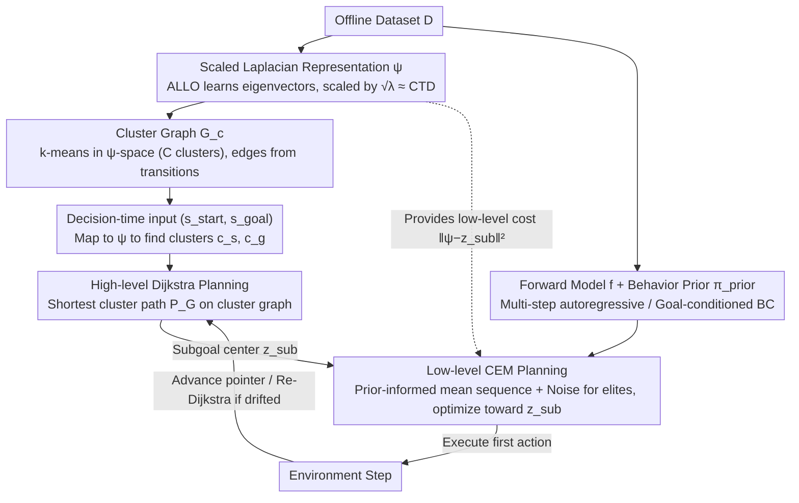

# Laplacian Representations for Decision-Time Planning

**Conference**: ICML 2026  
**arXiv**: [2602.05031](https://arxiv.org/abs/2602.05031)  
**Code**: https://github.com/machado-research/ALPS  
**Area**: Reinforcement Learning / Representation Learning / Model-based RL  
**Keywords**: Laplacian Representations, Hierarchical Planning, Decision-Time Planning, CEM, Offline Goal-Conditioned RL  

## TL;DR
This paper introduces ALPS, which utilizes the eigenvector space of the graph Laplacian (scaled to approximate commute-time distance) as a latent space for hierarchical decision-time planning. It first discovers subgoals using k-means in this space and generates high-level paths via Dijkstra, then performs short-range low-level planning in the original state space using CEM with behavior priors. On OGBench offline goal-conditioned RL tasks, this marks the first time model-based planning methods systematically outperform model-free SOTA.

## Background & Motivation

**Background**: Model-based reinforcement learning has theoretical advantages over model-free RL in sample efficiency, generalization, and adaptation speed. Decision-time planning (e.g., MPC, MCTS) is a common way to transform "learned models" into behavior. Difficult offline goal-conditioned RL benchmarks like OGBench have long been dominated by model-free methods such as HIQL, CRL, and QRL, while model-based planning methods are almost non-existent in long-horizon tasks.

**Limitations of Prior Work**: The core challenge of decision-time planning is **compounding errors**—a learned one-step model's predicted trajectories rapidly deviate from true dynamics after repeated rollouts over long horizons, leading optimizers like CEM to make incorrect decisions on "hallucinated trajectories." Hierarchical planning is a recognized solution (high-level picks subgoals, low-level runs short-range), but it requires a latent space that simultaneously satisfies two contradictory needs: proximal states must be close (supporting local cost calculations), and long-range reachability must be preserved (supporting high-level path searching).

**Key Challenge**: Commonly used contrastive learning latent spaces (such as the random walk contrastive objective used in PcLast) are good at low-level distance estimation but **do not explicitly encode global connectivity**. This causes subgoals found via k-means to often cross obstacles or generate unreachable high-level paths. Using raw Euclidean distance completely ignores environmental dynamics (two points in a maze might be Euclidean-close but require a long detour to reach).

**Goal**: Find a latent space such that: (1) distance approximates commute-time distance (CTD), supporting both high- and low-level planning; (2) it is naturally suited for spectral clustering for subgoal discovery; (3) it can be learned from samples without relying on exact $O(|\mathcal{S}|^3)$ eigendecomposition.

**Key Insight**: The authors observe that the eigenvectors of the graph Laplacian are specifically designed to express "multi-time scale graph structures"—the first few eigenvectors encode global structures (rooms, regions), while subsequent ones encode local details. Furthermore, spectral clustering theoretically guarantees partitioning the graph along "bottlenecks," which exactly corresponds to rooms connected by corridors in navigation tasks. Crucially, the scaled Laplacian representation $\psi_i(s) = \phi_i(s)/\sqrt{\lambda_i}$ is equivalent to CTD under Euclidean distance, allowing it to serve both as a low-level cost and a high-level distance.

**Core Idea**: Use the learned scaled Laplacian representation $\psi$ as a unified latent space. Perform k-means clustering in the $\psi$-space to obtain subgoals and generate high-level paths via Dijkstra. Low-level short-range optimization is performed in the original state space using CEM with behavior priors, bringing model-based planning back to the OGBench leaderboard.

## Method

### Overall Architecture
ALPS is a two-stage algorithm consisting of pre-training and decision-time planning. In the **pre-training** stage, three components are learned from the offline dataset $\mathcal{D}$: (1) Laplacian representation $\phi$ (rescaled to $\psi$), (2) a one-step forward model $f$ on the raw state space, and (3) a goal-conditioned behavior prior $\pi_{\text{prior}}$. Then, k-means is run in the $\psi$-space to obtain $C$ clusters; a cluster graph $G_c$ is constructed by treating cluster centers as vertices and observed transitions between clusters as edges. **At decision time**, given $(s_{\text{start}}, s_{\text{goal}})$, both are projected into $\psi$-space to find their respective clusters $(c_s, c_g)$. Dijkstra computes the shortest cluster path $\mathcal{P}_G$ on $G_c$ as the high-level plan. At each step, CEM performs short-range optimization toward the $\psi$ representation of the current target cluster center. The high-level pointer advances as the agent enters the next cluster, and replanning occurs if the agent deviates from $\mathcal{P}_G$.

### Key Designs

**1. Scaled Laplacian Representation $\psi$ as a Unified Latent Space: One space for both low-level costs and high-level distances**

Hierarchical planning requires a latent space that satisfies two conflicting needs: nearby states must be close (supporting local cost) while preserving long-range reachability (supporting high-level path search). Contrastive spaces excel at the former but lack explicit global connectivity; raw Euclidean distance ignores dynamics. The authors' key observation: by scaling the first $D$ non-zero eigenvectors $\phi$ of the graph Laplacian by their eigenvalues as $\psi(s)=\phi(s)\oslash\sqrt{\lambda}$, the Euclidean distance accurately approximates the commute-time distance (CTD), $c(u,v)\approx\|\psi(u)-\psi(v)\|^2$. CTD encodes both "one-step reachability" and "detour distance." To avoid the $O(|\mathcal{S}|^3)$ cost of exact eigendecomposition, $\phi$ is learned from samples via ALLO (Augmented Lagrangian Laplacian Objective): $\max_\beta \min_u \sum_i \langle u_i, L u_i \rangle + \sum_{j,k} \beta_{jk}(\langle u_j, [[u_k]]\rangle - \delta_{jk}) + B\cdot(\cdot)^2$. This uses stop-gradients $[[\cdot]]$ and Lagrange multipliers $\beta$ to enforce orthonormality. Eigenvalues are read directly from dual variables $\lambda_i=-\beta_{ii}/2$, yielding the scaling $\psi_i=\sqrt{2}\phi_i/\sqrt{-\beta_{ii}}$. Training pairs $(S_t,S_{t+\Delta})$ are sampled with $\Delta\sim\text{Geom}(1-\gamma_s)$. Since CTD serves dual purposes, ALPS does not need to maintain two separate latent spaces like PcLast: low-level CEM uses it as a cost, and high-level k-means automatically partitions along environmental bottlenecks.

**2. High-level Dijkstra Planning and Drift Replanning: Discretizing long-range problems into "room-to-room" searches**

To solve compounding errors, long horizons are split into short-horizon subtasks. ALPS runs k-means in $\psi$-space to form $C$ clusters (k-means in CTD space is equivalent to spectral clustering, which partitions along bottlenecks—maze rooms are separated by corridors, and states with large CTD naturally fall into different clusters). Cluster centers act as vertices, and observed dataset transitions "Cluster $i \to$ Cluster $j$" form edges. Nucleus sampling keeps only the top $p\%$ frequent neighbors per cluster to prune unreachable edges. At decision time, Dijkstra calculates the shortest path $\mathcal{P}_G$ on this $|C|$-vertex graph, reducing "how to get to the goal" to "which rooms to pass through." Each subtask duration fits within the forward model's trust window. The agent checks its cluster $c_{\text{curr}}$ at each step; if low-level CEM drifts into an off-plan cluster ($c_{\text{curr}}\notin\mathcal{P}_G$), Dijkstra is re-run from the current cluster. Graph search completes in seconds, reducing complexity from raw continuous state space to a discrete graph.

**3. Behavior Prior-Accelerated CEM Low-level Planning: Upgrading black-box optimizers to data-aware planners**

Standard CEM typically samples action sequences from uninformative Gaussians, converging slowly in high-dimensional spaces and accumulating errors in rollouts. ALPS optimizes the cost $J^m=\sum_{t=1}^H(\|\psi(\hat{S}_t^m)-z_{\text{sub}}\|_2^2+\lambda\|A_t^m\|_2^2)$ for a given subgoal $z_{\text{sub}}$, but no longer searches from scratch. First, a deterministic behavior prior $\pi_{\text{prior}}(S_t,\psi(S_t),\psi(S_{t+k}))$ is learned via goal-conditioned BC (regressing $A_t$ with $k\sim U(1,K_{\max})$). During planning, this prior works with a multi-step autoregressive forward model $f$ (trained with $\frac{1}{H_f}\sum_{\tau=1}^{H_f}\|\hat{S}_{t+\tau}-S_{t+\tau}\|_2^2$ backpropagated through time) to produce an initial mean action sequence $\mathbf{a}_{t:t+H-1}$. Time-correlated Gaussian noise is added to generate $N_s$ candidates, which are ranked by cost to update the distribution over $N_{\text{iter}}$ iterations. The behavior prior biases the search toward actions resembling goal-directed trajectories in the dataset, while the multi-step model keeps rollouts within the trust window, allowing CEM to converge in few iterations.

### Complete Example: Navigation in pointmaze-giant

Given $(s_{\text{start}}, s_{\text{goal}})$, ALPS maps both to $\psi$-space, falling into clusters $c_s$ (bottom-left room) and $c_g$ (top-right room). Dijkstra on $G_c$ finds the shortest cluster path, e.g., $\mathcal{P}_G = c_s \to c_3 \to c_7 \to c_g$ (passing through four rooms connected by three corridors). Because $\psi$ uses CTD geometry, this path will never "shortcut" through walls; it strictly follows the corridors. Execution points to the first subgoal $c_3$; low-level CEM performs short-range optimization toward its $\psi$ representation for $H$ steps and executes the first action. Once the agent enters $c_3$, the pointer advances to $c_7$. If noise pushes the agent into an off-path cluster $c_5$, high-level planning immediately runs Dijkstra from $c_5$ to find a new path $c_5 \to c_7 \to c_g$. Long-range navigation is thus decomposed into short "room-to-room" tasks.

### Loss & Training
ALLO uses $\gamma_s$ to control the time scale (geometric distribution parameter), and $B$ is the barrier coefficient (robustness reported). Forward models use $H_f$-step autoregressive MSE. The behavior prior is MSE behavior cloning. Key CEM hyperparameters: planner horizon $H$, samples $N_s$, elite count $N_e$, iterations $N_{\text{iter}}$, action penalty $\lambda$, and subgoal threshold $\epsilon$.

## Key Experimental Results

### Main Results

| Dataset | Metric | ALPS | Prev. SOTA (Model-free) | Gain |
|--------|------|------|---------|------|
| pointmaze-large-stitch-v0 | Success % | 96 ±2 | QRL 84 ±15 | +12 |
| pointmaze-giant-stitch-v0 | Success % | 98 ±1 | QRL 50 ±8 | +48 |
| antmaze-large-navigate-v0 | Success % | 93 ±5 | HIQL 91 ±2 | +2 |
| antmaze-giant-navigate-v0 | Success % | 69 ±9 | HIQL 65 ±5 | +4 |
| pointmaze-giant-navigate-v0 | Success % | 67 ±11 | QRL 68 ±7 | -1 (Draw) |

In OGBench overall, ALPS significantly outperforms all model-free baselines (GCBC/GCIVL/GCIQL/QRL/CRL/HIQL) using the Wilcoxon test with Holm-Bonferroni correction ($p<0.001$). The most dramatic improvement is in "stitch" datasets, which require stitching short trajectories; model-free methods largely fail here (HIQL scores 0 on pointmaze-giant-stitch), while ALPS achieves 98%.

### Ablation Study

| Config | Hallway | Rooms | Spiral | Description |
|------|---------|-------|--------|------|
| PcLast (1 cluster, low-level only) | 51 ±4 | 30 ±3 | 35 ±4 | Contrastive latent space |
| PcLast (16 clusters) | 62 ±4 | 57 ±10 | 60 ±6 | + High-level planning |
| ALPS† (1 cluster, low-level only) | 94 ±3 | 92 ±3 | 91 ±4 | $\psi$ space, no behavior prior |
| ALPS† (16 clusters) | 97 ±2 | 96 ±2 | 94 ±2 | + High-level planning |

### Key Findings
- The $\psi$ space itself is a critical contribution: replacing the latent space alone (ALPS† 1 cluster vs PcLast 1 cluster) improves Hallway from 51% to 94% and Rooms from 30% to 92%, proving Laplacian/CTD geometry is far more reliable for cost estimation than contrastive objectives.
- High-level planning is essential for PcLast (dropping 11–27 points without it) but only marginal for ALPS (2–5 point difference) because $\psi$-space distances implicitly encode global topology; CEM can navigate around most obstacles just by following $\psi(g)$.
- Stitch datasets highlight the inherent advantage of model-based planning: as long as the forward model learns local transitions, the planner can discover new paths by stitching sub-trajectories unseen in the data, whereas model-free value functions are constrained by data distribution.
- Teleport tasks (with instantaneous movement breaking CTD assumptions) are a weakness: pointmaze-teleport-stitch scores only 13%, as scaled Laplacian distance assumes locally smooth dynamics.

## Highlights & Insights
- Using a single latent space for "high-level subgoal discovery + high-level distance + low-level cost" avoids inconsistencies found in methods like PcLast that maintain multiple representations. This unity stems from the mathematical equivalence between CTD and spectral clustering.
- Reintroducing commute-time distance from graph theory into deep RL using the differentiable ALLO objective enables learning in continuous state spaces, representing an elegant fusion of representation learning and planning.
- Upgrading CEM with behavior priors is an efficient way to feed offline knowledge into the planning loop; the cost is merely a BC network, but it allows CEM to converge with fewer iterations in high-dimensional spaces.

## Limitations & Future Work
- Teleport-stitch is a major weakness because the scaled Laplacian assumes smooth local dynamics; any environment with teleports, portals, or state jumps distorts CTD.
- Representation quality: ALLO learns the Laplacian based on the behavioral policy $\pi$, so quality depends on dataset coverage. "Explore" datasets vs "Navigate/Stitch" datasets may yield different representation qualities.
- Future Work: Incorporate multiple dataset policies for $\psi$ or perform online fine-tuning of $\psi$; replace deterministic Dijkstra with belief-MDP planning; add uncertainty penalties (e.g., ensemble variance) to the CEM cost function.

## Related Work & Insights
- **vs PcLast**: PcLast uses contrastive objectives for latent space and k-means for subgoals. ALPS replaces the latent space with scaled Laplacian and adds behavior priors. Direct comparison shows $\psi$ improves performance by 30+ points on Maze2D tasks, proving latent geometry is the key driver.
- **vs HIQL/QRL**: HIQL is hierarchical model-free (subgoal representation prediction + IQL); QRL learns quasimetrics satisfying triangle inequalities. ALPS excels in stitching trajectories and out-of-distribution paths.
- **vs MuZero/Dreamer**: These learn latent spaces for search but do not explicitly model commute-time geometry. ALPS emphasizes that "latent spaces for planning should match the cost semantics of the planner."

## Rating
- Novelty: ⭐⭐⭐⭐ Elegant combination of commute-time distance and spectral clustering learned via ALLO for deep RL.
- Experimental Thoroughness: ⭐⭐⭐⭐ Full OGBench suite (locomotion/manipulation, state/pixel, navigate/stitch/explore), 8 seeds, Wilcoxon significance testing.
- Writing Quality: ⭐⭐⭐⭐ Clear explanation of the relationship between CTD, spectral clustering, and the Laplacian in Section 3.
- Value: ⭐⭐⭐⭐ Breaks the model-free monopoly on OGBench and provides a clear path for model-based planning to enter mainstream offline RL benchmarks.

<!-- RELATED:START -->

## Related Papers

- [\[ICLR 2026\] Solving General-Utility Markov Decision Processes in the Single-Trial Regime with Online Planning](../../ICLR2026/reinforcement_learning/solving_general-utility_markov_decision_processes_in_the_single-trial_regime_wit.md)
- [\[ICML 2026\] Learning to Search and Searching to Learn for Generalization in Planning](learning_to_search_and_searching_to_learn_for_generalization_in_planning.md)
- [\[ICML 2026\] DR.Q: Debiased Model-based Representations for Sample-efficient Continuous Control](debiased_model-based_representations_for_sample-efficient_continuous_control.md)
- [\[ICML 2026\] Quantifying and Optimizing Simplicity via Polynomial Representations](quantifying_and_optimizing_simplicity_via_polynomial_representations.md)
- [\[ICML 2026\] From Reward-Free Representations to Preferences: Rethinking Offline Preference-Based Reinforcement Learning](from_reward-free_representations_to_preferences_rethinking_offline_preference-ba.md)

<!-- RELATED:END -->
