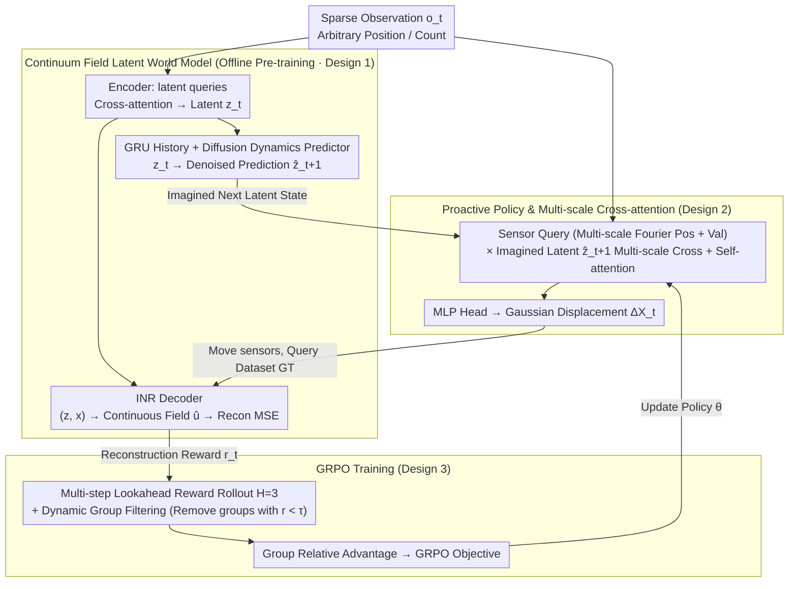

# LASER: Learning Active Sensing for Continuum Field Reconstruction

**Conference**: ICML 2026 Oral  
**arXiv**: [2604.19355](https://arxiv.org/abs/2604.19355)  
**Code**: To be confirmed  
**Area**: Reinforcement Learning / World Models / Active Sensing  
**Keywords**: Active Sensing, World Models, GRPO, POMDP, Continuum Field Reconstruction

## TL;DR
This work models the problem of "where to place sparse sensors" as a POMDP. It employs a "continuum field latent world model" (comprising an encoder, GRU, diffusion dynamics predictor, and implicit neural field decoder) to provide imagined next-step latent states as policy conditions. The cross-attention policy is trained using GRPO with dynamic group filtering and multi-step lookahead rewards. LASER consistently outperforms fixed layouts and offline-optimized layouts on sparse sensing reconstruction tasks across Navier-Stokes, Shallow-Water Equations, and real Sea Surface Temperature (SST) datasets.

## Background & Motivation

**Background**: Recovering continuous physical fields (such as turbulence, stress fields, or temperature fields) from sparse discrete sensor measurements is a core problem in scientific computing and engineering. Recent mainstream approaches utilize neural operators, INRs, or transformer operators for reconstruction, either treating sensor positions as fixed inputs (AROMA, DiffusionPDE) or performing offline optimization to generate **globally static** layouts (PhySense).

**Limitations of Prior Work**: Fixed or globally optimized layouts ignore the **non-stationary** nature of physical fields—the information content at the same sensor locations can vary significantly across different time steps and initial conditions. Literature explicitly reports that reconstruction accuracy can vary by several folds depending on the layout. However, current research lacks true instance-specific sensor adaptation in a closed-loop.

**Key Challenge**: To enable online sensor adaptation, an environment model capable of "what-if" simulation is required. One needs to know "how the next-step reconstruction error would change if sensors move 0.1 north," but real physical systems cannot be repeatedly rolled out. Additionally, active sensing presents a high-dimensional continuous action space with sparse, delayed feedback, making direct RL application unstable.

**Goal**: (i) Construct a latent world model as a differentiable environment surrogate capable of forward prediction and reconstruction reward calculation; (ii) Train an RL policy to **proactively** decide next-step sensor displacements within this latent space; (iii) Stabilize RL training under sparse rewards.

**Key Insight**: This work leverages the World Model paradigm (Ha & Schmidhuber 2018) to decouple environment simulation from planning in latent imagination. However, a world model for continuum fields must handle **arbitrary numbers and positions** of sparse observations, support forward rollouts, and output continuous fields as differentiable reward sources. On the policy side, the work adapts the group-relative advantage estimation of GRPO (from the DeepSeek-R1 series) to continuous control.

**Core Idea**: Use the "world-model imagined next-step latent state" as the query context for the policy to make sensor decisions **proactive** rather than reactive, and stabilize training via GRPO with dynamic filtering.

## Method

### Overall Architecture
LASER models active sensing as a POMDP $\mathcal{M}=(\mathcal{S},\mathcal{A},\mathcal{O},\mathcal{E},\mathcal{T}_\phi,\mathcal{R}_\phi,\gamma)$, where the latent state $\bm s_t=[\bm z_t,\bm h_t]$ consists of the current observation latent code $\bm z_t$ and GRU history $\bm h_t$. The action $\bm a_t=\Delta\bm X_t$ represents sensor displacement, and the reward $r_t=-\mathcal{L}(\bm u_{t+1},\hat{\bm u}_{t+1})$ is the negative MSE of the reconstruction decoded by the world model. Training proceeds in two stages: (1) **Offline** pre-training of the world model $\phi$ (joint ELBO of encoder/dynamics/decoder + diffusion denoising), with randomized sensor layouts per step to learn invariance; (2) **Online** training of the policy $\pi_\theta$ using GRPO, sampling $G$ groups of actions from the current $\hat{\bm z}_{t+1}$ and $\bm o_t$. The environment only queries the training dataset ground truth for rewards, requiring no real physical simulator.

### Key Designs

**1. Continuum Field Latent World Model: A differentiable physical surrogate for forward prediction and reward calculation**

Since real physical simulators are expensive and non-differentiable, making repeated RL rollouts impossible, the authors pre-train a latent world model $p_\phi^{enc}\to p_\phi^{dyn}\to p_\phi^{dec}$. Following AROMA, the encoder uses $M$ learnable latent queries to perform cross-attention on sparse observations $(\bm x_t^{(i)},\bm u_t(\bm x_t^{(i)}))$, yielding $\bm z_t\sim\mathcal{N}(\bm\mu_\phi,\bm\sigma_\phi^2)$. This is naturally permutation-invariant and adapts to any sensor count or location. Randomized layouts during training force the model to learn layout-invariant representations. The dynamics predictor is a conditional diffusion model, conditioned on $\bm z_t$ and GRU history $\bm h_t=\mathrm{GRU}_\phi(\bm h_{t-1},\bm z_t)$, performing $K$ denoising steps on $\tilde{\bm z}_{t+1}$ to output $\hat{\bm z}_{t+1}$. Diffusion is used instead of deterministic MLPs to capture the multi-modal future of non-stationary fields. The decoder is an Implicit Neural Field (INR) that maps $(\bm z_t,\bm x)$ to field values $\hat{\bm u}_t(\bm x)$, allowing differentiable MSE calculation across the entire domain $\Omega$. The total objective is $\mathcal{L}_{world}=\mathcal{L}_{recon}+\beta\mathcal{D}_{KL}+\lambda\mathcal{L}_{diffusion}$.

**2. Proactive Policy & Multi-scale Cross-attention: Using "imagined next latent state" as context for foresight**

Sensor decisions must anticipate rather than react. The key design uses the imagined $\hat{\bm z}_{t+1}$ (not current $\bm z_t$) as the policy's key/value context. The policy $\pi_\theta(\bm a_t|\hat{\bm z}_{t+1},\bm o_t)$ is a Transformer. Sensor queries are concatenated position and value embeddings $\mathbf q^{(i)}=[\gamma_{pos}(\bm x_t^{(i)});\text{Embed}(\bm u_t(\bm x_t^{(i)}))]$, where $\gamma_{pos}$ represents multi-scale Fourier features $\gamma^s(\bm x)=[\sin(\bm x\bm\omega^s),\cos(\bm x\bm\omega^s)]$. Multi-scale cross-attention $\mathbf f=\bigoplus_{s}\text{softmax}(\mathbf q^{(s)}(\mathbf k^{(s)})^\top/\sqrt{c_s})\mathbf v^{(s)}$ between queries and imagined latents captures both local details and global structures (large vs. small eddies). A self-attention layer follows for sensor coordination, and an MLP head outputs Gaussian displacements $(\bm\mu_\theta^{(i)},\log\bm\sigma_\theta^{(i)})$, clipped to $[-a_{max},a_{max}]$.

**3. GRPO Training: Dynamic group filtering + multi-step lookahead rewards for stable training**

Active sensing involves high-dimensional actions and sparse feedback. The authors adapt GRPO's group-relative advantage estimation from discrete LLM tokens to continuous control. For each $t$, $G$ groups of actions are sampled to obtain rewards $\{r_t^g\}$. Group relative advantages $A_{g,t}=(r_t^g-\text{mean})/\text{std}$ are normalized within the batch $\hat A_{g,t}$. The objective $\mathcal{J}_{GRPO}=\mathbb E[\min(s_{g,t}(\theta)\hat A_{g,t},\text{clip}(\cdot,1-\epsilon,1+\epsilon)\hat A_{g,t})]$ follows the PPO clip logic. Two enhancements are added: **Dynamic group filtering** maintains a threshold $\tau$ (running mean of $\min_g r_t^g$), discarding low-quality groups (e.g., overlapping sensors or out-of-bounds configurations) to prevent advantage corruption. **Multi-step lookahead reward** freezes the layout after action $\bm a_t$, performing a 3-step autoregressive rollout via $p_\phi^{dyn}$ to compute $r_t^{look}=\sum_{h=1}^H\gamma^{h-1}r_{t+h}/\sum\gamma^{h-1}$, ensuring decisions account for future reconstruction quality.

### Loss & Training
The world model is frozen after offline training via $\mathcal{L}_{world}$. The policy is trained online using GRPO with $H=3$. Hyperparameters $K, G, \epsilon, \beta, \lambda$ are provided in the appendix. Each episode randomly selects trajectories and start times $t_0$, initializing sensors in a uniform distribution to prevent overfitting to initial conditions.

## Key Experimental Results

### Main Results
Evaluated on 3 benchmarks: NS-1e-3 / NS-1e-5 (Navier-Stokes), Shallow-Water, and SST (Sea Surface Temperature). $\mathrm{MSE}_{recon}$ ($\times 10^{-3}$) metrics (lower is better):

| #Obs | Dataset | AROMA(Fixed) | DiffusionPDE | PhySense(Offline Opt) | LASER-PPO | **LASER** |
|------|------------|------------|--------------|------------------------|-----------|-----------|
| 256 | NS-1e-3 | 2.720 | 1.344 | 0.376 | 0.304 | **0.302** |
| 128 | NS-1e-3 | 5.816 | 6.609 | 0.370 | 0.353 | **0.321** |
| 64 | NS-1e-3 | 20.27 | 6.543 | 0.466 | 0.396 | **0.434** |
| 256 | Shallow-Water| 12.59 | 3.175 | 0.355 | 0.326 | **0.257** |
| 100 | SST | 1.0586 | 3.4626 | 0.7059 | — | **0.6932** |

LASER achieves the lowest error in 11/12 (dataset × #Obs) combinations. The advantage over fixed layouts increases with sparsity (e.g., AROMA vs. LASER on NS-1e-3 @64 shows a 47× difference). LASER with GRPO + dynamic filtering consistently outperforms LASER-PPO.

### Ablation Study

| Configuration | NS-1e-3 @256 Avg | Note |
|------|------------------|------|
| LASER (Full) | 0.302 | Full model |
| LASER† (w/o Dynamic Filtering) | 0.391 | Out-time error increases from 0.483 to 0.685 |
| LASER($\phi$) (WM only) | 0.359 | Active sensing provides ~16% gain |
| Lookahead $H=1$ | Out-t 0.6136 | Single-step reward is short-sighted |
| Lookahead $H=5$ | Out-t 0.3380 | Larger $H$ improves out-time performance |

GRU history length ablation (Table 6): Stronger turbulence (NS-1e-5, Shallow-Water) favors shorter history (3 steps), as excessive old information degrades performance.

### Key Findings
- **Active Sensing > Offline Optimized Layouts**: LASER consistently beats PhySense (the strongest offline baseline), proving instance-specific adaptation is irreplaceable.
- **Lookahead Reward is Critical for Out-time Generalization**: Increasing $H=1\to 5$ yields a 45% reduction in Out-time error while In-time error remains stable, indicating lookahead primarily targets future steps outside the training distribution.
- **Sparsity Highlights Adaptive Superiority**: AROMA degrades by 10×+ when $N$ drops from 256 to 64, while LASER degrades by <2×, proving closed-loop sensing compensates for sensor scarcity.
- **GRPO is Better Suited for This Problem**: LASER outperforms LASER-PPO across all datasets, confirming the effectiveness of group-relative advantage and dynamic filtering.

## Highlights & Insights
- **World Model as Differentiable Surrogate**: This application is highly suitable for SciML, where real simulators are costly or non-differentiable. The world model enables gradient-based rewards and bypasses model-free RL sample inefficiency.
- **Proactive Paradigm**: Condition the policy on imagined future latents $\hat{\bm z}_{t+1}$ rather than current $\bm z_t$ is a simple yet profound design. It enables "one-step ahead" cognition, transferable to various model-based control problems.
- **GRPO in Continuous Control**: While most GRPO work focuses on discrete LLM reasoning, this work successfully applies it to continuous high-dimensional actions. Dynamic group filtering provides a general stabilization trick.
- **Multi-scale Scientific ML Encoding**: Using multi-scale Fourier features and cross-attention corresponds to the multi-scale structure of physical fields (large vs. small eddies), providing an effective template for future SciML research.

## Limitations & Future Work
- The world model is **frozen** after pre-training; if the policy discovers layouts far outside the training distribution, predictions may become unreliable (model exploitation risk).
- Evaluations rely on simulation and historical SST data; **no real closed-loop hardware experiments** are conducted. Real sensors involve movement latency, noise, and energy constraints.
- While $H=3$ helps, Out-time performance could benefit from larger $H$, but diffusion-based rollouts are computationally expensive.
- World models and policies are currently trained per dataset; cross-domain transfer (e.g., from turbulence to temperature fields) remains unverified.

## Related Work & Insights
- **vs AROMA (Serrano+2024)**: AROMA serves as the encoder backbone but treats positions as fixed; LASER promotes "positions" to controllable actions and adds dynamics with a policy.
- **vs DiffusionPDE (Huang+2024)**: DiffusionPDE uses score-based sampling for sparse conditioning at test time (thousands of samples per step); LASER uses diffusion only for latent dynamics prediction, allowing faster autoregressive rollouts.
- **vs PhySense (Ma+2025)**: PhySense optimizes globally static layouts; LASER reduces average error relative to PhySense by 30%+ in the sparsest settings, demonstrating the value of instance-specific adaptation.
- **vs DreamerV3**: Shares the latent imagination paradigm but focuses on continuous PDE fields with Transformer encoders and diffusion dynamics rather than discrete/low-dimensional states.

## Rating
- Novelty: ⭐⭐⭐⭐ Combines world-model RL, GRPO, and multi-scale SciML encoders for active sensing; components are existing, but the integration is novel.
- Experimental Thoroughness: ⭐⭐⭐⭐ 3 datasets × 3 sparsity levels + thorough ablations; lacks hardware validation.
- Writing Quality: ⭐⭐⭐⭐ Clear POMDP formulation, Figure 2 topology, and Algorithm 1; high formula density.
- Value: ⭐⭐⭐⭐ Provides a clear "Active Sensing = World-Model RL" paradigm for the SciML community, applicable to geosciences, fluid dynamics, and industrial sensing networks.

<!-- RELATED:START -->

## Related Papers

- [\[ICLR 2026\] LaSeR: Reinforcement Learning with Last-Token Self-Rewarding](../../ICLR2026/reinforcement_learning/laser_reinforcement_learning_with_last-token_self-rewarding.md)
- [\[ICML 2026\] DARTS: Distribution-Aware Active Rollout Trajectory Shaping for Accelerating LLM Reinforcement Learning](darts_distribution-aware_active_rollout_trajectory_shaping_for_accelerating_llm_.md)
- [\[ICLR 2026\] Learning Human Habits with Rule-Guided Active Inference](../../ICLR2026/reinforcement_learning/learning_human_habits_with_rule-guided_active_inference.md)
- [\[ICML 2026\] Mind Dreamer: Untethering Imagination via Active Causal Intervention on Latent Manifolds](mind_dreamer_untethering_imagination_via_active_causal_intervention_on_latent_ma.md)
- [\[ICML 2025\] Learning Mean Field Control on Sparse Graphs](../../ICML2025/reinforcement_learning/learning_mean_field_control_on_sparse_graphs.md)

<!-- RELATED:END -->
