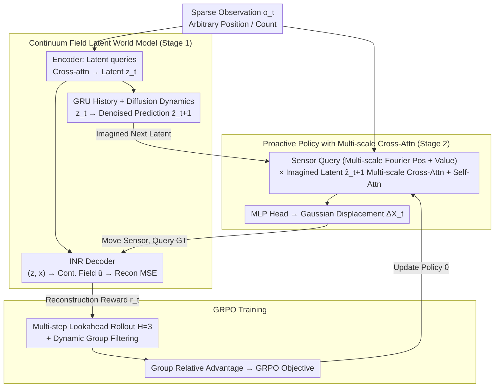

# LASER: Learning Active Sensing for Continuum Field Reconstruction

**Conference**: ICML 2026 Oral  
**arXiv**: [2604.19355](https://arxiv.org/abs/2604.19355)  
**Code**: To be confirmed  
**Area**: Reinforcement Learning / World Models / Active Sensing  
**Keywords**: Active Sensing, World Models, GRPO, POMDP, Continuum Field Reconstruction

## TL;DR
The authors model the problem of "where to place sparse sensors" as a POMDP. They introduce a "Continuum Field Latent World Model"—consisting of an encoder, GRU, diffusion-based dynamics predictor, and an implicit neural field decoder—to provide imagined next-step latent states as policy conditions. By employing GRPO with dynamic group filtering and multi-step lookahead rewards, the proactive cross-attention policy consistently outperforms fixed and offline-optimized layouts on Navier-Stokes, Shallow-Water equations, and Sea Surface Temperature (SST) datasets.

## Background & Motivation

**Background**: Recovering continuous physical fields (e.g., turbulence, stress fields, temperature fields) from sparse discrete sensor measurements is a core problem in scientific computing and engineering. Mainstream approaches currently use neural operators, INRs, or transformer operators for reconstruction, treating sensor positions either as fixed inputs (AROMA, DiffusionPDE) or as **globally static** layouts generated via offline optimization (PhySense).

**Limitations of Prior Work**: Fixed or globally optimized layouts ignore the **non-stationary** nature of physical fields—the information content at specific sensor locations varies significantly across different time steps and initial conditions. Literature indicates that changing the layout can lead to multi-fold differences in reconstruction accuracy. However, instance-specific sensor adaptation in a closed-loop setting remains unexplored.

**Key Challenge**: Online adaptation of sensor positions requires an environment model capable of "what-if" rehearsals. Predicting the effect of moving a sensor on future reconstruction error is impossible without a repeatable rollout, and real physical systems cannot be queried iteratively. Furthermore, active sensing involves high-dimensional continuous action spaces and sparse delayed feedback, making standard RL unstable.

**Goal**: (i) Construct a latent world model capable of forward prediction and reconstruction reward calculation as a differentiable environment proxy; (ii) Train an RL policy to **proactively** determine sensor displacements within this latent space; (iii) Ensure stable RL training under sparse rewards.

**Key Insight**: Borrowing from the World Model paradigm (Ha & Schmidhuber 2018), the authors decouple environment simulation from planning in latent imagination. A world model for continuum fields must handle **arbitrary numbers and positions** of sparse observations, perform forward rollouts, and output continuous fields for differentiable rewards. On the policy side, inspired by DeepSeek-R1, they adapt GRPO (Group Relative Policy Optimization) to continuous control.

**Core Idea**: Use the "imagined next latent state" from the world model as the query context for the policy, making sensor decisions **proactive** rather than reactive, and stabilize training via GRPO with dynamic filtering.

## Method

### Overall Architecture
LASER models active sensing as a POMDP $\mathcal{M}=(\mathcal{S},\mathcal{A},\mathcal{O},\mathcal{E},\mathcal{T}_\phi,\mathcal{R}_\phi,\gamma)$. The latent state $\bm s_t=[\bm z_t,\bm h_t]$ consists of the current observation latent code $\bm z_t$ and GRU history $\bm h_t$. Actions $\bm a_t=\Delta\bm X_t$ represent sensor displacements, and the reward $r_t=-\mathcal{L}(\bm u_{t+1},\hat{\bm u}_{t+1})$ is the negative MSE of the reconstruction. Training proceeds in two stages: (1) **Offline** pre-training of the world model $\phi$ (joint ELBO of encoder/dynamics/decoder + diffusion denoising), where sensor layouts are randomized at each step to learn invariance; (2) **Online** training of the policy $\pi_\theta$ using GRPO, where $G$ groups of actions are sampled starting from $\hat{\bm z}_{t+1}$ and $\bm o_t$, querying dataset ground truths for rewards without needing a real physics simulator.

### Key Designs

**1. Continuum Field Latent World Model: A differentiable environment proxy for prediction and rewards**

Since real physics simulators are expensive and non-differentiable, the authors pre-train a latent world model $p_\phi^{enc}\to p_\phi^{dyn}\to p_\phi^{dec}$. The encoder follows AROMA, using $M$ learnable latent queries to perform cross-attention on sparse observations $(\bm x_t^{(i)},\bm u_t(\bm x_t^{(i)}))$ to obtain $\bm z_t\sim\mathcal{N}(\bm\mu_\phi,\bm\sigma_\phi^2)$. This is inherently permutation-invariant and adaptable to any sensor count. The dynamics predictor is a conditional diffusion model, conditioned on $\bm z_t$ and GRU history $\bm h_t=\mathrm{GRU}_\phi(\bm h_{t-1},\bm z_t)$, performing $K$ denoising steps on $\tilde{\bm z}_{t+1}$ to output $\hat{\bm z}_{t+1}$. Diffusion is used instead of deterministic MLPs to capture the multi-modal future of non-stationary turbulent fields. The decoder is an Implicit Neural Field (INR) mapping $(\bm z_t, \bm x)$ to field values $\hat{\bm u}_t(\bm x)$, allowing rewards to be calculated as continuous differentiable MSE across the entire domain $\Omega$. The total loss is $\mathcal{L}_{world}=\mathcal{L}_{recon}+\beta\mathcal{D}_{KL}+\lambda\mathcal{L}_{diffusion}$.

**2. Proactive Policy & Multi-scale Cross-Attention: Anticipating the future using imagined latent states**

Sensor decisions must anticipate rather than react. The key design is using the world model's "hallucinated" $\hat{\bm z}_{t+1}$ (rather than current $\bm z_t$) as the key/value for the policy transformer $\pi_\theta(\bm a_t|\hat{\bm z}_{t+1},\bm o_t)$. Sensor queries are formed by concatenating position and value embeddings $\mathbf q^{(i)}=[\gamma_{pos}(\bm x_t^{(i)});\text{Embed}(\bm u_t(\bm x_t^{(i)}))]$, where $\gamma_{pos}$ uses multi-scale Fourier features. These queries interact with the imagined latent via multi-scale cross-attention $\mathbf f=\bigoplus_{s}\text{softmax}(\mathbf q^{(s)}(\mathbf k^{(s)})^\top/\sqrt{c_s})\mathbf v^{(s)}$ to capture both global structures (large eddies) and local details (fine eddies). A self-attention layer follows to ensure coordination and prevent sensor clustering. Finally, an MLP head outputs Gaussian displacements $(\bm\mu_\theta^{(i)},\log\bm\sigma_\theta^{(i)})$.

**3. GRPO Training: Dynamic group filtering and multi-step lookahead**

Active sensing involves high-dimensional actions and sparse feedback. The authors adapt GRPO's group-relative advantage estimation to continuous control: for each $t$, $G$ action groups are sampled to obtain rewards $\{r_t^g\}$, and advantages are computed as $A_{g,t}=(r_t^g-\text{mean})/\text{std}$, then normalized as $\hat A_{g,t}$ within the batch. Two crucial enhancements are added: (i) **Dynamic group filtering**, which maintains a threshold $\tau$ (moving average of $\min_g r_t^g$) to discard low-quality samples where sensors might be clustered or out-of-bounds. (ii) **Multi-step lookahead**, where the layout is frozen after $\bm a_t$, and $p_\phi^{dyn}$ performs an autoregressive rollout for $H=3$ steps to calculate a discounted reward $r_t^{look}=\sum_{h=1}^H\gamma^{h-1}r_{t+h}/\sum\gamma^{h-1}$. This prevents short-sighted decisions in rapidly evolving fields.

### Loss & Training
The world model is frozen after offline training with $\mathcal{L}_{world}$. The policy is trained online using the GRPO objective. Parameters such as $H=3$, $K$ denoising steps, $G$, $\epsilon$, $\beta$, and $\lambda$ are detailed in the appendix. Each episode randomly selects trajectories and starting times $t_0$ with uniform sensor initialization to prevent overfitting.

## Key Experimental Results

### Main Results
Evaluation across three benchmarks: NS-1e-3 / NS-1e-5 (Navier-Stokes), Shallow-Water, and SST (Sea Surface Temperature). Metric: $\mathrm{MSE}_{recon}$ ($\times 10^{-3}$, lower is better). Avg denotes the mean of In-time and Out-time results.

| #Obs | Dataset | AROMA (Fixed) | DiffusionPDE | PhySense (Offline Opt) | LASER-PPO | **Ours (LASER)** |
|------|--------|------------|--------------|------------------------|-----------|-----------|
| 256 | NS-1e-3 | 2.720 | 1.344 | 0.376 | 0.304 | **0.302** |
| 128 | NS-1e-3 | 5.816 | 6.609 | 0.370 | 0.353 | **0.321** |
| 64  | NS-1e-3 | 20.27 | 6.543 | 0.466 | 0.396 | **0.434** |
| 256 | Shallow-Water | 12.59 | 3.175 | 0.355 | 0.326 | **0.257** |
| 100 | SST | 1.0586 | 3.4626 | 0.7059 | — | **0.6932** |

LASER achieves the lowest error in 11 out of 12 combinations. The gain over fixed layouts increases with sparsity (e.g., a 47× improvement over AROMA on NS-1e-3 @ 64). Compared to LASER-PPO, the GRPO variant with dynamic filtering further reduces error.

### Ablation Study

| Configuration | NS-1e-3 @256 Avg | Note |
|------|------------------|------|
| LASER (Full) | 0.302 | Complete model |
| LASER† (w/o Dynamic Filtering) | 0.391 | Out-time error increases from 0.483 to 0.685 |
| LASER($\phi$) (No Active Sensing) | 0.359 | Active sensing provides ~16% gain |
| Lookahead $H=1$ | Out-t 0.6136 | Short-sighted rewards |
| Lookahead $H=5$ | Out-t 0.3380 | Higher $H$ improves Out-time significantly (~45% gain) |

GRU history length ablation (Table 6): Stronger turbulence (NS-1e-5, Shallow-Water) favors shorter history (3 steps) as stale information can degrade performance.

### Key Findings
- **Active Sensing > Offline Optimized Layouts**: LASER consistently beats PhySense (the strongest offline baseline), proving instance-specific adaptation is essential.
- **Lookahead is Critical for Out-time Generalization**: Increasing $H$ from 1 to 5 slashes Out-time error by 45% while keeping In-time results stable, suggesting that lookahead helps the model plan for future states outside the training distribution.
- **Sparsity Highlights Adaptive Advantages**: While AROMA’s error degrades by 10×+ when dropping from 256 to 64 sensors, LASER’s degradation is less than 2×.
- **GRPO Suited for Continuous Control**: LASER outperforms LASER-PPO across all datasets, validating the group-relative advantage and dynamic filtering approach.

## Highlights & Insights
- **World Models as Differentiable Physics Proxies**: This paradigm is highly effective for scientific computing where simulators are costly; it bypasses the sample efficiency limitations of model-free RL.
- **Proactive Paradigm**: Conditioned on future latents $\hat{\bm z}_{t+1}$ rather than current $\bm z_t$ is a simple yet profound design that ensures decisions are one step ahead.
- **GRPO for Continuous Control**: While most GRPO work focuses on discrete LLM tokens, this paper demonstrates its effectiveness for high-dimensional continuous action spaces.
- **Multi-scale Templates**: The combination of multi-scale Fourier encoding and cross-attention provides a robust template for handling the multi-scale structures inherent in physical fields (e.g., eddies in turbulence).

## Limitations & Future Work
- The world model is **frozen** after pre-training; if the policy discovers layouts far outside the training distribution, the model might be exploited, causing unreliable predictions.
- Evaluation is limited to simulations and historical SST data with **no real-world hardware experiments** involving motion latency or energy constraints.
- While $H=3$ helps, longer rollouts are constrained by the computational cost of diffusion dynamics.
- World models are trained per dataset; cross-domain transfer (e.g., from turbulence to temperature fields) remains unverified.

## Related Work & Insights
- **vs. AROMA (Serrano et al., 2024)**: AROMA serves as the encoder backbone but treats positions as fixed. LASER elevates "position" to a controllable action.
- **vs. DiffusionPDE (Huang et al., 2024)**: DiffusionPDE performs sampling at test time which is extremely slow; LASER uses diffusion only for latent dynamics prediction, enabling faster rollouts.
- **vs. PhySense (Ma et al., 2025)**: PhySense optimizes static layouts; LASER reduces error by 30%+ in sparse settings by being adaptive.
- **vs. DreamerV3**: Shares the latent imagination philosophy but adapts it to PDE continuum fields with transformer encoders and diffusion dynamics.

## Rating
- Novelty: ⭐⭐⭐⭐ (Combines world-model RL, GRPO, and multi-scale scientific ML in a novel way for active sensing.)
- Experimental Thoroughness: ⭐⭐⭐⭐ (Extensive across datasets and sparsity levels, though lacking hardware.)
- Writing Quality: ⭐⭐⭐⭐ (Clear formalization and diagrams.)
- Value: ⭐⭐⭐⭐ (Provides a clear "active sensing = world-model RL" paradigm for the scientific ML community.)

<!-- RELATED:START -->

## Related Papers

- [\[ICLR 2026\] cadrille: Multi-modal CAD Reconstruction with Reinforcement Learning](../../ICLR2026/reinforcement_learning/cadrille_multi-modal_cad_reconstruction_with_reinforcement_learning.md)
- [\[ICML 2026\] DARTS: Distribution-Aware Active Rollout Trajectory Shaping for Accelerating LLM Reinforcement Learning](darts_distribution-aware_active_rollout_trajectory_shaping_for_accelerating_llm_.md)
- [\[CVPR 2026\] BuildingGPT: Auto-Regressive Building Wireframe Reconstruction Model with Reinforcement Learning](../../CVPR2026/reinforcement_learning/buildinggpt_auto-regressive_building_wireframe_reconstruction_model_with_reinfor.md)
- [\[ICML 2026\] Mind Dreamer: Untethering Imagination via Active Causal Intervention on Latent Manifolds](mind_dreamer_untethering_imagination_via_active_causal_intervention_on_latent_ma.md)
- [\[ICML 2025\] Learning Mean Field Control on Sparse Graphs](../../ICML2025/reinforcement_learning/learning_mean_field_control_on_sparse_graphs.md)

<!-- RELATED:END -->
