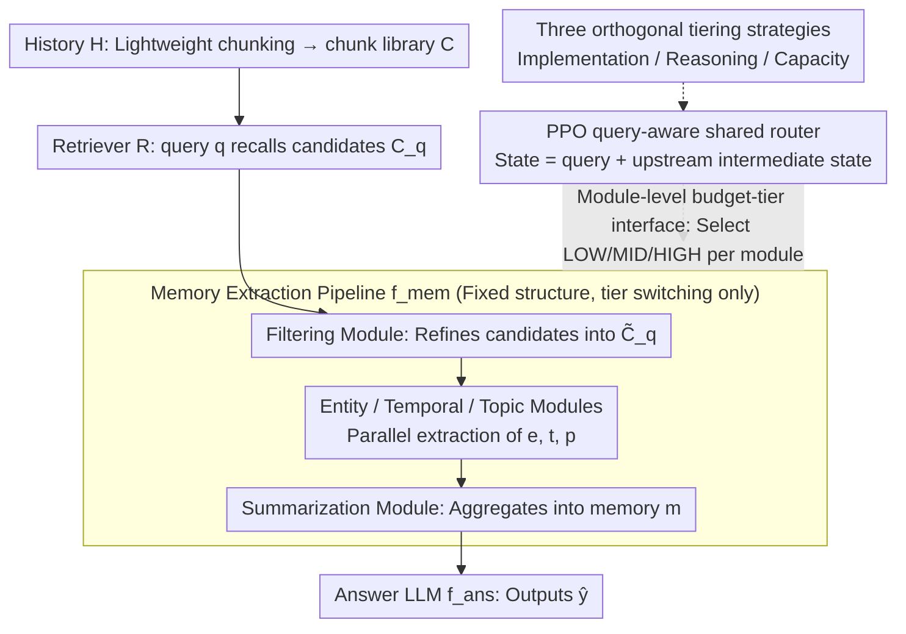

# Learning Query-Aware Budget-Tier Routing for Runtime Agent Memory

**Conference**: ICML 2026  
**arXiv**: [2602.06025](https://arxiv.org/abs/2602.06025)  
**Code**: https://github.com/ViktorAxelsen/BudgetMem  
**Area**: LLM Agent / Long-term Memory / Test-time Compute Scaling  
**Keywords**: agent memory, runtime extraction, budget-tier routing, RL router, performance-cost trade-off  

## TL;DR
BudgetMem reorganizes "runtime agent memory extraction" into a modular pipeline consisting of "filtering → parallel entity/temporal/topic extraction → summarization." Each module is equipped with LOW/MID/HIGH budget tier interfaces. A shared lightweight router is trained via PPO to select tiers for each module upon the arrival of a query, simultaneously improving F1/Judge scores and reducing the average cost per query on LoCoMo, LongMemEval, and HotpotQA.

## Background & Motivation

**Background**: Current mainstream LLM agent memory systems typically follow an "offline, query-agnostic" route: chat history is pre-compressed, summarized, and written into vector databases or knowledge graphs as soon as it is generated. Approaches like MemoryBank, Mem0, and A-MEM completely decouple "indexing" from "memory usage," requiring only retrieval during QA.

**Limitations of Prior Work**: This "build once, use always" paradigm is not coupled with specific queries, making it wasteful—the compute spent on preprocessing may be entirely useless for the current query—and fragile—offline summarization or compression might discard details crucial for certain queries. A more natural alternative is "on-demand" extraction from raw history when a query arrives. However, this shifts expensive LLM calls to runtime, making cost and latency first-class citizens, while existing runtime memory systems (ReadAgent, LightMem, etc.) lack explicit control knobs for the cost-performance trade-off.

**Key Challenge**: To controllably trade quality for cost at runtime, two previously conflated sub-problems must be addressed: *where* the budget should be allocated (at what granularity in the pipeline) and *how* the budget should be implemented (saving tokens by changing implementations, inference methods, or model sizes).

**Goal**: Construct a unified runtime memory framework where "budget units" are explicit at the module level, "budget implementation methods" can be compared side-by-side, and the overall trade-off can be learned rather than manually tuned.

**Key Insight**: Memory extraction is modeled as a multi-stage modular pipeline where each module is forced to implement an identical "budget-tier interface" (providing three tiers under the same input/output contract). Routing decisions then reduce to a small-scale sequential decision problem: "selecting one of three tiers for each module."

**Core Idea**: Use a shared small router that takes the query and the intermediate state of the previous stage as its state. It uses PPO to learn query-aware module-level tier selection based on a reward of "task performance + cost penalty," shifting cost control from offline/manual to online/learnable.

## Method

### Overall Architecture
Given a history $H$, task-agnostic lightweight chunking is first performed to obtain a chunk library $C=\{c_i\}_{i=1}^{N}$. Upon the arrival of query $q$, a retriever $R$ returns candidates $C_q = R(q, C)\subset C$. Memory extraction is defined as $m = f_{mem}(q, C_q)$, and the final answer $\hat y = f_{ans}(q, m)$ is generated by a fixed LLM. $f_{mem}$ is a modular pipeline with a fixed structure: a filtering module $M_{fil}$ refines $C_q$ into $\tilde C_q$, followed by parallel entity ($M_{ent}$), temporal ($M_{tmp}$), and topic ($M_{top}$) modules to extract $e, t, p$, which are finally aggregated into $m$ by a summarization module $M_{sum}$. The pipeline structure remains constant, while the router switches tiers within each module. The relationship is as follows: the pipeline provides the skeleton, the **module-level budget-tier interface** exposes three tiers for each module, **three orthogonal tiering strategies** define the implementation of these tiers, and the **PPO shared router** selects a tier for each module in the skeleton when a query arrives.

### Key Designs

**1. Module-level budget-tier interface: Wrapping each module in the same input/output contract with LOW/MID/HIGH implementations**

Adding budget knobs directly to the answer LLM is an "after-the-fact" fix that fails to see the costs incurred during memory extraction. BudgetMem instead sinks the budget to the module level. All modules share an abstract signature (input query + upstream intermediate states; output current intermediate representation), where three tiers correspond to different implementation complexities or inference costs. This reduces routing to a discrete 1-of-3 action per step, avoiding pipeline redesign while allowing precise identification of "over-spending" in filtering, extraction, or summarization.

**2. Three orthogonal tiering strategies: Side-by-side comparison of "Implementation/Reasoning/Capacity" under a unified framework**

In practice, reasoning levels and model sizes are often changed simultaneously, making it difficult to determine which knob is actually effective. BudgetMem separates them into three orthogonal axes. **Implementation tiering**: LOW uses rules or pattern matching, MID uses small BERT-like expert models, and HIGH upgrades to LLMs. **Reasoning tiering**: Under the same backbone, LOW uses direct answering, MID uses CoT, and HIGH uses multi-step/reflection. **Capacity tiering**: Uses the same algorithm with different LM sizes. Separating these axes informs designers which strategy is most cost-effective at low budgets and which has the highest ceiling at high budgets. Experiments show that capacity tiering has the highest ceiling, while implementation tiering is Pareto-superior in extremely tight budget regions.

**3. PPO-trained query-aware shared router: Modeling routing as sequential decision making with "Task Performance + Extraction Cost" rewards**

Since the path involves non-differentiable LLM calls, RL must be used. At each module invocation step $k$, the state $s_k$ (a compact embedding of query $q$, upstream outputs, and a "module descriptor") is observed, and an action $a_k \in \{\text{LOW}, \text{MID}, \text{HIGH}\}$ is output. A full pipeline run for a single query constitutes an episode. The reward $r = r_{task} + \lambda \cdot \alpha \cdot r_{cost}$ combines task performance $r_{task} \in [0, 1]$ with extraction cost $c_{raw} = \sum_k c(M_k, a_k)$ (LLM tiers calculated by token price; non-LLM tiers ignored). Costs are normalized via sliding window quantiles: $\tilde c = (\sqrt{c_{raw}}-Q_5)/(Q_{95}-Q_5)$, $r_{cost}=1-\mathrm{clip}(\tilde c, 0, 1)$, and multiplied by a variance alignment factor $\alpha = \mathrm{std}(r_{task})/(\mathrm{std}(r_{cost})+\epsilon)$ to prevent high-variance terms from dominating gradients. $\lambda$ is a preference toggle adjustable at deployment (lower for performance-first, higher for tight-budget) without retraining. The factor $\alpha$ addresses training instability caused by scale mismatches; without it, the router would be dominated by cost rewards and collapse to all-LOW actions.

### Loss & Training
The routing policy $\pi_\theta$ is optimized using PPO, with one query per episode and the reward defined by the cost-task formula. $\lambda$ serves as a preference switch that can be tuned during deployment: decreasing $\lambda$ for performance-first scenarios and increasing it for tight-budget constraints, without the need to retrain the router.

## Key Experimental Results

### Main Results
Evaluation was conducted on three long-term memory / long-context QA benchmarks: LoCoMo, LongMemEval, and HotpotQA. Metrics include F1, LLM-as-a-Judge, and "Average Cost per Query." The following table summarizes average results under the *performance-first* setting using a LLaMA-3.3-70B-Instruct backbone (averaged across three datasets).

| Method | Avg F1 | Avg Judge | Avg Cost ↓ |
|:---|:---|:---|:---|
| MemoryBank | 23.75 | 28.47 | 4.14 |
| A-MEM | 30.47 | 40.27 | 32.07 |
| Mem0 | 22.26 | 35.66 | 6.92 |
| MemoryOS | 26.03 | 37.14 | 18.04 |
| LightMem | 35.45 | 49.21 | 5.63 |
| **BudgetMem-IMP** | 41.84 | 57.36 | **1.29** |
| **BudgetMem-REA** | 44.19 | 57.39 | 1.52 |
| **BudgetMem-CAP** | **45.72** | **59.99** | 1.38 |

All three tiering strategies outperform strong runtime baselines like LightMem by 6–10 F1 points while simultaneously reducing average costs to less than 1/4. Capacity tiering offers the highest performance ceiling, while implementation tiering is the most economical at the low-budget end.

### Ablation Study

| Configuration | Key Phenomenon | Explanation |
|:---|:---|:---|
| All-HIGH (No routing) | Slight performance gain, cost explosion | Confirms "one-size-fits-all big models" is a common but inefficient default. |
| All-LOW (No routing) | Lowest cost, but significant F1/Judge drop | Critical details are lost as rules/small models are used regardless of query difficulty. |
| Random routing + Fixed budget | Similar cost but lower scores than BudgetMem | Proves that query-aware learned routing is indispensable. |
| Remove $\alpha$ (No variance alignment) | Cost reward dominates late training; router collapses to All-LOW | Indicates that reward-scale alignment is crucial for stable training. |

### Key Findings
- Within the same compute budget, capacity tiering typically provides the highest quality ceiling, yet implementation tiering is Pareto-superior in "extremely tight cost" regions, suggesting that the optimal knob changes across budget segments.
- The router is shared and lightweight: a single policy is used for all modules, distinguishing contexts via module descriptors. This avoids parameter expansion and data sparsity issues inherent in "one router per module" designs.
- Sliding window normalized $r_{cost}$ brings costs across different datasets into a shared $[0, 1]$ interval, which is a practical prerequisite for zero-shot transfer of RL routing across datasets.

## Highlights & Insights
- The "module-level + three-tier interface + shared small router" abstraction is very clean. it crystallizes the "budget control problem" from a tangle of engineering parameters into a discrete 1-of-3 RL problem—a paradigm applicable to other agent subsystems like tool use, retrieval depth, and reflection steps.
- Concurrently deconstructing *implementation / reasoning / capacity* tiering and comparing them on the same testbed provides empirical evidence for the heuristic "use implementation-tiering for low budgets and capacity-tiering for high budgets," offering significant guidance for system design.
- Using sliding window quantiles and variance alignment to resolve the scale mismatch between task and cost rewards is a detail often overlooked in RL-for-LLM-routing works, but it is critical for convergence stability and can be reused in any dual-objective RL training.

## Limitations & Future Work
- The current pipeline structure "filter → entity/temporal/topic → summary" is manually designed. Optimal module partitioning for other domains (e.g., code agents, vision agents) still requires manual effort; the framework is structure-agnostic, but the partitioning itself is not co-optimized.
- Three discrete budget tiers are practical but insufficiently granular. Future work could extend this to continuous budgets or longer tier lists, requiring more refined exploration strategies.
- $\lambda$ remains a manually tuned knob at deployment; the authors do not provide a method to automatically derive $\lambda$ given a specific SLA. In production, $\lambda$ selection based on latency/budget quotas is often necessary.
- Costs only account for token prices, ignoring real-world deployment costs like GPU time, caching, and cross-node communication. The definition of $c(\cdot)$ needs replacement for industrial deployment.

## Related Work & Insights
- **vs LightMem / MemoryOS**: Both utilize runtime memory, but LightMem implicitly embeds cost control into the pipeline design, lacking explicit knobs. BudgetMem exposes module-level tiers, allowing the generation of a full Pareto curve under the same backbone.
- **vs Mem0 / MemoryBank / A-MEM**: These focus on *offline* memory construction ("build then query"). BudgetMem takes the *on-demand* approach, emphasizing query-aware extraction and using the router to suppress inference costs to levels comparable to or lower than offline methods.
- **vs LLM router (e.g., RouteLLM, LLM-Blender)**: Classic LLM routing only switches models at the "answer LLM" stage. BudgetMem pushes the same routing philosophy down into each sub-module of memory extraction, extending routing from coarse-grained selection to internal pipeline components.

## Rating
- Novelty: TBD
- Experimental Thoroughness: TBD
- Writing Quality: TBD
- Value: TBD

<!-- RELATED:START -->

## Related Papers

- [\[ICML 2026\] Multi-Agent Decision-Focused Learning via Value-Aware Sequential Communication](multi-agent_decision-focused_learning_via_value-aware_sequential_communication.md)
- [\[ICML 2026\] Vulnerable Agent Identification in Large-Scale Multi-Agent Reinforcement Learning](vulnerable_agent_identification_in_large-scale_multi-agent_reinforcement_learnin.md)
- [\[ICML 2026\] Flow-Equivariant World Models: Memory for Partially Observed Dynamic Environments](flow_equivariant_world_models_memory_for_partially_observed_dynamic_environments.md)
- [\[ICLR 2026\] Routing, Cascades, and User Choice for LLMs](../../ICLR2026/reinforcement_learning/routing_cascades_and_user_choice_for_llms.md)
- [\[ICLR 2026\] Recurrent Action Transformer with Memory](../../ICLR2026/reinforcement_learning/recurrent_action_transformer_with_memory.md)

<!-- RELATED:END -->
