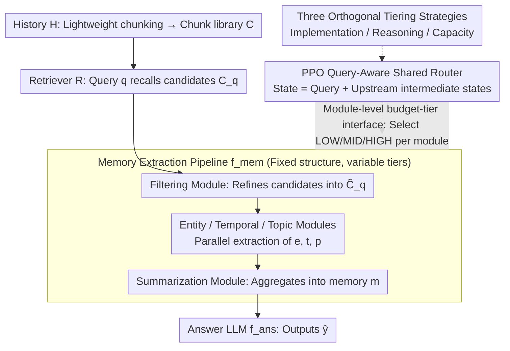

# Learning Query-Aware Budget-Tier Routing for Runtime Agent Memory

**Conference**: ICML 2026  
**arXiv**: [2602.06025](https://arxiv.org/abs/2602.06025)  
**Code**: https://github.com/ViktorAxelsen/BudgetMem  
**Area**: LLM Agent / Long-term Memory / Inference-time Compute Scheduling  
**Keywords**: agent memory, runtime extraction, budget-tier routing, RL router, performance-cost trade-off  

## TL;DR
BudgetMem reorganizes "runtime agent memory extraction" into a modular pipeline of "filtering → entity/temporal/topic parallel → summarization," assigning LOW/MID/HIGH budget tiers to each module. A shared lightweight router is trained using PPO to select tiers for each module upon query arrival, simultaneously improving F1/Judge scores and reducing average cost per query on LoCoMo, LongMemEval, and HotpotQA.

## Background & Motivation

**Background**: Current mainstream LLM agent memory systems primarily follow an "offline, query-agnostic" approach. Chat history is pre-compressed, summarized, and written into vector databases or knowledge graphs as soon as it is generated. Methods like MemoryBank, Mem0, and A-MEM completely decouple "indexing" from "memory usage," requiring only retrieval during QA.

**Limitations of Prior Work**: This "build once, use always" paradigm is not coupled with specific queries, leading to both waste—computational power spent on preprocessing may be entirely useless for the current query—and brittleness—offline summarization/compression might discard details crucial for certain queries. A more natural alternative is "on-demand" extraction from raw history upon query arrival. However, this shifts expensive LLM calls to runtime, making cost and latency first-class citizens. Existing runtime memory systems (e.g., ReadAgent, LightMem) offer almost no explicit control knobs for the performance-cost trade-off.

**Key Challenge**: To controllably trade the "quality-cost" curve at runtime, two previously conflated sub-questions must be answered: *where* the budget should be allocated (at which granularity in the pipeline) and *how* the budget should be implemented (the same token savings can be achieved by changing implementations, reasoning methods, or model sizes).

**Goal**: Construct a unified runtime memory framework where "budget units" are explicit at the module level, "budget implementation methods" can be compared side-by-side, and the overall trade-off can be learned rather than manually tuned.

**Key Insight**: Formulate memory extraction as a multi-stage modular pipeline, forcing each module to implement a consistent "budget-tier interface" (providing three tiers under the same input/output contract). Routing decisions then degenerate into a small-scale sequential decision problem of "choosing one of three tiers for each module."

**Core Idea**: Employ a shared lightweight router that treats the query plus upstream intermediate states as the state. Train it via PPO based on "task reward + cost penalty" to learn query-aware module-level tier selection, shifting cost control from offline/manual to online/learnable.

## Method

### Overall Architecture
Given history $H$, a query-agnostic lightweight chunking produces a chunk library $C=\{c_i\}_{i=1}^{N}$. When a query $q$ arrives, a retriever $R$ returns candidates $C_q = R(q, C)\subset C$. Memory extraction is defined as $m = f_{mem}(q, C_q)$, and the final answer $\hat y = f_{ans}(q, m)$ is generated by a fixed LLM. $f_{mem}$ is a modular pipeline with a fixed structure: a filtering module $M_{fil}$ refines $C_q$ into $\tilde C_q$; then entity $M_{ent}$, temporal $M_{tmp}$, and topic $M_{top}$ modules perform parallel extraction to produce $e, t, p$; finally, a summarization module $M_{sum}$ aggregates these into $m$. The pipeline structure remains constant, while the router switches tiers within each module. The relationship is: the pipeline provides the skeleton, the **module-level budget-tier interface** exposes LOW/MID/HIGH tiers for each module, **three orthogonal tiering strategies** define how these tiers are implemented, and the **PPO shared router** selects a tier for each module in the skeleton upon query arrival.

### Key Designs

**1. Module-level budget-tier interface: Wrapping each module in the same input-output contract with LOW/MID/HIGH implementations**

Adding budget knobs directly to the answer LLM is a "post-hoc fix" that ignores the cost of memory extraction. BudgetMem instead pushes the budget down to the module level. All modules share an abstract signature (input: query + upstream states; output: intermediate representation), where the three tiers correspond to different implementation complexities or inference costs. This reduces routing to a discrete 3-way choice, avoiding pipeline redesign while precisely identifying whether a query is "overspending" on filtering, entity extraction, or summarization.

**2. Three orthogonal tiering strategies: Side-by-side comparison of "implementation/reasoning/capacity" trade-offs**

In practice, reasoning levels and model sizes are often changed simultaneously, making it difficult to determine which knob is effective. BudgetMem separates them into three orthogonal axes. **Implementation tiering**: LOW use rules or pattern matching, MID use BERT-like expert models, HIGH upgrade to LLMs. **Reasoning tiering**: Under the same backbone, LOW uses direct answering, MID uses CoT, and HIGH uses multi-step/reflection. **Capacity tiering**: The same algorithm is used with different LM sizes. Separating these axes reveals which strategy is most cost-effective at low budgets and which provides the highest ceiling—experiments show capacity tiering has the highest ceiling, while implementation tiering is Pareto-optimal in extremely tight budget ranges.

**3. PPO-trained query-aware shared router: Modeling routing as sequential decision-making with end-to-end "task performance + extraction cost" rewards**

Since the path includes non-differentiable LLM calls, RL is used. At each module invocation step $k$, the state $s_k$ (a compact embedding of query $q$, upstream outputs, and a "module descriptor") is observed. An action $a_k\in\{\text{LOW},\text{MID},\text{HIGH}\}$ is output. A single query processing through the pipeline constitutes an episode. The reward $r = r_{task} + \lambda\cdot\alpha\cdot r_{cost}$ combines task performance $r_{task}\in[0,1]$ with raw extraction cost $c_{raw}=\sum_k c(M_k, a_k)$ (calculated via token price for LLMs, ignored for non-LLMs). Costs undergo sliding-window quantile normalization $\tilde c = (\sqrt{c_{raw}}-Q_5)/(Q_{95}-Q_5)$ and $r_{cost}=1-\mathrm{clip}(\tilde c,0,1)$, multiplied by a variance alignment factor $\alpha = \mathrm{std}(r_{task})/(\mathrm{std}(r_{cost})+\epsilon)$ to prevent high-variance terms from dominating gradients. $\lambda$ is a preference toggle adjustable at deployment (lower for performance-first, higher for tight-budget) without retraining the router. $\alpha$ specifically addresses training instability caused by mismatched reward scales; without it, the router tends to collapse to all-LOW actions due to cost dominance.

### Loss & Training
The routing policy $\pi_\theta$ is optimized using PPO, with one episode per query and rewards defined by Eq. (7). $\lambda$ serves as a tunable preference knob during deployment: $\lambda$ is lowered for performance-first scenarios and raised for tight-budget constraints, allowing preference adjustments without retraining the router.

## Key Experimental Results

### Main Results
Evaluations were conducted on LoCoMo, LongMemEval, and HotpotQA benchmarks for long-term memory and long-context QA. Metrics include F1, LLM-as-a-Judge, and "average cost per query." The following table summarizes average results for the *performance-first* setting using a LLaMA-3.3-70B-Instruct backbone (averaged across three datasets).

| Method | Avg F1 | Avg Judge | Avg Cost ↓ |
|:---|:---|:---|:---|
| MemoryBank | 23.75 | 28.47 | 4.14 |
| A-MEM | 30.47 | 40.27 | 32.07 |
| Mem0 | 22.26 | 35.66 | 6.92 |
| MemoryOS | 26.03 | 37.14 | 18.04 |
| LightMem | 35.45 | 49.21 | 5.63 |
| **BudgetMem-IMP** | 41.84 | 57.36 | **1.29** |
| **BudgetMem-REA** | 44.19 | 57.39 | 1.52 |
| **BudgetMem-CAP** | **45.72** | **59.99** | 1.38 |

All three tiering strategies outperform strong runtime baselines like LightMem by 6-10 F1 points while reducing average costs to less than 1/4. Capacity tiering offers the highest performance ceiling, while implementation tiering is the most economical at the low-budget end.

### Ablation Study
| Configuration | Key Observation | Description |
|:---|:---|:---|
| All HIGH (No routing) | Slight performance gain, astronomical cost | Confirms that "one-size-fits-all large model" approach is common but inefficient |
| All LOW (No routing) | Lowest cost, but significant drop in F1 / Judge | Critical details are lost as rules/small models are used regardless of query difficulty |
| Random routing + Fixed budget | Similar cost but lower scores than BudgetMem | Proves the necessity of query-aware learned routing |
| No $\alpha$ (No variance alignment) | Cost reward dominates late training; router collapses to all LOW | Indicates that reward-scale alignment is crucial for stable training |

### Key Findings
- For the same computational budget, capacity tiering typically yields the highest quality ceiling, but implementation tiering is Pareto-optimal in "extremely tight" budget ranges—demonstrating that the optimal knob varies across budget segments.
- The router is shared and lightweight: all modules use a single small policy, using module descriptors to distinguish contexts. This avoids parameter expansion and data sparsity associated with "one router per module" designs.
- Sliding-window normalized $r_{cost}$ maps costs from different datasets into a shared $[0,1]$ interval, which is a practical prerequisite for zero-shot transfer of RL routing across datasets.

## Highlights & Insights
- The abstraction of "module-level + three-tier interface + shared lightweight router" is remarkably clean. it transforms the "budget control problem" of memory systems from a mess of engineering parameters into a simple 3-way RL choice, a paradigm that can be directly applied to other agent subsystems (tool calling, retrieval depth, reflection steps).
- By simultaneously decoupling *implementation / reasoning / capacity* tiering and comparing them in the same testbed, the study provides the first empirical evidence for practical guidelines such as "use implementation changes for low budgets and capacity changes for high budgets."
- Using sliding-window quantiles and variance alignment to resolve the "task reward vs. cost reward" scale conflict is a detail often overlooked in RL-for-LLM-routing works. However, it significantly impacts convergence stability and can be directly reused in any dual-objective RL training for quality and cost.

## Limitations & Future Work
- The current pipeline "filter → entity/temporal/topic → summary" is manually designed. Optimal module partitioning for other domains (e.g., code agents, vision agents) remains to be explored. While the framework is structure-agnostic, the module decomposition itself is not currently optimized.
- Three discrete budget tiers are practical but not fine-grained. Future work could extend this to continuous budgets or longer tier lists, requiring finer exploration strategies.
- $\lambda$ is a manually tuned knob at deployment; there is no method provided to automatically solve for $\lambda$ given a specific SLA. In production, auto-selecting $\lambda$ based on latency/budget quotas is often required.
- Cost is only measured by token price, excluding real-world deployment costs like GPU time, caching, and cross-node communication. Industrial applications would require replacing the $c(\cdot)$ definition accordingly.

## Related Work & Insights
- **vs LightMem / MemoryOS**: Both are runtime memory systems, but LightMem embeds cost control implicitly within the pipeline design and lacks explicit knobs. BudgetMem exposes module-level tiers, enabling the generation of a full Pareto curve under the same backbone.
- **vs Mem0 / MemoryBank / A-MEM**: These are *offline* memory construction methods focused on "build then retrieve." BudgetMem takes an *on-demand* approach, emphasizing query-aware extraction and using a router to bring inference costs down to or below those of offline methods.
- **vs LLM router (e.g., RouteLLM, LLM-Blender)**: Classic LLM routing only switches models at the "answer LLM" stage. BudgetMem pushes routing into each sub-module of memory extraction, extending LLM routing from coarse-grained selection to fine-grained internal pipeline control.

## Rating
- Novelty: TBD
- Experimental Thoroughness: TBD
- Writing Quality: TBD
- Value: TBD

<!-- RELATED:START -->

## Related Papers

- [\[ICML 2026\] Multi-Agent Decision-Focused Learning via Value-Aware Sequential Communication](multi-agent_decision-focused_learning_via_value-aware_sequential_communication.md)
- [\[ICML 2026\] Flow-Equivariant World Models: Memory for Partially Observed Dynamic Environments](flow_equivariant_world_models_memory_for_partially_observed_dynamic_environments.md)
- [\[ICML 2026\] Vulnerable Agent Identification in Large-Scale Multi-Agent Reinforcement Learning](vulnerable_agent_identification_in_large-scale_multi-agent_reinforcement_learnin.md)
- [\[ICLR 2026\] Routing, Cascades, and User Choice for LLMs](../../ICLR2026/reinforcement_learning/routing_cascades_and_user_choice_for_llms.md)
- [\[ICML 2026\] Learning to Bet for Horizon-Aware Anytime-Valid Testing](learning_to_bet_for_horizon-aware_anytime-valid_testing.md)

<!-- RELATED:END -->
