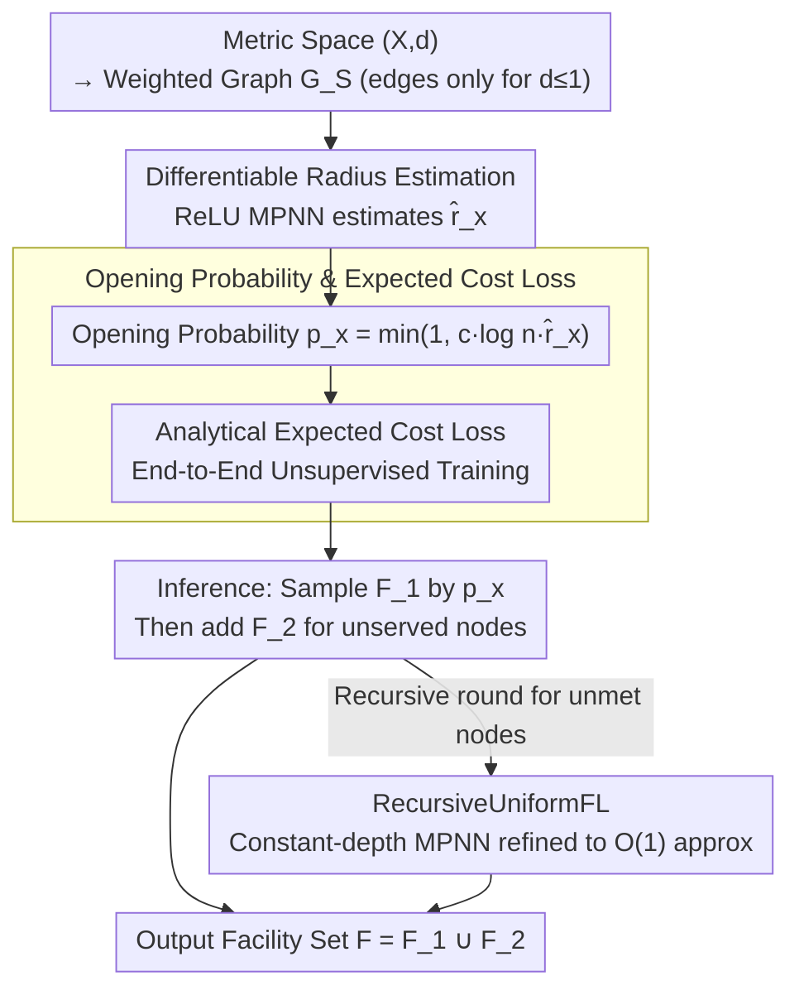

# Learning to Approximate Uniform Facility Location via Graph Neural Networks

**Conference**: ICML 2026  
**arXiv**: [2602.13155](https://arxiv.org/abs/2602.13155)  
**Code**: Not mentioned  
**Area**: Neural Combinatorial Optimization / MPNN / Learned Approximation Algorithms  
**Keywords**: Uniform Facility Location, MPNN, approximation guarantee, unsupervised, JL-style analysis

## TL;DR
This paper designs an MPNN that neuralizes the classic approximation algorithm SimpleUniformFL for Uniform Facility Location. **The model can be trained end-to-end using an unsupervised expected cost loss and possesses provable approximation bounds of $\mathcal{O}(\log n)$ (reducible to $\mathcal{O}(1)$ with the recursive version).** Empirically, it outperforms the classic SimpleUniformFL algorithm and approaches ILP optimality.

## Background & Motivation
**Background**: In recent years, many works have utilized MPNNs for end-to-end combinatorial optimization (CO-with-GNN, neural CO, karalias22, etc.), primarily following two paths: (1) Treating MPNNs as end-to-end heuristics; (2) Integrating MPNNs into classic exact solvers (e.g., branch-and-cut) as heuristics for cut or variable selection.

**Limitations of Prior Work**: (1) Supervised learning requires expensive optimal labels, while non-differentiable discrete objectives necessitate proxy gradients like straight-through, Gumbel-softmax, I-MLE, or SIMPLE, leading to **fragile and difficult training**. (2) End-to-end neural methods **almost entirely lack solution quality guarantees**, performing well in-distribution but collapsing in OOD settings. (3) Classic approximation algorithms possess worst-case guarantees but are distribution-agnostic, failing to exploit structural regularities in real-world data.

**Key Challenge**: The trade-off between robust but conservative approximation algorithms and expressive but fragile (and guarantee-less) learned solvers.

**Goal**: For the Uniform Facility Location (UniFL) problem—which is NP-hard but possesses clear local structures—develop an MPNN architecture that is **(i) fully differentiable, (ii) unsupervised, (iii) possesses provable approximation bounds, and (iv) exploits dataset structural patterns.**

**Key Insight**: UniFL has a well-known radius-based local structure (mettu2003online, Badoiu2005). Once the radius $r_x$ of a node (satisfying $\sum_{y \in B(x, r_x)} (r_x - d(y,x)) = 1$) is known, simply opening facilities with probability $\min(1, c \cdot \ln n \cdot r_x)$ yields an $\mathcal{O}(\log n)$ approximation. This structure of "local computation + probabilistic opening" is inherently suitable for message passing.

**Core Idea**: **Formulate the radius calculation and facility opening probability of SimpleUniformFL as ReLU MPNN layers; utilize an analytically integrable expected cost as an unsupervised loss.** Theoretically prove that parameters exist such that the MPNN reproduces the $\mathcal{O}(\log n)$ bound, while the version RecursiveUniformFL further achieves an $\mathcal{O}(1)$ approximation.

## Method

### Overall Architecture
UniFL encodes the metric space $(\mathcal{X}, d)$ as a weighted graph $G_S$ (retaining only edges where $d(u,v) \leq 1$). The MPNN workflow is: (1) Each node $x$ estimates the radius $\hat r_x$ via local message passing; (2) An FNN maps $\hat r_x$ to the facility opening probability $p_x$; (3) The model is trained end-to-end using the unsupervised expected cost loss; (4) During inference, $F_1$ is sampled independently according to $p_x$, then facilities $F_2$ are opened for nodes currently unserved, outputting $F = F_1 \cup F_2$. The recursive extension, RecursiveUniformFL, performs multiple rounds on nodes that do not meet the probability threshold to achieve a constant-factor approximation.

### Key Designs

**1. Differentiable Radius Estimation: Encoding radius as ReLU message passing for backpropagation**

The core of approximation algorithms for UniFL is the radius $r_x$ for each node (satisfying $\sum_{y\in B(x,r_x)}(r_x-d(y,x))=1$). However, this is typically calculated iteratively and is non-differentiable. The authors discretize $(0,1]$ into bins $0=a_0<a_1<\cdots<a_k=1$ and calculate indicators $t_x^{(i)}=\min\{1,\sum_{y\in N(x)}\text{reLU}(a_i-d(x,y))\}$ using a two-layer ReLU FNN: $t_x^{(i)}=\text{FNN}_{2,3}(\sum_y\text{FNN}_{1,3}(a_i,d(x,y)))$. If $r_x\ge a_i$, $t_x^{(i)}$ should be 1, so the radius estimate is $\hat r_x=\sum_i a_i(t_x^{(i-1)}-t_x^{(i)})$. This explicit construction (rather than a black-box) allows the approximation bounds to be rigorously mapped to the MPNN.

**2. Opening Probabilities and Analytical Expected Cost Loss: Bypassing STE/Gumbel noisy gradients**

Discrete objectives are non-differentiable. Traditional neural CO relies on proxy gradients like straight-through or Gumbel-softmax. This paper expresses the opening probability as $p_x=\min\{1,c\log(n)\cdot\hat r_x\}\equiv\text{FNN}_{2,3}(n,\hat r_x)$. Following the logic of "sampling $F_1$ and automatically opening $F_2$ if no service exists," the expected cost is formulated in a closed analytical form:

$$\mathbb{E}[\text{cost}]=\sum_f p_f+\sum_f\prod_{x:d(x,f)<1}(1-p_x)+\sum_x\sum_{f:d(x,f)<1}d(x,f)\cdot p_f\prod_{z:d(x,z)<d(x,f)}(1-p_z),$$

The three terms represent "independent facility opening," "forced opening when uncovered," and the "expected distance to the nearest open facility." All operations ($\min, \prod, \sum$) are differentiable with respect to $p_x$. By utilizing the sparse structure of UniFL, the complexity is reduced to $\mathcal{O}(nd^2)$, where $d$ is the maximum degree.

**3. From $\mathcal{O}(\log n)$ to $\mathcal{O}(1)$ via RecursiveUniformFL: Recursive peeling to refine approximation bounds**

Since Proposition 4 indicates that a constant-depth MPNN alone is capped at $\Omega(\log n/2)$ approximation, recursion is necessary. The probability is modified to $\min\{1,c\cdot d(x,F),c\cdot r_x\}$ to include a distance term to existing facilities. In each round, nodes served by some $f\in F$ within $6r_x$ are assigned and removed; remaining nodes enter the next recursive round using the same architecture. Proposition 3 proves that parameters exist for the MPNN to reproduce the $\mathcal{O}(\log n)$ bound, reaching $\mathcal{O}(1)$ after recursion. Proposition 5 further proves that parameters learned from finite training sets generalize to instances of arbitrary size $n$.

### Loss & Training
The loss function is the analytical expected cost formula mentioned above, which is purely unsupervised. During training, the MPNN acts as a generator for $p_x$. At inference, the model follows the internal post-processing of SimpleUniformFL to produce discrete solutions, reporting the average cost over 1000 samples. The framework can be adapted for $k$-Means by replacing the distance term with squared Euclidean distance.

## Key Experimental Results

### Main Results

| Candidate Method | Geo-1000-2 (Open) | Evaluation |
|---|---|---|
| ILP Solver (Optimal) | 366.302 | Upper bound control |
| SimpleUniformFL (Baseline) | > MPNN | $\mathcal{O}(\log n)$ classic algorithm |
| $\mathcal{O}(1)$-UFL (Gehweiler et al.) | Intermediate | Tuning-free baseline |
| **MPNN (Ours)** | Near ILP | Significantly better than SimpleUniformFL |
| KMeans++ / KMedoids++ (Same $k$) | Comparable/Worse | Fair comparison |

Consistent advantages are observed across 2/5/10 dimensions and both sparse/dense geometric graphs.

### Ablation Study

| Setting | Key Metric | Description |
|---|---|---|
| Train 1k pts → Test 2k-10k pts | Stable Approx Ratio | Verifies size generalization in Prop 5 |
| Geo-1000-10-sparse vs dense | Both robust | Not dependent on specific density |
| Real city road maps (4 metros) | Better than classic | Functional even if triangle inequality is violated |
| $k$-Means variant | Comparable to KMeans++ | Extensible by changing distance squared in loss |

### Key Findings
- **MPNNs can not only emulate the $\mathcal{O}(\log n)$ bound of SimpleUniformFL but also strictly outperform it in-distribution through training**, providing empirical evidence for the "approximation algorithm meets data distribution" paradigm.
- Size generalization remains stable even at 5-10x the training scale, aligning with Proposition 5.
- The approach works on real-world road networks where triangle inequalities may be violated, showing resilience of the radius-based logic for general metrics.
- While the $\mathcal{O}(1)$-UFL algorithm (Gehweiler) has a better theoretical bound, it lacks an analytical expected cost, making it non-trainable; **MPNN chooses SimpleUniformFL as a base specifically for differentiability.**

## Highlights & Insights
- "Neuralizes" the entire SimpleUniformFL process—radius, probability, and loss are all expressed as ReLU FNNs, **allowing the classic approximation algorithm to serve as the initialization for the neural network**, ensuring that training only improves the result.
- The expected cost loss is entirely closed-form, avoiding the fragility of proxy gradients like STE / Gumbel, while sparse structures keep complexity at $\mathcal{O}(nd^2)$.
- Proposition 4 explicitly proves the $\Omega(\log n)$ limit of constant-depth MPNNs, providing a rigorous defense for the necessity of recursion.
- Size generalization is generalized through Proposition 5's finite training set results, mitigating typical OOD concerns in neural CO.

## Limitations & Future Work
- Currently limited to Uniform FL (uniform facility costs); general FL, capacitated FL, and $k$-median would require re-deriving the expected cost.
- The Product ($\prod$) terms in the expected cost may suffer from numerical underflow for large $n$; log-space summation may be required.
- Training relies on synthetic GMM geometric graphs; the transfer to complex real-world distributions (e.g., e-commerce logistics demand) has not been fully explored.
- Inference still requires 1000 samples for post-processing, which is slower than a single forward pass; deterministic rounding could be explored.

## Related Work & Insights
- **vs. End-to-end neural CO (karalias22, etc.)**: These lack approximation guarantees and are uncontrollable OOD; this work provides $\mathcal{O}(\log n)$ and recursive $\mathcal{O}(1)$ bounds.
- **vs. Branch-and-cut + GNN (Gas+2019)**: Such methods require running solvers thousands of times during training; this work is entirely unsupervised.
- **vs. Algorithms with predictions**: Those treat ML as a black-box; this work integrates ML and the algorithm into a single differentiable pipeline.

## Rating
- Novelty: ⭐⭐⭐⭐⭐ 
- Experimental Thoroughness: ⭐⭐⭐⭐ 
- Writing Quality: ⭐⭐⭐⭐ 
- Value: ⭐⭐⭐⭐ 

<!-- RELATED:START -->

## Related Papers

- [\[ICLR 2026\] CaRe-BN: Precise Moving Statistics for Stabilizing Spiking Neural Networks in Reinforcement Learning](../../ICLR2026/reinforcement_learning/care-bn_precise_moving_statistics_for_stabilizing_spiking_neural_networks_in_rei.md)
- [\[ICML 2026\] Convergence of Steepest Descent and Adam under Non-Uniform Smoothness](convergence_of_steepest_descent_and_adam_under_non-uniform_smoothness.md)
- [\[ICML 2026\] RL4RLA: Teaching ML to Discover Randomized Linear Algebra Algorithms Through Curriculum Design and Graph-Based Search](rl4rla_teaching_ml_to_discover_randomized_linear_algebra_algorithms_through_curr.md)
- [\[ICML 2026\] ASAP: Exploiting the Satisficing Generalization Edge in Neural Combinatorial Optimization](asap_exploiting_the_satisficing_generalization_edge_in_neural_combinatorial_opti.md)
- [\[ICLR 2026\] Analysis of Approximate Linear Programming Solution to Markov Decision Problem with Log Barrier Function](../../ICLR2026/reinforcement_learning/analysis_of_approximate_linear_programming_solution_to_markov_decision_problem_w.md)

<!-- RELATED:END -->
