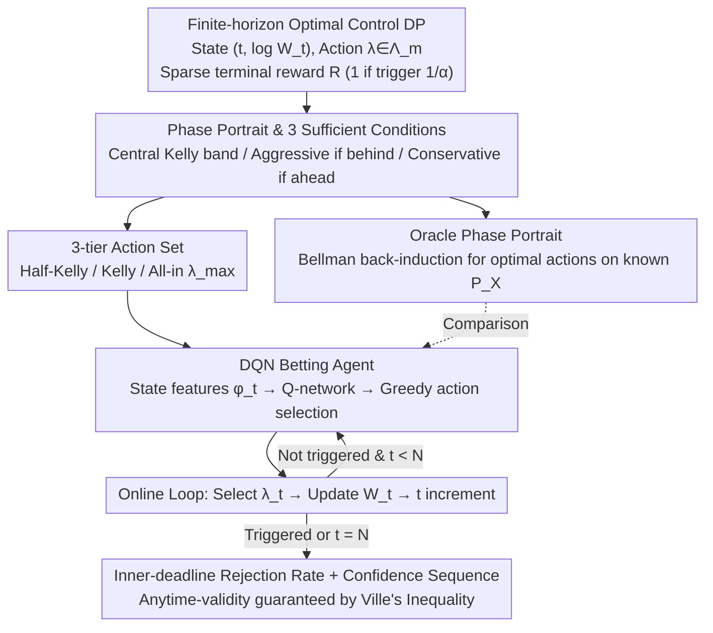

# Learning to Bet for Horizon-Aware Anytime-Valid Testing

**Conference**: ICML 2026  
**arXiv**: [2603.19551](https://arxiv.org/abs/2603.19551)  
**Code**: https://github.com/egetaga/learning-to-bet (Available)  
**Area**: Sequential Hypothesis Testing / Anytime-Valid Inference / Finite-Horizon Optimal Control  
**Keywords**: Testing martingales, Kelly betting, Confidence sequences, Phase portrait, DQN, Finite-horizon decision-making  

## TL;DR
This paper reformulates the design of anytime-valid sequential tests under a strict observation limit $N$ as a finite-horizon optimal control problem with state space $(t,\log W_t)$. It theoretically proves a three-zone "phase portrait"—optimal Kelly betting in the "on-schedule" middle band, aggressive betting when falling behind, and conservative betting when ahead. A unified DQN agent, trained on various synthetic Beta distributions, automatically learns state-dependent strategies consistent with this phase portrait, achieving higher rejection rates within the deadline and narrower confidence sequences on both synthetic and real data while maintaining anytime-validity via Ville’s inequality.

## Background & Motivation
**Background**: The e-process / testing-by-betting framework (shafer2019game/2021; waudby2024estimating) has become mainstream for constructing power-one tests and confidence sequences. Given a hypothesis $H_0:\mu_X=m$, one defines a predictable bet $\lambda_n(m)\in[-1/(1-m),1/m]$ such that the wealth process $W_n(m)=W_{n-1}(m)(1+\lambda_n(m)(X_n-m))$ is a non-negative martingale under $H_0$. By Ville’s inequality $\mathbb P(\exists n: W_n\ge 1/\alpha)\le \alpha$, $\tau_m=\inf\{n: W_n\ge 1/\alpha\}$ is immediately a level-$\alpha$ stopping time. Recent works like PrPlEB (waudby2024estimating), universal portfolios (orabona2023tight), and STaR-Bets (voravcek2025star) have refined betting strategies within this framework.

**Limitations of Prior Work**: Most mainstream approaches assume the observation stream $\{X_n\}$ is infinite. However, real-world scenarios (online A/B testing, adaptive experiments, resource-constrained research) almost always have a hard deadline $N$. Doob/Robbins-style anytime strategies remain too conservative for large $N$, while tests tuned for a fixed $N$ violate type-I error under continuous monitoring. These methods fail to address "continuous monitoring with a deadline."

**Key Challenge**: Maximizing the rejection probability within a deadline $N$ requires a "per-step drift" $(b-\log W_t)/(N-t)$ that is non-stationary, changing dynamically with current progress and remaining time. However, to maintain anytime-validity, the bet must consistently satisfy the martingale constraint—being $\mathcal F_{t-1}$-measurable and valued within $\Lambda_m$. STaR-Bets (voravcek2025star), the only prior work directly addressing this, relies on a Sequential Target-Recalculating heuristic without optimality guarantees or adaptation to distribution shapes.

**Goal**: (1) Formalize "horizon-aware betting" as a dynamic programming (DP) problem; (2) Provide provable sufficient conditions for when to deviate from Kelly betting and in which direction; (3) Translate this theory into an online-learning, distribution-agnostic betting strategy.

**Key Insight**: The Bellman state is fully determined by $(t,\log W_t)$, and the action is $\lambda$. This is a classic finite-horizon discrete DP, albeit with a continuous action space and unknown transition distribution $P_X$. Local analysis of the DP allows partitioning the state plane into a "Kelly/Aggressive/Conservative" phase portrait, which a DQN can then implement by absorbing distributional information from empirical features.

**Core Idea**: Treat anytime-valid testing as an optimal control problem characterized by a phase portrait, then implement the portrait as an executable policy via a cross-distribution DQN. This combines theoretical guarantees with learned efficiency.

## Method
The authors first formalize the problem using Bellman recursion, prove three complementary "phase portrait theorems," and then constrain the action space to $\{\widehat\lambda_t/2,\widehat\lambda_t,\lambda_{\max}\}$ to train a universal DQN. Crucially, policy learning is transparent to anytime-validity: validity only requires $\lambda_t\in\Lambda_m$ and predictability, regardless of how the strategy is derived.

### Overall Architecture
- **DP State**: $(t,\log W_t)$, with termination conditions $W_t\ge 1/\alpha$ or $t=N$.
- **Action**: $\lambda_t(m)\in\Lambda_m=[-1/(1-m),1/m]$, discretized into three levels: "Half-Kelly / Kelly / All-in ($\lambda_{\max}$)".
- **Reward**: $R=\mathbb I\{\max_{1\le t\le N}\log W_t\ge \log(1/\alpha)\}$ (sparse terminal reward), where $\mathbb E[R]=\mathbb P(\tau_m\le N)$ directly equals the rejection rate within the deadline.
- **Bellman Recursion**: $$V_t(y)=\max_{\lambda\in\Lambda_m}\mathbb E_{X\sim P_X}\big[\mathbb I\{y+h_m(\lambda,X)\ge b\}+\mathbb I\{y+h_m(\lambda,X)<b\}V_{t+1}(y+h_m(\lambda,X))\big]$$, where $h_m(\lambda,x)=\log(1+\lambda(x-m))$ and $b=\log(1/\alpha)$.
- **Confidence Sequence**: $C_n=\{m\in[0,1]:W_n(m)<1/\alpha\}$, providing horizon-aware coverage guarantees derived automatically from $\tau_m$.

The workflow is: formulate as DP → use theorems to characterize the optimal policy shape → discretize actions → use an oracle phase portrait as a baseline → train a cross-distribution DQN to learn switching logic. Anytime-validity is independently guaranteed by Ville's inequality.

### Key Designs

**1. $(t,\log W_t)$ Plane Phase Portrait and Three Sufficient Conditions: Formalizing "progress-aware" betting**

While the Bellman recursion lacks a general analytical solution, it exhibits a provable regional structure. Defining $T=N-t$ and $\Delta=TL_{\max}-(b-y)$ (where $L_{\max}=\mathbb E[h_m(\lambda_m^{\text{Kelly}},X)]$) as the "remaining drift margin beyond Kelly," three theorems define the regions. **Theorem 3.1 (Central Band)**: If $\Delta\ge B\sqrt{8T\log T}$, pure Kelly hits the boundary with probability $\ge 1-1/T$; conversely, deviating significantly from Kelly when the margin is narrow reduces success probability—meaning Kelly is optimal when on schedule. **Proposition 3.4 (Aggressive if behind)**: When $r=(b-y)/T>\max\{L_{\max},B_K/2\}$ (Kelly drift is insufficient), if an aggressive bet $\lambda^{\text{agg}}>\lambda^{\text{Kelly}}$ exists with a smaller KL rate penalty, it strictly outperforms Kelly. **Proposition 3.6 (Conservative if ahead)**: When $B_K/2<r<L_{\max}$, a defensive bet $\lambda^{\text{def}}<\lambda^{\text{Kelly}}$ yields a lower failure probability. These zones justify the DQN’s 3-tier action set.

**2. Oracle Phase Portrait (DP backward induction): Computing theoretical optima for known distributions**

Since theoretical theorems only provide relative relationships between regions, the authors compute an oracle version as a reference using known $P_X$. By discretizing the $(t,\log W_t)$ plane and performing Bellman backward induction from $t=N-1$, they map optimal actions. On Beta-mixtures, the oracle indeed shows three bands: "Central Kelly / Upper Half-Kelly / Lower All-in." As the problem difficulty increases ($m$ approaches $\mu_X$), the conservative band disappears, the Kelly band narrows, and the aggressive band expands, aligning with Proposition 3.4.

**3. Cross-Distribution Universal DQN Betting Agent: Learning "when to switch" via RL**

Phase portrait boundaries depend on the unknown $P_X$. Moreover, empirical Kelly estimates $\widehat\lambda_t(m)$ suffer from high variance at small $t$. The authors treat each test as an episode ($\le N$ steps) with a sparse reward $R$. The state features are $\mathcal F_{t-1}$-measurable (empirical moments, remaining time $N-t$, distance to threshold $b-\log W_t$, $m$, empirical Kelly $\widehat\lambda_t(m)$, etc.). The DQN learns $Q(s,a)$ once across 500,000 synthetic episodes (Beta/Beta-mixtures with randomized $\mu_X,m,N$). Crucially, this black-box learning does not compromise statistical rigor: anytime-validity relies only on predictability and $\lambda_t\in\Lambda_m$, which are maintained regardless of the DQN's output.

### Loss & Training
The DQN uses standard Q-learning (mnih2015human) with sparse terminal rewards $R\in\{0,1\}$. Two reward shaping variants, DQN-EB ($1+(1-t/N)$) and DQN-U ($1-t/N$), were explored to incentivize early rejection.

## Key Experimental Results

### Main Results
Baselines: STaR-Bets / STaR-Hoeffding (voravcek2025star) and PrPlEB (horizon-agnostic).

| Setting | Metric | DQN | STaR-Bets | PrPlEB |
|:---|:---|:---|:---|:---|
| Beta-mix conc=6, $N=100$, $m=0.45$ | $\mathbb P(\tau\le N)$ | **Highest** | Runner-up | Lagging |
| Beta-mix conc=1, $N=100$, $m=0.45$ | $\mathbb P(\tau\le N)$ | **Highest** | Runner-up | Lagging |
| Three Beta-mix families, $N=100$ | $C_N$ Width | **Narrowest** | Medium | Wide |
| Real Data (DNA & Humidity, 6 sources) | $\mathbb P(\text{reject})$ | **Highest (5/6)** | — | — |

The DQN, trained only on synthetic Beta distributions, maintains dominance across OOD logit-normal, Bernoulli, and 6 real data sources, with valid type-I calibrated error.

### Ablation Study

| Configuration | Key Observation | Description |
|:---|:---|:---|
| 3 actions vs 9 actions | Similar Performance | Aligning action set with the 3 theoretical zones is sufficient. |
| DQN (Original Reward) | Strongest terminal power | Directly optimizes $\mathbb P(\tau\le N)$. |
| DQN-EB ($1+(1-t/N)$) | Med. power, earlier rejection | Early bonus shifts rejection time forward. |
| DQN-U ($1-t/N$) | Earliest rejection, lower power | Extreme time bias through urgency rewards. |
| $N\in\{250,300,350\}$ (Zero-shot) | Still outperforms baselines | Demonstrates generalization to longer horizons. |
| $\alpha=0.01$ (Retrained) | Improved power | Strategies are $\alpha$-dependent and require specific training. |

### Key Findings
- The "modal action map" learned by the DQN visually replicates the oracle phase portrait: a central Kelly band, upper half-Kelly band, and lower all-in band, with boundaries shifting automatically based on distribution shape.
- Early conservatism is counter-intuitive for Kelly but correct: since $\widehat\lambda_t(m)$ has high variance for small $t$, early aggression risks non-recoverable low wealth due to estimation noise.
- Cross-distribution transfer is robust: training on synthetic Beta leads to high performance on logit-normal, Bernoulli, and real DNA/humidity data, with anytime-validity remaining independent and legal throughout.

## Highlights & Insights
- Formulating anytime-valid testing as finite-horizon optimal control with a DQN agent provides a clean bridge: validity is derived from the martingale property ($\lambda_t\in\Lambda_m$ + predictability), allowing for complex black-box strategies without sacrificing statistical rigor.
- The three phase portrait theorems (Central Kelly, Aggressive behind, Conservative ahead) use fundamental tools like Sanov’s theorem and KL rates to justify a simplified 3-tier action space, which significantly eases RL design.
- The DQN's ability to generalize to real OOD data suggests that using distribution-invariant "geometric" features ($t/N$, $(b-y)/T$, empirical Kelly) allows the policy to internalize distributional robust logic rather than memorizing samples.

## Limitations & Future Work
- Training is currently restricted to Beta/Beta-mixtures; generalization to heavy-tailed or discrete mass distributions remains an open question.
- The action set is limited to 3 discrete tiers; exploring continuous action spaces or asymmetric negative betting ($\lambda<0$) could further tighten two-sided tests.
- As a black-box strategy, the DQN lacks the auditability of hand-crafted rules, which may be required in highly regulated fields like clinical trials.
- Strategies are sensitive to $\alpha$ and require retraining; future work could include $\alpha$ as a state input for a "universal $\alpha$ policy."
- The scope is currently limited to testing the mean on $[0,1]$; extending phase portrait analysis to other functionals (variance, quantiles, CATE) is a promising direction.

## Related Work & Insights
- **vs voravcek2025star (STaR-Bets)**: The first horizon-aware betting work using a target-recalculating heuristic. Ours provides an optimal control formulation, phase portrait theory, and DQN implementation, yielding better cross-distribution performance.
- **vs waudby2024estimating (PrPlEB)**: The standard anytime betting strategy. It assumes infinite horizon and is naturally conservative for deadline scenarios; Ours modifies the strategy within the same e-process framework.
- **vs orabona2023tight (Universal Portfolio)**: Uses universal portfolios for strong regret guarantees in horizon-agnostic settings. Ours is a complementary route for horizon-aware power maximization using DRL.

<!-- RELATED:START -->

## Related Papers

- [\[ICML 2026\] Offline Reinforcement Learning with Universal Horizon Models](offline_reinforcement_learning_with_universal_horizon_models.md)
- [\[ICML 2026\] InftyThink+: Effective and Efficient Infinite-Horizon Reasoning via Reinforcement Learning](inftythink_effective_and_efficient_infinite-horizon_reasoning_via_reinforcement_.md)
- [\[ICML 2026\] Long-Horizon Model-Based Offline Reinforcement Learning Without Explicit Conservatism](long-horizon_model-based_offline_reinforcement_learning_without_explicit_conserv.md)
- [\[ICML 2026\] Multi-Agent Decision-Focused Learning via Value-Aware Sequential Communication](multi-agent_decision-focused_learning_via_value-aware_sequential_communication.md)
- [\[ICML 2026\] Learning Query-Aware Budget-Tier Routing for Runtime Agent Memory](learning_query-aware_budget-tier_routing_for_runtime_agent_memory.md)

<!-- RELATED:END -->
