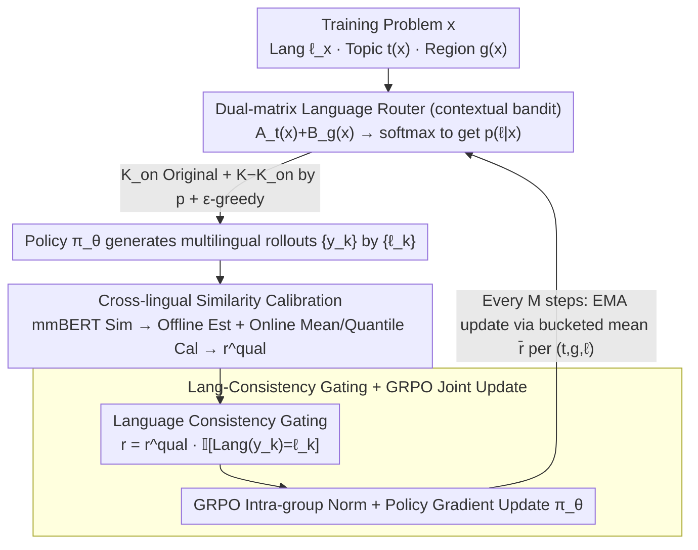

# Learning to Route Languages for Multilingual Policy Optimization

**Conference**: ICML 2026  
**arXiv**: [2605.25360](https://arxiv.org/abs/2605.25360)  
**Code**: https://github.com/Guochry/LRPO (Available)  
**Area**: Alignment RLHF / Multilingual LLM / Online Policy Optimization  
**Keywords**: Multilingual RL, GRPO, Language Router, Multi-Armed Bandit, Cross-lingual Reward Calibration

## TL;DR
This paper proposes LRPO (Language-Routed Policy Optimization), which treats "which language to use for rollout generation" as a learnable variable. Using a contextual bandit-form language router, it selects the most informative language combinations for each training sample under a fixed rollout budget. By pulling multilingual rollouts into the same scale via offline estimation and online calibration of cross-lingual similarity rewards, it performs GRPO and consistently outperforms GRPO and various dominant-language baselines across Qwen/Llama/Gemma backbones on five multilingual benchmarks.

## Background & Motivation
**Background**: Existing RL approaches for multilingual LLMs primarily follow two paths. One directly applies GRPO (shao2024deepseekmath), sampling a set of rollouts in the original language for each training question, scoring them with a reward model, and performing policy updates after intra-group normalization. The other explicitly constructs cross-lingual preference pairs (MAPO/LIDR/MPO), treating English (or other "dominant languages") as a naturally higher-quality anchor for other languages to align with.

**Limitations of Prior Work**: The GRPO approach sticks each question to a single language, leaving the decision of "which language can answer this question more accurately" entirely to the model's implicit internal mechanisms, thereby wasting complementary knowledge encoded across different languages. The dominant-language approach assumes English is always a better source of supervision, an assumption that often fails for questions with strong regional knowledge or cultural context—for instance, an Arabic rollout for a question about "Greek etiquette" might be closer to the correct answer than English or Chinese rollouts.

**Key Challenge**: Under a limited rollout budget ($K$ samples per question), "which languages to sample from" is itself an online exploration-exploitation decision problem. However, existing methods either make no decision (monolingual) or use a fixed and often incorrect prior (English-first).

**Goal**: To enable the model to learn "which languages to sample more for which topics/regions" under a fixed budget of $K$ rollouts, and to integrate multilingual rollout combinations into a unified GRPO framework for policy updates.

**Key Insight**: Model "language selection" explicitly as a contextual multi-armed bandit, where each question's topic $t(x)$ and optional region $g(x)$ serve as the context, and each language is an arm. The reward for an arm is the average GRPO reward generated by that language in that context. Simultaneously, cross-lingual similarity needs to be calibrated as a reward signal, as inconsistent scales between different language pairs otherwise disrupt intra-group preferences.

**Core Idea**: Use a lightweight "Topic $\times$ Language + Region $\times$ Language" dual-matrix router for online language selection policy learning. Use offline statistics and online calibration to bring multilingual similarity rewards to the same scale before feeding them back into GRPO for joint optimization.

## Method
LRPO extends the traditional "Sampling → Scoring → Update" three-stage process of GRPO into four stages: the router first decides which languages to use for the current round, the policy generates rollouts in the specified languages, cross-lingual rewards are calibrated, and finally, GRPO updates the policy while the router is updated via EMA.

### Overall Architecture
- **Input**: Training question $x$ (original language $\ell_x$, topic $t(x)$, optional region $g(x)$), policy $\pi_\theta$, routing parameters $(\mathbf{A},\mathbf{B})$, rollout budget $K$, and on-policy quota $K_{\text{on}}$.
- **Routing Phase**: Synthesize logits from the topic matrix $\mathbf{A}_{t(x)}$ and (if present) region matrix $\mathbf{B}_{g(x)}$. Obtain the language distribution $p(\ell\mid x)$ via softmax with temperature $\tau$. Reserve $K_{\text{on}}$ samples for $\ell_x$ (maintaining on-policy), sample the remaining $K-K_{\text{on}}$ according to $p$, and add $\epsilon$-greedy to ensure minimum exploration.
- **Rollout Phase**: Generate $\{y_k\}$ using $\pi_\theta$ guided by language tags or target-language system prompts based on the sampled $\{\ell_k\}$.
- **Reward Phase**: Calculate cross-lingual semantic similarity between each rollout and the reference answer using mmBERT. Perform language-pair-level mean or quantile calibration, and multiply by an indicator of "whether the target language was actually generated" as the final reward.
- **Update Phase**: Perform GRPO gradient steps after intra-group normalization. Every $M$ steps, update $\mathbf{A}$ and $\mathbf{B}$ using EMA with average rewards aggregated in $(t,g,\ell)$ buckets.

### Key Designs

**1. Dual-Matrix Language Router (Contextual Bandit): Upgrading Language Selection from Implicit to Learnable Decisions**

GRPO fixes each question to one language, and dominant-language routes assume English is always superior. Regional knowledge—such as Arabic rollouts being more accurate for Greek etiquette—invalidates the English-first assumption. LRPO formalizes language selection as a contextual bandit using two low-rank logit matrices: $\mathbf{A}\in\mathbb{R}^{T\times L}$ (Topic $\times$ Language) and $\mathbf{B}\in\mathbb{R}^{G\times L}$ (Region $\times$ Language). The distribution is $p(\ell\mid x)\propto\exp\!\big((A_{t(x),\ell}+\mathbb{I}[g(x)\neq\varnothing]B_{g(x),\ell})/\tau\big)$. Each question maintains $K_{\text{on}}$ original language rollouts for on-policy stability, with remaining slots sampled via $p$ plus $\epsilon$-greedy. Every $M$ steps, the cumulative average reward $\bar r_{t,g,\ell}$ per $(t,g,\ell)$ bucket is updated in the matrices via EMA: $A_{t,\ell}\leftarrow(1-\alpha)A_{t,\ell}+\alpha\bar r_{t,g,\ell}$. Simulated annealing is applied to $\epsilon$ and $\tau$ to emphasize exploration early and exploitation later. The region matrix $\mathbf{B}$ allows the structure "regional knowledge requires local language" to be explicitly modeled rather than masked by a fixed prior.

**2. Offline Estimation + Online Calibration of Cross-lingual Similarity Rewards: Normalizing Scaling Biases**

Raw mmBERT similarity exhibits systematic biases across language pairs (e.g., Chinese-English equivalence pairs average ~0.85, while Chinese-Arabic pairs average ~0.65). Without calibration, intra-group normalization would consistently depress low-resource language rollouts, and the learned "language utility" would be contaminated by measurement bias, ultimately collapsing to monolingual GRPO. LRPO addresses this in two stages: the offline phase collects semantic equivalence pairs (for upper-bound alignment), random mismatches, and hard negatives for each pair $\langle\ell_i, \ell_j\rangle$ to form an empirical distribution $\mathcal{S}_{\ell_i,\ell_j}$. In the online phase, after calculating $s=\mathrm{sim}(y,z)$, calibration is performed via either Mean Calibration $r^{\text{qual}}=s-\lambda(\mu_{\ell_i,\ell_j}-\mu_{\text{ref}})$ (shifting means to a global reference) or Quantile Calibration $r^{\text{qual}}=\mathcal{Q}_{\ell_i,\ell_j}(s)$ (mapping raw scores to comparable empirical quantiles). This ensures rollouts in different languages are compared fairly within GRPO groups.

**3. Language Consistency Gating + GRPO Joint Update: Hard Constraints for Language Adherence**

Without constraints, a policy might learn to "always respond in English regardless of the requested language" to bypass the router, making the "language channel" unobservable and preventing learning signals. LRPO uses a language identifier to compute $r^{\text{lang}}(y_k)=\mathbb{I}[\mathrm{Lang}(y_k)=\ell_k]$, multiplied by the quality reward for the final reward: $r_k=r^{\text{qual}}_k\cdot r^{\text{lang}}_k$. If the language is incorrect, the reward is zeroed, upgrading "language adherence" from a soft to a hard constraint. GRPO then performs normalization and policy gradient updates across the multilingual groups. Router updates are delayed by $M$ steps using EMA of recent reward bucket means to avoid single-step noise. Another benefit of the multiplicative gate is ensuring the router's $\bar r_{t,g,\ell}$ truly reflects the utility of language $\ell$ for a given topic, rather than language identification errors.

### Loss & Training
The policy side follows the GRPO objective, normalizing rewards within each multilingual rollout group. The router side does not use gradients; it updates the logit matrices using EMA every $M$ policy steps. Training data consists of 4,885 samples from HelpSteer3 + CARE covering 14 languages. Topics are automatically categorized into 6 classes (Regional Knowledge, General Knowledge, Chat, Reasoning, Safety, Translation) using gpt-oss-120b, achieving 98% agreement with manual annotations.

## Key Experimental Results

### Main Results
Evaluation results across five multilingual benchmarks (CARE / CARE-pro / mGSM-v2 / Global-MMLU-Lite / Include-Lite) using three backbones. Representative results for Qwen2.5-1.5b-it (mGSM-v2 average and overall average scores) are shown below:

| Method | mGSM-v2 Avg. | Overall Avg. |
|------|------|------|
| Vanilla | 24.87 | 28.64 |
| DPO | 27.02 | 29.33 |
| MAPO | 25.64 | 28.40 |
| MPO | 25.05 | 28.38 |
| GRPO | 32.33 | 30.42 |
| **LRPO (Ours)** | **38.25** | **32.15** |

On Qwen2.5-1.5b, LRPO boosts mGSM-v2 from 24.87 to 38.25 (+13.38) and improves the Overall score by +1.73 over GRPO. The average LRPO improvement across seen languages is +5.08 over the instruction-tuned starting point and +2.85 over GRPO. On the stronger Gemma3-4b-it, LRPO maintains a lead (46.89 vs GRPO 46.67), suggesting the improvement is not merely due to small models benefiting from multilingual signals.

### Ablation Study

| Router Variant | mGSM-v2 Avg. | Overall Avg. | Description |
|------|------|------|------|
| Monolingual (Only original lang) | 32.33 | 30.42 | Collapses to GRPO |
| Input-dominant (Strong on-policy bias) | 36.25 | 31.78 | Fixed routing, biased to original |
| EN-dominant (Strong English bias) | 37.89 | — | Simulates MAPO-style dominant language |
| **LRPO (Learnable route + Calib.)** | **38.25** | **32.15** | Full Model |

Fixed routing (whether biased toward input or English) performs worse than learnable routing. Furthermore, while the EN-dominant variant is competitive on mGSM-v2, it significantly trails on the regional-knowledge-heavy CARE series—validating that the "dominant language hypothesis" fails for region-grounded tasks.

### Key Findings
- **Router Contribution**: Expanding rollouts from "monolingual" to "router-assigned languages" allows GRPO to leverage complementary cross-lingual knowledge, which is the primary source of the +5.92 gain on mGSM-v2 compared to GRPO.
- **Calibration is Critical**: Using raw mmBERT similarity rewards results in intra-group normalization being contaminated by language-pair biases. The router then collapses toward the language identical to the reference, reverting to a Monolingual variant.
- **Region Matrix Utility**: The region matrix $\mathbf{B}$ provides significantly higher gains for regional problems (CARE / Include-Lite) than for pure reasoning tasks (mGSM-v2), aligning with the prior that regional knowledge is best carried by local languages.

## Highlights & Insights
- Formulating language selection as a clean contextual bandit is elegant. Conventional multilingual RL papers typically fix languages or default to English; this paper's $\mathbf{A}+\mathbb{I}\cdot\mathbf{B}$ parameterization allows "Topic $\times$ Language" and "Region $\times$ Language" priors to be learned online with negligible compute overhead but significant gains.
- The two-stage cross-lingual similarity calibration (offline + online) is highly generalizable. Any multimodal/multilingual RLHF using embedding similarity (e.g., image-text, video-text, cross-domain code) faces the same scaling bias issue. Quantile calibration $\mathcal{Q}_{\ell_i,\ell_j}(s)$ provides a plug-and-play solution without requiring a parameterized calibration model.
- The $r^{\text{qual}}\cdot r^{\text{lang}}$ multiplicative gate elegantly handles degenerate solutions where the model ignores the requested language. Elevating "language conditioning" to a hard constraint has broad implications for RLHF tasks requiring specific styles, formats, or tool usage.

## Limitations & Future Work
- The router is tabular; the number of topics $T$ and regions $G$ relies on coarse classification (6 topics). For fine-grained topics/regions (thousands), embedding parameterization would be required to prevent reward estimation instability due to sparsity.
- Cross-lingual calibration depends on mmBERT; the quality of offline semantic equivalence pairs in $\mathcal{S}_{\ell_i,\ell_j}$ determines the calibration ceiling. For truly low-resource pairs where parallel corpora are scarce, calibration remains an open problem.
- Experiments focused on Qwen/Llama/Gemma in the 1B–4B range; verification at 30B+ scales is needed. As scale increases, the model may achieve more cross-lingual transfer naturally via GRPO, potentially narrowing LRPO's relative gains.
- Training data still relies on human preference sets (HelpSteer3 + CARE); router-learned "language utility" is biased by the data distribution. For example, the languages used in CARE's regional questions dictate what $\mathbf{B}$ can learn, necessitating cold-start mechanisms for new regions.

## Related Work & Insights
- **vs MAPO / LIDR / MPO**: These assume English anchors are more reliable and align other languages to English via translation or log-odds. LRPO takes the opposite approach—making no assumptions and letting data dictate which language is most useful for which problem, avoiding the conflation of language identification errors and content quality errors.
- **vs GRPO**: Ours is a multilingual extension of GRPO. The rollout group expanded to multiple languages, rewards joined with cross-lingual calibration, and a language router added. It is fully compatible with existing GRPO infrastructure and acts as a low-cost upgrade for multilingual SFT/RL pipelines.
- **vs CCL/CoT Cross-lingual Reasoning**: While those methods focus on stitching cross-lingual chains-of-thought at inference, LRPO pushes cross-lingual signals into the training rewards. These directions are orthogonal and could theoretically be combined.

<!-- RELATED:START -->

## Related Papers

- [\[ICML 2026\] Metis: Learning to Jailbreak LLMs via Self-Evolving Metacognitive Policy Optimization](metis_learning_to_jailbreak_llms_via_self-evolving_metacognitive_policy_optimiza.md)
- [\[ICML 2026\] EAPO: Enhancing Policy Optimization with On-Demand Expert Assistance](eapo_enhancing_policy_optimization_with_on-demand_expert_assistance.md)
- [\[ICML 2026\] Revisiting Regularized Policy Optimization for Stable and Efficient Reinforcement Learning in Two-Player Games](revisiting_regularized_policy_optimization_for_stable_and_efficient_reinforcemen.md)
- [\[ACL 2026\] LANG: Reinforcement Learning for Multilingual Reasoning with Language-Adaptive Hint Guidance](../../ACL2026/reinforcement_learning/lang_reinforcement_learning_for_multilingual_reasoning_with_language-adaptive_hi.md)
- [\[ACL 2026\] Visually-Guided Policy Optimization for Multimodal Reasoning](../../ACL2026/reinforcement_learning/visually-guided_policy_optimization_for_multimodal_reasoning.md)

<!-- RELATED:END -->
