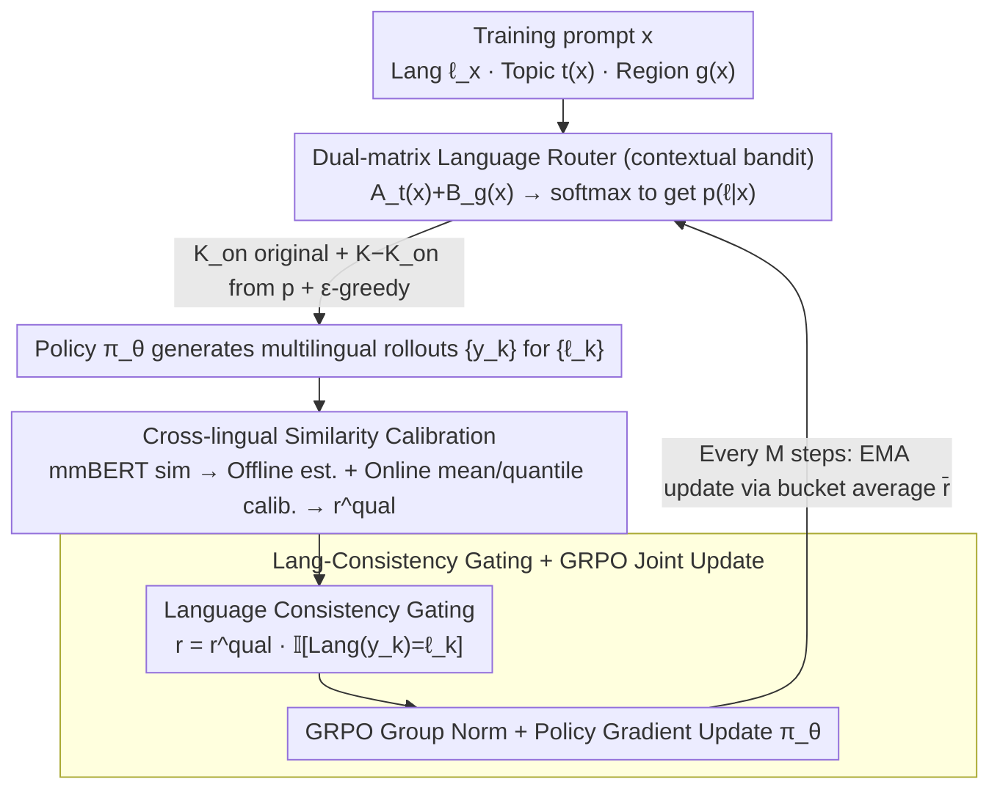

# Learning to Route Languages for Multilingual Policy Optimization

**Conference**: ICML 2026  
**arXiv**: [2605.25360](https://arxiv.org/abs/2605.25360)  
**Code**: https://github.com/Guochry/LRPO (Available)  
**Area**: Alignment RLHF / Multilingual LLM / Online Policy Optimization  
**Keywords**: Multilingual RL, GRPO, Language Router, Multi-Armed Bandit, Cross-lingual Reward Calibration  

## TL;DR
This paper proposes LRPO (Language-Routed Policy Optimization), which treats the choice of language for rollouts as a learnable variable. Using a contextual bandit-style language router, it selects the most informative language combinations for each training sample under a fixed rollout budget. By integrating cross-lingual similarity rewards (calibrated via offline estimation and online adjustment), multilingual rollouts are mapped to a unified scale for GRPO. LRPO consistently outperforms GRPO and various dominant-language baselines across Qwen/Llama/Gemma backbones and five multilingual benchmarks.

## Background & Motivation
**Background**: Existing RL approaches for multilingual LLMs generally follow two paths. One directly applies GRPO (shao2024deepseekmath), sampling a set of rollouts in the original language of the prompt, scoring them with a reward model, and performing policy updates after intra-group normalization. The other explicitly constructs cross-lingual preference pairs (MAPO/LIDR/MPO), treating English (or other "dominant languages") as naturally higher-quality anchors to which responses in other languages should align.

**Limitations of Prior Work**: The GRPO approach locks each problem to a single language, leaving the decision of "which language best answers this question" to implicit internal mechanisms, thereby wasting complementary knowledge encoded across languages. The dominant-language approach assumes English is always a superior supervision source, an assumption that often fails for region-specific knowledge or cultural contexts—for instance, responses in Arabic might be closer to the correct answer for questions about "Greek etiquette" than those in English or Chinese.

**Key Challenge**: Under a limited rollout budget ($K$ samples per prompt), deciding "which languages to sample from" is an online exploration-exploitation problem. Existing methods either make no decision (monolingual) or rely on a fixed and often inaccurate prior (English-first).

**Goal**: To enable the model to learn which languages to sample for specific topics/regions under a fixed budget of $K$ rollouts, and to integrate these multilingual rollouts into a unified GRPO framework for policy updates.

**Key Insight**: Language selection is explicitly modeled as a contextual multi-armed bandit. The prompt's topic $t(x)$ and optional region $g(x)$ serve as the context, while each language is an arm. The reward for an arm is the average GRPO reward generated by that language in that context. Simultaneously, cross-lingual similarity rewards are calibrated to resolve the inconsistency in raw similarity scales between different language pairs, which would otherwise distort intra-group preferences.

**Core Idea**: A lightweight "Topic $\times$ Language + Region $\times$ Language" dual-matrix router learns the language selection strategy online. Multilingual similarity rewards are brought to a common scale through offline statistics and online calibration before being fed into GRPO for joint optimization.

## Method
LRPO extends the traditional GRPO "Sample $\rightarrow$ Score $\rightarrow$ Update" pipeline into a four-stage process: the router decides the languages, the policy generates rollouts, rewards are cross-lingually calibrated, and finally, GRPO updates the policy while the router is updated via EMA.

### Overall Architecture
- **Input**: Training problem $x$ (original language $\ell_x$, topic $t(x)$, region $g(x)$), policy $\pi_\theta$, routing parameters $(\mathbf{A}, \mathbf{B})$, rollout budget $K$, and on-policy quota $K_{\text{on}}$.
- **Routing Phase**: Synthesize logits from the topic matrix $\mathbf{A}_{t(x)}$ and (if applicable) the region matrix $\mathbf{B}_{g(x)}$. After applying temperature $\tau$ and softmax, a language distribution $p(\ell\mid x)$ is obtained. $K_{\text{on}}$ samples are reserved for $\ell_x$ to maintain on-policy status, while the remaining $K-K_{\text{on}}$ samples are drawn from $p$ with $\epsilon$-greedy exploration.
- **Rollout Phase**: Generate $\{y_k\}$ using $\pi_\theta$ guided by language tags or target-language system prompts according to the sampled $\{\ell_k\}$.
- **Reward Phase**: Compute cross-lingual semantic similarity between each rollout and the reference answer using mmBERT. Apply language-pair-level mean or quantile calibration, and multiply by an indicator reflecting whether the target language was actually generated.
- **Update Phase**: Perform GRPO gradient steps after intra-group normalization. Every $M$ steps, update $\mathbf{A}$ and $\mathbf{B}$ using EMA based on average rewards aggregated in $(t, g, \ell)$ buckets.

### Key Designs

**1. Topic/Region Dual-Matrix Language Router (Contextual Bandit): Transforming language selection into a learnable decision.**

While GRPO fixes the language and dominant-language methods favor English, LRPO formalizes language selection as a contextual bandit using two low-rank logit matrices: $\mathbf{A}\in\mathbb{R}^{T\times L}$ (Topic $\times$ Language) and $\mathbf{B}\in\mathbb{R}^{G\times L}$ (Region $\times$ Language). The distribution is defined as $p(\ell\mid x)\propto\exp\!\big((A_{t(x),\ell}+\mathbb{I}[g(x)\neq\varnothing]B_{g(x),\ell})/\tau\big)$. To ensure stability, $K_{\text{on}}$ rollouts remain in the original language, while others are sampled from $p$ with $\epsilon$-greedy exploration. Every $M$ steps, the matrices are updated via EMA: $A_{t,\ell}\leftarrow(1-\alpha)A_{t,\ell}+\alpha\bar r_{t,g,\ell}$, where $\bar r$ is the bucketed average reward. Simulated annealing is applied to $\epsilon$ and $\tau$ to transition from exploration to exploitation. The region matrix $\mathbf{B}$ allows the model to explicitly capture structural priors, such as "regional knowledge requires local languages."

**2. Cross-lingual Similarity Reward Calibration: Rescaling raw similarity across language pairs.**

Raw similarity scores from mmBERT exhibit systematic biases across language pairs (e.g., Chinese-English pairs often average 0.85 while Chinese-Arabic pairs average 0.65). Without calibration, intra-group normalization in GRPO would penalize low-resource languages, and the router would fail to learn true utility. LRPO addresses this in two stages:
- **Offline**: Collect semantic equivalence pairs (for upper-bound alignment) and mismatch pairs for each language pair $\langle\ell_i,\ell_j\rangle$ to form empirical distributions $\mathcal{S}_{\ell_i,\ell_j}$.
- **Online**: For a given similarity $s = \mathrm{sim}(y, z)$, apply either **Mean Calibration** ($r^{\text{qual}}=s-\lambda(\mu_{\ell_i,\ell_j}-\mu_{\text{ref}})$) or **Quantile Calibration** ($r^{\text{qual}}=\mathcal{Q}_{\ell_i,\ell_j}(s)$), mapping raw scores to a cross-lingually comparable empirical quantile. This ensures rollouts in different languages are compared fairly within the GRPO group.

**3. Language Consistency Gating + GRPO Joint Update: Hardware constraints for language compliance.**

To prevent the model from defaulting to English regardless of the requested language, LRPO employs a language identifier to compute $r^{\text{lang}}(y_k)=\mathbb{I}[\mathrm{Lang}(y_k)=\ell_k]$. The final reward is the product $r_k=r^{\text{qual}}_k\cdot r^{\text{lang}}_k$. This elevates language compliance from a soft constraint to a hard gating mechanism. GRPO then uses these rewards for normalization and policy gradient updates. The router updates are delayed by $M$ steps using EMA of recent reward windows to mitigate single-step noise. This multiplicative gating ensures that the router's observed average reward $\bar r_{t,g,\ell}$ reflects the true utility of language $\ell$ for topic $t$.

### Loss & Training
The policy side follows the standard GRPO objective with reward normalization within multilingual rollout groups. The router is updated via EMA of the logit matrices every $M$ policy steps rather than via backpropagation. Training utilizes 4,885 samples from HelpSteer3 and CARE across 14 languages. Topics are automatically categorized into 6 classes (Regional Knowledge, General Knowledge, Chat, Reasoning, Safety, Translation) using gpt-os-120b, achieving 98% agreement with human labels.

## Key Experimental Results

### Main Results
Evaluation across five multilingual benchmarks (CARE, CARE-pro, mGSM-v2, Global-MMLU-Lite, Include-Lite) using three backbones. Representative results for Qwen2.5-1.5b-it (mGSM-v2 average and Overall average) are shown below:

| Method | mGSM-v2 Avg. | Overall Avg. |
| :--- | :---: | :---: |
| Vanilla | 24.87 | 28.64 |
| DPO | 27.02 | 29.33 |
| MAPO | 25.64 | 28.40 |
| MPO | 25.05 | 28.38 |
| GRPO | 32.33 | 30.42 |
| **LRPO (Ours)** | **38.25** | **32.15** |

On Qwen2.5-1.5b, LRPO improves mGSM-v2 from 24.87 to 38.25 (+13.38), and the Overall score by +1.73 over GRPO. Across benchmarks for seen languages, LRPO shows a +5.08 gain over the instruction-tuned baseline and +2.85 over GRPO. On the larger Gemma3-4b-it, LRPO maintains a lead (46.89 vs. GRPO 46.67).

### Ablation Study

| Router Variant | mGSM-v2 Avg. | Overall Avg. | Note |
| :--- | :---: | :---: | :--- |
| Monolingual | 32.33 | 30.42 | Degenerates to GRPO |
| Input-dominant | 36.25 | 31.78 | Fixed, favors on-policy |
| EN-dominant | 37.89 | — | Simulates MAPO-style anchor |
| **LRPO (Learnable + Calib)** | **38.25** | **32.15** | Full model |

Learnable routing outperforms fixed routing. While the EN-dominant variant performs well on mGSM-v2, it falls significantly behind on the region-aware CARE series, confirming that the "English-dominant assumption" fails for regional tasks.

### Key Findings
- **Router Contribution**: Expanding rollouts from "monolingual" to "router-assigned languages" allows GRPO to leverage cross-lingual complementarity, accounting for the +5.92 gain on mGSM-v2 over vanilla GRPO.
- **Calibration Necessity**: Without calibration, rewards are contaminated by language-pair biases, causing the router to collapse toward languages that naturally match the reference language's scale.
- **Regional Matrix**: The $\mathbf{B}$ matrix provides significantly higher gains for region-specific tasks (CARE / Include-Lite) compared to pure reasoning tasks like mGSM-v2.

## Highlights & Insights
- Formulating language selection as a contextual bandit is a clean abstraction. It allows the model to learn "Topic $\times$ Language" and "Region $\times$ Language" weights online with almost zero computational overhead.
- The two-stage cross-lingual calibration is highly transferable. Any multimodal or multilingual RLHF using embedding similarity (e.g., image-text, code-cross-domain) faces the same scale inconsistency. Quantile calibration $\mathcal{Q}_{\ell_i,\ell_j}(s)$ offers a plug-and-play solution.
- The $r^{\text{qual}}\cdot r^{\text{lang}}$ multiplicative gate effectively solves the "language cheating" problem. This transformation of a condition into a hard constraint is a valuable pattern for other RLHF tasks involving specific styles, formats, or tool-use.

## Limitations & Future Work
- The tabular router depends on coarse categories for $T$ and $G$. Scaling to thousands of fine-grained topics would require embedding-based parameterization to avoid data sparsity issues.
- Calibration quality depends on the mmBERT upper bound and the availability of semantic equivalence pairs. Calibration remains an open problem for extremely low-resource pairs lacking parallel corpora.
- Experiments were conducted on 1B–4B models. The relative gains of LRPO might narrow on 30B+ models where stronger cross-lingual transfer is already present in the base model.
- The router's learned behavior is biased by the training distribution (HelpSteer3 + CARE). Cold-start mechanisms would be needed when deploying to entirely new geographic regions.

## Related Work & Insights
- **vs. MAPO / LIDR / MPO**: Unlike these methods, which assume an English anchor is always best, LRPO lets the data dictate which language is most useful for which topic, avoiding the merging of "language identification error" and "content quality error" into a single reward.
- **vs. GRPO**: LRPO is essentially an "upgraded" multilingual GRPO. It expands the rollout group, calibrates rewards, and learns a router. It is fully compatible with existing GRPO infrastructure.
- **vs. CCL/CoT**: While some methods use cross-lingual reasoning at inference, LRPO incorporates cross-lingual signals into the training rewards. The two approaches are orthogonal and potentially combinable.

<!-- RELATED:START -->

## Related Papers

- [\[ICML 2026\] Metis: Learning to Jailbreak LLMs via Self-Evolving Metacognitive Policy Optimization](metis_learning_to_jailbreak_llms_via_self-evolving_metacognitive_policy_optimiza.md)
- [\[ICML 2026\] EAPO: Enhancing Policy Optimization with On-Demand Expert Assistance](eapo_enhancing_policy_optimization_with_on-demand_expert_assistance.md)
- [\[ICML 2026\] Revisiting Regularized Policy Optimization for Stable and Efficient Reinforcement Learning in Two-Player Games](revisiting_regularized_policy_optimization_for_stable_and_efficient_reinforcemen.md)
- [\[ACL 2026\] Visually-Guided Policy Optimization for Multimodal Reasoning](../../ACL2026/reinforcement_learning/visually-guided_policy_optimization_for_multimodal_reasoning.md)
- [\[ACL 2026\] LANG: Reinforcement Learning for Multilingual Reasoning with Language-Adaptive Hint Guidance](../../ACL2026/reinforcement_learning/lang_reinforcement_learning_for_multilingual_reasoning_with_language-adaptive_hi.md)

<!-- RELATED:END -->
