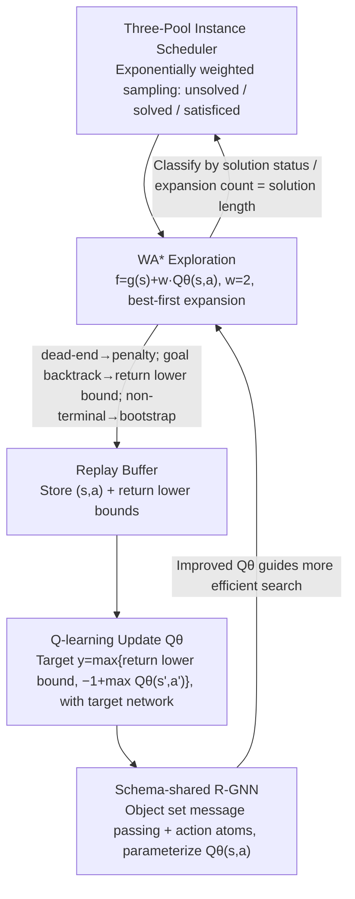

# Learning to Search and Searching to Learn for Generalization in Planning

**Conference**: ICML 2026  
**arXiv**: [2605.25720](https://arxiv.org/abs/2605.25720)  
**Code**: https://github.com/maichmueller/generalized-search-for-planning  
**Area**: Reinforcement Learning / Classical Planning / Relational GNN  
**Keywords**: Generalized Planning, WA* Search, Q-learning, R-GNN, Zero-shot Scale Generalization  

## TL;DR
This paper proposes GSP: a "self-improving generalized planner" that integrates Weighted A* (WA*) best-first search and Q-learning into a single loop, utilizing a Relational Graph Neural Network (R-GNN) to represent $Q_\theta(s,a)$. Trained only on small-scale instances, it achieves zero-shot generalization to instances up to ten times larger than those seen during training (e.g., from $\le 30$ blocks to 488 blocks in Blocksworld). It simultaneously sets new coverage records across multiple IPC benchmarks, Sokoban, PushWorld, and The Witness, outperforming DRL baselines based on real-time search.

## Background & Motivation
**Background**: Classical planning (PDDL) naturally provides a "domain-instance" separation: the domain defines fixed predicates and action schemas, while instances vary in initial values, goals, and the number of objects. This clean structure makes it an ideal testing ground for "combinatorial generalization." Recent works like Lifted HER, WL-features, and Distincter have attempted to use DRL or supervised learning to generate "generalized policies" or "generalized heuristics," allowing a learned network to solve instances of arbitrary size.

**Limitations of Prior Work**: (1) DRL approaches (Rivlin 2020, Ståhlberg 2023a/2026, etc.) follow real-time (agent-based) search, which is extremely inefficient during exploration in difficult problems with sparse rewards, dead-ends, and long horizons (e.g., Sokoban, Floortile). (2) Supervised approaches (WL-f, Horčik, Distincter) use optimal planners to pre-generate $h^\ast(s)$ for regression, skipping the self-improving loop where "better search $\rightarrow$ better training samples $\rightarrow$ stronger heuristics." (3) Hindsight Experience Replay (HER) is effective in domains with decomposable subgoals, but many planning goals cannot be meaningfully decomposed, rendering HER ineffective for real-time search.

**Key Challenge**: In classical planning, the model is fully known, which suggests that best-first search (A*, WA*, GBFS) should be utilized. However, DRL often forces real-time search due to the inertia of RL frameworks, which is counterproductive. Furthermore, while the feedback loop of "better heuristics lead to faster search, and faster search leads to better samples" (e.g., LRTA*, RTDP) has long existed, it has been confined to single state spaces rather than generalizing across an entire family of instances.

**Goal**: Construct a self-improving search-learning loop where an untrained $Q_\theta$ learns generalized heuristics from WA* search data on small instances that can directly generalize across scales. At test time, the network can be used greedily as a policy or to accelerate search via WA*.

**Key Insight**: Since the model is known, best-first search is treated as the "explorer" and R-GNN as the "cross-scale transferer." R-GNN performs message passing over object sets, naturally supporting training on 29 blocks and testing on 488 blocks.

**Core Idea**: Replace real-time search with WA* for exploration and use Q-learning combined with "return lower bounds" discovered by search as supervision. The entire loop is built on a schema-shared R-GNN to obtain a $Q_\theta(s,a)$ capable of cross-instance generalization.

## Method

### Overall Architecture
GSP maintains a $Q_\theta(s,a)$ parameterized by an R-GNN and a replay buffer $\mathcal D$. In each iteration: (1) An instance $\mathcal E$ is sampled from the training pool; (2) WA* search is performed using $f(s,a)=g(s)+w\,Q_\theta(s,a)$ ($w=2$), where nodes are state-action pairs $(s,a)$; (3) Dead-ends encountered, samples from the goal path, and search-derived return lower bounds $\underline R$ are stored in the buffer; (4) Mini-batches are asynchronously sampled from the buffer to update $Q_\theta$ via Q-learning (with a target network); (5) Instances are dynamically scheduled across three pools—"unsolved / solved (nodes expanded = optimal length) / satisficed (solved but non-optimal)"—with exponentially increasing weights to ensure computational resources focus on medium-difficulty instances that provide the most learning signal. This forms a self-improving loop: "search yields better data $\rightarrow$ data trains stronger $Q_\theta$ $\rightarrow$ stronger $Q_\theta$ guides more efficient search."

### Key Designs

**1. WA* Exploration + Search-derived Return Lower Bounds: Converting "Successful Search" into Direct Q-Supervision**

In classical planning, the model is fully known, making best-first search the logical choice. DRL's use of real-time search often leads to poor sample efficiency under sparse rewards. GSP reintroduces this common sense to RL: rewards are unit step costs $r=-1$ without discounting, and the cumulative return $g(s)$ is the negative depth. The frontier is expanded based on the maximum $f(s,a)=g(s)+w\,Q_\theta(s,a)$ ($w=2$). Three types of transitions are handled: dead-ends receive a fixed penalty $R_\bot$; goal paths are backtracked to label each $(s_t, a_t)$ with the actual return-to-go $\underline R$ as a lower bound for the optimal return; and non-terminals use standard Q-learning bootstrap. The critical training target is $y=\max\{\underline R,\,\hat y(s,a)\}$, where $\hat y(s,a)=-1+\max_{a'}Q_\theta(s',a')$. This $\max$ operation prevents bootstrapping from pulling the target below a value already achieved by search, acting as a crucial stabilizer. Essentially, once WA* finds a solution path, the information that "this path is traversable" is explicitly fed back into $Q$.

**2. Schema-shared R-GNN with Action Atoms: One Readout for All Object Counts and Action Schemas**

Traditional DRL/MLP models hardcode the action space into the output layer, which fails when moving to larger instances. GSP uses a Relational Graph Neural Network for message passing over object sets, supporting a scale shift from 29 training blocks to 488 test blocks. Each state-goal pair is encoded as a set of relations $\mathcal R_{s,g}=\{p(\bar o)\in s\cup g\}$. For each applicable grounded action $a=A(\bar o)$, a dedicated action object $o_a$ and an atom $A(o_a,\bar o)$ are introduced into the message-passing graph. Each predicate $p$ has its own $\mathrm{Comb}_p$ MLP to encode positional roles. Objects aggregate information via smoothmax and update via a shared $\mathrm{Comb}_U$ with residuals. After $L$ layers, a single schema-shared MLP predicts $Q_\theta(s,a)$ based on $[X_L(o_a)\|\bar X(s,g)]$. Crucially, $\mathrm{MLP}_Q$ is shared across all action schemas, ensuring the model learns "scoring principles" rather than schema-specific values.

**3. Three-Pool Instance Scheduling (unsolved / solved / satisficed): Focusing Compute on Informative Instances**

Uniform sampling is wasteful: perfectly solved instances provide zero gradient, and unsolvable instances provide zero signal. GSP categorizes training instances based on recent WA* results: solved but expanded nodes > path length (satisficed), solved with expanded nodes = path length (solved/high confidence), and unsolved. Sampling weights increase exponentially from satisficed $\rightarrow$ unsolved $\rightarrow$ solved. The intent is to prioritize "satisficed" instances—those where the heuristic can find a solution but is not yet direct—providing the best contrast between sub-optimal and optimal actions to fuel $Q$ improvement.

### Loss & Training
All experiments share a fixed hyperparameter set: embedding dimension $d=32$, smoothmax aggregation, R-GNN learning rate $10^{-4}$, and readout rate $10^{-3}$. The system uses 1 learner and 5 parallel search workers with a 60s search budget and a worker batch size of 256. The FIFO replay buffer holds 40 batches. The target network updates every 10 full passes of the replay buffer. Training lasts 12 hours, with the paper reporting dynamics within the first 180 minutes.

## Key Experimental Results

### Main Results (2023 IPC Learning Track Coverage and Nodes Expanded)
| Domain (Train $\rightarrow$ Test Scale) | GSPπ (greedy) | GSP$_{\mathrm{WA^*}}$ | Lifted HER | LAMA | Remarks |
| :--- | :--- | :--- | :--- | :--- | :--- |
| Blocksworld (29 $\rightarrow$ 488) | Strong (holds across scales) | Further Improvement | Weak | Domain-independent baseline | Trained on $\le 30$, tested on 488 |
| Transport (34 $\rightarrow$ 453) | Strong | Strong | Relatively Weak | Medium | Suitable for search heuristics |
| Sokoban (11×11, b=3 $\rightarrow$ 99×99, b=79) | Still solves many | Significantly stronger than greedy | Degenerated | Limited | Classic PSPACE-hard problem |
| Spanner (28 $\rightarrow$ 833) | High Coverage | Near 100% | Medium | Medium | Classic schema generalization |
| Childsnack (51 $\rightarrow$ 1326) | High | High | Weak | Limited | Hardest instance: 4.67e7 actions |
| Satellite/Miconic/Ferry/Rovers | Generally Leading | Generally Leading | Close in some | Medium | Learned heuristic takes over |
| Floortile | Average | Average | Weak | Average | Training loop failed to solve all instances |

> Note: Qualitative summary based on "Cov./Steps" columns in the original paper. GSP achieves better or equal coverage compared to all baselines in both GSPπ and GSP$_{\mathrm{WA^*}}$ modes, maintaining competitive plan lengths.

### Ablation Study
| Comparison | Result | Explanation |
| :--- | :--- | :--- |
| GSP$_{\mathrm{WA^*}}$ vs. GSPπ | WA* is significantly stronger on hard problems like Sokoban | $Q$ works as both a policy and a heuristic |
| GSP vs. AlphaZero ($\alpha_0$, same R-GNN) | GSP is comprehensively stronger | MCTS is less effective for single-goal pathfinding/sparse puzzles |
| GSP vs. Lifted HER | Significantly leads in most settings | Best-first exploration + return lower bounds > real-time search + HER |
| GSP vs. WL-f / Horčik / Distincter | Competitive or better without pre-generated $h^\ast$ | Self-improving vs. Supervised |
| Training Curves: Blocks vs. Floortile | Blocks: expanded nodes $\downarrow$, solve rate $\uparrow$; Floortile: stuck | Validates the "search-learn-search" loop; exposes failures |
| Puzzle Domains: PushWorld / The Witness | GSP still solves; DRL baselines fail significantly | Cross-domain portability |

### Key Findings
- **Zero-shot scale transfer** is the standout result: Blocksworld trained on $\le 30$ blocks solves 488 blocks greedily; Sokoban scales from 11×11 to 99×99.
- **$y=\max\{\underline R, \hat y\}$ is a stabilizer**: Using the search-found solution length as a hard lower bound for bootstrapping prevents Q-learning from being dragged down by underestimated targets in sparse reward settings.
- **R-GNN + action atoms** allows a single readout to handle all action schemas, which is fundamental for generalizing to unfamiliar scales and maintaining permutation invariance.
- **MCTS loses to WA* in generalized planning**: While AlphaZero excels in zero-sum games or dense rewards, for single-target pathfinding and sparse puzzles, MCTS simulation lacks the directional focus of global best-first search.
- **Floortile as a failure case**: The training loop failed to solve all instances within the time limit, indicating that if search cannot find a signal initially, the self-improving loop cannot start.

## Highlights & Insights
- **Repurposing the roles of RL and search**: When the model is known, real-time search should not be used for exploration. Treating WA* as the explorer and Q-learning as the estimator is a cleaner paradigm than treating the model as a black box.
- **Search-derived lower bounds are free labels**: Every successful search provides $\underline R$ for every $(s,a)$ on the path, converting search success into supervised data.
- **Three-pool instance scheduling** is a valuable engineering trick: Stratifying samples by "difficulty/information" speeds up training without complex curriculum adjustments.
- **R-GNN + action atoms** provides a general framework for "object permutation equivariance + schema sharing," applicable to any domain with clear relational structures (e.g., chemical reactions, ECS games, combinatorial optimization).
- **Dual usage at test time**: $Q_\theta$ functions as both a zero-search greedy policy and a search-guiding heuristic, offering flexibility for varying inference budgets.

## Limitations & Future Work
- **Dependence on a known model**: Environments that are stochastic, partially observable, or have only raw sensory input are not directly compatible, as WA* requires explicit transition functions.
- **Sensitivity to initial search feasibility**: In domains like Floortile where search fails to find a goal within the initial budget, the loop stalls. Future work could include warm-starts or adaptive budgets.
- **Compute budget optimization**: Unlike some dLLM works, GSP does not directly optimize for "computational budget." Future iterations could include node expansion counts in the return.
- **GNN expressivity limits**: Relation-based GNNs cannot distinguish certain graph isomorphism pairs, which may limit the policy in highly symmetric and dense domains.

## Related Work & Insights
This work follows the tradition of "search-learning symbiosis" (e.g., LRTA*/RTDP) but extends it to the dimension of "learning a generalized Q across a family of instances." Compared to Lifted HER, the primary distinction is replacing real-time search with best-first search. Compared to the AlphaZero family, it removes the dependence on MCTS, which is better suited for planning structures. Unlike supervised heuristic learning (e.g., WL-f), it does not require an optimal planner to generate labels and possesses a self-improving loop. It suggests a unified path for "model-known RL": for any decision problem with a known model, best-first search exploration combined with cross-instance $Q_\theta$ learning is a robust paradigm.

<!-- RELATED:START -->

## Related Papers

- [\[ICML 2026\] The Surprising Difficulty of Search in Model-Based Reinforcement Learning](the_surprising_difficulty_of_search_in_model-based_reinforcement_learning.md)
- [\[ICML 2026\] Laplacian Representations for Decision-Time Planning](laplacian_representations_for_decision-time_planning.md)
- [\[ICML 2026\] You Can Learn Tokenization End-to-End with Reinforcement Learning](you_can_learn_tokenization_end-to-end_with_reinforcement_learning.md)
- [\[ICML 2026\] Safety Generalization Under Distribution Shift in Safe Reinforcement Learning: A Diabetes Testbed](safety_generalization_under_distribution_shift_in_safe_reinforcement_learning_a_.md)
- [\[ICLR 2026\] On the Generalization of SFT: A Reinforcement Learning Perspective with Reward Rectification](../../ICLR2026/reinforcement_learning/on_the_generalization_of_sft_a_reinforcement_learning_perspective_with_reward_re.md)

<!-- RELATED:END -->
