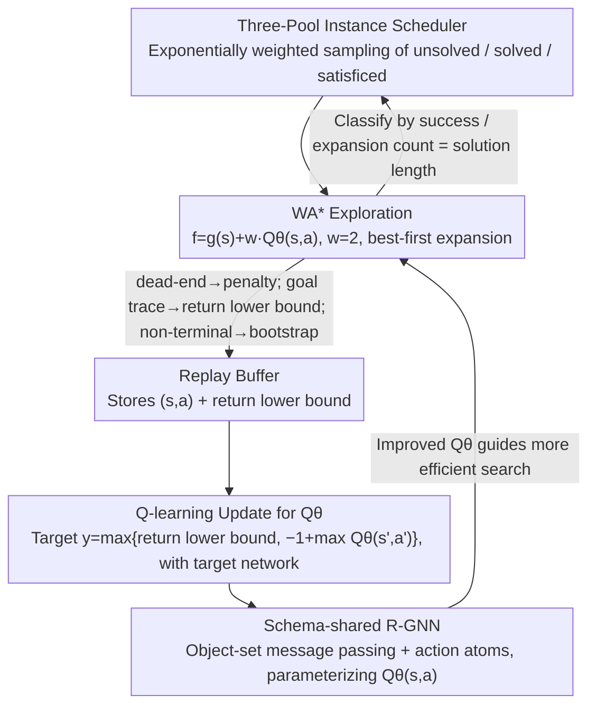

# Learning to Search and Searching to Learn for Generalization in Planning

**Conference**: ICML 2026  
**arXiv**: [2605.25720](https://arxiv.org/abs/2605.25720)  
**Code**: https://github.com/maichmueller/generalized-search-for-planning  
**Area**: Reinforcement Learning / Classical Planning / Relational GNN  
**Keywords**: Generalized Planning, WA* Search, Q-learning, R-GNN, Zero-shot Scale Generalization  

## TL;DR
This paper proposes GSP: a "self-improving generalized planner" that integrates Weighted A* best-first search and Q-learning within a unified loop, using Relational Graph Neural Networks (R-GNN) to represent $Q_\theta(s,a)$. By training only on small-scale instances, it achieves zero-shot generalization to instances over ten times larger (e.g., from $\le$ 30 blocks to 488 blocks in Blocksworld). It sets new coverage records across multiple IPC benchmarks, Sokoban, PushWorld, and The Witness, significantly outperforming DRL baselines based on real-time search.

## Background & Motivation
**Background**: Classical planning (PDDL) naturally features a separation between "domain" and "instance": the domain defines fixed predicates and action schemas, while instances vary in initial states, goals, and object counts. This clean structure makes it an ideal testbed for "combinatorial generalization." Recent works like Lifted HER, WL-features, and Distincter have attempted to use DRL or supervised learning to generate "generalized policies" or "generalized heuristics" capable of solving instances of arbitrary size.

**Limitations of Prior Work**: (1) DRL approaches (Rivlin 2020, Ståhlberg 2023a/2026, etc.) typically employ real-time (agent-based) search, which is extremely inefficient during exploration in problems with sparse rewards, dead-ends, or long horizons (e.g., Sokoban, Floortile); (2) Supervised approaches (WL-f, Horčik, Distincter) rely on pre-generated $h^\ast(s)$ from optimal planners for regression, bypassing the self-improvement loop where "better search leads to better samples, leading to stronger heuristics"; (3) Hindsight Experience Replay (HER) is effective in domains with decomposable subgoals, but many planning domains have goals that cannot be meaningfully partitioned.

**Key Challenge**: In classical planning, the model is fully known, which theoretically favors best-first search (A*/WA*/GBFS). However, DRL is often constrained by RL frameworks to use real-time search, which is counterproductive. Furthermore, while the feedback loop of "better heuristics leading to faster search, and faster search providing better samples" is well-known (e.g., LRTA*, RTDP), it has not been successfully scaled to handle generalization across a "family of instances."

**Goal**: Construct a self-improving search-learning loop where an untrained $Q_\theta$ learns from WA* search data on small instances to produce generalized heuristics that generalize across scales. At test time, the model can be used either as a greedy policy or as a heuristic to accelerate WA* search.

**Key Insight**: Since the model is known, best-first search should be treated as the "explorer," and R-GNN as the "cross-scale migrator." R-GNNs perform message passing over object sets, naturally supporting models trained on 29 blocks to be tested on 488 blocks.

**Core Idea**: Replace real-time search with WA* for exploration, use Q-learning combined with search-derived "return lower bounds" for supervision, and build the entire loop on a schema-shared R-GNN to obtain an instance-agnostic $Q_\theta(s,a)$.

## Method

### Overall Architecture
GSP maintains a $Q_\theta(s,a)$ parameterized by an R-GNN and a replay buffer $\mathcal D$. Each iteration involves: (1) Sampling an instance $\mathcal E$ from the training pool; (2) Running a WA* search using $f(s,a)=g(s)+w\,Q_\theta(s,a)$ ($w=2$), where nodes are state-action pairs $(s,a)$; (3) Storing dead-ends, samples from goal paths, and search-derived return lower bounds $\underline R$ into the buffer; (4) Asynchronously sampling mini-batches from the buffer to perform Q-learning (with a target network) on $Q_\theta$; (5) Dynamically scheduling instances across three pools—"unsolved," "solved" (node count = optimal length), and "satisficed" (solved but non-optimal)—using exponentially increasing weights to focus computational resources on mid-difficulty instances that provide the strongest learning signals.

### Key Designs

**1. WA* Exploration + Search-derived return lower bounds: Turning successful search into direct supervision**
In classical planning where the model is known, best-first search is superior to agent-based exploration, which suffers from poor sample efficiency under sparse rewards. GSP brings this intuition back to RL. It uses a unit step cost $r=-1$. The search frontier is expanded based on $f(s,a)=g(s)+w\,Q_\theta(s,a)$ ($w=2$). Three types of transitions are handled: dead-ends receive a penalty $R_\bot$; goal paths are backtracked to label $(s_t, a_t)$ with the actual return-to-go $\underline R$ (acting as a lower bound for the optimal return); and non-terminals use standard Q-learning bootstrapping. The training target is $y=\max\{\underline R,\,\hat y(s,a)\}$, where $\hat y(s,a)=-1+\max_{a'}Q_\theta(s',a')$. This `max` operation prevents bootstrapping from pulling the target below the quality of a solution already found by search, which is a critical stabilizer.

**2. Schema-shared R-GNN with action atoms: Handling arbitrary object counts and action schemas**
Traditional DRL/MLP architectures hardcode the action space, causing them to fail when instance scales change. GSP uses an R-GNN for message passing over object sets, supporting a jump from 29 blocks in training to 488 in testing. Specifically, each state-goal pair is encoded as a set of relations $\mathcal R_{s,g}=\{p(\bar o)\in s\cup g\}$. For every applicable grounded action $a=A(\bar o)$, a dedicated "action object" $o_a$ and atom $A(o_a, \bar o)$ are introduced into the message-passing graph. Each predicate $p$ has a corresponding $\mathrm{Comb}_p$ MLP to encode positional roles. Objects aggregate information via smoothmax and update via a shared $\mathrm{Comb}_U$ with residuals. After $L$ layers, a single schema-shared MLP predicts $Q_\theta(s,a)$ based on $[X_L(o_a)\|\bar X(s,g)]$. Because $\mathrm{MLP}_Q$ is shared across all action schemas, the model learns "scoring principles" rather than schema-specific values, enabling permutation-invariant generalization.

**3. Three-pool Instance Scheduling (unsolved / solved / satisficed): Focusing on high-information instances**
Uniform sampling is inefficient; solved instances provide zero gradient, while unsolvable ones provide zero signal. GSP categorizes training instances based on recent WA* results: "satisficed" (solution found, but expansion count > solution length), "solved" (solution found with minimal expansion), and "unsolved." Sampling weights increase exponentially from solved to satisficed to unsolved, prioritizing instances where the heuristic can find a solution but lacks precision. The contrast between suboptimal and optimal traces in these instances serves as the primary "fuel" for $Q$ improvement.

### Loss & Training
All experiments share a single set of hyperparameters: embedding dimension $d=32$, smoothmax aggregation; R-GNN learning rate $10^{-4}$, readout $10^{-3}$; 1 learner + 5 parallel search workers; 60 seconds budget per search with a worker batch size of 256; FIFO replay buffer capacity of 40 batches; target network updated every 10 full buffer passes. Training is conducted for 12 hours.

## Key Experimental Results

### Main Results (2023 IPC Learning Track Coverage and Expansion Nodes)

| Domain (train→test scale) | GSPπ (greedy) | GSP$_{\mathrm{WA^*}}$ | Lifted HER | LAMA | Remarks |
|--------|------|------|------|------|------|
| Blocksworld (29→488) | Strong | Further improvement | Weak | Baseline | Trained on $\le$30, tested on 488 |
| Transport (34→453) | Strong | Strong | Weak | Moderate | Suited for search-based heuristics |
| Sokoban (11×11, b=3 → 99×99, b=79) | Moderate | Significantly > greedy | Fails | Limited | PSPACE-hard puzzle |
| Spanner (28→833) | High | ~100% | Moderate | Moderate | Classic schema generalization |
| Childsnack (51→1326) | High | High | Weak | Limited | Largest instance: 4.67e7 actions |
| Satellite/Miconic/Ferry/Rovers | Leading | Leading | Comparable | Moderate | Learned heuristic guides search |
| Floortile | Poor | Poor | Weak | Poor | Training loop failed to solve all instances |

> Note: Coverage results are qualitatively summarized based on the paper's "Cov./Steps" tables. GSP consistently achieves superior coverage compared to all baselines in both GSPπ and GSP$_{\mathrm{WA^*}}$ modes.

### Ablation Study

| Comparison | Result | Explanation |
|------|------|------|
| GSP$_{\mathrm{WA^*}}$ vs. GSPπ | WA* is significantly stronger on hard puzzles like Sokoban | $Q$ serves as both a policy and a heuristic |
| GSP vs. AlphaZero ($\alpha_0$) | GSP is generally stronger | MCTS is less effective for sparse-reward pathfinding |
| GSP vs. Lifted HER | GSP significantly leads in most settings | Best-first exploration + lower bounds > real-time search + HER |
| GSP vs. WL-f / Horčik | Competitive or superior | Self-improvement vs. fixed supervision |
| Puzzle benchmarks: PushWorld / The Witness | GSP succeeds where DRL baselines fail | Cross-domain migration capability |

### Key Findings
- **Zero-shot Scale Transfer**: The most striking results involve Blocksworld (30 to 488 blocks) and Sokoban (11x11 to 99x99) where the model succeeds without further training despite massive increases in state and action space.
- **Stability of $y=\max\{\underline R,\hat y\}$**: Using the found solution length as a hard lower bound for bootstrapping prevents Q-learning from being undermined by underestimated targets in sparse reward settings.
- **R-GNN + action atoms**: Sharing a single readout across all action schemas is the fundamental reason the model can process unfamiliar scales and schemas.
- **MCTS vs. WA***: For single-goal pathfinding and sparse puzzles, MCTS simulation lacks the global directionality provided by best-first search.

## Highlights & Insights
- **Re-evaluating RL and Search**: For model-known environments, one should not use real-time search for exploration. Treating WA* as the "explorer" and Q-learning as the "estimator" is a cleaner paradigm for model-based RL.
- **Search-derived lower bounds are "free" labels**: Every successful search provides optimal or near-optimal target values for every step in the trace, significantly boosting learning efficiency compared to standard RL.
- **Curriculum through Scheduling**: The three-pool strategy is a lightweight yet effective way to speed up training by focusing on instances with the highest information gain.
- **Action Atoms for Heterogeneous Schemas**: The framework of using a specific object to represent an action allows a single readout to evaluate diverse actions, which is applicable to fields like chemical reactions or combinatorial optimization.

## Limitations & Future Work
- **Dependency on Known Models**: Cannot be directly applied to stochastic or partially observable environments where transition functions are unknown.
- **Bootstrap Sensitivity**: In domains like Floortile where the initial 60s search rarely finds a goal, the self-improvement loop fails to start. This suggests a need for "warm-starts" or adaptive search budgets.
- **Training Heaviness**: 12 hours per domain with multiple workers is still computationally non-trivial.
- **GNN Expressivity**: Relational GNNs based on WL-equivalence cannot distinguish certain isomorphic graphs, which may limit policy performance in highly symmetric domains.

## Related Work & Insights
This work revitalizes the "search-learning symbiosis" of LRTA*/RTDP but extends it to generalized Q-learning across instance families. Unlike Lifted HER, it replaces real-time search with best-first search. Unlike AlphaZero, it removes the dependence on MCTS, which is better suited for the specific structure of long-horizon puzzles. It demonstrates a unified model-based RL path: for decision problems with clear relational structures, one should focus on "best-first exploration + cross-instance $Q_\theta$ learning."

<!-- RELATED:START -->

## Related Papers

- [\[ICML 2026\] The Surprising Difficulty of Search in Model-Based Reinforcement Learning](the_surprising_difficulty_of_search_in_model-based_reinforcement_learning.md)
- [\[ICML 2026\] Laplacian Representations for Decision-Time Planning](laplacian_representations_for_decision-time_planning.md)
- [\[ICML 2026\] You Can Learn Tokenization End-to-End with Reinforcement Learning](you_can_learn_tokenization_end-to-end_with_reinforcement_learning.md)
- [\[ICML 2026\] Safety Generalization Under Distribution Shift in Safe Reinforcement Learning: A Diabetes Testbed](safety_generalization_under_distribution_shift_in_safe_reinforcement_learning_a_.md)
- [\[ICLR 2026\] On the Generalization of SFT: A Reinforcement Learning Perspective with Reward Rectification](../../ICLR2026/reinforcement_learning/on_the_generalization_of_sft_a_reinforcement_learning_perspective_with_reward_re.md)

<!-- RELATED:END -->
