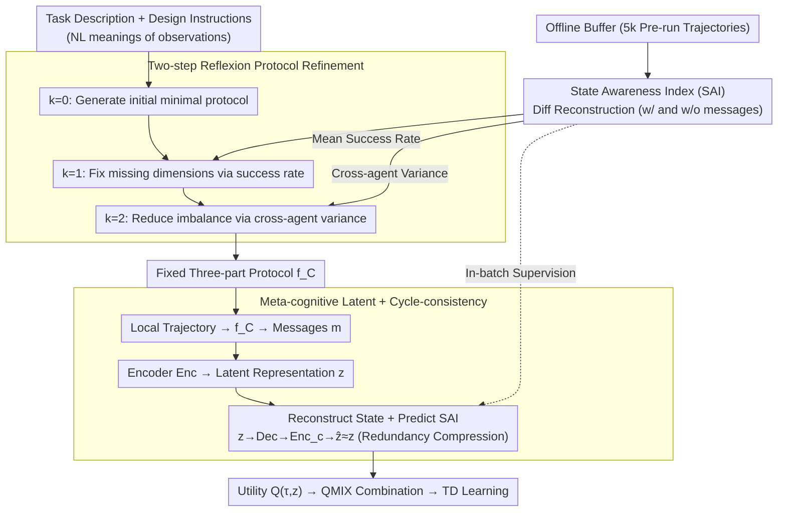

# LLM-Guided Communication for Cooperative Multi-Agent Reinforcement Learning

**Conference**: ICML2026  
**arXiv**: [2605.18077](https://arxiv.org/abs/2605.18077)  
**Code**: https://saaangjun.github.io/LMAC/  
**Area**: Reinforcement Learning  
**Keywords**: Multi-agent RL, Cooperative Communication, LLM Protocol Design, CTDE, QMIX

## TL;DR
This paper proposes LMAC—using LLMs offline to design executable communication protocol code for cooperative MARL. Based on the "state reconstructability" metric, it performs two rounds of feedback iteration (first improving reconstruction accuracy, then reducing cross-agent imbalance). It significantly outperforms communication baselines such as TarMAC/SMS/T2MAC/MASIA on benchmarks like SMAC-Comm, LBF, GRF, and SMACv2, even exceeding the QMIX+State upper bound (where the global state is provided to all agents) in some scenarios.

## Background & Motivation
**Background**: Cooperative MARL widely employs communication to alleviate partial observability under the CTDE framework. Early models like CommNet used broadcasting, TarMAC used attention weighting, SMS used Shapley value scoring, T2MAC used evidence fusion, and MASIA learned a latent representation for "state reconstruction" to broadcast.

**Limitations of Prior Work**: These methods implicitly assume that "delivering the message is enough," but in practice, many messages are redundant or miss critical information. A specific case in SMAC serves as a counterexample: an Overseer directly observes enemy positions, while Banelings have no visibility. In MASIA and FullComm, after 2M training steps, the reconstruction error for enemy positions remains high; the variance of reconstruction error between agents is also large, meaning some agents "know" while others are still "guessing." This leads to disjointed estimates and failed coordination among Banelings.

**Key Challenge**: Designing efficient communication requires understanding "which observation dimensions are critical for global state reconstruction and which are redundant"—a semantic task-understanding problem that gradient optimization struggles to learn automatically. Conversely, using LLMs as online agents to generate messages (e.g., Li et al., 2024) incurs high token costs per step and is limited to text-world interfaces.

**Goal**: (i) Use LLMs to generate "communication protocols" once as executable code, eliminating LLM calls during training and execution; (ii) Ensure LLM iterative refinement signals are derived from real RL replay data rather than LLM hallucinations; (iii) Quantify "protocol quality" as a differentiable metric—state reconstructability—to drive a Reflexion-style feedback loop.

**Key Insight**: Treat the LLM as a "protocol designer" rather than an "online message generator." The LLM receives task descriptions and natural language meanings for each observation dimension, outputting Python code that maps $\tau_t^i$ to message $m_t^i$. The quality is evaluated by an auxiliary decoder on an offline buffer.

**Core Idea**: Driven by two criteria—"whether messages improve state reconstruction accuracy" and "whether knowledge is uniform across agents"—the LLM self-corrects, treating protocol design as a code generation task that converges in two steps.

## Method

### Overall Architecture
LMAC splits MARL training into "protocol design" and "policy learning":

1.  **Offline Protocol Design Stage**: Run QMIX to collect a small buffer $\mathcal{B}$ (5k trajectories). Use an LLM with task description $\mathcal{I}_T$ and protocol design instructions $\mathcal{I}_P$ to generate the initial protocol $f_C^{(0)}$. Then, train an auxiliary decoder $D_\phi^{(k)}$ using agent trajectories (with and without messages) to attempt global state reconstruction. Compute the SAI metric based on whether reconstruction falls within threshold $\alpha$, and convert SAI into language feedback to drive $f_C^{(1)}$ (improving accuracy) and $f_C^{(2)}$ (reducing cross-agent variance). This yields the final three-part protocol $f_C=(f_C^{(0)},f_C^{(1)},f_C^{(2)})$.
2.  **Online CTDE Training Stage**: Execute $f_C$ as a fixed function—each agent processes local trajectories to get message segments $m_t^i=(m_t^{i,(0)},m_t^{i,(1)},m_t^{i,(2)})$, which are passed through an encoder $\mathrm{Enc}_\psi$ to obtain a latent representation $z_t^i$. This $z_t^i$ is fed into individual utilities $Q^i(\tau_t^i, z_t^i)$, combined by QMIX into $Q_{tot}$ for TD learning. The encoder-decoder is simultaneously trained to reconstruct the global state, predict SAI, and apply a cycle-consistency regularizer to prune redundant features.

The following flowchart illustrates the two-stage process: SAI acts as a "stethoscope" throughout—converting reconstruction results into feedback in the offline stage and serving as a supervisory signal for meta-cognitive representations in the online stage.

### Key Designs

**1. State Awareness Index (SAI): Diagnostic via Differential Reconstruction**
To design efficient communication, one must identify which observation dimensions are critical vs. redundant. LMAC uses RL replay data to score protocols instead of relying on LLM self-evaluation. For each agent $i$, state dimension $d$, and time $t$, reconstructions are performed under two conditions: with messages $\hat s_{1,d,t}^i=D_\phi^{(k)}(\tau_t^i, m_t^{i,(k)}, i)|_d$ and without messages $\hat s_{0,d,t}^i=D_\phi^{(k)}(\tau_t^i,\mathbf 0, i)|_d$. The 0/1 signal $\chi_{l,d,t}^{i,(k)}=\mathbb I[\|\hat s_{l,d,t}^i - s_{d,t}\|^2\le\alpha]$ is used. Averaging over $t$ yields the reconstruction success rate (accuracy), while variance over $i$ reflects knowledge imbalance.

**2. Two-step Reflexion Protocol Refinement: Decoupling Accuracy and Consistency**
Standard Reflexion uses a static feedback loop, which can be vague. LMAC employs specific goals for each step. $k=0$ generates a "minimal message" version. $k=1$ uses $\mathbb E_t[\chi_{1,d,t}^{i,(0)}]$ for feedback, identifying agents struggling to reconstruct specific dimensions and prompting the LLM to include missing info. $k=2$ uses $\mathrm{Var}_i[\chi_{1,d,t}^{i,(1)}]$ to highlight cross-agent inconsistencies, causing the LLM to introduce shared anchors or ID tags. Experiments show that this two-step process leads to stepwise performance gains.

**3. Meta-cognitive Latent Representation + Cycle-consistency: A Supervisory Bottleneck**
Since LLM-designed messages may still be noisy, an encoder $z_t^i = \mathrm{Enc}_\psi(\tau_t^i, m_t^i)$ compresses the messages during CTDE training. The decoder $\mathrm{Dec}_\psi$ is trained to reconstruct $s_t$ and predict SAI $\chi_{d,t}^i$. This makes the representation *meta-cognitive*: it must be accurate and "know" what it doesn't know. A cycle-consistency loss $\hat z_t^i=\mathrm{Enc}_{c,\psi}(\mathrm{Dec}_\psi(z_t^i)) \approx z_t^i$ is added to ensure that the features passing through the bottleneck are task-relevant and non-redundant.

### Loss & Training
The standard QMIX TD loss handles the value function. The encoder-decoder is trained with three additional terms: (i) global state reconstruction loss, (ii) SAI prediction loss, and (iii) cycle-consistency loss. For the LLM, the best $\alpha$ thresholds are used for $k=0,1,2$. While GPT-4 is the default, performance remains stable across various LLMs like GPT-o1-mini, Claude, or Gemini.

## Key Experimental Results

### Main Results
Evaluated on SMAC-Comm (including large-scale `2o_20b_vs_2r`), LBF, GRF, and SMACv2.

| Benchmark / Scenario | Metric | LMAC (Ours) | Strongest Comm Baseline | QMIX+State Upper Bound | Note |
|------------|------|-------------|--------------|-----------------|------|
| SMAC-Comm `bane_vs_hM` | Final Win Rate | Near QMIX+State | T2MAC/MASIA lag behind | Reference | Significant gains in large-scale/hard-reconstruct scenarios |
| LBF | Conv. Speed | Near QMIX+State | Inferior | Reference | Faster and higher convergence |
| GRF (`3_vs_1_with_keeper`) | Final Win Rate | **Exceeds** QMIX+State | Inferior | Reference | Latent compression is better than raw state in high-dim space |
| SMACv2 `terran_5_vs_5` | Test Win Rate | $67.87 \pm 2.77$ | MAIC $63.80\pm3.4$ | QMIX+State $64.77\pm2.79$ | Outperforms state upper bound |
| SMACv2 `protoss_5_vs_5` | Test Win Rate | $57.96 \pm 4.02$ | MAIC $51.93\pm2.4$ | QMIX+State $56.40\pm2.33$ | Consistent advantage |
| SMACv2 `zerg_5_vs_5` | Test Win Rate | $42.18 \pm 4.37$ | NDQ $38.75\pm2.9$ | QMIX+State $40.06\pm3.39$ | Consistent advantage |

Most baselines fail significantly on SMACv2, indicating LLM-designed protocols are more robust to randomization.

### Ablation Study
(Results based on SMAC-Comm Average Win Rate %).

| Configuration | Win Rate | Note |
|------|---------|------|
| LMAC (Full $k=2$) | $82.9 \pm 1.9$ | Full refinement + cycle-consistency + SAI |
| $k=0$ (Initial only) | $68.5 \pm 3.8$ | Single LLM output, no feedback |
| $k=1$ (Accuracy only) | $77.8 \pm 2.2$ | First feedback step only |
| w/o Cycle-consistency | $66.5 \pm 2.1$ | Massive drop due to redundant features |
| w/o SAI Supervision | $76.6 \pm 5.6$ | Representation loses meta-cognitive awareness |

### Key Findings
- **Feedback is non-redundant**: The 5-point gain from $k=1$ (77.8) to $k=2$ (82.9) confirms the value of decoupling accuracy and consistency.
- **Cycle-consistency is critical**: Removing it dropped performance to 66.5, showing that redundancy compression is as vital as the SAI metric itself.
- **Outperforming Truth**: On high-dimensional GRF tasks, LMAC surpasses QMIX+State, suggesting filtered communication can facilitate faster learning than raw high-dimensional states.

## Highlights & Insights
- **Decoupled LLM Usage**: By using the LLM as an offline designer rather than an online decider, token costs are minimized and RL training instability is avoided. This "LLM-writes-code, RL-runs-code" paradigm is broadly applicable.
- **Effective SAI Metric**: The differential reconstruction approach provides a low-cost, high-information protocol diagnostic.
- **Cross-domain Transfer**: Applying cycle-consistency from image translation (CycleGAN) to multi-agent communication is a successful architectural transfer.
- **Interpretability**: The resulting communication protocols are human-readable Python code, offering a significant upgrade in auditability compared to attention-based end-to-end networks.

## Limitations & Future Work
- **Description Dependency**: Relies on high-quality natural language task/observation descriptions. It is difficult to apply if observations are anonymous embeddings (e.g., raw pixels).
- **Buffer Bias**: SAI depends on the coverage of the pre-run QMIX buffer; inadequate exploration may lead to biased feedback.
- **Static Design**: Protocols are designed once. Non-stationary tasks or changing agent counts would require re-running the LLM design process.
- **Proxy Objective**: Communication is treated as a state-reconstruction proxy, which may not be the optimal objective for tasks requiring opponent modeling or intent reasoning.

## Related Work & Insights
- **Comparison to MASIA/FullComm**: While both aim for state recovery, LMAC uses the LLM to decide "who should send what," optimizing for efficiency and accuracy simultaneously.
- **Comparison to TarMAC/SMS**: Baselines focus on message aggregation (weights, Shapley values) without touching "semantic content." LMAC rewrites the content at the code level.
- **Comparison to Li et al., 2024**: LMAC avoids the high cost of per-step online LLM calls and works in non-text-world environments.

## Rating
- **Novelty**: ⭐⭐⭐⭐⭐ Combining LLM code generation with offline SAI feedback is a clean, new direction for MARL comms.
- **Experimental Thoroughness**: ⭐⭐⭐⭐⭐ Four benchmarks, multiple LLMs, and detailed ablations.
- **Writing Quality**: ⭐⭐⭐⭐ Clear structure, though some LLM prompt details are relegated to the appendix.
- **Value**: ⭐⭐⭐⭐⭐ Provides a low-cost way to integrate LLM semantic power into MARL with deployable, interpretable results.

<!-- RELATED:START -->

- T2MAC: Targeted Multi-Agent Communication with Evidence Fusion
- MASIA: Multi-Agent State Information Augmented Communication
- SMS: Shapley Message Selection for Multi-Agent Reinforcement Learning

<!-- RELATED:END -->

## Related Papers

- [\[ICML 2026\] Multi-Agent Decision-Focused Learning via Value-Aware Sequential Communication](multi-agent_decision-focused_learning_via_value-aware_sequential_communication.md)
- [\[CVPR 2026\] TaskForce: Cooperative Multi-agent Reinforcement Learning for Multi-task Optimization](../../CVPR2026/reinforcement_learning/taskforce_cooperative_multi-agent_reinforcement_learning_for_multi-task_optimiza.md)
- [\[ICML 2026\] Interaction-Breaking Adversarial Learning Framework for Robust Multi-Agent Reinforcement Learning](interaction-breaking_adversarial_learning_framework_for_robust_multi-agent_reinf.md)
- [\[NeurIPS 2025\] Mean-Field Sampling for Cooperative Multi-Agent Reinforcement Learning](../../NeurIPS2025/reinforcement_learning/mean-field_sampling_for_cooperative_multi-agent_reinforcement_learning.md)
- [\[ICML 2026\] Vulnerable Agent Identification in Large-Scale Multi-Agent Reinforcement Learning](vulnerable_agent_identification_in_large-scale_multi-agent_reinforcement_learnin.md)

<!-- RELATED:END -->
