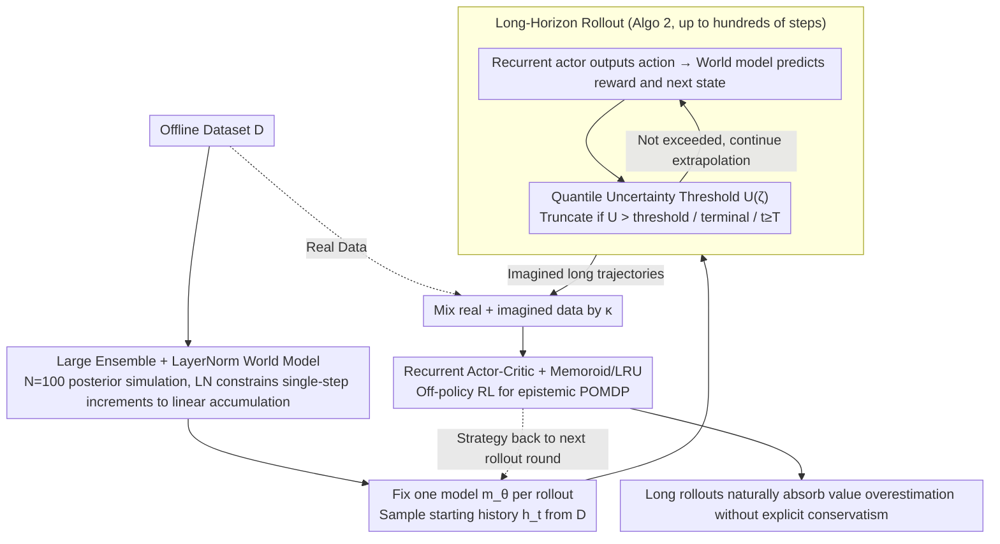

# Long-Horizon Model-Based Offline Reinforcement Learning Without Explicit Conservatism

**Conference**: ICML 2026  
**arXiv**: [2512.04341](https://arxiv.org/abs/2512.04341)  
**Code**: https://github.com/twni2016/neubay (Available)  
**Area**: Offline Reinforcement Learning / Model-Based RL / Bayesian RL  
**Keywords**: offline RL, model-based RL, Bayesian RL, long-horizon rollout, epistemic POMDP

## TL;DR
This paper challenges the prevailing consensus that "offline RL must be explicitly conservative" and proposes Neubay: utilizing a Bayesian perspective for posterior model ensembles, employing **long-horizon rollouts (hundreds of steps)** to naturally absorb value overestimation, and controlling compounding errors with layer normalization and uncertainty thresholds. It matches SOTA conservative algorithms across 33 datasets in D4RL/NeoRL without pessimistic penalties and sets new records on 7 datasets.

## Background & Motivation

**Background**: Mainstream offline RL (e.g., CQL, IQL, EDAC, ReBRAC, MOPO, COMBO, MOBILE) is built on the "explicit conservatism" principle—penalizing state-action pairs outside the dataset. Simultaneously, model-based methods typically perform only 1–5 step short-horizon rollouts to suppress both value overestimation and compounding errors. Theoretically, this corresponds to the robust MDP: $\max_\pi\min_{m\in\mathfrak{M}_\mathcal{D}}J(\pi,m)$.

**Limitations of Prior Work**: While conservatism reduces overestimation, it also suppresses average-case performance, especially on low-quality datasets. When the behavior policy is poor, conservative training traps the agent near suboptimal actions, preventing the exploration of better, unseen actions during testing. The Bayesian perspective (epistemic POMDP) by Ghosh et al. theoretically allows for test-time adaptation, but practical algorithms (APE-V, MAPLE, CBOP, MoDAP) re-introduce uncertainty penalties and short horizons for stability, diluting the Bayesian spirit back into conservatism.

**Key Challenge**: The Bayesian objective $\max_\pi \mathbb{E}_{m\sim \mathbb{P}_\mathcal{D}}[J(\pi, m)]$ theoretically requires full rollouts on the posterior. However, without explicit conservatism, compounding errors and value overestimation become uncontrollable, leaving the Bayesian route "theoretically attractive but practically underperforming" for a long time.

**Goal**: (1) Empirically demonstrate that a pure Bayesian route (without any uncertainty penalties) can work on mainstream offline RL tasks; (2) Identify key bottlenecks and design corresponding mechanisms; (3) Provide clear boundaries for when to use Bayesian vs. conservative approaches.

**Key Insight**: The authors use an extreme two-armed bandit example to clarify: conservatism is **destined** to stick to a suboptimal arm already observed in skewed data, while Bayesian methods can adapt at test time. From this, they propose an counter-intuitive observation: **long-horizon rollouts themselves can substitute explicit conservatism** in suppressing overestimation, as the $H$-step TD target $\sum_{j=0}^{H-1}\gamma^j \hat{r}_{t+j+1} + \gamma^H Q(\hat{h}_{t+H}, \pi(\hat{h}_{t+H}))$ exponentially decays the heavily overestimated bootstrap term by $\gamma^H$.

**Core Idea**: Abandon explicit conservatism and commit fully to the Bayesian spirit—randomly sample one model from the posterior (fixed for each rollout), use an adaptive uncertainty threshold to decide where to truncate, apply layer normalization to cap compounding errors, and use a recurrent actor-critic to handle the partial observability of the epistemic POMDP, ultimately computing long rollouts of several hundred steps.

## Method

### Overall Architecture
The training loop of Neubay (Algo. 1) is very MBPO-like: (a) Train an ensemble of 100 models $\mathbf{m}_{\boldsymbol{\theta}}$ using $\mathcal{D}$; (b) For each iteration, sample a starting point $h_t = s_{0:t}$ from any timestep $t$ in $\mathcal{D}$, draw a fixed model $m_\theta$ from the ensemble (note: the model is fixed for the entire rollout), and run Algo. 2 Rollout until (i) a terminal state is reached, (ii) uncertainty $U_{\boldsymbol{\theta}}(\hat s_t, \hat a_t) > \mathcal{U}(\zeta)$ triggers truncation, or (iii) the episode limit $T$ (up to 1000) is reached; (c) Mix real and imagined data by ratio $\kappa$ to feed a recurrent actor $\pi_\nu(a_t|h_t)$ and critic $Q_\omega(h_t, a_t)$ with independent LRU encoders for off-policy RL. The pipeline sequentially connects "World Model training with large ensemble + LayerNorm", "Quantile uncertainty thresholds to control long rollout termination", and "Recurrent AC learning from long trajectories," as shown below.

### Key Designs

**1. Large Ensemble ($N{=}100$) + LayerNorm in World Model: Making long rollouts feasible**
Running rollouts of several hundred steps requires both posterior fidelity and suppression of error accumulation. Neubay formulates the world model as delta prediction: $\mathbb{E}[\hat s'] = s + \mathbf{W}^\top \mathrm{ReLU}(\mathrm{LN}(\psi(s, a)))$. Since LN without affine parameters satisfies the identity $\|\mathrm{LN}(x)\| = \sqrt{k}$, single-step increments are strictly bounded: $\|\mathbb{E}[\hat s'] - s\| \leq \sqrt{k}\|\mathbf{W}\|$. After $H$ steps, the accumulation $\|\mathbb{E}[\hat s_H] - s_0\| \leq H\sqrt{k}\|\mathbf{W}\|$ grows linearly rather than exponentially, pinning down compounding errors via geometric boundaries. The ensemble size is increased from MBPO’s default 5 to 100; while the posterior matters less for short rollouts, accuracy is vital for 64–512 steps to prevent exaggeration of posterior errors. This LN approach is adapted from Ball et al.'s work on Q-network extrapolation error.

**2. Quantile Uncertainty Threshold $\mathcal{U}(\zeta)$: Using an adaptive switch for rollout termination instead of fixed horizons**
Once the world model is stable, the crucial question is rollout length—maximizing execution in credible regions to absorb overestimation while immediately truncating in incredible regions. Neubay first calculates the distribution of ensemble disagreement $U_{\boldsymbol{\theta}}(s, a) = \mathrm{std}(\{\mu_{\theta^n}(s, a)\}_{n=1}^N)$ for all $(s, a)$ in the dataset, and sets the threshold $\mathcal{U}(\zeta) := F_Y^{-1}(\zeta)$ using the $\zeta$-quantile. During rollout, truncation occurs if $U_{\boldsymbol{\theta}}(\hat s_t, \hat a_t)$ exceeds this threshold, stopping extrapolation without applying any penalty. The paper uses $\zeta = 1.0$ (maximum uncertainty within the dataset) to encourage maximum rollout length. Removing the fixed horizon cap is essential; without explicit conservatism, short horizons allow the bootstrap term to dominate, leading to severe overestimation. The quantile form is robust across datasets with vastly different uncertainty scales.

**3. Recurrent Actor-Critic + Memoroid (LRU): Handling epistemic POMDP from Bayesian objectives**
A Bayesian objective naturally transforms the environment into a POMDP—the agent does not know which model from the ensemble was sampled and must infer it from history. Consequently, both the policy and critic must process history. Neubay equips the actor and critic with independent RNN encoders ($\nu_\phi(h_t)$, $\omega_\phi(h_t)$), using Memoroid + LRU (Linear Recurrent Unit) to support efficient memory for up to 1000 steps. A critical detail is that the learning rate $\eta_\phi$ for RNN encoders is set much smaller than for MLP heads (swept $3\text{e-}7$ to $1\text{e-}4$), as representations are extremely sensitive to parameters under long histories. Neubay introduces Memoroid + LRU, proven in online POMDP settings, to handle the long-range dependencies required for this task.

### Loss & Training
The RL loss uses standard TD3+BC style recurrent off-policy actor-critic. The world model ensemble is trained via MLE until convergence and then frozen. Key hyperparameters: $\zeta$ (truncation threshold, default $1.0$), $\kappa$ (real data ratio, swept $[0.05, 0.95]$), $\eta_\phi$ (RNN learning rate, swept $[3\text{e-}7, 1\text{e-}4]$), and $N=100$. Each rollout uses one fixed model $m_\theta \sim \mathbf{m}_{\boldsymbol{\theta}}$ (**not** randomized per step) to strictly adhere to the Bayesian objective $\mathbb{E}_{m \sim \mathbb{P}_\mathcal{D}}[J(\pi, m)]$.

## Key Experimental Results

### Main Results
D4RL locomotion (representative results, higher is better):

| Dataset | CQL | MOBILE | ReBRAC | CBOP (Bayesian) | **Neubay** |
|---|---|---|---|---|---|
| hp-random | 5.3 | 31.9 | — | 31.4 | 24.5 |
| wk-random | 5.4 | 17.9 | — | — | — |
| hc-random | 31.3 | 39.3 | 45.4 | 32.8 | 37.0 |

Overall performance across 33 datasets (D4RL Locomotion 12 + Adroit 6 + AntMaze 6 + NeoRL 9):

| Category | Performance |
|---|---|
| vs. Best Conservative (MOBILE/RAMBO/ReBRAC) | on par |
| vs. Existing Bayesian (APE-V/MAPLE/CBOP) | Significantly better |
| New SOTA | 7 datasets |
| Strength Area | Low-quality + Mid-quality + Mid-coverage datasets |

### Ablation Study

| Configuration | Performance | Description |
|---|---|---|
| Full Neubay ($\zeta{=}1.0$, $H$ up to 64–512) | Optimal | Median rollout length is 64-512 steps |
| Short-horizon variant ($\zeta{=}0.9$) | Fails severely | Bootstrap dominates; Q-values on dataset skyrocket |
| $\zeta=0.99/0.999$ | Intermediate | Performance and Q-values are in between |
| Remove LayerNorm | Error explosion | Long rollouts become infeasible |
| Ensemble $N{=}5$ vs $N{=}100$ | Poor posterior | Posterior distortion amplified by long rollouts |

### Key Findings
- **Long-horizon actively suppresses overestimation**: Figure 1 (middle) shows that as $\zeta$ increases (allowing longer rollouts), the estimated Q-values on the offline dataset actually decrease while performance improves—completely reversing the "model-based RL must have short horizons" dogma.
- **When Bayesian outperforms Conservative**: On low-quality datasets (e.g., random, low-coverage NeoRL) where optimal actions are scarce, Bayesian methods can adapt at test time; the gap narrows on high-quality data. Theoretical bandit examples confirm conservatism is **destined** to pick seen suboptimal arms in skewed data.
- **Fixed model per rollout is crucial**: The MBPO-style "random model per step" destroys posterior semantics; Neubay requires model-consistent rollouts to align with the Bayesian expected objective.
- Ablations show that LN + Large Ensemble + Long Horizon are **all essential**; removing any one makes the long-horizon path non-viable.

## Highlights & Insights
- **"Long-horizon self-absorption of overestimation" is a counter-intuitive yet profound observation**: Breaking the $H$-step TD target into $\sum \gamma^j \hat r$ (low bias) + $\gamma^H Q$ (high bias but exponentially decayed) reveals that the $H$-axis is not just for error accumulation, but also a lever for bias decay. This suggests the community’s focus on $H=1-5$ as a "safe zone" might be a collective misconception.
- **Reframing uncertainty from "penalty" to "switch"**: The same ensemble disagreement used as a reward deduction in conservative paths is used here as a binary switch for rollout continuation—a design philosophy shift that yields significantly different results from the same information.
- **LayerNorm constrains geometric boundaries**: Using normalization layers for Lipschitz control (shrinking single-step bounds from $\|W\|\cdot\|\psi\|$ to constant $\sqrt{k}\|W\|$) is a broadly applicable insight for any rollout-heavy model-based work.
- **Quantile-based uncertainty thresholds**: $\mathcal{U}(\zeta) := F_Y^{-1}(\zeta)$ makes thresholds automatically comparable across dataset scales, proving much more robust than absolute thresholds $u_0$.

## Limitations & Future Work
- The algorithm requires sweeping two hyperparameters per dataset ($\eta_\phi$ and $\kappa$), maintaining parity with mainstream model-based offline RL (MOPO, MOBILE) but not yet reaching a "parameter-free" status.
- Running a 100-model ensemble + hundred-step rollouts + thousand-step RNN context makes the wall-clock time significantly higher than model-free algorithms like IQL/CQL.
- The advantage is concentrated in "low quality + medium coverage" scenarios; for high-quality, low-coverage "expert-near-optimal" datasets, the Bayesian advantage is less prominent or slightly inferior to conservative algorithms.
- The Bayesian posterior currently uses deep ensembles; more sophisticated posteriors (e.g., SWAG, HMC) could be used to improve fidelity in small-data regimes.

## Related Work & Insights
- **vs. MOBILE / RAMBO / COMBO (Conservative MBRL)**: They rely on uncertainty penalties + short horizons. Neubay discards penalties and uses long horizons to absorb overestimation, outperforming them on 7 datasets and structural dominance in low-quality data.
- **vs. APE-V / MAPLE / CBOP / MoDAP (Previous Bayesian RL)**: They often revert to semi-conservatism for stability. Neubay is the first to stick to the Bayesian spirit and prove it on mainstream benchmarks.
- **vs. MBPO**: MBPO serves as the template but uses short horizons, small ensembles, and per-step model randomization. Neubay flips all three, showing this is the "correct way" for offline scenarios.
- **Insight**: This work provides a new perspective for "MBRL + overestimation" problems—instead of penalties or shortening horizons, consider if the model rollout structure itself can absorb the bias. This "self-consistent mechanism" approach is valuable for RLHF, world models, and long-range reasoning.

## Rating
- Novelty: ⭐⭐⭐⭐⭐ The claim of long-horizon suppressing overestimation disrupts mainstream cognitive biases.
- Experimental Thoroughness: ⭐⭐⭐⭐⭐ 33 datasets across 4 benchmarks + 4 ablation dimensions + boundary mapping for data quality.
- Writing Quality: ⭐⭐⭐⭐ Clear conceptual flow, though the density of terminology (POMDP/BAMDP/robust MDP) requires prior knowledge.
- Value: ⭐⭐⭐⭐ Opens a viable "non-conservative" path for the offline RL community, potentially leading to a new generation of MBRL algorithms.

## Related Papers

- [\[ICML 2026\] Offline Reinforcement Learning with Universal Horizon Models](offline_reinforcement_learning_with_universal_horizon_models.md)
- [\[ACL 2026\] A Goal Without a Plan Is Just a Wish: Efficient and Effective Global Planner Training for Long-Horizon Agent Tasks (EAGLET)](../../ACL2026/reinforcement_learning/a_goal_without_a_plan_is_just_a_wish_efficient_and_effective_global_planner_trai.md)
- [\[ICLR 2026\] Strict Subgoal Execution: Reliable Long-Horizon Planning in Hierarchical Reinforcement Learning](../../ICLR2026/reinforcement_learning/strict_subgoal_execution_reliable_long-horizon_planning_in_hierarchical_reinforc.md)
- [\[ICML 2026\] InftyThink+: Effective and Efficient Infinite-Horizon Reasoning via Reinforcement Learning](inftythink_effective_and_efficient_infinite-horizon_reasoning_via_reinforcement_.md)
- [\[ICML 2026\] The Surprising Difficulty of Search in Model-Based Reinforcement Learning](the_surprising_difficulty_of_search_in_model-based_reinforcement_learning.md)

<!-- RELATED:END -->

<!-- RELATED:START -->

## Related Papers

- [\[ICML 2026\] Offline Reinforcement Learning with Universal Horizon Models](offline_reinforcement_learning_with_universal_horizon_models.md)
- [\[ICLR 2026\] Scalable Offline Model-Based RL with Action Chunks](../../ICLR2026/reinforcement_learning/scalable_offline_model-based_rl_with_action_chunks.md)
- [\[ACL 2026\] A Goal Without a Plan Is Just a Wish: Efficient and Effective Global Planner Training for Long-Horizon Agent Tasks (EAGLET)](../../ACL2026/reinforcement_learning/a_goal_without_a_plan_is_just_a_wish_efficient_and_effective_global_planner_trai.md)
- [\[ICLR 2026\] MOBODY: Model-Based Off-Dynamics Offline Reinforcement Learning](../../ICLR2026/reinforcement_learning/mobody_model-based_off-dynamics_offline_reinforcement_learning.md)
- [\[ICML 2026\] Trajectory-Level Data Augmentation for Offline Reinforcement Learning](trajectory-level_data_augmentation_for_offline_reinforcement_learning.md)

<!-- RELATED:END -->
