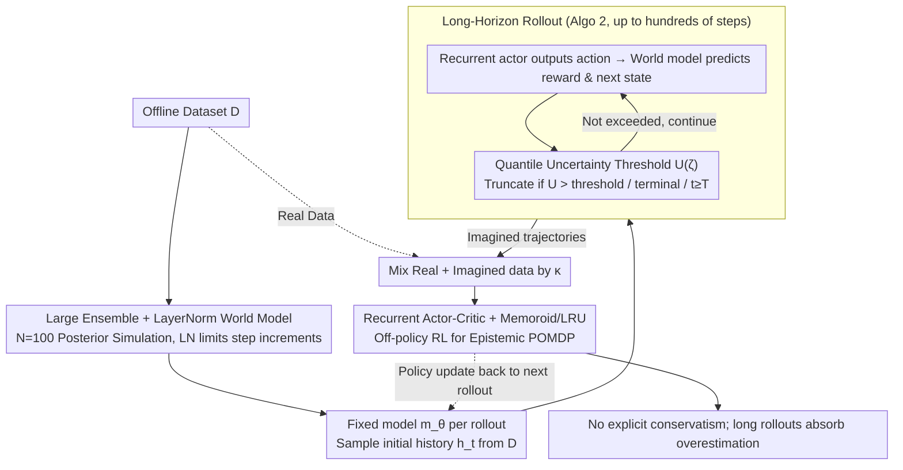

# Long-Horizon Model-Based Offline Reinforcement Learning Without Explicit Conservatism

**Conference**: ICML 2026  
**arXiv**: [2512.04341](https://arxiv.org/abs/2512.04341)  
**Code**: https://github.com/twni2016/neubay (Available)  
**Area**: Offline Reinforcement Learning / Model-Based RL / Bayesian RL  
**Keywords**: offline RL, model-based RL, Bayesian RL, long-horizon rollout, epistemic POMDP

## TL;DR
This paper challenges the mainstream consensus that "offline RL must be explicitly conservative." It proposes Neubay: viewing model ensembles from a Bayesian posterior perspective, utilizing **long-horizon rollouts (hundreds of steps)** to naturally absorb value overestimation, and controlling compounding errors with layer normalization and uncertainty thresholds. It matches SOTA conservative algorithms across 33 D4RL/NeoRL datasets without pessimistic penalties and sets new records on 7 datasets.

## Background & Motivation

**Background**: Mainstream offline RL (CQL, IQL, EDAC, ReBRAC, MOPO, COMBO, MOBILE, etc.) is built on the "explicit conservatism" principle—penalizing state-action pairs outside the dataset while performing only 1–5 step short-horizon rollouts in model-based methods to suppress both overestimation and compounding error. Theoretically, this corresponds to a robust MDP $\max_\pi\min_{m\in\mathfrak{M}_\mathcal{D}}J(\pi,m)$.

**Limitations of Prior Work**: The conservative principle reduces overestimation but suppresses average-case performance, particularly on low-quality datasets. When the behavior policy is poor, conservative training strictly adheres to sub-optimal actions and fails to explore better unseen actions during testing. Although the Bayesian perspective (epistemic POMDP) by Ghosh et al. theoretically allows for test-time adaptation, practical algorithms (APE-V, MAPLE, CBOP, MoDAP) have reintroduced uncertainty penalties and short horizons for stability, diluting the Bayesian spirit back into a conservative route.

**Key Challenge**: The Bayesian objective $\max_\pi \mathbb{E}_{m\sim \mathbb{P}_\mathcal{D}}[J(\pi, m)]$ theoretically requires complete rollouts on the posterior. However, in practice, compounding error and value overestimation become uncontrollable once explicit conservatism is discarded, causing the Bayesian approach to be "theoretically appealing but practically underperforming."

**Goal**: (1) Empirically prove that a pure Bayesian approach (without any uncertainty penalty) can work on mainstream offline RL tasks; (2) Identify critical bottlenecks and design corresponding mechanisms; (3) Provide clear boundaries for when to use Bayesian vs. conservative methods.

**Key Insight**: The authors use a two-armed bandit extreme example to clarify—conservatism on skewed data is **destined** to stay with observed sub-optimal arms, while Bayesian methods can adapt at test time. From this, they propose a counter-intuitive observation: **long-horizon rollouts themselves can replace explicit conservatism to suppress overestimation**, as the $H$-step TD target $\sum_{j=0}^{H-1}\gamma^j \hat{r}_{t+j+1} + \gamma^H Q(\hat{h}_{t+H}, \pi(\hat{h}_{t+H}))$ exponentially decays the highly overestimated bootstrap term by $\gamma^H$.

**Core Idea**: Abandon explicit conservatism and adhere to the Bayesian spirit—randomly sample one model from the posterior (fixed for each rollout), determine truncation points using adaptive uncertainty thresholds, restrict compounding error with layer normalization, and handle partial observability of the epistemic POMDP using recurrent actor-critic for long rollouts spanning hundreds of steps.

## Method

### Overall Architecture
The training loop of Neubay (Algo. 1) is closely following MBPO: (a) Train a 100-model ensemble $\mathbf{m}_{\boldsymbol{\theta}}$ on $\mathcal{D}$; (b) For each iteration, sample a starting point $h_t = s_{0:t}$ from $\mathcal{D}$, draw a fixed model $m_\theta$ from the ensemble (Note: this model is fixed for the entire rollout, not resampled at each step), and execute the Rollout in Algo. 2 until (i) a terminal state is reached, (ii) the uncertainty $U_{\boldsymbol{\theta}}(\hat s_t, \hat a_t) > \mathcal{U}(\zeta)$ triggers truncation, or (iii) the episode limit $T$ (up to 1000) is reached; (c) Mix real and imagined data with ratio $\kappa$ to train a recurrent actor $\pi_\nu(a_t|h_t)$ and critic $Q_\omega(h_t, a_t)$ with independent LRU encoders. The pipeline follows the sequence of "stabilizing the world model with a large ensemble + LayerNorm → controlling long rollout termination with quantile thresholds → learning policies from long trajectories via recurrent actor-critic."

### Key Designs

**1. Large Ensemble ($N{=}100$) + LayerNorm in World Model: Making Long Rollouts Feasible**

Executing rollouts of hundreds of steps requires both posterior fidelity and the prevention of compounding error explosion. Neubay formulates the world model as delta prediction: $\mathbb{E}[\hat s'] = s + \mathbf{W}^\top \mathrm{ReLU}(\mathrm{LN}(\psi(s, a)))$. Since LN without affine parameters satisfies the identity $\|\mathrm{LN}(x)\| = \sqrt{k}$, the single-step increment is strictly bounded: $\|\mathbb{E}[\hat s'] - s\| \leq \sqrt{k}\|\mathbf{W}\|$. After $H$ steps, $\|\mathbb{E}[\hat s_H] - s_0\| \leq H\sqrt{k}\|\mathbf{W}\|$, representing linear rather than exponential growth—compounding error is constrained by geometric boundaries. Simultaneously, the ensemble is increased from the MBPO default of 5 to 100; while the posterior is less critical for short rollouts, accuracy is vital for 64–512 steps. The LN technique is adapted from Ball et al., who used it in model-free RL to suppress Q-network extrapolation error.

**2. Quantile Uncertainty Threshold $\mathcal{U}(\zeta)$: Adaptive Switching for Rollout Termination**

With a stable world model, the core question becomes rollout length—maximizing the trusted region to absorb overestimation while truncating untrusted regions. Neubay calculates the distribution of ensemble disagreement $U_{\boldsymbol{\theta}}(s, a) = \mathrm{std}(\{\mu_{\theta^n}(s, a)\}_{n=1}^N)$ on all $(s, a)$ in the dataset and uses the $\zeta$-th quantile as the threshold $\mathcal{U}(\zeta) := F_Y^{-1}(\zeta)$. Rollouts are truncated as soon as $U_{\boldsymbol{\theta}}(\hat s_t, \hat a_t)$ exceeds this threshold, without applying any penalties. The paper uses $\zeta = 1.0$ (maximum dataset uncertainty) to encourage long rollouts. Unlike prior works that pair uncertainty thresholds with a fixed short horizon cap, this paper finds that removing explicit conservatism makes the bootstrap term dominant in short horizons, necessitating the removal of the fixed cap to let the threshold dictate length. Quantile thresholds are also more robust across datasets with varying uncertainty scales (Fig. 4).

**3. Recurrent Actor-Critic + Memoroid (LRU): Handling Epistemic POMDPs from Bayesian Objectives**

A Bayesian objective naturally transforms the environment into a POMDP—the agent does not know which model from the ensemble was sampled and must infer it from history. Neubay equips the actor and critic with independent RNN encoders ($\nu_\phi(h_t)$, $\omega_\phi(h_t)$), using Memoroid + LRU (Linear Recurrent Unit) to support efficient memory over 1000 steps. A key detail is that the RNN encoder learning rate $\eta_\phi$ is significantly smaller than the MLP heads (searched from $3\text{e-}7$ to $1\text{e-}4$), as representation becomes extremely sensitive to parameters under long histories. Unlike CBOP/APE-V which used short-context GRUs or reverted to model-free approaches, Neubay introduces Memoroid + LRU, proven in online POMDPs to handle thousand-step histories. A mixing ratio $\kappa \in (0, 1)$ is also used to balance real and imagined data.

### Loss & Training
The RL loss follows a standard TD3+BC style recurrent off-policy actor-critic (details in Appendix E). The world model ensemble is trained via MLE until convergence and then frozen. Key hyperparameters: $\zeta$ (truncation threshold, default $1.0$), $\kappa$ (real data ratio, searched $[0.05, 0.95]$), $\eta_\phi$ (RNN learning rate, searched $[3\text{e-}7, 1\text{e-}4]$), $N=100$ (ensemble size). Each rollout uses one fixed model $m_\theta \sim \mathbf{m}_{\boldsymbol{\theta}}$ (**not** randomized per step) to strictly comply with the Bayesian objective $\mathbb{E}_{m \sim \mathbb{P}_\mathcal{D}}[J(\pi, m)]$.

## Key Experimental Results

### Main Results
D4RL locomotion (representative results, higher is better):

| Dataset | CQL | MOBILE | ReBRAC | CBOP (Bayesian) | **Neubay** |
|---|---|---|---|---|---|
| hp-random | 5.3 | 31.9 | — | 31.4 | 24.5 |
| wk-random | 5.4 | 17.9 | — | — | — |
| hc-random | 31.3 | 39.3 | 45.4 | 32.8 | 37.0 |

Overall, across 33 datasets (D4RL locomotion 12 + Adroit 6 + AntMaze 6 + NeoRL 9):

| Category | Performance |
|---|---|
| Compared to Best Conservative (MOBILE/RAMBO/ARMOR/ReBRAC) | On par |
| Compared to Existing Bayesian (APE-V/MAPLE/CBOP/MoDAP) | Significantly outperforms |
| New SOTA | 7 datasets |
| Advantage Region | Low-quality + medium-quality + medium-coverage datasets |

### Ablation Study

| Configuration | Performance | Description |
|---|---|---|
| Full Neubay ($\zeta{=}1.0$, $H$ up to 64–512) | Optimal | Median horizon reaches 64-512 steps |
| Short-horizon variant ($\zeta{=}0.9$) | Severely fails | Bootstrap term dominates; Q-values surge (Fig. 1 center) |
| $\zeta=0.99/0.999$ | Intermediate | Performance and Q-estimates fall in between |
| Remove LayerNorm | Compounding error explosion | Long rollouts become unfeasible |
| Ensemble $N{=}5$ vs $N{=}100$ | Small ensemble posterior distortion | Errors magnified under long rollouts |

### Key Findings
- **Long horizons actively suppress overestimation**: Figure 1 (center) shows that larger $\zeta$ allows for longer rollouts, which leads to lower Q-estimates and better performance—completely reversing the "model-based RL must use short horizons" dogma.
- **When Bayesian outperforms conservative**: In low-quality datasets (e.g., random) and scenarios with scarce optimal actions, Bayesian methods can adapt at test time; the gap narrows in high-quality data.
- **Fixing one model per rollout is critical**: Resampling models at each step (MBPO style) breaks posterior semantics. Neubay must maintain model consistency to meet the Bayesian expectation objective.
- Ablation shows that LN + Large Ensemble + Long Horizon are **all essential**; removing any one makes the long-horizon path untenable.

## Highlights & Insights
- **The observation that "long horizons self-absorb overestimation" is counter-intuitive but profound**: Decomposing the H-step TD target into $\sum \gamma^j \hat r$ (low bias) + $\gamma^H Q$ (high bias but exponentially decayed) reveals that $H$ is not just an error accumulator but also a leverage for bias decay. This suggests the MBRL community's reliance on $H=1-5$ as a "safety zone" may be a collective misconception.
- **Converting uncertainty from "penalty" to "switch"**: The same ensemble disagreement used as a reward penalty in conservative routes is used here as a binary switch for rollout continuation—a transferable design philosophy.
- **LayerNorm shrinks the single-step geometric boundary to a constant $\sqrt{k}\|W\|$**: This approach to Lipschitz control is applicable to any rollout-heavy world model work.
- **Quantile uncertainty thresholds** $\mathcal{U}(\zeta) := F_Y^{-1}(\zeta)$: This makes thresholds automatically comparable across different data scales, proving much more robust than absolute thresholds.

## Limitations & Future Work
- The algorithm requires searching for $\eta_\phi$ and $\kappa$, maintaining similar tuning costs to mainstream conservative MBRL (MOPO, MOBILE).
- Running an $N{=}100$ ensemble + hundreds of rollout steps + thousand-step RNN context results in significantly higher wall-clock time compared to model-free algorithms.
- The advantage region is "low-quality + medium coverage"; for high-quality, low-coverage expert data, the Bayesian advantage is less pronounced or slightly inferior to conservative algorithms.
- Current Bayesian posteriors are approximated via deep ensembles; more refined posteriors (e.g., SWAG, HMC) could improve fidelity in low-data regimes.

## Related Work & Insights
- **vs. MOBILE / RAMBO / COMBO (Conservative MBRL)**: These rely on uncertainty penalties + short horizons. Neubay discards penalties and uses long horizons to absorb bias, outperforming them on 7 datasets and structurally excelling in low-quality data.
- **vs. APE-V / MAPLE / CBOP / MoDAP (Previous Bayesian attempts)**: These often reintroduced conservatism for stability; Neubay is the first to prove a pure Bayesian approach is viable on mainstream benchmarks.
- **vs. MBPO**: While Neubay follows the MBPO template, it reverses the key settings ($H=1-5$ vs long, $N=5$ vs $N=100$, stochastic vs fixed model), showing this reversal is the "correct way" for offline scenarios.
- **Insight**: This work provides a new perspective for all "MBRL + overestimation" problems—instead of immediately adding penalties or shortening horizons, consider if the model rollout structure can absorb the bias itself.

## Rating
- Novelty: ⭐⭐⭐⭐⭐ The claim that long horizons suppress overestimation disrupts mainstream knowledge; the bandit insight is elegant.
- Experimental Thoroughness: ⭐⭐⭐⭐⭐ 33 datasets across 4 benchmarks + 4 ablation dimensions.
- Writing Quality: ⭐⭐⭐⭐ Clear conceptual flow (bandit → challenges → design), although term density (POMDP/BAMDP/robust MDP) is high.
- Value: ⭐⭐⭐⭐ Opens a viable "non-conservative" path for the offline RL community, potentially leading to next-gen MBRL algorithms.

<!-- RELATED:START -->

## Related Papers

- [\[ICML 2026\] Offline Reinforcement Learning with Universal Horizon Models](offline_reinforcement_learning_with_universal_horizon_models.md)
- [\[ACL 2026\] A Goal Without a Plan Is Just a Wish: Efficient and Effective Global Planner Training for Long-Horizon Agent Tasks (EAGLET)](../../ACL2026/reinforcement_learning/a_goal_without_a_plan_is_just_a_wish_efficient_and_effective_global_planner_trai.md)
- [\[ICML 2026\] InftyThink+: Effective and Efficient Infinite-Horizon Reasoning via Reinforcement Learning](inftythink_effective_and_efficient_infinite-horizon_reasoning_via_reinforcement_.md)
- [\[ICLR 2026\] Strict Subgoal Execution: Reliable Long-Horizon Planning in Hierarchical Reinforcement Learning](../../ICLR2026/reinforcement_learning/strict_subgoal_execution_reliable_long-horizon_planning_in_hierarchical_reinforc.md)
- [\[NeurIPS 2025\] Reinforcement Learning for Long-Horizon Multi-Turn Search Agents](../../NeurIPS2025/reinforcement_learning/reinforcement_learning_for_long-horizon_multi-turn_search_agents.md)

<!-- RELATED:END -->
