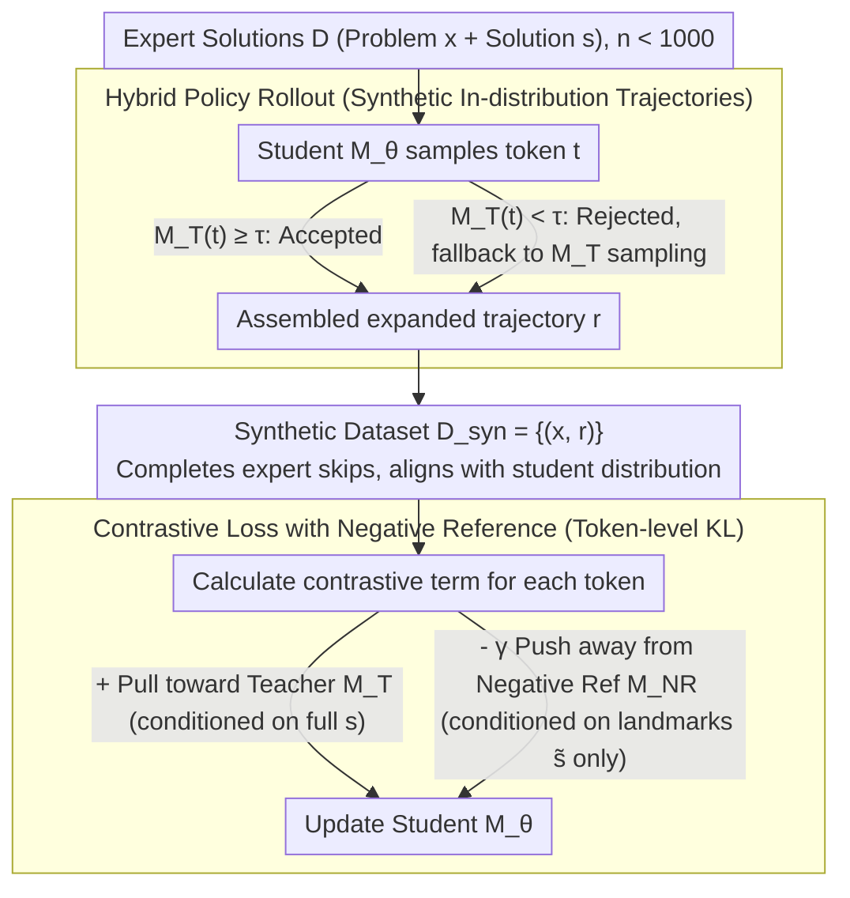

# Making Expert Reasoning Learnable with Self-Distillation

**Conference**: ICML 2026  
**arXiv**: [2602.02405](https://arxiv.org/abs/2602.02405)  
**Code**: https://github.com/ethanm88/DAIL  
**Area**: LLM Reasoning  
**Keywords**: Expert trajectories, self-distillation, contrastive learning, distribution alignment, mathematical reasoning

## TL;DR
DAIL utilizes a hybrid strategy rollout where "Teacher = self with expert solution + Student = self without expert solution" to rewrite fewer than 1000 expert trajectories into reasoning chains consistent with the student’s policy distribution. It then employs a contrastive loss to penalize "shortcut tokens" that have high probability in a negative reference model which only sees intermediate results. This approach achieves up to a 31% improvement in pass@128 on Qwen2.5-Instruct / Qwen3 while reducing the required reasoning tokens by half.

## Background & Motivation

**Background**: Currently, two mainstream paths for enhancing LLM reasoning are Reinforcement Learning from Verifiable Rewards (RLVR, e.g., GRPO) and distilling long CoT from stronger teacher models. Both assume that training signals are "readily available"—either because the model can sample the correct answer itself or because a significantly stronger teacher exists.

**Limitations of Prior Work**: On hard problems at the AIME/IMO level, frontier models often fail all 32 samples, leaving RLVR with zero rewards, advantages, or gradients. Conversely, solutions written by actual expert teachers (human Olympiad contestants) are intended for human readers, often skipping steps or omitting derivation details. Directly applying SFT to such data can disrupt the reasoning processes learned during the model's post-training.

**Key Challenge**: Two types of misalignment exist between the expert solution distribution $p_{\text{expert}}$ and the student policy distribution $p_\theta$: (1) **didactic shortcuts**, where experts omit intermediate steps necessary for the student; and (2) **rationalization shortcuts**, where the model, if forced to "complete" these steps, peeks at the answer and forces the derivation toward the known result rather than truly deriving it. Standard NLL treats all tokens equally, internalizing both types of shortcuts.

**Goal**: To transform every expert solution into a generalizable reasoning training signal under conditions where expert solutions are extremely scarce ($n < 1000$) and problems may be unverifiable (open-ended proof problems).

**Key Insight**: The authors decompose the problem into two stages: **distribution-aligned data synthesis** (transforming OOD expert solutions into in-distribution expanded trajectories) and a **shortcut-sensitive objective** (specifically penalizing tokens that exhibit high probability only when peeking at the answer).

**Core Idea**: Use "self-distillation" $M_T = M_{\theta_{\text{ref}}}(\cdot | x, s)$ as the teacher (the same model conditioned on the expert solution $s$), allowing it to collaborate with the student $M_\theta(\cdot | x)$ via a "speculative-decoding-style" hybrid policy rollout to generate trajectories. Then, construct a **negative reference model** $M_{NR}$ conditioned only on key nodes of the expert solution $\tilde s$, and train the student using the contrastive loss $\mathrm{KL}(M_\theta \| M_T) - \gamma \mathrm{KL}(M_\theta \| M_{NR})$.

## Method

### Overall Architecture
DAIL is a two-stage offline training method that takes $n < 1000$ expert (problem, solution) pairs $\mathcal{D} = \{(x_i, s_i)\}$ and outputs an updated student model $M_\theta$. The pipeline consists of: (1) **In-distribution trajectory synthesis**—using frozen initial weights $\theta_{\text{ref}}$ to instantiate both the "Teacher" (observing $s$) and the "Student" (not observing $s$), generating expanded trajectories $r_i$ via hybrid strategy decoding to obtain a synthetic dataset $\mathcal{D}_{\text{syn}} = \{(x_i, r_i)\}$; (2) **Contrastive fine-tuning**—training $M_\theta$ on $\mathcal{D}_{\text{syn}}$ using a contrastive loss that pulls the student toward the full-solution teacher while pushing it away from the landmark-only negative reference. The process is fully offline, and since the teacher, student, and negative reference share base weights, only one set of model weights is stored using LoRA adapters.

> The three roles $M_\theta$ / $M_T$ / $M_{NR}$ share the same frozen base and switch via LoRA toggles (see Key Design 3), ensuring VRAM usage is approximately equal to single-model inference.

### Key Designs

**1. Hybrid policy rollout: Rewriting expert solutions into "in-distribution but anchored" trajectories**

Directly using expert solutions for SFT causes two issues: a teacher who sees the answer might copy skips directly, while a student generating independently might diverge. DAIL uses a speculative-decoding-style hybrid sampling: for token $i$, a token $t$ is sampled from the student $t \sim M_\theta(\cdot | x, r_{<i})$. The teacher then performs an "accept/reject" step: if $M_T(t | r_{<i}) \geq \tau$, $r_i := t$ is accepted; otherwise, it falls back to teacher sampling $r_i \sim M_T(\cdot | r_{<i})$. The goal is opposite to standard speculative decoding—allow the student to "speak" as much as possible, intervening only when it deviates significantly from the expert path. This is crucial for long CoT models (e.g., Qwen3-think) where direct teacher sampling often triggers "meta-comments" about referencing expert solutions, whereas hybrid rollout maintains the student's native self-verification rhythm while being lightly anchored.

**2. Contrastive loss with negative reference: Penalizing "peeking" shortcut tokens**

After completing expert solutions into full trajectories, the student must be prevented from memorizing rationalization shortcuts—tokens that are highly probable only when the answer is known but not truly derived. DAIL constructs a negative reference $M_{NR}(\cdot) = M_{\theta_{\text{ref}}}(\cdot | x, \tilde s)$, where $\tilde s$ represents "coarse answer landmarks" (numerical or symbolic results) extracted via regex from $s$. A model conditioned only on landmarks tends to skip reasoning and "force-fit" the path between landmarks. The loss is:

$$L(\theta) = \mathbb{E}_{(x,r) \sim \mathcal{D}_{\text{syn}}} \sum_{t=1}^{|r|} \left[ \mathrm{KL}(M_\theta(\cdot|x, r_{<t}) \| M_T(\cdot | r_{<t})) - \gamma\, \mathrm{KL}(M_\theta(\cdot|x, r_{<t}) \| M_{NR}(\cdot | r_{<t})) \right],$$

effectively pulling towards the full-knowledge teacher and pushing away from the landmark-only reference. Token-level KL contrast allows precise punishment where the two conditional distributions diverge.

**3. Efficiency-friendly framework: Offline decoupling + LoRA toggles**

RLVR on hard problems can require 1k GPU hours due to the bottleneck of simultaneous sampling and training. DAIL decouples these into "offline synthesis of $\mathcal{D}_{\text{syn}}$" and "offline training." Data synthesis can be massively parallelized and cached. Since $\theta_{\text{ref}}$, $M_T$, and $M_{NR}$ share base parameters and only the student requires a LoRA adapter, all three forward passes happen on a single set of frozen weights, making it feasible to iterate on 14B models even on small clusters.

### Loss & Training
The formal loss is the contrastive KL provided above, with $\gamma$ as a critical hyperparameter for the negative term. The construction of $\tilde s$ uses a fixed regex for mathematical scenarios (retaining $\boxed{}$ and right-hand sides of key equations) without additional annotation. Training data: `e1-verifiable` (417 AIME problems from 1985–2023 that the base model fails to solve in 32 samples) for Qwen2.5-7B-Instruct; and `e1-proof` (669 IMO-level open-ended proof problems) for Qwen3-8B/14B, demonstrating DAIL’s capability on **unverifiable** problems where RLVR struggles.

## Key Experimental Results

### Main Results

Mathematical reasoning pass@k (Aggregated across AIME 2024/25, BeyondAIME, and IMO-AnswerBench; Qwen2.5-7B-Instruct trained on `e1-verifiable`):

| Method | Training Type | pass@128 (vs Base) | Notes |
| :--- | :--- | :--- | :--- |
| Qwen2.5-7B-Instruct (Base) | — | Baseline | Post-trained Instruct model |
| GRPO (on `e1-verifiable`) | RLVR | **Decrease** | Sparse rewards on hard problems; overfits to random correct rollouts |
| NuRL + GRPO | RLVR + hint | Lower than GRPO | Dependency on hints during training; drops during inference |
| GRPO (DeepScaleR, 40K) | Large-scale RLVR | slight pass@1 increase; pass@k drops | Scale alone is insufficient for Olympiad-level problems |
| Direct SFT on Experts | Behavior Cloning | Decrease | OOD data causes breakdown |
| STaR rationalization | Self-synthesis | Decrease | Model lacks capability to self-generate valid chains |
| **DAIL (Ours)** | Self-distill + Contrast | **Up to +31% pass@128** | Only method with stable improvement |

Efficiency during inference (Qwen3-8B/14B on `e1-proof`): Across token budgets from 512 to 4096, DAIL consistently outperforms the base Qwen3 and matches its peak performance using **2× fewer tokens**, indicating that expert trajectory information density translates directly into reasoning efficiency.

OOD Generalization (GPQA-Diamond, Graduate-level Sci): Across 8 settings (pass@1/pass@128 for Qwen2.5 & Qwen3), DAIL maintains or improves performance (e.g., Qwen3 pass@128 improves by ~3 points consistently), showing no catastrophic forgetting.

### Ablation Study

| Configuration | Phenomenon | Explanation |
| :--- | :--- | :--- |
| Full DAIL (contrastive + mixed) | Main Result | Training set pass@k is **lower** than NLL, but OOD test performance is highest |
| Replace with NLL loss | pass@1 / pass@128 drop | Student learns rationalization shortcuts without negative reference |
| Direct vs Mixed (Qwen3-think) | Mixed is significantly better | Direct sampling introduces meta-comments in reasoning LRM |
| Direct vs Mixed (Qwen2.5-Inst) | Direct is slightly better | Prompting is sufficient to control shortcuts in non-reflective models |

### Key Findings
*   Contrastive loss gains are most evident in pass@1: Improving by ~15–20% on direct sampling data where shortcuts are more prevalent.
*   The "inverse generalization gap" (lower training score, higher test score) serves as direct evidence that the contrastive objective successfully suppresses non-robust reasoning patterns.
*   RLVR failure on hard problems is rooted in **overfitting** to rare stochastic successes rather than a total lack of reward.
*   DAIL scales positively across both parameter count (8B to 14B) and token budgets (512 to 4096).

## Highlights & Insights
*   **"Teacher = Self + Answer" positioning**: Unlike traditional distillation requiring stronger external models, DAIL uses "self with answer" as the teacher, bypassing the scarcity of stronger models for hard problems.
*   **Landmark-based negative reference**: A "bad model" is generated without extra training by conditioning the frozen base on **incomplete information** (landmarks only), creating a control distribution biased toward shortcuts.
*   **Training on unverifiable proofs**: The `e1-proof` dataset and methodology enable post-training on problems without executable verifiers, serving as a vital supplement to the RLVR paradigm.
*   **Counter-intuitive training performance**: Lower training set fit is a natural byproduct of a loss function that punishes shortcut imitation, acting as a robust form of regularization.

## Limitations & Future Work
*   Reliance on regex for $\tilde s$ extraction is currently specific to the "box + intermediate equations" format of math problems; other domains require new extraction rules.
*   Evaluation is centered on Mathematics and Science; other tasks like coding, planning, or formal theorem proving (Lean) remain unverified.
*   The stable intervals for hyperparameters $\gamma$ and $\tau$ are not systematically explored, increasing the potential cost of tuning for reproduction.
*   Expert data remains at the scale of hundreds; the tension between contrastive and positive terms at larger scales (10k+) remains an open question.

## Related Work & Insights
*   **vs On-policy distillation (Agarwal et al., 2024)**: DAIL removes the need for two separate models and a stronger teacher by using "self+answer" and handles teacher hallucinations via contrastive terms.
*   **vs RLVR/GRPO (Shao et al., 2024)**: DAIL breaks the requirement for verifiability and the need for the model to sample the correct answer itself.
*   **vs STaR (Zelikman et al., 2022)**: While STaR relies on the model's own ability to rationalize, DAIL uses expert-anchored hybrid rollouts to prevent hallucinated reasoning paths.
*   **Methodological Inspiration**: The DAIL template is applicable to any scenario where expert trajectories are scarce, direct imitation fails, and answers can be structurally extracted—such as surgery robot demonstrations, SQL query logs, or penetration testing write-ups.

## Rating
*   Novelty: ⭐⭐⭐⭐⭐ Seamlessly integrates self-distillation, speculative rollout, and contrastive RL; first to show effective post-training on non-verifiable Olympiad proofs.
*   Experimental Thoroughness: ⭐⭐⭐⭐ Extensive benchmarks and baselines, though lacks multi-domain (coding/planning) verification.
*   Writing Quality: ⭐⭐⭐⭐⭐ Clear progression of motivation and elegant definition of shortcut types.
*   Value: ⭐⭐⭐⭐⭐ Provides a new paradigm for hard-problem post-training with small data and offline efficiency.

<!-- RELATED:START -->

## Related Papers

- [\[ICML 2026\] EAPO: Enhancing Policy Optimization with On-Demand Expert Assistance](eapo_enhancing_policy_optimization_with_on-demand_expert_assistance.md)
- [\[ICML 2025\] The Challenge of Teaching Reasoning to LLMs Without RL or Distillation](../../ICML2025/reinforcement_learning/the_challenge_of_teaching_reasoning_to_llms_without_rl_or_distillation.md)
- [\[ICML 2026\] Metis: Learning to Jailbreak LLMs via Self-Evolving Metacognitive Policy Optimization](metis_learning_to_jailbreak_llms_via_self-evolving_metacognitive_policy_optimiza.md)
- [\[ICML 2026\] D$^2$Evo: Dual Difficulty-Aware Self-Evolution for Data-Efficient Reinforcement Learning](d2evo_dual_difficulty-aware_self-evolution_for_data-efficient_reinforcement_lear.md)
- [\[ICML 2026\] ORLoopBench: Solver-in-the-Loop Benchmarks for Self-Correction and Behavioral Rationality in Operations Research](orloopbench_solver-in-the-loop_benchmarks_for_self-correction_and_behavioral_rat.md)

<!-- RELATED:END -->
