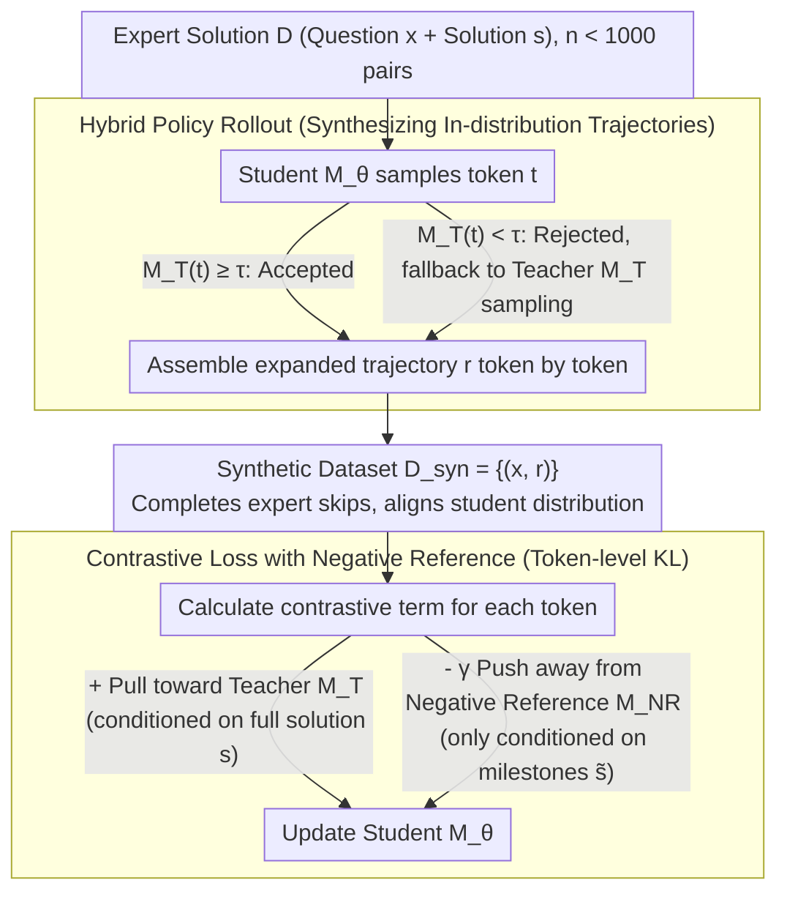

# Making Expert Reasoning Learnable with Self-Distillation

**Conference**: ICML 2026  
**arXiv**: [2602.02405](https://arxiv.org/abs/2602.02405)  
**Code**: https://github.com/ethanm88/DAIL  
**Area**: LLM Reasoning  
**Keywords**: Expert Trajectories, Self-distillation, Contrastive Learning, Distribution Alignment, Mathematical Reasoning

## TL;DR
DAIL utilizes a hybrid strategy rollout where "Teacher = itself with the expert solution + Student = itself without the expert solution" to rewrite fewer than 1,000 expert trajectories into reasoning chains aligned with the student's policy distribution. It then employs a contrastive loss to suppress high-probability shortcut tokens from a "negative reference model that only sees intermediate answers," achieving up to a 31% improvement in pass@128 on Qwen2.5-Instruct / Qwen3 while reducing the required reasoning tokens by half.

## Background & Motivation

**Background**: Currently, two mainstream approaches to enhance LLM reasoning are Reinforcement Learning with Verifiable Rewards (RLVR, such as GRPO) and distilling long CoT from stronger teacher models. Both assume that training signals are "readily available"—either the model can sample the correct answer itself, or a superior teacher exists.

**Limitations of Prior Work**: On hard problems at the AIME / IMO level, frontier models may fail all 32 sampling attempts, resulting in zero rewards, advantages, or gradients for RLVR. Furthermore, solutions written by superior teachers (human math Olympians) are intended for human readers, often skipping steps or omitting derivation details. Directly applying SFT to these typically breaks the reasoning processes learned during the model's post-training.

**Key Challenge**: There are two types of misalignment between the expert trajectory distribution $p_{\text{expert}}$ and the student policy distribution $p_\theta$: (1) **didactic shortcuts**, where experts skip steps necessary for students; and (2) **rationalization shortcuts**, where the model "peeks" at the answer and forcibly bends the derivation toward the known result rather than truly deriving it. Standard NLL treats all tokens equally, internalizing both types of shortcuts.

**Goal**: To transform each individual expert solution into maximum generalizable reasoning signals under conditions where expert solutions are extremely scarce ($n < 1000$) and problems may be unverifiable (open-ended proofs).

**Key Insight**: The authors decompose the problem into two stages: first, **distribution-aligned data synthesis** (transforming OOD expert solutions into in-distribution expanded trajectories), and second, a **shortcut-sensitive objective function** (specifically penalizing tokens that are highly probable only when peeking at the answer).

**Core Idea**: Use "self-distillation" $M_T = M_{\theta_{\text{ref}}}(\cdot | x, s)$ as the teacher (the same model, but conditioned on the expert solution $s$). This teacher and the student $M_\theta(\cdot | x)$ cooperatively generate trajectories via a "speculative-decoding-style" hybrid strategy rollout. A **negative reference model** $M_{NR}$ is then constructed, conditioned only on key nodes $\tilde s$ of the expert solution, to train the student using the contrastive loss $\mathrm{KL}(M_\theta \| M_T) - \gamma \mathrm{KL}(M_\theta \| M_{NR})$.

## Method

### Overall Architecture
DAIL is a two-stage offline training method. The input consists of $n < 1000$ expert (problem, solution) pairs $\mathcal{D} = \{(x_i, s_i)\}$, and the output is the updated student model $M_\theta$. The pipeline consists of: (1) **In-distribution trajectory synthesis**: Utilizing frozen initial weights $\theta_{\text{ref}}$ to instantiate both the "teacher" (with expert solution) and the "student" (without expert solution). They generate expanded reasoning trajectories $r_i$ through hybrid policy decoding, resulting in a synthetic dataset $\mathcal{D}_{\text{syn}} = \{(x_i, r_i)\}$. (2) **Contrastive fine-tuning**: Training $M_\theta$ on $\mathcal{D}_{\text{syn}}$ using a contrastive loss. The positive term pulls the student toward the teacher (who sees the full solution), while the negative term pushes it away from the negative reference (who only sees answer milestones). The entire training is offline, and since the teacher, student, and negative reference share the same base weights, only one copy of model weights is needed by using LoRA adapters.

> The three roles $M_\theta$, $M_T$, and $M_{NR}$ share the same frozen base and switch via LoRA toggles (as per Design 3). Consequently, the VRAM usage for the entire process is approximately equal to single-model inference.

### Key Designs

**1. Hybrid policy rollout: Rewriting expert solutions into trajectories within the student's distribution but anchored to the expert path.**

Directly using expert solutions for SFT causes two issues: the teacher who has seen the answer tends to copy it, introducing step-skipping; meanwhile, letting the student generate independently leads to deviations. DAIL employs a speculative-decoding-style hybrid sampling: when generating the $i$-th token, a token $t$ is first sampled from the student $t \sim M_\theta(\cdot | x, r_{<i})$. Then the teacher provides an "accept/reject" vote: if $M_T(t | r_{<i}) \geq \tau$, $r_i := t$ is accepted; otherwise, it falls back to teacher sampling $r_i \sim M_T(\cdot | r_{<i})$. The goal is the opposite of speculative decoding or DAgger: let the student speak as much as possible, intervening only when it significantly deviates from the expert path. This is crucial for long CoT reasoning models (like Qwen3-think); direct teacher sampling frequently triggers meta-comments like "referring to the expert solution," disrupting the natural self-verification flow. Hybrid rollout preserves the student's native rhythm of backtracking and self-correction while being lightly anchored by the expert solution to avoid distribution drift. For non-reflective models (like Qwen2.5-Instruct), direct sampling with prompt engineering is sufficient, so this component is primarily designed for LRMs.

**2. Contrastive loss with negative reference: Specifically suppressing shortcut tokens that are probable only when peeking at the answer.**

After completing the expert solution into a full trajectory, it is necessary to prevent the student from memorizing rationalization shortcuts—tokens that are highly probable given the answer but not actually derived. DAIL constructs a negative reference $M_{NR}(\cdot) = M_{\theta_{\text{ref}}}(\cdot | x, \tilde s)$, where $\tilde s$ represents "coarse-grained answer milestones" automatically extracted from $s$ via regex (e.g., intermediate numerical or symbolic results in mathematics). A model conditioned only on milestones naturally tends to skip step-by-step derivations and force connections between milestones. The loss is formulated as:

$$L(\theta) = \mathbb{E}_{(x,r) \sim \mathcal{D}_{\text{syn}}} \sum_{t=1}^{|r|} \left[ \mathrm{KL}(M_\theta(\cdot|x, r_{<t}) \| M_T(\cdot | r_{<t})) - \gamma\, \mathrm{KL}(M_\theta(\cdot|x, r_{<t}) \| M_{NR}(\cdot | r_{<t})) \right],$$

which essentially "pulls toward the teacher who saw the full solution + pushes away from the negative reference who only saw the milestones." While maximizing the negative term is theoretically unbounded, the student is initialized from $\theta_{\text{ref}}$ and strongly anchored by the positive term, making training stable in practice. Consistent with the issues of BC on sub-optimal data identified by Kumar et al. (2022), standard NLL cannot distinguish between "valid reasoning" and "spurious shortcuts," whereas token-level KL contrast allows precise penalties at the exact positions where the two conditional distributions diverge.

**3. Efficiency-friendly training framework: Offline decoupling + LoRA toggles on a single weight.**

RLVR takes approximately 1k GPU hours to converge on hard problems, with the bottleneck being simultaneous sampling and training. DAIL decouples "generation + optimization" into "first offline synthesis of $\mathcal{D}_{\text{syn}}$, then purely offline training." The data synthesis stage can be scaled across distributed clusters and is completely separated from the GPU optimization stage; the data is also reusable and cacheable. Furthermore, $\theta_{\text{ref}}$, $M_T$, and $M_{NR}$ share base parameters, with only the student utilizing a LoRA adapter (Hu et al., 2022). Thus, all three forward passes use the same set of frozen weights, simply toggling the LoRA switch as needed. The VRAM footprint is basically equal to single-model inference. By layering LoRA, 14B models can be run on small clusters, making rapid iteration for each new difficult dataset feasible.

### Loss & Training
The formal loss is the contrastive KL provided in the previous section. $\gamma$ is a critical hyperparameter for the negative term weight (see original paper Appendix C.8 for ablation). The construction of $\tilde s$ uses a fixed regex for mathematical scenarios (retaining $\boxed{}$, rights sides of key equations, etc.) without requiring additional annotation. Training data: For Qwen2.5-7B-Instruct, `e1-verifiable` was used (417 AIME problems from 1985–2023 that the base model fails even with 32 samples). For Qwen3-8B/14B (think), the authors' newly released `e1-proof` (669 IMO-level open-ended proof problems authorized by USA IMO coach Evan Chen) was used to demonstrate that DAIL can train on **unverifiable** proof problems—something RLVR cannot do without a generative reward model.

## Key Experimental Results

### Main Results

Mathematical reasoning pass@k (aggregated across AIME 2024/25, BeyondAIME, and IMO-AnswerBench; Qwen2.5-7B-Instruct trained on `e1-verifiable`):

| Method | Training Type | pass@128 (relative to base) | Note |
|------|----------|----------------------|------|
| Qwen2.5-7B-Instruct (Base) | — | Baseline | Post-trained instruction model |
| GRPO (on `e1-verifiable`) | RLVR | **Decrease** | Sparse rewards on hard problems; overfits to rare random correct rollouts |
| NuRL + GRPO | RLVR + hint | Lower than GRPO | Depends on hints during training; performance drops without hints at inference |
| GRPO (DeepScaleR, 40K problems) | Large-scale RLVR | Slight increase in pass@1; decrease in pass@k at large k | Large-scale verifiable data alone is insufficient for Olympiad problems |
| Direct SFT on Expert Solutions | Behavioral Cloning | Decrease | OOD directly breaks performance |
| STaR rationalization | Self-synthesis | Decrease | Model lacks capability to self-generate valid reasoning chains |
| **DAIL (Ours)** | Self-distillation + Contrastive | **Up to +31% pass@128** | The only method with stable improvements |

Inference token efficiency (Qwen3-8B/14B (think) trained on `e1-proof`, pass@128 vs token budget): Within a budget of 512–4096 tokens, DAIL outperforms the untrained Qwen3 across the board, matching the best performance of the untrained model using **2× fewer tokens**. The information density of expert trajectories translates directly into reasoning efficiency.

OOD Generalization (GPQA-Diamond, graduate-level Physics/Chemistry/Biology; 8 sets of pass@1 / pass@128 for Qwen2.5 & Qwen3 across 4 token budgets):

| Setting | Base Avg | DAIL Avg | Conclusion |
|------|-----------|-----------|------|
| Qwen2.5 pass@1 / pass@128 | 34.1 / 85.9 | **35.1** / 84.3 | Nearly equivalent; no catastrophic forgetting |
| Qwen3 pass@128 (512/1024/2048/4096) | 93.9 / 95.5 / 93.4 / 93.4 | **96.5 / 96.9 / 96.5 / 96.0** | Consistent improvement of ~3 points |

### Ablation Study

| Configuration | Phenomenon | Explanation |
|------|------|------|
| Complete DAIL (contrastive + mixed rollout) | Main Result | Training set pass@k is actually **lower** than NLL, but OOD testing is highest |
| Replace with NLL loss | Overall drop in pass@1 / pass@128 | Without the negative reference, the student learns rationalization shortcuts |
| Direct sampling vs Mixed rollout (Qwen3-think) | Mixed significant better | In reflective LRMs, direct sampling introduces "referencing expert" meta-comments |
| Direct sampling vs Mixed rollout (Qwen2.5-Instruct) | Direct slightly better | For non-reflective models, prompt-controlled shortcuts are sufficient |
| Training set pass@k comparison | NLL / RLVR higher on training, lower on test | Direct evidence: they learned shortcuts, not generalizable reasoning |

### Key Findings
- The gain from the contrastive loss is primarily reflected in pass@1: a ~15–20% improvement over NLL on direct sampling data, as this data contains more shortcuts, making the contrastive "filter" more valuable. Mixed rollout data has fewer shortcuts, so the contrastive term mainly shows a stable ~1% improvement in pass@128.
- DAIL's lower training scores paired with higher test scores constitute a "reverse generalization gap," which is direct evidence that the contrastive objective is successfully suppressing non-robust reasoning patterns.
- The root cause of RLVR failure on hard problems is not that rewards are exactly zero (there are still rare stochastic correct rollouts), but rather that the model **overfits** to these rare successes, causing general reasoning ability to degenerate; even large-scale data like DeepScaleR cannot recover Olympiad-level reasoning.
- DAIL scales positively across both parameters (8B→14B) and token budgets (512→4096), proving it is not a "small trick" effective only for small models.

## Highlights & Insights
- **The positioning of "Teacher = self + answer" in self-distillation** is clever: traditional distillation requires stronger external teachers. DAIL treats "the version of self that has seen the answer" as the teacher, bypassing the reality that no significantly stronger model exists for very hard problems. Since the base is identical, the acceptance rate for hybrid policy rollout is naturally high, and distribution drift is minimal.
- **The construction of the negative reference** is worth transferring: it does not require training an additional "poor model"; one only needs to provide the same frozen model with **information-deficient context** (in math, "retaining only answer milestones"). This naturally produces a distribution biased toward shortcut behavior. This logic can be applied to code generation (deficient = signature + return value only) or theorem proving (deficient = final proposition only).
- **Inclusion of unverifiable proof problems**: The `e1-proof` dataset itself is a contribution. It enables post-training on open-ended problems without executable verifiers or automated scorers, serving as an effective complement to the RLVR paradigm.
- **Lower training set performance leading to better test performance** is counter-intuitive but logical: when the training objective is to "reduce shortcut imitation," the training loss naturally includes a term for "actively abandoning fit to part of the training distribution," which is best understood as a regularization term.

## Limitations & Future Work
- The negative reference $\tilde s$ currently relies on regex to extract key nodes, tied strongly to the format features of math problems ("$\boxed{}$ + intermediate equations"). Transferring this to fields like law or coding requires redesigning extraction rules for $\tilde s$, for which no universal solution was provided.
- Evaluations are restricted to Mathematics and GPQA (Science MCQs). Other reasoning tasks (Code, Planning, Lean theorem proving) are unverified. The "correctness" of open-ended proofs is still measured using IMO-AnswerBench (rewritten with standard answers); true free-form proof evaluation remains untouched.
- Systematic scans for the stable intervals of hyperparameters $\gamma$ (negative weight) and $\tau$ (acceptance threshold) were not provided, leaving the tuning cost unknown for those with limited resources.
- Data scale remains at only a few hundred expert solutions. Whether the contrastive term remains stable or creates tension with the positive term as expert data scales to thousands or tens of thousands is an open question.

## Related Work & Insights
- **vs On-policy distillation (Agarwal et al., 2024 / Lu & Lab 2025)**: They require a stronger teacher to provide token-level supervision on student trajectories, necessitating two models. DAIL changes the teacher to "the same model seeing the answer," enabling single-model training and handling potential teacher hallucinations via the contrastive term.
- **vs RLVR / GRPO (Shao et al., 2024)**: RLVR requires verifiability and the ability to sample correct answers. DAIL breaks both assumptions—it works with unverifiable proofs and learns from problems where the model fails all 32 initial attempts.
- **vs STaR rationalization (Zelikman et al., 2022)**: STaR allows the model to generate rationalizations given the answer, but the model lacks sufficient capability on hard problems. DAIL's hybrid policy rollout anchors the generation path with expert solutions, essentially providing a "no-fabrication" navigation for STaR.
- **vs NuRL (Chen et al., 2025a)**: NuRL injects hints during RLVR to mitigate reward sparsity, but train-inference mismatch (no hints during inference) results in worse performance than GRPO in few-shot scenarios. DAIL is entirely offline, avoiding this mismatch.
- **Methodological Inspiration**: The DAIL template can be applied to any scenario involving "scarce expert trajectories + failed direct imitation + extractable structured answers"—such as surgical robot demonstration data, complex SQL logs, or penetration testing writeups. All could potentially reuse the "answer-conditioned teacher + milestone negative reference" architecture.

## Rating
- Novelty: ⭐⭐⭐⭐⭐ Seamlessly integrates self-distillation, speculative decoding, and contrastive RL into a clean two-stage framework, and is the first to achieve effective post-training on "unverifiable Olympiad proof problems."
- Experimental Thoroughness: ⭐⭐⭐⭐ Covers 3 math benchmarks + GPQA OOD + two base models + 5 baseline categories + multiple ablations, but lacks hyperparameter sensitivity scans and more diverse domains like coding.
- Writing Quality: ⭐⭐⭐⭐⭐ Lucid progression of motivation; the definitions of "didactic shortcut vs rationalization shortcut" are elegant, and Figure 1 explains the entire pipeline at a glance.
- Value: ⭐⭐⭐⭐⭐ Provides a new paradigm for hard-problem post-training (< 1,000 samples + offline + LoRA-friendly) and releases the `e1-proof` dataset, offering direct value to both academia and the open-source community.

<!-- RELATED:START -->

## Related Papers

- [\[ICML 2026\] EAPO: Enhancing Policy Optimization with On-Demand Expert Assistance](eapo_enhancing_policy_optimization_with_on-demand_expert_assistance.md)
- [\[ICML 2025\] The Challenge of Teaching Reasoning to LLMs Without RL or Distillation](../../ICML2025/reinforcement_learning/the_challenge_of_teaching_reasoning_to_llms_without_rl_or_distillation.md)
- [\[ICML 2026\] Metis: Learning to Jailbreak LLMs via Self-Evolving Metacognitive Policy Optimization](metis_learning_to_jailbreak_llms_via_self-evolving_metacognitive_policy_optimiza.md)
- [\[ICML 2025\] Diving into Self-Evolving Training for Multimodal Reasoning](../../ICML2025/reinforcement_learning/diving_into_self-evolving_training_for_multimodal_reasoning.md)
- [\[ICML 2026\] D$^2$Evo: Dual Difficulty-Aware Self-Evolution for Data-Efficient Reinforcement Learning](d2evo_dual_difficulty-aware_self-evolution_for_data-efficient_reinforcement_lear.md)

<!-- RELATED:END -->
