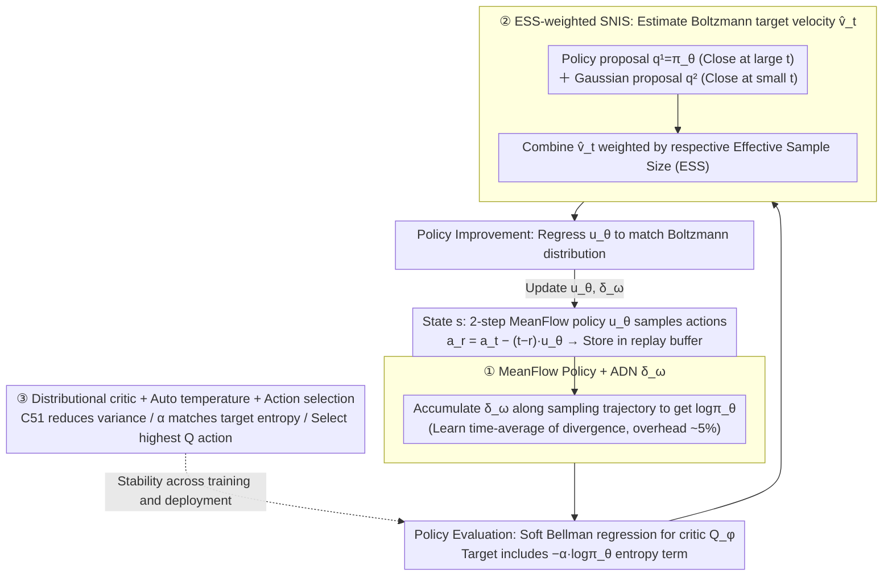

# MFPO: Accelerating MaxEnt RL to Gaussian Policy Speeds with Few-step MeanFlow Policy

**Conference**: ICML 2026  
**arXiv**: [2604.14698](https://arxiv.org/abs/2604.14698)  
**Code**: https://github.com/dongxiaoyi-xyz/MFPO  
**Area**: Reinforcement Learning / Diffusion Policy / Flow Matching  
**Keywords**: MeanFlow, MaxEnt RL, soft policy iteration, average divergence network, importance sampling

## TL;DR
MFPO employs MeanFlow models (learning average velocity instead of instantaneous velocity) as an RL policy to reduce diffusion policy sampling steps from 20+ to 2 steps. By using an average divergence network to solve action likelihood calculation and ESS-weighted SNIS to combine Gaussian + policy proposals for soft policy improvement, it achieves performance $\geq$ diffusion baselines on MuJoCo/DMC/HumanoidBench while reducing training time by $\sim 50\%$.

## Background & Motivation

**Background**: Online RL for continuous control using Gaussian or deterministic policies is overly unimodal, making it prone to local optima when the reward landscape of complex tasks is multimodal. Diffusion and flow matching policies (e.g., DIPO, QVPO, DACER, DIME) model multimodal actions via iterative generation, but their 10–20 step inference makes training one to two orders of magnitude slower.

**Limitations of Prior Work**: MaxEnt RL requires both action likelihood evaluation and soft policy improvement (matching the Boltzmann distribution) to balance exploration and exploitation. Both are challenging for diffusion policies: likelihood requires integrating instantaneous velocity divergence (which is intractable), and soft improvement requires Boltzmann samples (which are unavailable). Existing methods (DIME lower bound, MaxEntDP numerical integration, SAC-Flow with GRU/Transformer) suffer from loose bounds or large ODE discretization errors in few-step regimes.

**Key Challenge**: Multimodal expressiveness requires diffusion, while RL training efficiency requires few steps; however, few steps sacrifice likelihood precision and the accuracy of policy improvement.

**Goal**: Achieve precise likelihood calculation and soft improvement for multimodal policies within 2 steps in a MaxEnt RL framework, making diffusion policy training time comparable to that of Gaussian policies.

**Key Insight**: MeanFlow models (Geng et al. 2025) learn average velocity $\boldsymbol{u}(\boldsymbol{x}_t, r, t) = \frac{1}{t-r} \int_r^t \boldsymbol{v}(\boldsymbol{x}_\tau, \tau) d\tau$ instead of instantaneous velocity. Once learned precisely, 2-step sampling yields no discretization error. However, applying MeanFlow to MaxEnt RL still requires solving the challenges of likelihood calculation and soft improvement.

**Core Idea**: (1) Construct an average divergence network (ADN) $\delta_\omega$ mimicking MeanFlow to approximate $\frac{1}{t-r} \int_r^t \nabla \cdot \boldsymbol{v}_\theta d\tau$, reusing the sampling pipeline for likelihood calculation; (2) Use SNIS to estimate the marginal velocity of the Boltzmann distribution by adaptively combining policy proposals and Gaussian proposals via ESS weighting; (3) Train the MeanFlow policy using soft policy iteration with a distributional critic and automatic temperature adjustment.

## Method

### Overall Architecture

MFPO maintains two networks: a critic $Q_\phi$ and a MeanFlow policy $\boldsymbol{u}_\theta$ (augmented with the average divergence network $\delta_\omega$). It alternates between **Policy Evaluation** (updating $Q_\phi$) and **Policy Improvement** (updating $\boldsymbol{u}_\theta$) within the soft policy iteration framework. The difficulty lies in the fact that both steps rely on the action likelihood of the MeanFlow policy and the Boltzmann target distribution, which are typically unavailable for few-step generative policies. MFPO bridges this gap with three designs: ① **MeanFlow Policy + ADN** for likelihood, ② **ESS-weighted SNIS** for target velocity estimation in policy improvement, and ③ **Distributional Critic + Auto Temperature + Action Selection** for stability during training and deployment. Deployment requires only 2 sampling steps: $\boldsymbol{a}_{t_{i-1}} = \boldsymbol{a}_{t_i} - \frac{1}{T} \boldsymbol{u}_\theta(\boldsymbol{s}, \boldsymbol{a}_{t_i}, t_{i-1}, t_i)$.



### Key Designs

**1. MeanFlow Policy + Average Divergence Network (ADN): Accurate Action Likelihood for 2-step Sampling**

MaxEnt RL must incorporate entropy into the objective, requiring the calculation of the log-likelihood of actions under the policy. For diffusion policies, likelihood requires integrating the divergence of the instantaneous velocity field over time, which is inherently intractable and prone to discretization errors over few steps. MFPO adopts the same "learning the average" approach: it drains an average divergence network $\delta_\omega(\boldsymbol{s}, \boldsymbol{a}_t, r, t) \approx \frac{1}{t-r} \int_r^t \nabla \cdot \boldsymbol{v}_\theta\,d\tau$. The training objective uses the Skilling-Hutchinson trace estimator $\widehat{\text{div}} = \frac{1}{N} \sum_i \boldsymbol{\epsilon}_i^\top \frac{\partial \boldsymbol{v}_\theta}{\partial \boldsymbol{a}_t} \boldsymbol{\epsilon}_i$ to avoid backpropagating through every dimension. During inference, the divergence is accumulated using points along the sampling trajectory: $\log \pi_\theta(\boldsymbol{a}_0|\boldsymbol{s}) = \log p_1(\boldsymbol{a}_1) + \frac{1}{T} \sum_i \delta_\omega(\boldsymbol{s}, \boldsymbol{a}_{t_i}, t_{i-1}, t_i)$, with an overhead of only about 5%. The ADN is effective because it is isomorphic to MeanFlow—while MeanFlow learns the time-average of velocity, ADN learns the time-average of divergence, making it both accurate (trained to match) and efficient.

**2. ESS-weighted SNIS: Soft Policy Improvement Without Boltzmann Samples**

Soft policy improvement aims to match the policy to the Boltzmann distribution $\pi(\boldsymbol{a}_0|\boldsymbol{s}) \propto \exp(\frac{1}{\alpha} Q)$. Since samples from the Boltzmann distribution are unavailable, one must estimate its marginal velocity field $\boldsymbol{v}_t(\boldsymbol{a}_t|\boldsymbol{s}) = \mathbb{E}_{\pi(\boldsymbol{a}_0|\boldsymbol{a}_t, \boldsymbol{s})}[\frac{\boldsymbol{a}_t - \boldsymbol{a}_0}{t}]$. Prior methods (MaxEntDP/SDAC) utilize a Gaussian proposal $q^2(\boldsymbol{a}_0) = \mathcal{N}(\boldsymbol{a}_0|\frac{\boldsymbol{a}_t}{1-t}, (\frac{t}{1-t})^2 I)$ for self-normalized importance sampling. However, as $t \to 1$, the target is dominated by $Q$, and the Gaussian proposal deviates significantly, causing the Effective Sample Size (ESS) to collapse. MFPO adds a policy proposal $q^1(\boldsymbol{a}_0) = \pi_\theta(\boldsymbol{a}_0|\s)$ (with likelihood provided by the ADN), which remains close at large $t$. The final estimate is a combination weighted by the ESS of each proposal: $\hat{\boldsymbol{v}}_t = \sum_k \frac{\text{ESS}_k}{\sum_l \text{ESS}_l} \hat{\boldsymbol{v}}_t^k$. This ensures the Gaussian proposal handles small $t$ while the policy proposal handles large $t$, with the weight favoring the proposal with more effective samples. This approach realizes variance reduction through ESS naturally rather than via manual tuning.

**3. Distributional critic + Auto temperature + Action selection: Ensuring Stability in Training and Deployment**

Three additional configurations stabilize the method, addressing the conflict between exploration and exploitation. The critic uses C51 to learn $Q$ as a categorical distribution, using only the mean for policy updates; this distributional Q-learning suppresses value estimation variance, as verified in diffusion RL. The temperature $\alpha$ is not fixed but is automatically adjusted to match a target entropy $\mathcal{H}_{\text{target}} = -\rho \cdot \dim(\mathcal{A})$ (with $\rho = 0.5$ being generally optimal), ensuring robustness to reward scaling. During evaluation, instead of random sampling, several candidate actions are sampled from the policy, and the one with the highest $Q$ value is selected. Randomness aids exploration during training, while determinism ensures performance during deployment.

### Mechanism

```text
Initialize Q_φ, π_θ (MeanFlow), δ_ω, α
for each step:
    # Policy evaluation
    L(φ) = (Q_φ(s,a) - (r + γ(Q(s',a') - α log π(a'|s'))))²
    # Policy improvement  
    Estimate v̂_t via ESS-weighted SNIS combining q^1 = π_θ + q^2 = Gaussian
    L(θ) = ||u_θ - sg(u_tgt)||²
    # ADN update via Eq. 17
    L(ω) = ||δ_ω - sg(δ_tgt)||²
    # Auto temperature
    L(α) = α (H(π_θ) - H_target)
```

## Key Experimental Results

### Main Results: MuJoCo (5 Locomotion Tasks)

| Algorithm | Sampling Steps | Inference Time (ms) | Avg Performance |
|---|---|---|---|
| **MFPO (ours)** | **2** | **0.46** | best/tied |
| DIME | 16 | 0.97 | comparable |
| FlowRL | 11 | 0.42 | comparable |
| SAC-Flow | 4 | 0.96 | comparable |
| MaxEntDP | 20 | 1.56 | slightly lower |
| DACER | 20 | 1.06 | comparable |
| QVPO | 20 | 1.68 | slightly lower |
| TD3 (Gaussian) | 1 | 0.14 | lower (unimodal) |
| SAC (Gaussian) | 1 | 0.15 | lower (unimodal) |

MFPO with 2-step sampling achieves an inference time of 0.46ms, which is 2–3.5× faster than other diffusion methods, while maintaining performance $\geq$ all diffusion baselines. Training time is reduced by $\sim 50\%$.

### Ablation Study (HalfCheetah-v3)

| Ablation | Impact |
|---|---|
| MeanFlow → Flow Matching policy | Performance degradation; average velocity is necessary for few-step |
| Remove ADN | Performance degradation; highlights necessity of likelihood estimation |
| Only Gaussian proposal | Low ESS as $t \to 1$ |
| Only policy proposal | Failed; proposal was not effective enough |
| $K_1:K_2 = 1:2$ (More Gaussian) | Optimal |
| Fixed temperature | Lower performance than auto temperature |
| $\rho = 0.5$ for target entropy | Optimal |

### Key Findings

- **2-step sampling matches 20-step diffusion performance**: MFPO over 2 steps catches up with MaxEntDP/QVPO over 20 steps, reducing inference time by 3–4×.
- **Training time reduced by 50%**: Compared to DACER/DIME/MaxEntDP, the total training time is nearly halved.
- **ADN adds only 5% overhead for accurate likelihood**: Compared to naive numerical integration (requiring $d$ backward passes per step), ADN is practically free.
- **Two-proposal SNIS is critical**: The combination significantly reduces variance, which is essential for stable policy updates.
- **Scales to HumanoidBench**: MFPO matches SOTA on high-dimensional tasks (>50 dim actions), proving its scalability to complex control.

## Highlights & Insights

- **MeanFlow + MaxEnt RL is an ideal combination**: MeanFlow addresses few-step expressiveness, while MaxEnt addresses exploration; the result is both fast and stable.
- **ADN is an elegant methodological analogy**: The idea of "learning the time-average of velocity" from MeanFlow is successfully transferred to "learning the time-average of divergence."
- **Engineering value of ESS-weighted SNIS**: This is not ad-hoc tuning; the ESS provides automatic weighting with theoretical guarantees for variance reduction.
- **Practical significance of 50% faster training**: This makes diffusion-based RL feasible in engineering projects. What previously took days for diffusion results can now be achieved in hours with SAC-like efficiency.
- **Cross-pollination**: Transferring the latest progress in generative modeling (average velocity) to RL represents a successful example of interdisciplinary synergy.

## Limitations & Future Work

- **Expression limits in 2 steps**: While MeanFlow reduces discretization error, there is still a theoretical gap in multimodality between 2 steps and 20 steps; the sweet spot for extremely complex tasks might be 4–8 steps.
- **ADN training stability**: The ADN training objective depends on stop-gradients and a recursive structure; whether it drifts during very long training runs has not been fully verified.
- **Proposal ratio tuning**: The $K_1:K_2 = 1:2$ ratio was optimal for HalfCheetah, but whether this requires cross-task tuning lacks a systematic ablation.
- **Choice of distributional critic**: While C51 is the default, alternatives like QR-DQN or IQN might offer more stability; the specific impact of this choice was not separately ablated.
- **Lack of sample efficiency comparison**: While training time is faster, the sample efficiency (performance per environment step) relative to baselines is not explicitly contrasted.
- **No verification on pixel-based tasks**: Experiments were limited to state-based benchmarks. The effectiveness of MeanFlow policies under pixel observations remains unknown.

## Related Work & Insights

- **vs DACER / DIME / MaxEntDP / SDAC**: These methods use diffusion + MaxEnt but require 10–20 steps; MFPO uses MeanFlow to reduce steps to 2 while maintaining MaxEnt precision.
- **vs FPMD / QVPO / FlowRL**: These utilize diffusion-based RL but lack the MaxEnt framework; MFPO combines multimodal expressiveness with principled MaxEnt exploration.
- **vs SAC-Flow**: They use GRU/Transformers for stability; MFPO is more general as it does not rely on specific architectures.
- **vs MeanFlow (Geng et al. 2025)**: The original generative modeling paper; this work is the first application of MeanFlow to RL.
- **Insights**: (1) MeanFlow should be considered for any domain where diffusion models suffer from slow sampling; (2) The "learn the average via consistency" principle from MeanFlow can be extended to other quantities like Lyapunov or value functions; (3) Multi-proposal SNIS is a universal trick for intractable distributions where ESS-weighting provides necessary adaptivity.

## Rating

- Novelty: ⭐⭐⭐⭐⭐ The combination of MeanFlow + MaxEnt RL, the ADN analogy, and ESS-weighted SNIS is methodologically comprehensive.
- Experimental Thoroughness: ⭐⭐⭐⭐⭐ Covers MuJoCo / DMC / HumanoidBench benchmarks, 8 baselines, 4-dimensional ablation, and ESS/variance visualization.
- Writing Quality: ⭐⭐⭐⭐⭐ Clear mathematical derivations, intuitive ADN analogy, and the ESS visualization in Figure 1 directly support the motivation.
- Value: ⭐⭐⭐⭐⭐ Brings diffusion-based RL inference speed and training cost close to Gaussian policies, a critical step for practical adoption.

<!-- RELATED:START -->

<div class="related-papers" markdown="1">

## Related Papers

- [\[AAAI 2026\] One-Step Generative Policies with Q-Learning: A Reformulation of MeanFlow](../../AAAI2026/reinforcement_learning/one-step_generative_policies_with_q-learning_a_reformulation_of_meanflow.md)
- [\[ICML 2026\] Learning to Route Languages for Multilingual Policy Optimization](learning_to_route_languages_for_multilingual_policy_optimization.md)
- [\[ICML 2026\] EAPO: Enhancing Policy Optimization with On-Demand Expert Assistance](eapo_enhancing_policy_optimization_with_on-demand_expert_assistance.md)
- [\[ICML 2026\] Metis: Learning to Jailbreak LLMs via Self-Evolving Metacognitive Policy Optimization](metis_learning_to_jailbreak_llms_via_self-evolving_metacognitive_policy_optimiza.md)
- [\[ACL 2026\] Bridging SFT and RL: Dynamic Policy Optimization for Robust Reasoning](../../ACL2026/reinforcement_learning/bridging_sft_and_rl_dynamic_policy_optimization_for_robust_reasoning.md)

</div>

<!-- RELATED:END -->
