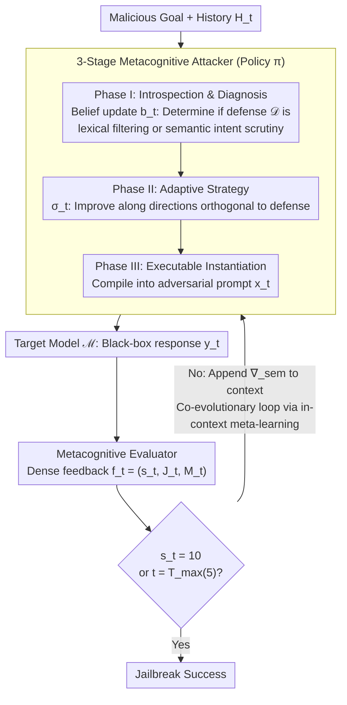

# Metis: Learning to Jailbreak LLMs via Self-Evolving Metacognitive Policy Optimization

**Conference**: ICML 2026  
**arXiv**: [2605.10067](https://arxiv.org/abs/2605.10067)  
**Code**: None  
**Area**: LLM Security / Red Teaming / Jailbreak / Test-time Policy Optimization  
**Keywords**: Red Teaming, Jailbreak, POMDP, Metacognition, Semantic Gradient

## TL;DR
The paper reformulates multi-turn jailbreaking as a test-time policy optimization problem. Under an adversarial POMDP framework, the Attacker and Metacognitive Evaluator form a closed loop: the dense analytical feedback from the Evaluator acts as a "semantic gradient" to guide the Attacker's belief updates and policy improvements. Without retraining any weights, this approach achieves an average ASR of 89.2% across 10 frontier models including O1, GPT-5-chat, and Claude-3.7, while reducing token consumption by an average of 8.2x compared to strong baselines.

## Background & Motivation

**Background**: Automated red teaming has evolved from single-turn (GCG, PAIR, PAP, CipherChat, etc.) to multi-turn methods (Crescendo, CoA, ActorBreaker, X-Teaming). Multi-turn frameworks are generally more powerful as they can continuously probe defense boundaries through interaction.

**Limitations of Prior Work**: Even current state-of-the-art multi-turn frameworks essentially perform "random searches within predefined heuristic spaces"—using mechanisms like tree search, topic escalation, or fixed plans. While effective against weaker models like Llama or GPT-3.5, their performance drops sharply on strongly aligned frontier models like O1, GPT-5-chat, or Claude-3.7 (e.g., ActorBreaker achieves only 14% on O1; X-Teaming achieves 49% on GPT-5-chat).

**Key Challenge**: Existing methods rely on sparse success/failure signals to drive searches, lacking causal diagnosis of "why this attempt failed" or "what the defense logic is." Furthermore, heuristic templates are non-adaptive and cannot generate bespoke strategies for the specific defensive posture of each target model.

**Goal**: (1) Formalize multi-turn jailbreaking as an adversarial POMDP to rigorously express policy learning and belief updates; (2) Design an agent capable of self-evolution at test-time (without weight updates) via causal diagnosis and policy refinement; (3) Replace sparse rewards with dense semantic feedback to achieve convergence within a single trajectory; (4) Ensure interpretability by explicitly outputting reasoning traces.

**Key Insight**: The unknown defense mechanism of the target model is treated as a latent state in a POMDP, which the agent must maintain a belief over. The Evaluator provides an analytical critique rather than a scalar reward, acting as a high-dimensional "semantic gradient" $\nabla_\text{sem}$ to approximate inaccessible loss gradients.

**Core Idea**: Utilize an "Attacker + Metacognitive Evaluator" dual-agent setup to form a three-stage metacognitive loop: `<thought> → <strategy> → <prompt>`. This upgrades red teaming from heuristic search to test-time semantic policy optimization.

## Method

### Overall Architecture
The LLM red teaming process is modeled as an Adversarial POMDP $(\mathcal{S}, \mathcal{A}, \mathcal{O}, \mathcal{R})$. The latent state includes the conversation history $H_t$ and the unknown defense $\mathcal{D}$; actions are the prompts $x_t$ generated by the attacker; observations consist of the target response $y_t$ and evaluator feedback $f_t$; the reward $\mathcal{R}$ measures the semantic alignment between the response and the malicious goal $\mathcal{G}$. The pipeline iterates for a maximum of $T_\text{max}=5$ turns: in each turn, the Attacker executes three-stage metacognition (Diagnosis → Strategy → Instantiation) and interacts with the target; the Evaluator converts responses into dense feedback $(s_t, J_t, M_t)$; the full trajectory $\tau_t$ is preserved in the context to enable in-context meta-learning.

### Key Designs

**1. Three-Stage Metacognitive Attacker: Decomposing Decisions into "Diagnosis → Strategy → Instantiation"**

Traditional multi-turn attacks output a single prompt per turn, making the process opaque and failures difficult to diagnose. Metis explicitly decomposes each decision into three segments labeled `<thought>`, `<strategy>`, and `<prompt>`. Phase I performs a belief update $b_t\leftarrow\text{Reason}(b_{t-1}, y_{t-1}, f_{t-1})$ within the `<thought>` block, integrating previous responses and feedback to narrow down hypotheses about the unknown defense $\mathcal{D}$ (e.g., distinguishing between lexical filters and semantic scrutiny). Phase II generates an abstract strategy $\sigma_t\leftarrow\pi_\text{plan}(b_t, \mathcal{P}_\text{seed})$ in the `<strategy>` block, using a few known attack vectors ($\mathcal{P}_\text{seed}$) as priors to shift the strategy in directions orthogonal to the identified defense. Phase III instantiates the strategy into specific tokens $x_t\sim\pi_\text{gen}(x\mid\sigma_t, H_t)$ in the `<prompt>` block. This transparency provides both a reasoning trace for human analysts and clear targets for the Evaluator.

**2. Metacognitive Evaluator as Semantic Gradient: Replacing Sparse Rewards with Textual Critiques**

Standard RL-based red teaming often uses binary success signals as rewards, which become increasingly sparse as trajectories lengthen, requiring intensive sampling. Metis uses a third-party LLM as an Evaluator to output $(s_t, J_t, M_t)$—comprising a scalar reward, textual justification, and meta-suggestions. This is treated as an approximation of an inaccessible loss gradient: $\nabla_\text{sem}\approx\mathcal{E}(y_t, \mathcal{G})$. This "semantic gradient" provides high-dimensional directional signals, explicitly informing the Attacker how to refine the strategy. Meta-suggestions $M_t$ are appended to the Attacker's next context, upgrading search-style rewards to dense supervision. This step-wise reward shaping allows the Attacker to internalize cause-and-effect within a single trajectory without weight updates. Ablations show this is a critical bottleneck: removing Evaluator metacognition is more detrimental than removing Attacker metacognition (−40 vs −20 on Claude-3.7).

**3. Co-evolutionary Loop & Tight Budget Convergence: Optimization via Semantic Gradients**

Existing methods (e.g., X-Teaming's multi-agent plans or Crescendo's topic escalation) rely on exploratory search, causing token costs to surge against strong defenses. Metis maintains the full history $(b_t, \sigma_t, x_t, y_t, f_t)$ in context to facilitate in-context meta-learning. As the Attacker refines its belief and strategy, it forms a positive feedback loop with the Evaluator. The paper enforces a tight budget of $T_\text{max}=5$ to distinguish "targeted optimization" from "random exploration." Results show that success is usually achieved in ~1.8–2.3 turns (AQS), with token consumption reduced by 8.2x compared to strong baselines. This confirms that reframing red teaming as an optimizer with dense supervision significantly improves efficiency and success rates.

### Loss & Training
Metis is a zero-shot, test-time framework that does not update LLM weights. The Attacker uses DeepSeek-R1-V528, and the Evaluator uses GPT-4o. The success threshold is strict: only an Evaluator score of 10 ("Full and Unambiguous Jailbreak") is considered successful to avoid counting partial responses as breaches. $T_\text{max} = 5$ for fair budgetary comparison.

## Key Experimental Results

### Main Results
10 target models across 2 benchmarks (HarmBench, AdvBench). HarmBench ASR:

| Method | Llama3-8B | Llama3-70B | Qwen2.5 | Claude-3.7 | GPT-4o | O1 | GPT-5-chat | Gemini 2.5 Pro | Grok3 | Avg. |
|------|-----------|------------|---------|------------|--------|----|------------|----------------|-------|------|
| GCG | 34.5 | 17.0 | 6.5 | — | 12.5 | 0.0 | — | — | — | 21.1 |
| AutoDAN-Turbo | 23.0 | 32.0 | 7.0 | 17.0 | 23.0 | 24.0 | 55.0 | 52.0 | 84.0 | 36.4 |
| Crescendo | 60.0 | 62.0 | — | — | 62.0 | 14.0 | — | 23.0 | 6.0 | 41.0 |
| ActorBreaker | 79.0 | 85.5 | 47.0 | 22.0 | 84.5 | 14.0 | 22.0 | 44.0 | 42.0 | 51.9 |
| X-Teaming | 85.0 | 83.0 | 95.0 | 81.0 | 91.0 | 71.0 | 49.0 | 84.0 | 89.0 | 82.0 |
| **Metis** | **88.0** | **90.0** | **97.0** | **86.0** | **93.0** | **76.0** | **78.0** | **90.0** | **100.0** | **89.2** |

### Ablation Study

| Configuration | Llama3-8B | Claude-3.7 | GPT-4o |
|------|-----------|------------|--------|
| w/o Attacker Metacog. | 82.0 (↓6) | 66.0 (↓20) | 74.0 (↓19) |
| w/o Evaluator Metacog. | 86.0 (↓2) | 46.0 (↓40) | 72.0 (↓21) |
| w/o Seed Paradigms | 78.0 (↓10) | 60.0 (↓26) | 76.0 (↓17) |
| **Metis (Full)** | 88.0 | 86.0 | 93.0 |

Efficiency Comparison (Shared $T_\text{max}=5$, same backbone):

| Model | Method | ASR | AQS | ATS (tokens) | Gain vs X-Teaming |
|------|------|-----|-----|--------------|-------------------|
| Claude-3.7 | X-Teaming | 81.0 | 8.95 | 13,248 | — |
| Claude-3.7 | **Metis** | **86.0** | **1.90** | **1,425** | **9.3×** |
| GPT-5-chat | X-Teaming | 49.0 | 12.48 | 14,095 | — |
| GPT-5-chat | **Metis** | **78.0** | **1.80** | **1,570** | **9.0×** |
| Gemini 2.5 Pro | **Metis** | **90.0** | **2.30** | **1,464** | **8.1×** |

### Key Findings
- **Generalization Gap**: The performance of baselines drops significantly on frontier models (e.g., ActorBreaker drops from ≥80% to 22% on Claude-3.7). Metis remains stable, proving that metacognitive adaptability is more reliable than static planning.
- **Evaluator Bottleneck**: Removing Evaluator metacognition is more damaging than removing Attacker metacognition, indicating that dense semantic feedback is the primary driver of success. The Attacker’s reasoning requires anchoring by external critiques.
- **Model Sensitivity**: Switching the Evaluator from GPT-4o to Qwen2.5-7B causes ASR on GPT-4o to drop from 93% to 30%, suggesting that Metis's ceiling is determined by the Evaluator's analytical capability rather than the Attacker's generation.
- **Efficiency**: Token consumption is reduced by 8.2x on average, and success is typically reached in 1.8–2.3 turns (AQS), demonstrating that dense feedback compresses multi-turn search into a few targeted optimizations.
- **Bespoke Strategy**: t-SNE and diversity analysis show that Metis generates strategies with high semantic variety (0.427 cross-model diversity), proving it produces bespoke attacks rather than just re-skinning predefined templates.

## Highlights & Insights
- Reformulating jailbreaking from "search" to "test-time policy optimization" is a paradigm shift. The Attacker acts as an optimizer with beliefs and dense supervision, improving both success rates and costs.
- The explicit `<thought> / <strategy> / <prompt>` structure provides a diagnostic tool for safety researchers to understand specific model vulnerabilities through the reasoning traces.
- Using textual critiques as "semantic gradients" is a transferable concept for any scenario involving black-box optimization with sparse signals (e.g., automated prompt optimization or reward model training).
- The discovery that the Evaluator—not the Attacker—is the bottleneck suggests that defense researchers should invest in stronger "judge models" rather than just larger generation models to harden red teaming.

## Limitations & Future Work
- Dependency on external LLMs (like GPT-4o) as Evaluators introduces risks related to API stability and safety filters; the paper does not address degradations when the Evaluator refuses to answer.
- Costs are not zero; while token counts are reduced, the dual-LLM calls result in higher latency per turn than single-agent setups.
- There is still an alignment gap (76.8% agreement) between the Evaluator and human assessment, meaning some "successful" jailbreaks may be false positives.
- Evaluation is limited to 5 turns and two benchmarks, which may not capture long-range multi-session attack scenarios.
- Code and data are not explicitly public, which may limit reproducibility.

## Related Work & Insights
- **vs Crescendo/ActorBreaker/X-Teaming**: These rely on stochastic search over predefined heuristics, whereas Metis performs in-situ policy optimization, yielding targeted trajectories and lower costs.
- **vs PAIR/GCG/PAP**: Single-turn optimizations fail on frontier models; Metis uses multi-turn metacognition for causal diagnosis of dynamic defenses.
- **vs MTSA/AutoDAN-Turbo**: While they optimize low-level prompt primitives, Metis optimizes high-level strategy and beliefs, mimicking human red teaming.
- **vs Metacognitive LLM Works**: Previous metacognitive works focus on general reasoning; this is a novel application for adversarial policy learning.

## Rating
- Novelty: ⭐⭐⭐⭐ Systematically combines POMDP, metacognition, and dense semantic gradients for automated red teaming.
- Experimental Thoroughness: ⭐⭐⭐⭐ Extensive testing across 10 models, 2 benchmarks, multiple baselines, and ablation of efficiency/interpretability.
- Writing Quality: ⭐⭐⭐⭐ Clear algorithmic framework, dense data tables, and thorough discussion of backbone sensitivity.
- Value: ⭐⭐⭐ Provides methodological contributions to red teaming and safety, though its social value depends on its use in hardening defenses.

<!-- RELATED:START -->

No related papers cited in this note summary.

<!-- RELATED:END -->

## Related Papers

- [\[ACL 2026\] Easy Samples Are All You Need: Self-Evolving LLMs via Data-Efficient Reinforcement Learning](../../ACL2026/reinforcement_learning/easy_samples_are_all_you_need_self-evolving_llms_via_data-efficient_reinforcemen.md)
- [\[ICML 2026\] Learning to Route Languages for Multilingual Policy Optimization](learning_to_route_languages_for_multilingual_policy_optimization.md)
- [\[ICLR 2026\] SPELL: Self-Play Reinforcement Learning for Evolving Long-Context Language Models](../../ICLR2026/reinforcement_learning/spell_self-play_reinforcement_learning_for_evolving_long-context_language_models.md)
- [\[ICLR 2026\] Metis-SPECS: Decoupling Multimodal Learning via Self-distilled Preference-based Cold Start](../../ICLR2026/reinforcement_learning/metis-specs_decoupling_multimodal_learning_via_self-distilled_preference-based_c.md)
- [\[ICML 2026\] EAPO: Enhancing Policy Optimization with On-Demand Expert Assistance](eapo_enhancing_policy_optimization_with_on-demand_expert_assistance.md)

<!-- RELATED:END -->
