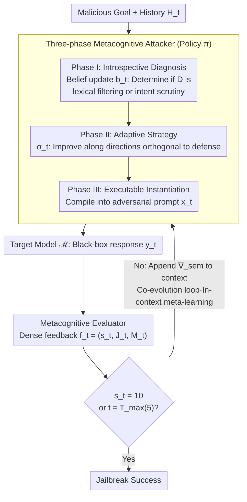

# Metis: Learning to Jailbreak LLMs via Self-Evolving Metacognitive Policy Optimization

**Conference**: ICML 2026  
**arXiv**: [2605.10067](https://arxiv.org/abs/2605.10067)  
**Code**: None  
**Area**: LLM Safety / Red Teaming / Jailbreak / Test-time Policy Optimization  
**Keywords**: Red Teaming, jailbreak, POMDP, Metacognition, Semantic Gradient  

## TL;DR
Reframes multi-turn jailbreaking as a test-time policy optimization problem under an adversarial POMDP framework. An Attacker and a Metacognitive Evaluator form a closed loop where dense analytical feedback from the Evaluator serves as a "semantic gradient" to guide the Attacker's belief updates and policy improvements. Without retraining any weights, it achieves an average ASR of 89.2% on 10 frontier models (including O1 / GPT-5-chat / Claude-3.7), while reducing token consumption by an average of 8.2x compared to strong baselines.

## Background & Motivation

**Background**: Automated red teaming has evolved from single-turn (GCG, PAIR, PAP, CipherChat, etc.) to multi-turn (Crescendo, CoA, ActorBreaker, X-Teaming). Multi-turn frameworks are generally more potent as they can iteratively approach defense boundaries via interaction.

**Limitations of Prior Work**: Even the strongest current multi-turn frameworks execute logic based on "random search within a predefined heuristic space" (e.g., tree search, topic escalation, fixed plans). Policy templates are essentially static. While effective on weakly aligned models like Llama or GPT-3.5, performance drops sharply on strongly aligned frontier models like O1, GPT-5-chat, or Claude-3.7 (e.g., ActorBreaker drops to 14% on O1; X-Teaming drops to 49% on GPT-5-chat).

**Key Challenge**: Existing methods rely on sparse success/failure signals to drive search, lacking causal diagnosis of "why the attempt failed" or "what the defense logic is." Furthermore, heuristic templates lack adaptability and cannot generate bespoke strategies for the specific defensive posture of each target model.

**Goal**: (1) Formalize multi-turn jailbreaking as an adversarial POMDP to rigorously express policy learning and belief updates; (2) Design agents capable of self-evolution during test-time (without weight updates) to perform causal diagnosis and policy improvement; (3) Replace sparse rewards with dense semantic feedback to achieve convergence within a single trajectory; (4) Ensure interpretability by explicitly outputting reasoning traces.

**Key Insight**: Treat the unknown defense mechanism of the target model as a latent state in a POMDP, requiring the agent to maintain a belief over it. The Evaluator provides an analytical critique instead of a scalar reward, which essentially acts as a high-dimensional "semantic gradient" $\nabla_\text{sem}$ to approximate inaccessible loss gradients.

**Core Idea**: Utilize an "Attacker + Metacognitive Evaluator" dual-agent setup to create a "<thought> → <strategy> → <prompt>" metacognitive cycle, upgrading red teaming from heuristic search to test-time semantic policy optimization.

## Method

### Overall Architecture
The LLM red teaming process is modeled as an Adversarial POMDP $(\mathcal{S}, \mathcal{A}, \mathcal{O}, \mathcal{R})$. The latent state includes the conversation history $H_t$ and the unknown defense $\mathcal{D}$; the action is the attacker-generated prompt $x_t$; the observation consists of the target response $y_t$ and evaluator feedback $f_t$; the reward $\mathcal{R}$ measures the semantic alignment between the response and the malicious goal $\mathcal{G}$. The pipeline iterates for a maximum of $T_\text{max}=5$ rounds: in each round, the Attacker completes a three-phase metacognitive cycle (diagnosis → strategy → instantiation) and interacts with the target; the Evaluator converts the response into dense feedback $(s_t, J_t, M_t)$; the full trajectory $\tau_t$ is preserved in the context to enable in-context meta-learning.

### Key Designs

**1. Three-phase Metacognitive Attacker: Decomposing Single-turn Decisions into "Diagnosis → Strategy → Instantiation"**

Traditional multi-turn attacks output a single prompt per round, making the process opaque and failures difficult to diagnose. Metis explicitly decomposes the Attacker's decision-making into three segments labeled `<thought>`, `<strategy>`, and `<prompt>`. Phase I performs a belief update $b_t \leftarrow \text{Reason}(b_{t-1}, y_{t-1}, f_{t-1})$ within the `<thought>` tag, integrating previous responses and feedback to refine hypotheses about the unknown defense $\mathcal{D}$ (e.g., determining if it relies on lexical filters or semantic intent scrutiny). Phase II generates an abstract strategy $\sigma_t \leftarrow \pi_\text{plan}(b_t, \mathcal{P}_\text{seed})$ in the `<strategy>` tag, using a few seed attack vectors as priors to guide improvement in directions orthogonal to the perceived defense. Phase III instantiates the strategy into concrete tokens $x_t \sim \pi_\text{gen}(x \mid \sigma_t, H_t)$ in the `<prompt>` tag. This provides a readable reasoning trace for security analysts and clear targets for the Evaluator.

**2. Metacognitive Evaluator as Semantic Gradient: Replacing Sparse Rewards with Textual Critiques**

Standard RL-based red teaming often uses only binary success/failure as a final reward, leading to sparse signals as trajectories lengthen, which necessitates high sampling rates and token costs. Metis employs a third-party LLM as an Evaluator to output $(s_t, J_t, M_t)$—a scalar reward, textual justification, and meta-suggestions—approximating an inaccessible loss gradient: $\nabla_\text{sem} \approx \mathcal{E}(y_t, \mathcal{G})$. This "semantic gradient" provides high-dimensional directional signals, explicitly informing the Attacker how to modify its strategy. Meta-suggestions $M_t$ are appended to the context, upgrading search-style sparse rewards to dense supervision. This step-wise reward shaping allows the Attacker to internalize cause-and-effect within a single trajectory without weight updates. Ablations show that removing Evaluator metacognition is more detrimental than removing Attacker metacognition (-40 vs -20 on Claude-3.7).

**3. Co-evolutionary Closed Loop + Tight Budget Convergence: Converging along Semantic Gradients**

Existing methods often rely on exploratory search, causing token costs to surge with defense strength. Metis preserves each $(b_t, \sigma_t, x_t, y_t, f_t)$ in the context for in-context meta-learning: the Attacker simultaneously refines its belief and strategy, forming a positive feedback loop with the Evaluator. The study enforces a tight $T_\text{max}=5$ budget to differentiate "targeted optimization" from "random exploration." Results show success within ~1.8–2.3 rounds on average, with token consumption reduced by 8.2x compared to strong baselines, confirming that reframing red teaming as an optimizer with dense supervision improves both cost and success rates.

### Loss & Training
Metis does not update any LLM weights and is a pure test-time framework. The Attacker uses DeepSeek-R1-V528 and the Evaluator uses GPT-4o. Success is strictly defined as an Evaluator score of 10 ("Full and Unambiguous Jailbreak") to avoid counting partial or borderline responses. $T_\text{max} = 5$ for a fair budget comparison.

## Key Experimental Results

### Main Results
Evaluated on 10 target models across 2 benchmarks (HarmBench, AdvBench). HarmBench ASR:

| Method | Llama3-8B | Llama3-70B | Qwen2.5 | Claude-3.7 | GPT-4o | O1 | GPT-5-chat | Gemini 2.5 Pro | Grok3 | Avg. |
|------|-----------|------------|---------|------------|--------|----|------------|----------------|-------|------|
| GCG | 34.5 | 17.0 | 6.5 | — | 12.5 | 0.0 | — | — | — | 21.1 |
| AutoDAN-Turbo | 23.0 | 32.0 | 7.0 | 17.0 | 23.0 | 24.0 | 55.0 | 52.0 | 84.0 | 36.4 |
| Crescendo | 60.0 | 62.0 | — | — | 62.0 | 14.0 | — | 23.0 | 6.0 | 41.0 |
| ActorBreaker | 79.0 | 85.5 | 47.0 | 22.0 | 84.5 | 14.0 | 22.0 | 44.0 | 42.0 | 51.9 |
| X-Teaming | 85.0 | 83.0 | 95.0 | 81.0 | 91.0 | 71.0 | 49.0 | 84.0 | 89.0 | 82.0 |
| **Ours (Metis)** | **88.0** | **90.0** | **97.0** | **86.0** | **93.0** | **76.0** | **78.0** | **90.0** | **100.0** | **89.2** |

### Ablation Study

| Configuration | Llama3-8B | Claude-3.7 | GPT-4o |
|------|-----------|------------|--------|
| w/o Attacker Metacog. | 82.0 (↓6) | 66.0 (↓20) | 74.0 (↓19) |
| w/o Evaluator Metacog. | 86.0 (↓2) | 46.0 (↓40) | 72.0 (↓21) |
| w/o Seed Paradigms | 78.0 (↓10) | 60.0 (↓26) | 76.0 (↓17) |
| **Ours (Full Metis)** | 88.0 | 86.0 | 93.0 |

Efficiency Comparison (Budget $T_\text{max}=5$, same backbone):

| Model | Method | ASR (%) | AQS | ATS (tokens) | Gain (vs X-Teaming) |
|------|------|-----|-----|--------------|-------------------|
| Claude-3.7 | X-Teaming | 81.0 | 8.95 | 13,248 | — |
| Claude-3.7 | **Ours** | **86.0** | **1.90** | **1,425** | **9.3×** |
| GPT-5-chat | X-Teaming | 49.0 | 12.48 | 14,095 | — |
| GPT-5-chat | **Ours** | **78.0** | **1.80** | **1,570** | **9.0×** |
| Gemini 2.5 Pro | **Ours** | **90.0** | **2.30** | **1,464** | **8.1×** |

### Key Findings
- **Generalization Gap**: Baselines suffer significantly on frontier models; ActorBreaker's ASR drops to 22% on Claude-3.7, while Metis remains stable, proving metacognitive adaptability is more reliable than static plans.
- **Evaluator Importance**: Removing Evaluator metacognition causes a larger drop than removing Attacker metacognition (-40 vs -20 on Claude-3.7), indicating dense semantic feedback is the primary bottleneck.
- **Evaluator Bottleneck**: Replacing GPT-4o with Qwen2.5-7B as the Evaluator caused GPT-4o ASR to drop from 93% to 30%, showing performance is bounded by the Evaluator's analytical capability rather than the Attacker's generation.
- **Efficiency**: Average token consumption is 8.2x lower (up to 11.4x), with AQS success typically achieved within 1.8-2.3 rounds.
- **Diversity**: t-SNE analysis shows Metis strategies are more widely distributed in semantic space than seed paradigms, with a cross-model diversity of 0.427, indicating the generation of bespoke attacks.

## Highlights & Insights
- Moving from "search" to "test-time policy optimization" is a paradigm shift: the attacker becomes an optimizer with beliefs and dense supervision.
- Explicit `<thought> / <strategy> / <prompt>` segments improve interpretability and serve as a diagnostic tool for security researchers.
- The use of textual critiques as a "semantic gradient" is highly transferable to other black-box optimization scenarios with sparse signals.
- The insight that the Evaluator, not the Attacker, is the bottleneck suggests that defensive research should focus on strengthening evaluation models.

## Limitations & Future Work
- The Evaluator (GPT-4o) is subject to OpenAI's own safety filters, which might become an uncontrollable variable; the handling of Evaluator refusals remains undiscussed.
- Higher latency per round due to dual-agent calls, despite lower total token costs.
- While the human agreement is 76.8%, a ~23% gap exists where Evaluator success may not align with human judgment.
- Limited budget ($T_\text{max}=5$) may not reflect long-range multi-day or multi-session attacks.
- Lack of public code and data limits immediate reproducibility.

## Related Work & Insights
- **vs Crescendo / ActorBreaker / X-Teaming**: These rely on stochastic search; Metis uses in-situ policy optimization, leading to targeted trajectories and lower token costs.
- **vs PAIR / GCG / PAP**: Single-turn optimizations fail on frontier models; Metis uses multi-turn metacognition for causal diagnosis of dynamic defenses.
- **vs Learning-based Red Teaming**: Unlike MTSA/AutoDAN-Turbo which optimize low-level primitives, Metis optimizes high-level strategy and beliefs.

## Rating
- Novelty: ⭐⭐⭐⭐ Systematic combination of POMDP, metacognition, and semantic gradients.
- Experimental Thoroughness: ⭐⭐⭐⭐ Strong coverage across 10 models, 2 benchmarks, and extensive efficiency/interpretability metrics.
- Writing Quality: ⭐⭐⭐⭐ Clear framework and thorough discussion of backbone sensitivity.
- Value: ⭐⭐⭐ Significant methodological contribution to red teaming, though societal value depends on defensive application.

<!-- RELATED:START -->

## Related Papers

- [\[ACL 2026\] Easy Samples Are All You Need: Self-Evolving LLMs via Data-Efficient Reinforcement Learning](../../ACL2026/reinforcement_learning/easy_samples_are_all_you_need_self-evolving_llms_via_data-efficient_reinforcemen.md)
- [\[ICLR 2026\] SPELL: Self-Play Reinforcement Learning for Evolving Long-Context Language Models](../../ICLR2026/reinforcement_learning/spell_self-play_reinforcement_learning_for_evolving_long-context_language_models.md)
- [\[ICML 2026\] Learning to Route Languages for Multilingual Policy Optimization](learning_to_route_languages_for_multilingual_policy_optimization.md)
- [\[ICLR 2026\] R-Zero: Self-Evolving Reasoning LLM from Zero Data](../../ICLR2026/reinforcement_learning/r-zero_self-evolving_reasoning_llm_from_zero_data.md)
- [\[ICML 2026\] Dr. Tulu: Reinforcement Learning with Evolving Rubrics for Deep Research](dr_tulu_reinforcement_learning_with_evolving_rubrics_for_deep_research.md)

<!-- RELATED:END -->
