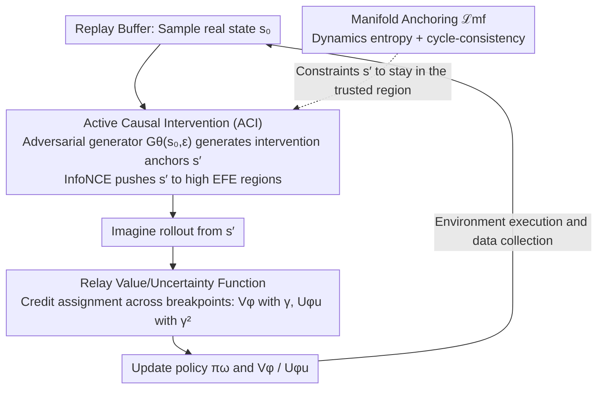

# Mind Dreamer: Untethering Imagination via Active Causal Intervention on Latent Manifolds

**Conference**: ICML2026  
**arXiv**: [2605.16030](https://arxiv.org/abs/2605.16030)  
**Code**: To be confirmed  
**Area**: Reinforcement Learning  
**Keywords**: Model-based RL, Latent Space Imagination, Active Causal Intervention, Free Energy, Dreamer

## TL;DR
This paper proposes Mind Dreamer for Model-Based Reinforcement Learning (MBRL), which utilizes an adversarial generator to "jump" to key anchors on the learned latent manifold of the world model that are not covered by historical trajectories. It resolves credit assignment across breakpoints through newly designed Relay Value/Uncertainty functions (incorporating a $\gamma^2$ discount), achieving an average $1.67\times$ speedup over DreamerV3 on DMC and up to $8.8\times$ on sparse reward tasks.

## Background & Motivation
**Background**: MBRL represented by the Dreamer series achieves high sample efficiency by "imagining" future trajectories in latent space. A key step involves sampling an initial state $s_0 \sim \mathcal{D}$ from the replay buffer and rolling out trajectories using an RSSM-like world model to train the policy.

**Limitations of Prior Work**: The authors characterize this approach as *Historical Tethering*—imagination remains a prisoner of history. While world models can rapidly learn the global structure of the manifold $\mathcal{M}$ through dense self-supervised signals, the policy crawls slowly via sparse rewards, creating "learning asymmetry." Even if the model knows how two regions connect, the policy must start from historical trajectory points and wait for random walks to reach bottleneck regions again.

**Key Challenge**: The coverage of imagination is constrained by the sampling distribution rather than the actual capabilities of the world model. Curiosity methods like Plan2Explore encourage exploration, but the rollout starting points must still be taken from the buffer, making them *trajectory-bound*. Methods like HER or Goal-Conditioned RL merely relabel historical trajectories without escaping the buffer's convex hull.

**Goal**: (i) Enable initial states to be synthesized rather than drawn from the buffer; (ii) Ensure synthesized states are physically plausible on the world model's manifold; (iii) Correctly propagate value/uncertainty signals when imagination paths encounter "spatial fractures" (teleports).

**Key Insight**: MBRL is viewed as an intervention problem within a causal framework—replacing $\mathcal{D}$ with a learned intervention distribution $p_{gen}$, corresponding to Pearl’s $do(\cdot)$ operator; the Expected Free Energy (EFE) from Active Inference is used as a global criterion for "where to jump."

**Core Idea**: The "imagination starting point" is untethered from the buffer. An adversarial generator samples latent space anchors with high EFE, and newly designed Relay Value/Uncertainty functions stitch rewards and information gains across anchors back into the Bellman equation.

## Method

### Overall Architecture
Mind Dreamer (MD) inserts two new module sets atop the RSSM of DreamerV3:

1.  **Adversarial Generator $\mathcal{G}_\theta(s,\epsilon)$**: Maps a real state $s$ from the buffer paired with noise $\epsilon \sim \mathcal{N}(0,I)$ to an "intervention anchor" $s' = \mathcal{G}_\theta(s,\epsilon)$ on the latent manifold. $s'$ is not required to be a state that appeared in history but must be a potential state considered "physically reachable" by the world model.
2.  **Relay Potentials $V_{RVF}, V_{RUF}$**: Treating $s'$ as an intermediate transition state rather than a final goal, these measure "how much reward can be obtained if I go to $s'$ first" and "how much model uncertainty can be eliminated if I go to $s'$ first," respectively.
3.  **Manifold Anchoring Loss $\mathcal{L}_{mf}$**: Prevents the generator from exploiting "manifold cracks" by using dynamics entropy regularization and cycle-consistency to keep $s'$ within the trusted regions of the world model.

During training, the world model is updated via standard RSSM losses and the policy via standard actor-critic. Simultaneously, $s' \sim \mathcal{G}_\theta$ replaces a portion of $s_0 \sim \mathcal{D}$ as the imagination starting point. The generator, potentials, and policy are updated asynchronously; the world model has the lowest frequency and the generator the highest, ensuring the target distribution is "quasi-static" for the policy.

### Key Designs

**1. Active Causal Intervention (ACI): Lifting EFE from a path scalar to a global curve for anchor placement**

The world model learns the global manifold structure quickly through self-supervision, while the policy learns slowly via sparse rewards, trapping imagination at buffer starting points. The generator solves "where to jump." For a single anchor $s'$, the local EFE is defined via Active Inference as $G(s') = -\beta\,\mathcal{I}(s_\tau;o_\tau|\pi) - \eta\,\mathbb{E}_q[\ln p(o_\tau)]$, involving epistemic value (uncertainty reduction) and pragmatic value (matching task priors). The Relay-EFE $\Psi(s,s') = \mathbb{E}_q\big[\sum_{k=1}^{H}\gamma^k G(s_k) \mid s_0=s, s'\in\xi\big]$ is obtained by summing discounted EFE over an $H$-step imagination. To stabilize gradient ascent on $\Psi$, the authors use an InfoNCE contrastive loss $\mathcal{L}_{contrast}=\max(0, m-(\Psi(s')-\max\Psi(s_{neg})))$, ensuring anchor potential is higher than historical/elite baselines. This prevents aimless drifting by simultaneously considering learning potential and task proximity.

**2. Relay Value / Uncertainty Function: Credit Assignment across Breakpoints**

Once an imagination path "teleports" to a synthetic anchor $s'$, a spatial fracture occurs where standard Bellman equations cannot propagate rewards or information gain from $s'$ back to the origin $s$. MD treats $s'$ as a transition state: defining hitting time $\tau_{s'}=\inf\{t\ge 0: s_t=s'\}$, the Pragmatic Relay operator is $(\mathcal{T}_V V)(s,s')=\mathbb{E}_\pi\big[\sum_{t=0}^{\tau_{s'}-1}\gamma^t r_t + \gamma^{\tau_{s'}} V_\phi(s')\big]$. The Epistemic Relay operator follows a similar structure, but information gain $\mathcal{I}_{t+1}$ is discounted by $\gamma^{2t}$: $(\mathcal{T}_U U)(s,s')=\mathbb{E}_\pi\big[\sum_{t=0}^{\tau_{s'}-1}\gamma^{2t}\mathcal{I}_{t+1} + \gamma^{2\tau_{s'}} U_{\phi_u}(s')\big]$. Both are contraction mappings under the $\ell_\infty$ norm (one with $\gamma$, one with $\gamma^2$), ensuring a unique fixed point. The $\gamma^2$ discount arises from the property of variance operators $\mathrm{Var}(\sum\gamma^t\epsilon_t)=\sum\gamma^{2t}\mathrm{Var}(\epsilon_t)$; epistemic impacts naturally decay at a quadratic rate. Linear $\gamma$ would cause distal model variance to explode, creating hallucinations; the authors term this the *Epistemic Horizon*—providing an endogenous truncation radius for cognitive curiosity.

**3. Manifold Anchoring $\mathcal{L}_{mf}$ and Adversarial Co-training: Confining the Generator to Trusted Regions**

The generator can create states outside the buffer's convex hull, but they must remain on the world model's trusted manifold to avoid leading the policy into "cracks" where hallucinations occur. The constraint is $\mathcal{L}_{mf} = \mathcal{H}\big(p_\psi(\cdot|s',a)\big) + D_{KL}\big[\mathrm{Enc}(\mathrm{Dec}(s'))\,\|\,s'\big]$, penalizing transition distribution entropy (uncertainty indicating unreliability) and ensuring cycle-consistency (re-encoding back to self as a proxy for the reconstruction manifold). The generator maximizes $\eta V_{RVF} + \beta V_{RUF} - \lambda \mathcal{L}_{mf}$. The authors prove that the jump error $\delta=\|s'-\mathrm{Proj}_\mathcal{M}(s')\|$ under an $L$-Lipschitz value field satisfies $\epsilon_V \le L\delta/(1-\gamma^n)$. Suppressing $\delta$ confines the adversarial generator to a pessimistic trust region, theoretically preventing policy collapse. Removing $\mathcal{L}_{mf}$ causes MD to underperform relative to DreamerV3, highlighting its critical role.

### Loss & Training
Following Algorithm 1: Within each step, the world model is updated using real buffer data via RSSM losses. Then $s_0 \sim \mathcal{D}$ is sampled alongside $s' \leftarrow \mathcal{G}_\theta(s_0,\epsilon)$ and a negative pool $s_{neg}$ to update $\theta$ via $\mathcal{L}_{contrast}+\lambda\mathcal{L}_{mf}$. Imagination rollouts begin from the posterior features $z_{s'}$, updating the policy, $V_\phi$, and $U_{\phi_u}$ via TD learning. Relay potentials are updated using $k$-step HER with non-recursive bootstrap targets. Finally, $\pi_\omega$ is executed in the real environment to collect data. Relay potentials use quasi-static target networks, and the world model updates significantly less frequently than the generator to prevent adversarial non-stationarity from affecting policy training.

Theoretical analysis yields three conclusions: (i) Minimizing R-EFE is equivalent to minimum-variance importance sampling; (ii) Under Gaussian world models, $V_{RUF}$ is asymptotically proportional to the trace of the Fisher Information Matrix $\frac{1}{2}\mathrm{Tr}(\mathcal{F}(\theta)\Sigma_\theta)$, meaning the generator samples where parameters are hardest to learn; (iii) On discrete manifold abstractions, interventions reduce the hitting time to bottleneck states from $\mathcal{O}(\mathrm{poly}(\Phi^{-1}))$ to $\mathcal{O}(\log|\mathcal{M}|)$, with a speedup $\nu \approx 1+\chi^2(q^*\|q_{traj}) \propto \Phi^{-2}$.

## Key Experimental Results

### Main Results
Evaluation on 20 pixel-observation tasks in DeepMind Control Suite (DMC) using DreamerV3's RSSM backbone and identical interaction budgets across 5 random seeds.

| Setting | Metric | Mind Dreamer | DreamerV3 | Remarks |
|------|------|--------------|-----------|------|
| DMC 20 Tasks Avg | Steps to 90% Peak Perf | 334.7k | 557.6k | $1.67\times$ Avg Speedup |
| Pendulum Swingup (Bottleneck) | Speedup to 90% Peak | — | — | $>8.8\times$ |
| DMC Avg Return | Asymptotic Performance | 831.1 | 780.3 | Uniformly Superior |
| Hopper Hop (Sparse) | Return Gain | — | Baseline | +59.8% |
| Quadruped Run | Return Gain | — | Baseline | +30.3% |
| Synthetic Three-Ring | Hitting time speedup | — | — | $\approx 4.2\times$ |

Baselines also include DreamerV2 and Plan2Explore, with MD consistently leading in sample efficiency and final returns.

### Ablation Study

| Configuration | DMC Avg Return / Observation | Explanation |
|------|----------------------|------|
| Full MD | 831.1 | Complete model |
| w/o $V_{RVF}$ (Pragmatic) | Exploration entropy maintained but reward slow | Relay Advantage lost; unable to find "reward canyons" |
| w/o $V_{RUF}$ (Epistemic) | Locally refined but fails to escape | Loss of active manifold repair signals |
| w/o $\mathcal{L}_{mf}$ | Catastrophic drop, below DreamerV3 | Generator exploits cracks, hallucinations infect policy |

### Key Findings
- $\mathcal{L}_{mf}$ is a hard constraint: Its removal causes MD to fall behind DreamerV3, proving trust region constraints are more critical than the Relay design itself in adversarial MBRL.
- Synthetic Three-Ring experiments show DreamerV3 imagination is trapped in the first attractor ring, while MD’s $\mathcal{G}$ focuses sampling on ring boundaries, converting global exploration into local refinement.
- The $\gamma^2$ discount is theoretically grounded: Linear variance addition + EFE equivalence. Using $\gamma^3$ would track third-order moments (skewness), breaking EFE equivalence.

## Highlights & Insights
- Redefines the MBRL bottleneck from "world model accuracy" to "imagination starting point distribution."
- The $\gamma^2$ discount provides a rigorous theoretical anchor for propagating uncertainty in discontinuous/jump semantics.
- Lifting EFE to a global functional $\Psi(s,s')$ bridges Active Inference and manifold learning, a perspective applicable to goal-conditioned RL and option discovery.
- Utilizing InfoNCE instead of direct adversarial reward maximization stabilizes generator training.

## Limitations & Future Work
- Computational Overhead: Training $\mathcal{G}$ and computing InfoNCE proxies at every step may be costly in compute-heavy scenarios.
- Static Mechanism Assumption: Current epistemic signals assume stable latent KL transitions; in non-stationary environments, the model might mistake mechanism drift for "epistemic blind spots."
- Evaluation Scope: Primarily validated on DMC pixel tasks and synthetic manifolds; performance on discrete actions (Atari) or sim-to-real robotics remains unverified.
- Lack of direct comparison with non-adversarial "jump-back" baselines like HER/Go-Explore to quantify the specific gains of adversarial generation.

## Related Work & Insights
- **vs Plan2Explore**: Both use curiosity, but Plan2Explore rollout starts are buffer-bound. MD untethers the start point and upgrades curiosity to a global potential.
- **vs Go-Explore**: Go-Explore relies on environment-supported explicit resets. MD perform "mental teleports" in latent space, making it applicable to non-resettable physical environments.
- **vs HER / Goal-Conditioned RL**: HER uses endpoints of sampled trajectories (within buffer hull). MD’s $s'$ is synthetic and can fall outside the hull while remaining on the world model's manifold.
- **vs Active Inference**: Lifts local EFE to Relay-EFE and implements credit assignment as a contraction mapping for the first time on Dreamer-level benchmarks.

## Rating
- Novelty: ⭐⭐⭐⭐⭐ Introduction of Historical Tethering + Relay Potentials + $\gamma^2$ discount with a clear framework.
- Experimental Thoroughness: ⭐⭐⭐⭐ Extensive DMC testing + Three-Ring visualization, though lacking discrete/robotics tasks.
- Writing Quality: ⭐⭐⭐⭐⭐ Clear conceptual hierarchy and natural transitions between theory and algorithms.
- Value: ⭐⭐⭐⭐⭐ Fundamentally modifies the unchallenged imagination starting point in MBRL; serves as a standard plugin for Dreamer-style work.

<!-- RELATED:START -->

## Related Papers

- [\[NeurIPS 2025\] Dynamics-Aligned Latent Imagination in Contextual World Models for Zero-Shot Generalization](../../NeurIPS2025/reinforcement_learning/dynamics-aligned_latent_imagination_in_contextual_world_models_for_zero-shot_gen.md)
- [\[ICLR 2026\] Generalization of RLVR Using Causal Reasoning as a Testbed](../../ICLR2026/reinforcement_learning/generalization_of_rlvr_using_causal_reasoning_as_a_testbed.md)
- [\[ICLR 2026\] Unveiling the Cognitive Compass: Theory-of-Mind-Guided Multimodal Emotion Reasoning](../../ICLR2026/reinforcement_learning/unveiling_the_cognitive_compass_theory-of-mind-guided_multimodal_emotion_reasoni.md)
- [\[ICML 2026\] Compositional Transduction with Latent Analogies for Offline Goal-Conditioned Reinforcement Learning](compositional_transduction_with_latent_analogies_for_offline_goal-conditioned_re.md)
- [\[ICML 2026\] LASER: Learning Active Sensing for Continuum Field Reconstruction](laser_learning_active_sensing_for_continuum_field_reconstruction.md)

<!-- RELATED:END -->
