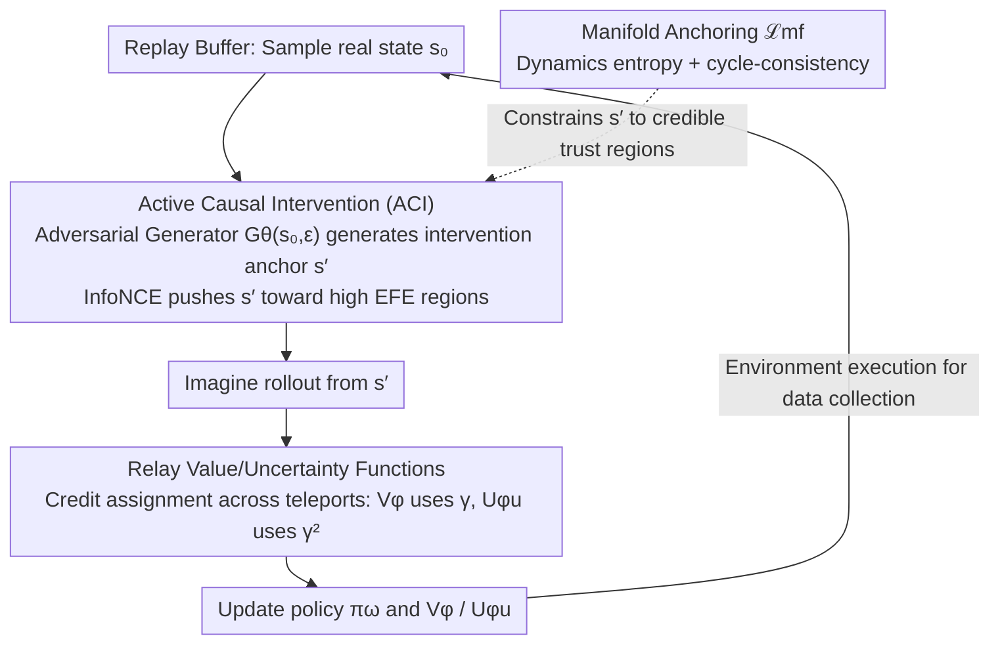

# Mind Dreamer: Untethering Imagination via Active Causal Intervention on Latent Manifolds

**Conference**: ICML2026  
**arXiv**: [2605.16030](https://arxiv.org/abs/2605.16030)  
**Code**: To be confirmed  
**Area**: Reinforcement Learning  
**Keywords**: Model-Based RL, Latent Space Imagination, Active Causal Intervention, Free Energy, Dreamer

## TL;DR
This paper proposes Mind Dreamer for Model-Based Reinforcement Learning (MBRL). It utilizes an adversarial generator to "jump" to key anchor points on the latent manifold learned by the world model that are not covered by historical trajectories. By introducing newly designed Relay Value/Uncertainty functions (incorporating a $\gamma^2$ discount) to address credit assignment across temporal discontinuities, it achieves an average $1.67\times$ speedup over DreamerV3 on DMC, with up to $8.8\times$ speedup on sparse reward tasks.

## Background & Motivation
**Background**: MBRL represented by the Dreamer series achieves high sample efficiency by "imagining" future trajectories in latent space. A critical step involves sampling an initial state $s_0 \sim \mathcal{D}$ from a replay buffer and rolling out trajectories using an RSSM-style world model to train the policy.

**Limitations of Prior Work**: The authors characterize this practice as *Historical Tethering*—imagination remains a prisoner of history. While the world model quickly learns the global structure of the manifold $\mathcal{M}$ through dense self-supervised signals, the policy crawls slowly based on sparse reward signals, creating a "learning asymmetry." Even if the model knows how two regions connect, the policy must start from historical trajectory points and rely on random walks to re-enter bottleneck regions.

**Key Challenge**: The coverage of imagination is constrained by the sampling distribution rather than the true capabilities of the world model. Curiosity-driven methods like Plan2Explore encourage exploration, but the rollout starting points must still be drawn from the buffer, remaining essentially *trajectory-bound*. HER/Goal-Conditioned RL merely relabel historical trajectories without stepping outside the buffer's convex hull.

**Goal**: (i) Enable the synthesis of initial states themselves rather than relying on the buffer; (ii) ensure these synthesized states are physically plausible on the world model's manifold; (iii) correctly propagate value/uncertainty signals when "teleports" (spatial discontinuities) occur in imagination paths.

**Key Insight**: Treat MBRL as an intervention problem within a causal framework—replacing $\mathcal{D}$ with a learned intervention distribution $p_{gen}$, corresponding to Pearl's $do(\cdot)$ operator. Use the Expected Free Energy (EFE) from Active Inference as a global criterion for "where to jump."

**Core Idea**: Decouple the "imagination starting point" from the buffer. An adversarial generator samples latent anchors with high EFE, and newly designed Relay Value/Uncertainty functions stitch rewards and information gains across anchors back into the Bellman equation.

## Method

### Overall Architecture
Mind Dreamer (MD) inserts two sets of new modules on top of DreamerV3's RSSM:

1.  **Adversarial Generator $\mathcal{G}_\theta(s,\epsilon)$**: Maps a real state $s$ from the buffer and noise $\epsilon \sim \mathcal{N}(0,I)$ to an "intervention anchor" $s' = \mathcal{G}_\theta(s,\epsilon)$ on the latent manifold. $s'$ does not need to be a state that actually appeared in history but must be a potential state the world model deems "physically reachable."
2.  **Relay Potentials $V_{RVF}, V_{RUF}$**: Treat $s'$ as an intermediate transition state rather than a final goal, measuring "how much reward can be obtained by continuing through $s'$" and "how much model uncertainty can be eliminated by continuing through $s'$," respectively.
3.  **Manifold Anchoring Loss $\mathcal{L}_{mf}$**: Prevents the generator from exploiting "manifold cracks" by using dynamics entropy regularization and cycle-consistency to constrain $s'$ within the world model's credible regions.

During training, the world model is trained via standard RSSM losses and the policy via standard actor-critic, while $s' \sim \mathcal{G}_\theta$ replaces a portion of $s_0 \sim \mathcal{D}$ as the start of imagination rollouts. The generator, potentials, and policy are updated asynchronously; the world model has the lowest frequency and the generator the highest, ensuring the target distribution is "quasi-static" for the policy.

### Key Designs

**1. Active Causal Intervention (ACI): Elevating EFE from path scalars to global curves to determine anchor placement**

The world model learns the global manifold structure quickly via dense self-supervision, but the policy crawls slowly via sparse rewards, trapping imagination at buffer starting points. The generator solves "where to jump." For a single anchor $s'$, the local EFE is formulated via Active Inference as $G(s') = -\beta\,\mathcal{I}(s_\tau;o_\tau|\pi) - \eta\,\mathbb{E}_q[\ln p(o_\tau)]$, consisting of epistemic value (uncertainty reduction) and pragmatic value (task priors). This is summed over an $H$-step imagination trajectory to obtain the Relay-EFE $\Psi(s,s') = \mathbb{E}_q\big[\sum_{k=1}^{H}\gamma^k G(s_k) \mid s_0=s, s'\in\xi\big]$. To stabilize training, this is converted into an InfoNCE contrastive loss $\mathcal{L}_{contrast}=\max(0, m-(\Psi(s')-\max\Psi(s_{neg})))$, ensuring the potential of generated anchors is strictly higher than historical or elite baselines. This allows the generator to balance "how much can be learned" and "proximity to task rewards," avoiding aimless drift from pure curiosity.

**2. Relay Value / Uncertainty Function: Credit assignment across discontinuities**

Once an imagination path "teleports" to a synthetic anchor $s'$, a spatial discontinuity occurs. Standard Bellman equations cannot propagate rewards and information gains from after $s'$ back to the starting point $s$, rendering $s'$ unreachable by gradients. MD treats $s'$ as an intermediate state: defining the first hit time $\tau_{s'}=\inf\{t\ge 0: s_t=s'\}$, the Pragmatic Relay operator is $(\mathcal{T}_V V)(s,s')=\mathbb{E}_\pi\big[\sum_{t=0}^{\tau_{s'}-1}\gamma^t r_t + \gamma^{\tau_{s'}} V_\phi(s')\big]$. The Epistemic Relay operator is similar, but information gain $\mathcal{I}_{t+1}$ is discounted by $\gamma^{2t}$: $(\mathcal{T}_U U)(s,s')=\mathbb{E}_\pi\big[\sum_{t=0}^{\tau_{s'}-1}\gamma^{2t}\mathcal{I}_{t+1} + \gamma^{2\tau_{s'}} U_{\phi_u}(s')\big]$. Both are contraction mappings under the $\ell_\infty$ norm (one with $\gamma$, one with $\gamma^2$), guaranteeing unique fixed points. The $\gamma^2$ is not an empirical hyperparameter—per variance operator properties $\mathrm{Var}(\sum\gamma^t\epsilon_t)=\sum\gamma^{2t}\mathrm{Var}(\epsilon_t)$, epistemic shocks naturally decay at a quadratic rate. Linear $\gamma$ would cause distal model variance to explode into hallucinations. The authors term this the *Epistemic Horizon*—providing an endogenous truncation radius for cognitive curiosity.

**3. Manifold Anchoring $\mathcal{L}_{mf}$ and Adversarial Joint Training: Keeping the generator within the world model's trust region**

The generator can create states outside the buffer's convex hull, but they must lie on the world model's credible manifold; otherwise, the policy might be led into "cracks" where the model is uncertain, fostering hallucinations. The constraint is $\mathcal{L}_{mf} = \mathcal{H}\big(p_\psi(\cdot|s',a)\big) + D_{KL}\big[\mathrm{Enc}(\mathrm{Dec}(s'))\,\|\,s'\big]$: the first term penalizes transition distribution entropy (uncertainty in successors indicates low credibility), and the second is cycle-consistency (acting as a proxy for whether the state lies on the reconstructed manifold). The generator maximizes $\eta V_{RVF} + \beta V_{RUF} - \lambda \mathcal{L}_{mf}$. The authors prove that the teleportation error $\delta=\|s'-\mathrm{Proj}_\mathcal{M}(s')\|$ satisfies $\epsilon_V \le L\delta/(1-\gamma^n)$ under an $L$-Lipschitz value field. By suppressing $\delta$, the adversarial generator is confined to a pessimistic trust region, theoretically ensuring imagination does not trigger policy collapse. Removing $\mathcal{L}_{mf}$ in ablations causes MD to underperform DreamerV3, highlighting it as more critical than the Relay design itself.

### Loss & Training
Following Algorithm 1: Within one step, the world model is updated using real buffer data and RSSM losses. Then, $s_0 \sim \mathcal{D}$ and $s' \leftarrow \mathcal{G}_\theta(s_0,\epsilon)$ are sampled along with a negative pool $s_{neg}$ to update $\theta$ via $\mathcal{L}_{contrast}+\lambda\mathcal{L}_{mf}$. Imagination rollouts start from the posterior features $z_{s'}$, utilizing TD learning to update the policy, $V_\phi$, and $U_{\phi_u}$. Relay potentials are updated using $k$-step HER combined with non-recursive bootstrap targets. Finally, $\pi_\omega$ is executed in the real environment to collect data. Relay potentials use a quasi-static target network, and the world model updates significantly less frequently than the generator to prevent adversarial non-stationarity from infecting policy training.

Theoretical analysis yields three core conclusions: (i) Minimizing R-EFE is equivalent to performing minimum variance importance sampling, where the ideal proposal distribution $q^*(s)\propto \rho(s)\|\nabla G(s)\|_2$ aligns with high $\Psi$ regions. (ii) Under a Gaussian world model, $V_{RUF}$ is asymptotically proportional to the trace of the Fisher Information Matrix $\frac{1}{2}\mathrm{Tr}(\mathcal{F}(\theta)\Sigma_\theta)$, meaning the generator automatically samples where "parameters are hardest to learn." (iii) On discrete abstractions of the latent manifold, intervention reduces the time to hit bottleneck states from $\mathcal{O}(\mathrm{poly}(\Phi^{-1}))$ to $\mathcal{O}(\log|\mathcal{M}|)$, with a speedup $\nu \approx 1+\chi^2(q^*\|q_{traj}) \propto \Phi^{-2}$.

## Key Experimental Results

### Main Results
On 20 pixel-observation tasks from the DeepMind Control Suite (DMC), using the DreamerV3 RSSM backbone and identical environment interaction budgets across 5 random seeds.

| Setting | Metric | Mind Dreamer | DreamerV3 | Remarks |
|------|------|--------------|-----------|------|
| DMC 20 Tasks Average | Environment steps to 90% peak performance | 334.7k | 557.6k | $1.67\times$ avg speedup |
| Pendulum Swingup (Bottleneck) | Speedup ratio to 90% peak | — | — | $>8.8\times$ |
| DMC Average Return | Asymptotic performance | 831.1 | 780.3 | Superior across board |
| Hopper Hop (Sparse Reward) | Return improvement | — | baseline | +59.8% |
| Quadruped Run | Return improvement | — | baseline | +30.3% |
| Synthetic Three-Ring | Time to first hit across rings speedup | — | — | $\approx 4.2\times$ |

Baselines also include DreamerV2 (to isolate improvements from backbone evolution) and Plan2Explore (curiosity-style baseline). MD consistently leads in both sampling efficiency and final return.

### Ablation Study

| Configuration | DMC Avg Return / Phenomenon | Description |
|------|----------------------|------|
| Full MD | 831.1 | Complete model |
| w/o $V_{RVF}$ (Pragmatic) | Exploration entropy maintained but slow reward convergence | Relay Advantage disappears; fails to find "reward canyons" |
| w/o $V_{RUF}$ (Epistemic) | Local refinement only; fails to leave known areas | Loses active manifold repair signal |
| w/o $\mathcal{L}_{mf}$ | Catastrophic drop, below DreamerV3 | Generator exploits manifold cracks, hallucination infects policy; self-consistency error increases $\times 43.5$ |

### Key Findings
- $\mathcal{L}_{mf}$ is the bottom line: Removing it causes MD to lose to DreamerV3, proving that "adversarial MBRL must have trust region constraints" is more critical than the Relay design itself.
- Three-Ring synthetic experiments verify: "DreamerV3 imagination is trapped in the first attractor ring, while MD's $\mathcal{G}$ automatically clusters sampling at ring boundaries," reducing global exploration to local refinement.
- $\gamma^2$ discount is not heuristic: The authors prove that using $\gamma^3$ would track the third moment (skewness), breaking equivalence with EFE; moreover, aleatoric noise in RSSM is naturally absorbed by the KL term, requiring no additional orders.

## Highlights & Insights
- Redefines the MBRL bottleneck from "inaccurate world models" to "incorrect imagination starting distributions." The world model already knows the answer; the policy just fails to ask. This re-characterization opens modification paths for many RSSM-derived methods.
- The $\gamma^2$ discount has a rigorous theoretical foundation: linear variance addition + EFE equivalence. This is a powerful formula to remember—useful for any algorithm propagating uncertainty under discontinuous/teleporting semantics.
- Elevating EFE from a "scalar target on a path" to a "global function $\Psi(s,s')$" integrates Active Inference and manifold learning; this "globalization of local goals" perspective can migrate to goal-conditioned RL, option discovery, and state sampling in offline RL.
- Replacing direct adversarial reward maximization with InfoNCE is a practical trick for stabilizing generator training, worth replicating in any GAN-in-RL setting.

## Limitations & Future Work
- Computational Overhead: Training $\mathcal{G}$ and computing InfoNCE proxies at every step may not be cost-effective in scenarios where environment steps are cheap but computation is expensive.
- Static Mechanism Assumption: Current use of latent KL as an epistemic signal assumes stable transition mechanisms. In non-stationary environments where physical parameters drift (e.g., changes in friction/load), the model might misidentify drift as an "epistemic blind spot." Separating structural uncertainty from environment drift is cited as future work.
- Evaluation Scope: Primarily validated on DMC pixel tasks and synthetic manifolds. Lack of discrete actions (Atari) or robot sim-to-real makes it difficult to judge generator controllability in high-dimensional embodied environments.
- Lack of direct comparison with non-adversarial "jump-back" baselines like HER or Go-Explore makes it hard to quantify the specific marginal gain of "adversarial generation" over "simple state resets."

## Related Work & Insights
- **vs Plan2Explore**: Both use curiosity as a primary signal, but Plan2Explore starting points are drawn from the buffer. MD decouples the starting point into a learnable distribution and upgrades curiosity from a "step-level reward bonus" to a "global value potential."
- **vs Go-Explore**: Go-Explore relies on environment-supported explicit resets to return to key states. MD performs "mental teleportation" in latent space, independent of environment reset interfaces, making it applicable to non-resettable physical environments.
- **vs HER / Goal-Conditioned RL**: HER treats ends of sampled trajectories as pseudo-goals, remaining within the buffer's convex hull. MD's $s'$ is synthetic and can fall outside the convex hull, while $\mathcal{L}_{mf}$ ensures it remains on the world model's credible manifold.
- **vs Active Inference Series** (Tschantz et al., Friston et al.): Elevates local EFE to Relay-EFE and introduces "credit assignment across discontinuities" as a contraction mapping, allowing EFE concepts to scale to Dreamer-level benchmarks.

## Rating
- Novelty: ⭐⭐⭐⭐⭐ The naming of Historical Tethering + Relay Potential + $\gamma^2$ discount triad is compelling with a clear theoretical framework.
- Experimental Thoroughness: ⭐⭐⭐⭐ Full DMC suite + Three-Ring visualization + complete ablations, though lacking discrete actions and sparse robot tasks.
- Writing Quality: ⭐⭐⭐⭐⭐ Concept hierarchy is clear; transitions between theory and algorithm are natural; theorems and intuition reinforce each other.
- Value: ⭐⭐⭐⭐⭐ Provides a fundamental modification to the long-unquestioned setting of imagination starting points in MBRL, serving as a standard plugin for Dreamer-style work.

<!-- RELATED:START -->

## Related Papers

- [\[NeurIPS 2025\] Dynamics-Aligned Latent Imagination in Contextual World Models for Zero-Shot Generalization](../../NeurIPS2025/reinforcement_learning/dynamics-aligned_latent_imagination_in_contextual_world_models_for_zero-shot_gen.md)
- [\[ICML 2026\] Compositional Transduction with Latent Analogies for Offline Goal-Conditioned Reinforcement Learning](compositional_transduction_with_latent_analogies_for_offline_goal-conditioned_re.md)
- [\[ICML 2026\] LASER: Learning Active Sensing for Continuum Field Reconstruction](laser_learning_active_sensing_for_continuum_field_reconstruction.md)
- [\[ICLR 2026\] Unveiling the Cognitive Compass: Theory-of-Mind-Guided Multimodal Emotion Reasoning](../../ICLR2026/reinforcement_learning/unveiling_the_cognitive_compass_theory-of-mind-guided_multimodal_emotion_reasoni.md)
- [\[ACL 2026\] SpiralThinker: Latent Reasoning through an Iterative Process with Text-Latent Interleaving](../../ACL2026/reinforcement_learning/spiralthinker_latent_reasoning_through_an_iterative_process_with_text-latent_int.md)

<!-- RELATED:END -->
