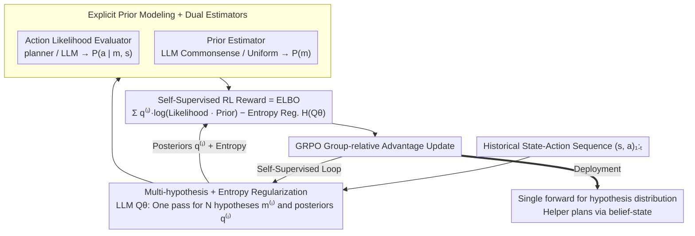

# MindZero: Learning Online Mental Reasoning with Zero Annotations

**Conference**: ICML2026  
**arXiv**: [2606.00240](https://arxiv.org/abs/2606.00240)  
**Code**: https://scai.cs.jhu.edu/MindZero  
**Area**: Reinforcement Learning / Theory of Mind / Multimodal LLM Post-training  
**Keywords**: Mental Reasoning, GRPO, Self-Supervised RL, Variational Inference, Proactive Assistance

## TL;DR
MindZero reformulates Bayesian Inverse Planning (BIP) into a "self-supervised RL" objective for multimodal LLMs. The reward maximizes the likelihood of observed human actions given the generated mental hypotheses. Trained via GRPO, the model achieves single-forward, fast, and robust online mental reasoning without requiring any manual mental annotations.

## Background & Motivation

**Background**: For AI to proactively assist humans in real-world environments, it must possess strong Theory of Mind (ToM)—inferring goals/beliefs from behavior. Current approaches follow three paths: (i) prompt-engineered LLMs for direct questioning; (ii) model-driven Bayesian Inverse Planning (BIP) which explicitly enumerates hypotheses; (iii) supervised learning (SL) to fit annotations.

**Limitations of Prior Work**: (1) Prompting methods systematically fail in long contexts and recursive reasoning; (2) BIP-based methods (e.g., AutoToM, ThoughtTracing) require searching and LLM evaluation at every step, often exceeding hundreds of TFLOPs per inference, making them unsuitable for real-time use; (3) Supervised learning is nearly impossible to scale as "ground-truth mental states" are rarely available in real-world household or web environments.

**Key Challenge**: Model-driven BIP is robust but slow, while LLM single-forward passes are fast but unreliable. Furthermore, the lack of ground-truth mental states in open scenarios necessitates a new paradigm: retaining the deductive structure of BIP (using action likelihood to verify hypotheses) during training, while compressing it into a single LLM forward pass during deployment.

**Goal**: (i) Train small multimodal LLMs for online, uncertainty-aware mental reasoning without any mental labels; (ii) ensure the trained models are both accurate and real-time responsive in proactive assistance tasks.

**Key Insight**: The ELBO form of BIP, $\mathbb{E}_{Q_\theta}[\log P(a|m,s) P(m)] + H(Q_\theta)$, depends naturally on the likelihood of the "action-state-hypothesis" triplet, rather than the ground-truth $m^\star$. By treating this term as an RL reward, the LLM can "internalize" the deductive structure of BIP via GRPO.

**Core Idea**: Use "explaining observed human actions" as a self-supervised reward to distill Bayesian Inverse Planning into the LLM strategy distribution.

## Method

### Overall Architecture

MindZero trains a multimodal LLM $Q_\theta(\cdot \mid s_{1:t}, a_{1:t})$. Given the historical state-action sequence, it outputs $N$ mental hypotheses $\mathcal{M}_t = \{m_t^{(1)}, \dots, m_t^{(N)}\}$ and their normalized posteriors $\mathcal{Q}_t = \{q_t^{(1)}, \dots, q_t^{(N)}\}$ (where $\sum q^{(i)} = 1$) in a single pass. An external "action likelihood evaluator" (a model-driven planner for GridWorld; an LLM for the household domain) provides $P(a_{1:t} \mid m_t^{(i)}, s_{1:t})$, while another LLM (or a uniform distribution) provides the prior $P(m_t^{(i)})$. The reward is synthesized and fed to GRPO to update the model. During deployment, the model performs one forward pass per timestep to obtain the hypothesis distribution, and a downstream helper plans actions via $P(a^A_t | s_{1:t}, a_{1:t}) = \sum_{m_t} P(a^A_t | s_t, m_t) P(m_t | s_{1:t}, a_{1:t})$.

### Key Designs

**1. Self-Supervised RL Reward = ELBO: Learning signals without mental annotations**

The primary barrier to ToM is the absence of ground-truth mental states $m^\star$ in open scenarios. MindZero frames ToM as variational inference $Q_\theta \approx P(m|s,a)$, maximizing the ELBO which relies only on the triplets:

$$\mathcal{J}(\theta) = \mathbb{E}_{Q_\theta}\big[\log\big(P(a_{1:t}|m_t,s_{1:t})\cdot P(m_t)\big)\big] + H(Q_\theta).$$

For $N$ sampled hypotheses, this becomes $R(\mathcal{M}_t,\mathcal{Q}_t)=\sum_i q_t^{(i)}\log[P(a_{1:t}|m_t^{(i)},s_{1:t})P(m_t^{(i)})] - \sum_i q_t^{(i)}\log q_t^{(i)}$. GRPO facilitates updates using group-relative advantages without a critic. This effectively "internalizes" the deductive structure of BIP into the LLM weights.

**2. Multi-hypothesis + Entropy Regularization: Preventing premature commitment**

BIP is robust because it explicitly tracks multiple hypotheses. Single-point predictions in ambiguous tasks (like early-stage GridWorld) cause helpers to act prematurely in the wrong direction. MindZero enforces the output of $N$ hypotheses and their posteriors $\{q_t^{(i)}\}$, while using the entropy term $H(Q_\theta)=-\sum_i q_t^{(i)}\log q_t^{(i)}$ to penalize "point-collapse." This allows the downstream helper to weight actions based on the distribution until more evidence is observed.

**3. Explicit Prior Modeling + Dual Estimators: Preventing reward hacking and enabling transfer**

Without a prior, models might output overly broad goals (e.g., "pick up everything") to make any action appear "likely," leading to reward hacking. MindZero uses an LLM as a prior estimator to score "commonsense plausibility" (e.g., "putting an apple in the dishwasher" receives a very low log-prior). The likelihood $P(a_{1:t}|m_t,s_{1:t})$ is provided by domain-specific evaluators—a model-based planner for GridWorld and a pre-trained LLM for the household domain. Decoupling likelihood and prior allows the framework to migrate to new domains by merely swapping the planner or prompt.

### Loss & Training

The reward $R$ is calculated as above, and $Q_\theta$ is updated via GRPO using group-normalized advantages. Small models like Llama-3.2-3B undergo an SFT "warm-up" using historical data sampled from Llama-3.1-8B to learn formatting (without ground-truth) before RL.

## Key Experimental Results

### Main Results

Evaluations were conducted on GridWorld QA, GridWorld Proactive Assistance, Household QA (MMToM-QA), and Household Proactive Assistance (O-WAH). The "Speedup" metric indicates the efficiency gain relative to a human performing the task alone.

| Scenario | Baseline (Same Backbone) | MindZero (Ours) | Notes |
|------|----------------|------------------|------|
| GridWorld Assistance (Qwen3-VL-4B) | 1.4% speedup | 23.0% speedup | Order of magnitude improvement |
| GridWorld Assistance (Qwen3-VL-8B) | -0.1% speedup | 24.5% speedup | Base 8B model had negative speedup |
| Household Assistance (Qwen3-4B) | 2.3% speedup | 19.1% speedup | Outperforms GPT-5.2 (9.4%) & Gemini-3 (17.7%) |
| Household Assistance (Llama-3.1-8B) | 1.7% speedup | 17.4% speedup | Beats Gemini-3-Flash with ~1/2 compute |
| QA Accuracy (avg.) | Base Models | 2.1–2.5× | Accuracy multiplier over base models |

### Ablation Study (Qwen3-4B / Household Assistance)

| Configuration | Speedup ↑ | TFLOPs ↓ | Note |
|------|------------|------------|------|
| MindZero (Full) | 19.1% | 201.2 | All three designs active |
| w/o Explicit Prior | 17.0% | 200.5 | Slight reward hacking tendency |
| w/o Multi-hypothesis | 10.3% | 132.6 | Single-point prediction; early commitment |
| w/o Entropy Regularization | 5.2% | 245.1 | Mode collapse; worst performance |

### Key Findings

- **Small Model + MindZero ≥ Large Model Zero-shot**: A 4B Qwen3 model trained with MindZero achieved a 19.1% speedup in household assistance, surpassing the 235B Qwen3-235B-A22B (12.3%) and GPT-5.2 (9.4%).
- **Large Models Fail on GridWorld**: GPT-5.2 and Gemini-3-Flash achieved $\leq 1\%$ speedup because their goal predictions fluctuated wildly at each step, causing the agent to oscillate. MindZero's 24.5% speedup highlights that "online reasoning stability" is more critical than "single-step reasoning quality."
- **Entropy > Hypotheses > Prior**: Ablation results show that the entropy term is the "soul" of MindZero for preventing collapse, while the prior acts as a "fuse" against reward hacking.
- **Human Study**: In tests with 12 human subjects, MindZero (Qwen3-4B) provided a 19.7% real-world speedup, which is statistically comparable ($p=0.24$) to Gemini-3-Flash (23.4%).

## Highlights & Insights

- **BIP as RL Reward**: Rewriting variational ELBO as a reward for GRPO allows Bayesian Inverse Planning to be internalized by LLMs as a single-forward pass without needing labels.
- **Formatting as Contribution**: By forcing a $(m^{(i)}, q^{(i)})$ schema, the model avoids collapse through explicit entropy regularization and enables downstream belief-state planning.
- **Transferable Paradigm**: The "ELBO-as-reward + GRPO" paradigm can be applied to any LLM post-training task requiring inverse inference (e.g., code debugging, intent inference, or robot failure diagnosis) where $P(\text{evidence}|\text{hypothesis})$ can be defined.

## Limitations & Future Work

- **First-order ToM Only**: Currently only models one-level ToM (user's mind) and does not handle recursive "A thinks that B thinks..." reasoning.
- **Context Length**: The input sequence $s_{1:t}, a_{1:t}$ grows linearly with time, which may exceed context limits in long-horizon tasks.
- **Evaluator Dependency**: Model-based planners in GridWorld are computationally cheap, but LLM-based likelihood estimation in household domains is expensive. Bias in the evaluator (e.g., unfamiliarity with objects) can propagate into the RL training.

## Related Work & Insights

- **vs. BIP / AutoToM / ThoughtTracing**: BIP methods are robust but slow due to repeated LLM calls; MindZero distills this structure into weights for real-time inference.
- **vs. Supervised ToM (Rabinowitz 2018)**: MindZero removes the reliance on mental state labels by using "behavior as supervision."
- **vs. DeepSeek-R1 / GRPO in Math/Code**: While most GRPO applications focus on "correct answer matching," MindZero advances the framework into the "likelihood-based inverse inference" task family.

## Rating
- Novelty: ⭐⭐⭐⭐⭐ A clean and critical paradigm shift by treating ELBO as an RL reward.
- Experimental Thoroughness: ⭐⭐⭐⭐ Extensive coverage across environments and models; however, lacks large-scale open-domain evaluation.
- Writing Quality: ⭐⭐⭐⭐ Clear problem definitions and derivations.
- Value: ⭐⭐⭐⭐⭐ Enables small models to reach or exceed state-of-the-art closed-model performance in proactive assistance.

<!-- RELATED:START -->

## Related Papers

- [\[ICLR 2026\] R-Zero: Self-Evolving Reasoning LLM from Zero Data](../../ICLR2026/reinforcement_learning/r-zero_self-evolving_reasoning_llm_from_zero_data.md)
- [\[ICML 2026\] Unlocking Zero-Shot Geospatial Reasoning via Indirect Rewards](unlocking_zero-shot_geospatial_reasoning_via_indirect_rewards.md)
- [\[ICLR 2026\] REA-RL: Reflection-Aware Online Reinforcement Learning for Efficient Reasoning](../../ICLR2026/reinforcement_learning/rea-rl_reflection-aware_online_reinforcement_learning_for_efficient_reasoning.md)
- [\[ICML 2026\] Bilevel Optimization over Saddle Points of Zero-Sum Markov Games](bilevel_optimization_over_saddle_points_of_zero-sum_markov_games.md)
- [\[ICLR 2026\] SPIRAL: Self-Play on Zero-Sum Games Incentivizes Reasoning via Multi-Agent Multi-Turn Reinforcement Learning](../../ICLR2026/reinforcement_learning/spiral_self-play_on_zero-sum_games_incentivizes_reasoning_via_multi-agent_multi-.md)

<!-- RELATED:END -->
