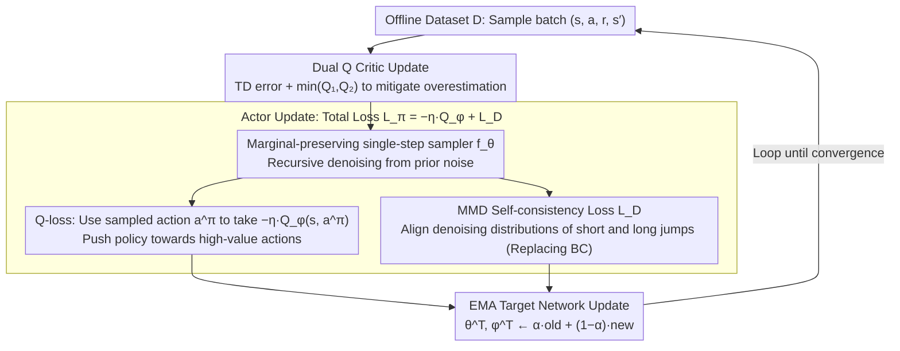

# MoMa QL: Accelerating Diffusion/Flow Matching Policies for Offline and Offline-to-Online RL via Moment Matching

**Conference**: ICML 2026  
**arXiv**: [2605.29033](https://arxiv.org/abs/2605.29033)  
**Code**: Not yet released  
**Area**: Reinforcement Learning / Offline RL / Diffusion Policy  
**Keywords**: Offline RL, Diffusion Policy, Flow Matching, Maximum Mean Discrepancy, Stochastic Interpolants, Consistency Models

## TL;DR
MoMa QL replaces the standard BC loss with Maximum Mean Discrepancy (MMD), compressing the multi-step sampling of diffusion/flow matching policies into a single-step or few-step "marginal-preserving interpolation" sampler. It achieves a Gym normalized score of 95.5 on D4RL, significantly leading Diffusion-QL (87.9). Due to much faster sampling, it shows greater gains in offline-to-online fine-tuning compared to Consistency AC and Diffusion-QL.

## Background & Motivation

**Background**: Offline RL aims to learn an optimal policy from static datasets. The difficulty lies in unreliable value estimation for OOD actions and increasingly complex multi-modal behavior distributions. Generative policies based on diffusion or flow matching (Diffusion-QL, IDQL, FQL) have become mainstream as they can represent arbitrary multi-modal behaviors more effectively than GMMs or VAEs.

**Limitations of Prior Work**: Sampling in diffusion/flow matching policies is iterative—inference requires dozens to hundreds of denoising steps. For actor-critic training in offline RL, every actor update requires online sampling of actions to input into the critic; iterative sampling leads to explosive training costs. More critically, during the offline-to-online phase, online rollouts require sampling at almost every time step, causing diffusion policies to be bottlenecked by sampling latency in real environments.

**Key Challenge**: There is a natural conflict between expressivity (multi-step iteration) and computational efficiency (single-step sampling). While consistency models offer a solution (learning a mapping from "any time → clean sample"), they are primarily for distillation and are difficult to train jointly with critic signals within an actor-critic framework.

**Goal**: To find a sampler $p^\theta_{s|t}(\mathbf{x}|\mathbf{x}_t)$ that can jump from any time $t$ in a diffusion trajectory to any earlier time $s$ in a single step, while being directly optimizable by the critic's Q-signal with training stability.

**Key Insight**: Align the "target distribution the sampler aims to approximate" with the "intermediate distribution of the diffusion process" using MMD. MMD is a distribution distance based on RKHS that implicitly captures all orders of moments in the feature space. It is more stable than single-moment constraints (like BC log-likelihood) and more friendly to generative models than likelihood-based constraints like KL/JS.

**Core Idea**: Replace the BC loss in the BRAC framework with the "MMD between the marginal distributions $p^{\theta^-}_{s|r}$ and $p^\theta_{s|t}$ originating from two different intermediate steps $r<s<t$." This allows the policy to learn to denoise from any noise level to any cleaner level in a single step, while training the critic synchronously with Q-loss. This process functions as a hybrid of consistency training and actor-critic.

## Method

### Overall Architecture

Built on BRAC as a dual Q-learning framework: the critic uses classic TD($\lambda=0$) + double Q, while the actor includes two components—(1) Q-loss: recursively generating actions $\mathbf{a}^\pi$ from a prior using the learned sampler and feeding them into the critic for $-\eta Q$; (2) BC-loss: utilizing MMD consistency constraints to make the sampler self-consistent across different intermediate time steps. The sampling stage directly follows a DDIM-style recursion: starting from $\mathbf{a}_N \sim \mathcal{N}(0,\sigma_d^2 I)$, the learned $f_\theta(t_{i-1}, t_i, \mathbf{a}_{t_i})$ is called at each step to jump to the next time step. The training is a loop of "sampling batch → critic update → actor update (both losses share the same sampler) → EMA target update." Few-step sampling makes this loop efficient and prevents online rollouts from being stalled by sampling latency.

### Key Designs

**1. Marginal-preserving Stochastic Interpolants + Cross-time Single-step Sampler: Changing Diffusion from "Step-by-step Denoising" to "Single-step Jump from any $t$ to any earlier $s$"**

Traditional diffusion/flow matching only learns $t\to t-1$ mapping, leading to high multi-step sampling costs. MoMa QL defines marginal interpolants $q_t(\mathbf{x}_t)=\iint q_t(\mathbf{x}_t|\mathbf{x},\boldsymbol{\varepsilon})q(\mathbf{x})p(\boldsymbol{\varepsilon})d\mathbf{x}d\boldsymbol{\varepsilon}$ and condition $q_{s|t}(\mathbf{x}_s|\mathbf{x},\mathbf{x}_t)=\mathcal{N}(I_{s|t}(\mathbf{x},\mathbf{x}_t),\gamma^2_{s|t}I)$ based on stochastic interpolants, requiring "marginal preservation"—where for any $s\le t$, $q_s=\iint q_{s|t}q_t(\mathbf{x}|\mathbf{x}_t)q_t(\mathbf{x}_t)d\mathbf{x}_t d\mathbf{x}$. The model learns an implicit sampler $p^\theta_{s|t}(\mathbf{x}|\mathbf{x}_t)=\delta(\mathbf{x}-G_\theta(\mathbf{x}_t,s,t))$: given $\mathbf{x}_t$, it directly predicts a clean sample $\tilde{\mathbf{x}}$, then applies DDIM interpolation to obtain $\tilde{\mathbf{x}}_s$. This is equivalent to learning a consistency model, but under the unified perspective of stochastic interpolants, both single-step and multi-step inference modes are naturally supported. Offline training can use multi-step to preserve expressivity, while online rollouts switch to single-step for acceleration.

**2. MMD Self-consistency Loss: Replacing Likelihood Constraints of BC with Maximum Mean Discrepancy for Stable, Higher-order Moment Alignment**

BC using Gaussian log-likelihood only matches first-order moments, failing to characterize multi-modal behaviors in offline data. Directly matching $q_s(\mathbf{x}_s)$ and $p^\theta_{s|t}(\mathbf{x}_s)$ is unstable—when $t$ and $s$ are far apart, the difference between $q_t$ and $q_s$ is large and hard to estimate. Borrowing from consistency training, the authors introduce an intermediate time $r$ ($s<r<t$) and enforce self-consistency by minimizing the distance between "short jumps" and "long jumps":

$$\mathcal{L}_D(\theta)=\mathbb{E}_{s,r,t}\big[\mathrm{MMD}^2(p^{\theta^-}_{s|r}(\mathbf{x}_s),\,p^\theta_{s|t}(\mathbf{x}_s))\big].$$

Using the RBF kernel $k(x,y)=e^{-\|x-y\|^2/(2\sigma^2)}$ (which is characteristic and implicitly captures all orders of moments) with the unbiased estimator by Gretton et al., density estimation is avoided. This choice offers three benefits: higher-order moment matching characterizes multi-modal behaviors accurately, the sample-based nature is compatible with implicit generative models like diffusion, and the self-consistency form shares roots with consistency models—the paper proves in the Appendix that CM is a special case of this framework at the $r\to s$ limit.

**3. Consistency Induction + Dual Q Overestimation Mitigation: Jointly Training "Short-jump Consistency" and "Stable Q Estimation"**

Every actor update requires sampling actions $\mathbf{a}^\pi$ for the critic. If sampling takes 100 steps, a single update requires 100 network forward passes; this framework reduces this overhead by one or two orders of magnitude through few-step sampling. The critic uses classic TD3+BC dual Q $\mathcal{L}(\phi)=\mathbb{E}[(r+\gamma\min_{i\in\{1,2\}}Q_{\phi^T_i}(\mathbf{s}',\mathbf{a}')-Q_{\phi_i}(\mathbf{s},\mathbf{a}))^2]$ to mitigate overestimation, where $\mathbf{a}'\sim\pi_{\theta^T}(\cdot|\mathbf{s}')$ is sampled by the actor's inference algorithm. The actor's target $\theta^-$ is an EMA stop-gradient policy providing a stable reference for the MMD consistency constraint, with the target network updated as $\theta^T\leftarrow\alpha\theta^T+(1-\alpha)\theta$. Few-step sampling allows "actor update + critic update" to converge within a reasonable time, which is key to enabling diffusion policies for offline-to-online fine-tuning.

### Loss & Training

The total actor loss is $\mathcal{L}_\pi(\theta) = -\eta \mathbb{E}[Q_\phi(\mathbf{s}, \mathbf{a}^\pi)] + \mathcal{L}_D(\theta)$, where $\mathbf{a}^\pi$ is generated by recursively calling $f_\theta(t_{i-1}, t_i, \mathbf{a}_{t_i})$ as per Algorithm 2. $\eta$ controls the trade-off between the Q-signal and MMD consistency. The critic is standard dual Q TD. The overall training loop includes critic updates → actor updates → EMA target updates, synchronized with BRAC.

## Key Experimental Results

### Main Results: D4RL Task Comparison

| Task Suite | BC | Diffusion-BC | Consistency-BC | CQL | IQL | Diffusion-QL | Consistency-AC | **MoMa QL** |
|---------|-----|--------------|-----------------|-----|-----|--------------|-----------------|-------------|
| Gym BC Avg (9 tasks) | 51.9 | 76.3 | 69.7 | — | — | — | — | **89.8** |
| Gym Offline RL (9 tasks) | — | — | — | 77.6 | 77.0 | 87.9 | 85.1 | **95.5** |
| Adroit (12 tasks) | 48.3 | — | — | — | 53.4 | — | 42.9 | **56.7** |
| Kitchen (3 tasks) | — | — | — | 48.2 | 53.3 | 69.0 | 45.3 | **73.1** |

On Gym BC, it shows a 1.18× improvement over Diffusion-BC (76.3) and 1.73× over vanilla BC (51.9). On Gym Offline RL, it improves by 1.09× over Diffusion-QL (87.9), leading by 14% on HalfCheetah and 8.5% on Walker2D. On Adroit, it slightly outperforms ReBRAC (55.4) and ranks first in the door task (38.5).

### Key Experimental Results (Offline-to-Online Fine-tuning on Gym)

| Task | Offline Score | Online Score | Gain |
|------|-------|-------|------|
| HalfCheetah-m | 72.6 | 83.1 | +10.5 |
| Hopper-m | 104.2 | 104.3 | +0.1 |
| Walker2d-m | 95.6 | 99.1 | +3.5 |
| HalfCheetah-mr | 63.3 | 80.9 | +17.6 |

The largest improvement occurs in medium-replay tasks (HalfCheetah-mr +28% relative), validating the causal chain: "Fast sampling → efficient online interaction → more thorough fine-tuning."

### Key Findings

- **Multimodal Behavior Capture**: MoMa QL shows the greatest relative advantage on medium-replay (most multi-modal) data, leading the strongest baseline by 1.26× on walker2d-mr and 1.44× on halfcheetah-m, verifying the advantage of MMD higher-order moment matching for multi-modal distributions.
- **Trading Sampling Efficiency for Online Capability**: Diffusion-QL performs strongly in the offline phase but often suffers from performance degradation during online fine-tuning due to slow sampling. MoMa QL's single-step sampling makes online interaction almost as fast as Gaussian policies, allowing offline-to-online performance to maintain a "continuous upward" trend.
- **Anomaly on hopper-me**: MoMa QL scored 67.9 while BC-based baselines were at 100+. This suggests that on data already close to optimal behavior, excessively strong higher-order moment matching turns MMD self-consistency into noise. This is a trade-off in actor signal design.
- **Discriminative vs. Generative**: On Adroit, ReBRAC is slightly stronger on expert datasets, but MoMa QL is more stable in settings with mixed data quality, indicating its advantage lies more in "covering multi-modal behavior distributions" than "pure expert imitation."

## Highlights & Insights

- **MMD as a Dual Match for Tools and Objects**: The higher-order moment properties of MMD align perfectly with the multi-modal requirements of offline RL, while its sample-based nature aligns with implicit generative models like diffusion. This "natural fit" makes the methodology more than just performance numbers; it is a paradigmatic alignment.
- **Unification of Consistency Training and Actor-Critic**: Previously, consistency models were mainly used for unsupervised accelerated sampling. This paper incorporates them into the Q-learning training loop and proves CM is a special case, providing a unified path for "accelerating generative policies = consistency distillation + RL signal joint training."
- **Flexibility of Marginal-preserving Interpolation**: Supports switching between single-step and multi-step sampling within a unified framework—using multi-step during offline training to ensure expressivity and switching to single-step for online rollout acceleration. This decoupling of "accurate training vs. fast inference" is very deployment-friendly.
- **Stability from Kernel Functions rather than Hyperparameter Tuning**: The boundedness of the RBF kernel and the non-negativity of MMD ensure the actor loss does not explode. Compared to the numerical issues of KL-divergence (positive/negative infinity), it is better suited for RL scenarios where rewards fluctuate across orders of magnitude.

## Limitations & Future Work

- **Dependence on MMD Kernel**: Experiments primarily use RBF with adaptive bandwidth, but the choice of kernel significantly affects MMD performance. Optimal kernels might vary by task, and the paper does not deeply discuss kernel selection strategies.
- **Trade-off between Q-signal and MMD**: Hyperparameter $\eta$ controls the balance between Q-dominance and MMD-dominance; the appendix indicates sensitivity to this value. The anomaly on hopper-me might be a side effect of $\eta$ not scaling adaptively on expert data.
- **Variance of MMD Estimation**: Sample-based MMD has high variance with small batches, which might require larger batches or more complex unbiased estimators for high-dimensional action tasks (e.g., robotics). Experiments were focused on medium dimensions.
- **Asymptotic Theoretical Convergence**: The conclusion that CM is a special case at the $r \to s$ limit requires more detailed discretization error analysis for finite step sizes.

## Related Work & Insights

- **vs. Diffusion-QL / IDQL**: These use full multi-step diffusion sampling, providing high expressivity but at high training/online costs. MoMa QL uses MMD consistency to compress sampling to single or few steps, leading to better performance.
- **vs. Consistency-AC / FQL**: Also aiming to accelerate generative policies—CAC uses CM distillation and FQL uses flow matching distillation, but they separate "acceleration" from "RL signal." This paper jointly trains both within an MMD self-consistency loss, achieving superior training efficiency and final performance.
- **vs. QGPO / EDP / QIPO**: Energy-guided diffusion treats RL objectives as reward weighting. This paper follows the "explicit multi-step distribution matching" route, which does not rely on energy importance sampling and is more stable during training.
- **Insight**: For any scenario requiring "multi-step iterative generation + task signals" (robotics control, text generation RL, visual agents), this three-part formula of "marginal-preserving interpolation + MMD consistency + task loss" can be applied.

## Rating

- Novelty: ⭐⭐⭐⭐ Unifying MMD, consistency training, and actor-critic via stochastic interpolants is a novel paradigmatic synthesis, and the proof of CM as a special case provides theoretical value.
- Experimental Thoroughness: ⭐⭐⭐⭐ Covers three major D4RL suites, offline, and offline-to-online with multiple strong baselines; however, ablation on kernel functions and $\eta$ is slightly thin.
- Writing Quality: ⭐⭐⭐⭐ Clear derivations and complete notation. The correspondence between Algorithm 1 and Algorithm 2 is somewhat condensed in the main text and requires the appendix for full clarity.
- Value: ⭐⭐⭐⭐⭐ Provides a practical solution for the deployment bottlenecks of diffusion policies (slow online rollouts), leads the D4RL leaderboard, and the methodology is transferable to other generative RL scenarios.

<!-- RELATED:START -->

## Related Papers

- [\[ICML 2026\] Reverse Flow Matching: A Unified Framework for Online Reinforcement Learning with Diffusion and Flow Policies](reverse_flow_matching_a_unified_framework_for_online_reinforcement_learning_with.md)
- [\[ICLR 2026\] Flow Matching Policy Gradients](../../ICLR2026/reinforcement_learning/flow_matching_policy_gradients.md)
- [\[ICLR 2026\] Q-Learning with Adjoint Matching](../../ICLR2026/reinforcement_learning/q-learning_with_adjoint_matching.md)
- [\[ICLR 2026\] Bridging Successor Measure and Online Policy Learning with Flow Matching-Based Representations](../../ICLR2026/reinforcement_learning/bridging_successor_measure_and_online_policy_learning_with_flow_matching-based_r.md)
- [\[ICLR 2026\] Accelerating Diffusion Planners in Offline RL via Reward-Aware Consistency Trajectory Distillation](../../ICLR2026/reinforcement_learning/accelerating_diffusion_planners_in_offline_rl_via_reward-aware_consistency_traje.md)

<!-- RELATED:END -->
