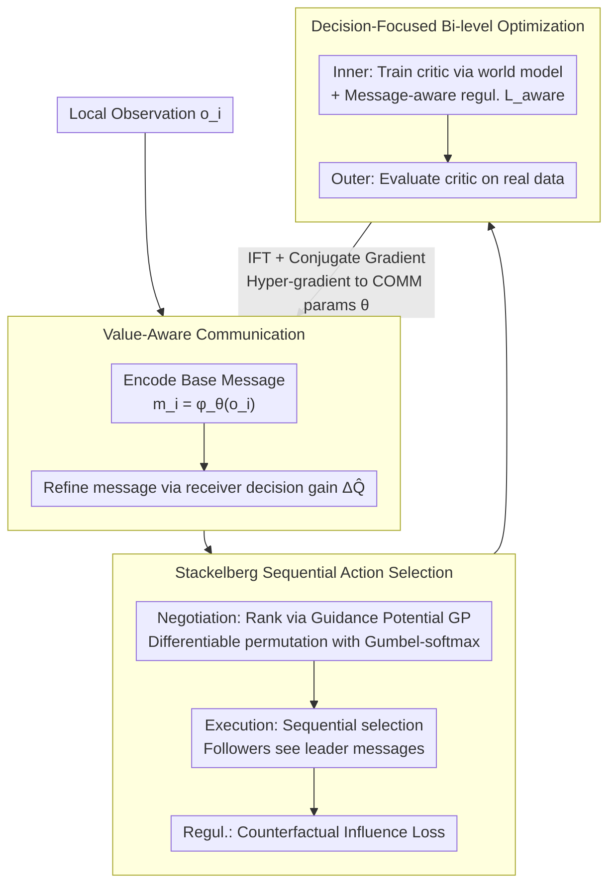

# Multi-Agent Decision-Focused Learning via Value-Aware Sequential Communication

**Conference**: ICML 2026  
**arXiv**: [2604.08944](https://arxiv.org/abs/2604.08944)  
**Code**: None  
**Area**: Reinforcement Learning / Multi-Agent Systems  
**Keywords**: Multi-Agent Communication, Decision-Focused Learning, Stackelberg Sequential Decision Making, Bi-level Optimization, QMIX

## TL;DR
SeqComm-DFL treats "multi-agent communication" as a predictor and "joint policy selection" as a downstream optimizer. By combining value-aware message generation, Stackelberg sequential conditioning, and implicit differentiation bi-level optimization, it aligns communication learning directly with team rewards. It achieves a 4-6x increase in cumulative rewards and a >13 percentage point improvement in win rates in hospital scheduling and SMAC tasks.

## Background & Motivation

**Background**: Mainstream Cooperative Multi-Agent Reinforcement Learning (MARL), represented by QMIX, MAPPO, and MADDPG, adopts the "Centralized Training, Decentralized Execution" (CTDE) paradigm to mitigate non-stationarity and credit assignment via value decomposition or actor-critic methods. Communication learning methods (CommNet, DIAL, NDQ, SeqComm, MAIC, etc.) further address coordination challenges under partial observability by allowing agents to exchange messages.

**Limitations of Prior Work**: Optimization objectives for current communication protocols are essentially **proxy objectives**—reconstruction accuracy, mutual information, or simple token prediction—rather than the actual information content that affects downstream decision quality. Consequently, bandwidth is wasted on features that are "informative but action-irrelevant," mirroring the classic "objective mismatch" problem in model-based RL where world models sacrifice value-relevant error for pixel-level fitting.

**Key Challenge**: The optimization signals for communication modules (reconstruction/MI) are decoupled from the final team goal (cumulative reward) in terms of gradient direction. Consequently, even if an agent learns to "accurately describe what it sees," it may not lead to better decisions by teammates. Furthermore, concurrent action selection among multiple agents naturally suffers from coordination ambiguity among multiple equilibria.

**Goal**: (1) Enable the communication module to be directly supervised by "downstream decision quality"; (2) Break coordination ambiguity under symmetric concurrent decision-making; (3) Extend Decision-Focused Learning (DFL) from single-agent programs with exogenous uncertainty to multi-agent settings with endogenous uncertainty (where messages in turn change other agents' policies).

**Key Insight**: This work views communication as the "predictor" in a Predict-and-Optimize framework and multi-agent policy selection as the "optimizer." This naturally leads to an end-to-end paradigm where gradients backpropagate from the final task loss to the communication module. A Stackelberg leader-follower structure is employed to break the symmetry of multi-agent action selection.

**Core Idea**: Utilize "receiver Q-value gain $\Delta Q_j(m_i)$" instead of "message mutual information" as the communication training signal. Agents are scheduled via a sequential condition based on prosocial guidance potential ranking. Finally, bi-level optimization gradients are backpropagated to communication parameters using the Implicit Function Theorem.

## Method

### Overall Architecture
SeqComm-DFL partitions the coordination problem under Dec-POMDP into three coupled modules: (1) **Value-Aware Communication** — each agent encodes local observations $o_i$ into a base message $m_i^{\text{base}}=\phi_\theta(o_i)$, which is then refined by a network based on the estimated receiver decision gain $\Delta\hat Q_i$. (2) **Stackelberg Sequential Action Selection** — agents are prioritized using guidance potential $\pi=\text{argsort}(-\text{GP})$. Actions $a_{\pi_k}=\arg\max_a Q_{\pi_k}(o_{\pi_k}, M_{1:\pi_k-1}, a)$ are selected sequentially, allowing followers to observe messages already sent by leaders. (3) **Decision-Focused World Model Bi-level Optimization** — the inner loop trains the critic using world model predictions, while the outer loop evaluates the critic on real environment data and propagates gradients back to the world model and communication modules via implicit differentiation. These components form an end-to-end trainable loop via hyper-gradients: communication is no longer trained on reconstruction error but is instead supervised by the final team reward.

### Key Designs

**1. Value-Aware Message Generation: Replacing "reconstruction accuracy" with "teammate decision improvement" as training signals**

Traditional protocols optimize reconstruction error or mutual information. However, even a message that perfectly describes an observation is worthless if those details do not change a teammate's action—bandwidth is wasted on "informative but decision-irrelevant" features. The authors quantify decision value as the receiver decision gain $\Delta Q_j(m_i) = \max_a Q_j(o_j, m_i, a) - \max_a Q_j(o_j, \emptyset, a)$, representing how much the optimal Q for agent $j$ increases when the message is present. Its negation is used as the loss $\mathcal{L}_{\text{VA}}(\theta) = -\frac{1}{B \cdot N(N-1)} \sum_b \sum_i \sum_{j\neq i} \Delta Q_j(m_i^{(b)})$, forcing each message to maximize the optimal Q of other agents. Since the critic $Q_w$ is unreliable early in training, Monte Carlo rollouts $\Delta Q_j^{\text{MC}}$ are used initially, then smoothed into the critic estimate via annealing $\Delta\hat Q = (1-\beta_t)\Delta Q^{\text{MC}}+\beta_t \Delta Q_w$. This loss is theoretically grounded: the authors use the envelope theorem to prove that at the optimal critic, the gradient of the true task loss with respect to the message is $\propto -\sum_{j\neq i} \nabla_{m_i} Q_j$, which aligns exactly with $\Delta Q_j$. Thus, it is a dual quantity naturally derived from DFL, decoupling "which information is worth communicating" from "information-theoretic bits."

**2. Stackelberg Sequential Conditioning + Guidance Potential Ranking: Learning "who speaks first" to break concurrent coordination ambiguity**

Simultaneous action selection by multiple agents naturally leads to relative overgeneralization and multiple equilibria—agents bet on each other's moves and may fall into sub-optimal equilibria. The authors implement a three-stage sequential coordination. In the **negotiation stage**, a prosocial guidance potential $\text{GP}_i(s) = \mathbb{E}_{\mathbf{a}^*}[Q_{1:N}(s,\mathbf{a}^*|i^+) - Q_{1:N}(s,\mathbf{a}^*|i^-)]$ is calculated for each agent, measuring the contribution of making that agent a "leader" to the team's total reward. This is converted into a differentiable permutation $\pi=\text{argsort}(-\text{GP})$ via Gumbel-softmax. In the **publication stage**, actions are selected sequentially according to $\pi$, where $a_{\pi_k}=\arg\max_a Q_{\pi_k}(o_{\pi_k}, M_{1:\pi_k-1}, a)$, allowing followers to observe messages from higher-priority agents. The **regularization stage** uses a counterfactual influence loss $\mathcal{L}_{\text{inf}} = -\frac{1}{N(N-1)}\sum_i \sum_{j\neq i} D_{\text{KL}}[\pi_j(\cdot|m_i)\,\|\,\pi_j(\cdot|\emptyset)]$ to force messages to actually change the receiver's policy rather than just being correlated. Unlike SeqComm's ranking based on "desire to act," guidance potential is prosocial: theoretically $\text{GP}_i \propto \sum_{j\neq i} I(M_i; a_j^*|o_j)$, so agents holding key private information for coordination are naturally pushed to the leader position, allowing teammates to make decisions based on valuable priors into a Pareto-superior Stackelberg equilibrium.

**3. Decision-Focused Bi-level World Model + Implicit Differentiation: Optimizing world models for "maximum team reward" rather than "next-frame prediction"**

In MARL, world models and critics are naturally linked in a chain, forming a bi-level structure. The authors define this explicitly: the outer loop minimizes $\mathcal{L}_{\text{true}}(w^*(\theta);\theta)$ (evaluating the critic on real data), while the inner loop $w^*(\theta)=\arg\min_w \mathcal{L}_{\text{model}}(w;\theta) + \lambda_{\text{aware}}\mathcal{L}_{\text{aware}}(w)$ trains the critic using model predictions. Communication and world model parameters are optimized together in the outer loop. To avoid "inner apathy"—where the critic learns to ignore messages $M$, causing the hyper-gradient to vanish—a hinge-form message-aware regularization $\mathcal{L}_{\text{aware}}=\max(0, \epsilon_{\text{margin}} - |Q_w(s,a,M)-Q_w(s,a,\mathbf{0})|)$ is added to force a margin between Q-values with and without message inputs. Instead of backpropagating through $K_{\text{inner}}$ steps of gradient descent (which leads to vanishing/exploding gradients), the outer gradient is computed by expanding at the inner fixed point via the Implicit Function Theorem:

$$\frac{dw^*}{d\theta}=-[\nabla^2_{ww}\mathcal{L}_{\text{model}}]^{-1}\nabla^2_{\theta w}\mathcal{L}_{\text{model}},$$

where the inverse Hessian-vector product $H^{-1}b$ is approximated using Conjugate Gradient $(H+\lambda I)v^* = b$, requiring only two autodiff steps per iteration. Theoretically, this decoupling has been proven in single-agent OMD to keep $\|Q^* - \hat Q_{\text{DFL}}\|_\infty \le \epsilon/(1-\gamma)$, which is tighter than MLE. Ours extends this to multi-agent scenarios with communication and QMIX decomposition while addressing the message apathy bottleneck.

### Loss & Training
Total outer objective: $\theta \leftarrow \theta - \eta(\frac{d\mathcal{L}_{\text{true}}}{d\theta}+\lambda_{\text{VA}}\nabla\mathcal{L}_{\text{VA}}+\lambda_{\text{inf}}\nabla\mathcal{L}_{\text{inf}})$; inner loop uses $K_{\text{inner}}$ SGD steps to train $w$; target networks use Polyak EMA $\bar w \leftarrow \tau_{\text{ema}}\bar w + (1-\tau_{\text{ema}})w$; warmup phase $\beta_t = \min(t/T_w, 1)$ ensures smooth transition from MC-based $\Delta Q$ to critic-based; Gumbel-softmax provides differentiable exploration for priority ranking. Theoretical convergence: $\frac{1}{T}\sum_t \mathbb{E}\|\nabla_\theta \mathcal{L}_{\text{true}}\|^2 \le O(1/\sqrt T)$.

## Key Experimental Results

### Main Results
Two environments were tested: a custom multi-specialty hospital collaboration ($N=3$ specialists, $\mathcal P=100$ patients, specialty-gated hidden risks) and the standard SMAC benchmark.

| Environment | Metric | SeqComm-DFL | Prev. SOTA | Gain |
|------|------|-------------|-----------|------|
| Hospital Dec-POMDP | Cumulative Reward | 4-6× baseline | QMIX/MAPPO/SeqComm | Several-fold increase |
| SMAC | Win Rate | +13pp | QMIX/MAIC | Significantly outperformed |
| Hospital | Comm Value $\Delta V$ | Consistent with lower bound $\frac{L_R}{1-\gamma}\sum\sqrt{2\ln 2\cdot I_i\cdot\text{Var}(a_i^*)}$ | — | Validates Thm 5.1 |

### Ablation Study

| Configuration | Key Effect | Description |
|------|---------|------|
| Full SeqComm-DFL | Optimal | All modules enabled |
| w/o $\mathcal{L}_{\text{VA}}$ | Comm degrades to reconstruction | Messages no longer optimized for decisions |
| w/o Stackelberg ordering | Coordination ambiguity | Falls into sub-optimal equilibrium via concurrent selection |
| w/o $\mathcal{L}_{\text{aware}}$ | Inner apathy | Critic ignores messages; hyper-gradients vanish |
| w/o IFT / Direct BPTT inner | Training divergence | Vanishing gradients during backprop through $K_{\text{inner}}$ steps |

### Key Findings
- Value-aware loss + message-aware regularization are two necessary conditions for end-to-end training; without them, communication is drowned out by environmental noise.
- Guidance potential ranking allows agents with the largest information gap $\mathcal I_i$ to naturally become leaders; otherwise, it degrades to the intention-based ranking of SeqComm.
- The convergence rate $O(1/\sqrt T)$ is closely related to the bias $\epsilon_{\text{bias}}=\epsilon_{\text{inner}}+\epsilon_{\text{CG}}$ from implicit differentiation and CG; too few CG iterations result in biased outer gradients.

## Highlights & Insights
- **Communication as a DFL "Predictor"**: This work is the first to explicitly cast multi-agent communication into the predict-and-optimize framework. Proving $\Delta Q$ is the dual of the true loss gradient via the envelope theorem is an elegant transition from theory to engineering.
- **Message Apathy Regularization**: To solve the failure mode where critics ignore auxiliary inputs in bi-level settings, the authors use a hinge loss to force a margin. This idea is transferable to any scenario where auxiliary inputs are easily neglected (e.g., weak conditions in diffusion, retrieval results in RAG).
- **Stackelberg + Prosocial Ranking**: Learning "who speaks first" using ranking based on team benefit rather than individual preference is a fundamental shift from SeqComm. The use of Gumbel-softmax to make permutations differentiable is an efficient engineering implementation.

## Limitations & Future Work
- Implicit differentiation and CG are sensitive to the number of iterations and the damping coefficient $\lambda$ for high-dimensional $w$. The complexity analysis assumes a well-conditioned $H$, which may not hold in continuous control.
- The execution latency of Stackelberg leader-follower structures increases with agent count $N$. Experiments only reached mid-scale SMAC; swarm-level scalability remains unaddressed.
- The hospital Dec-POMDP is a custom environment where specialty gating creates "information gaps" tailored for the method; real-world cross-domain evaluation (e.g., traffic signals, multi-vehicle coordination) is missing.
- Communication content remains continuous vectors $m\in\mathbb R^{d_m}$; discrete symbols and actual bandwidth budgets are not considered.

## Related Work & Insights
- **vs SeqComm (Ding 2023)**: Both use sequential communication, but SeqComm ranks by intention value ("who wants to act most"), whereas OMRS uses prosocial guidance potential ("who can help teammates most") and optimizes message content end-to-end.
- **vs MAIC (Yuan 2022)**: MAIC treats messages as incentives for Q-values; this work adopts that idea for $\mathcal{L}_{\text{aware}}$ but binds the incentive to decision-focused bi-level optimization.
- **vs OMD (Nikishin 2022)**: OMD fixes objective mismatch in single-agent MBRL; this work extends it to multi-agent settings with endogenous uncertainty and communication, adding QMIX decomposition for scalability.
- **vs DFL (Donti 2017 / Elmachtoub-Grigas)**: Classic DFL assumes predictions do not change the ground truth of downstream optimization; this work is among the first to handle endogenous uncertainty (messages changing the action distribution of others).

## Rating
- Novelty: ⭐⭐⭐⭐⭐ First expansion of DFL to multi-agent, endogenous uncertainty, and communication.
- Experimental Thoroughness: ⭐⭐⭐⭐ Covered symmetric and asymmetric information in SMAC and hospital settings, but lacks swarm-scale or industrial scenarios.
- Writing Quality: ⭐⭐⭐⭐⭐ Extremely clear logic from concept to theory, algorithm, and experiments.
- Value: ⭐⭐⭐⭐ Insightful for communication learning, MB-MARL, and DFL communities, though implicit differentiation requires significant engineering.

<!-- RELATED:START -->

## Related Papers

- [\[ICML 2026\] LLM-Guided Communication for Cooperative Multi-Agent Reinforcement Learning](llm-guided_communication_for_cooperative_multi-agent_reinforcement_learning.md)
- [\[ICML 2025\] Counterfactual Effect Decomposition in Multi-Agent Sequential Decision Making](../../ICML2025/reinforcement_learning/counterfactual_effect_decomposition_in_multi-agent_sequential_decision_making.md)
- [\[ICML 2026\] Vulnerable Agent Identification in Large-Scale Multi-Agent Reinforcement Learning](vulnerable_agent_identification_in_large-scale_multi-agent_reinforcement_learnin.md)
- [\[ICLR 2026\] Continuous-Time Value Iteration for Multi-Agent Reinforcement Learning](../../ICLR2026/reinforcement_learning/continuous-time_value_iteration_for_multi-agent_reinforcement_learning.md)
- [\[ICML 2026\] Learning Query-Aware Budget-Tier Routing for Runtime Agent Memory](learning_query-aware_budget-tier_routing_for_runtime_agent_memory.md)

<!-- RELATED:END -->
