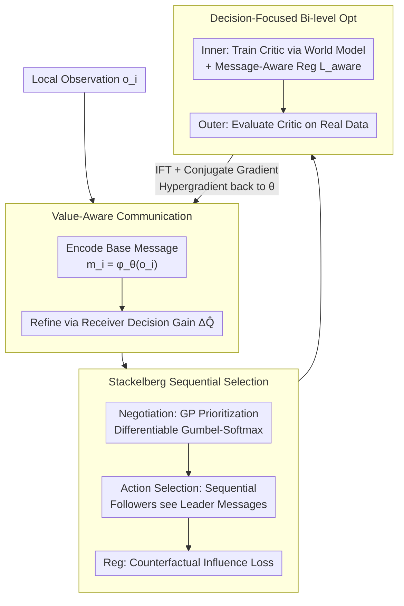

# Multi-Agent Decision-Focused Learning via Value-Aware Sequential Communication

**Conference**: ICML 2026  
**arXiv**: [2604.08944](https://arxiv.org/abs/2604.08944)  
**Code**: None  
**Area**: Reinforcement Learning / Multi-Agent  
**Keywords**: Multi-agent communication, Decision-focused learning, Stackelberg sequential decision, Bi-level optimization, QMIX

## TL;DR
SeqComm-DFL treats "multi-agent communication" as a predictor and "joint policy selection" as a downstream optimizer. By combining value-aware message generation, Stackelberg sequential conditions, and implicit differential bi-level optimization, it aligns communication learning directly with team rewards. It achieves 4-6x cumulative reward gains in hospital scheduling and a >13 percentage point win rate increase in SMAC.

## Background & Motivation

**Background**: Cooperative Multi-Agent Reinforcement Learning (MARL) typically adopts the "Centralized Training, Decentralized Execution" (CTDE) paradigm, represented by QMIX, MAPPO, and MADDPG, which mitigate non-stationarity and credit assignment through value decomposition or actor-critic methods. Learning-to-communicate methods (CommNet, DIAL, NDQ, SeqComm, MAIC, etc.) further alleviate coordination difficulties under partial observability by allowing agents to exchange messages.

**Limitations of Prior Work**: Optimization objectives for existing communication protocols are mostly **proxy targets**—such as reconstruction accuracy, mutual information, or simple token prediction—rather than the amount of information that truly impacts downstream decision quality. Consequently, bandwidth is wasted on features that are "informative but action-irrelevant," mirroring the classical "objective mismatch" problem in model-based RL: world models sacrifice value-relevant error optimization to fit all pixel details.

**Key Challenge**: The optimization signal for communication modules (reconstruction/mutual information) is decoupled from the team's ultimate goal (cumulative reward) in gradient direction. This leads to agents potentially learning to "accurately describe what they see" without enabling teammates to make better decisions. Simultaneously, parallel action selection among multiple agents inherently faces coordination problems with multiple equilibria.

**Goal**: (1) Enable the communication module to be supervised directly by "downstream decision quality"; (2) Break coordination ambiguity under parallel decision symmetry; (3) Extend Decision-Focused Learning (DFL) from single-agent setups with exogenous uncertainty to multi-agent setups with endogenous uncertainty (where messages inversely change other agents' policies).

**Key Insight**: The authors view communication as the "predictor" in a Predict-and-Optimize framework and multi-agent policy selection as the "optimizer." This naturally leads to an end-to-end paradigm where gradients flow from the final task loss back to the communication module. Furthermore, a Stackelberg leader-follower structure is borrowed to break the symmetry of multi-agent action selection.

**Core Idea**: Replace "message mutual information" with "receiver Q-value gain $\Delta Q_j(m_i)$" as the training signal for communication. Construct sequential conditional decisions based on prosocial guidance potential ranking, and pass bi-level optimization gradients back to communication parameters using the implicit function theorem.

## Method

### Overall Architecture
SeqComm-DFL splits the collaborative problem under Dec-POMDP into three coupled modules: (1) **Value-Aware Communication** — Each agent encodes local observations $o_i$ into base messages $m_i^{\text{base}}=\phi_\theta(o_i)$, then refines them via a network based on estimated receiver decision gains $\Delta\hat Q_i$; (2) **Stackelberg Sequential Action Selection** — A guidance potential is used to prioritize agents $\pi=\text{argsort}(-\text{GP})$, followed by sequential action selection $a_{\pi_k}=\arg\max_a Q_{\pi_k}(o_{\pi_k}, M_{1:\pi_k-1}, a)$, allowing followers to see messages from leaders; (3) **Decision-Focused World Model Bi-level Optimization** — The inner loop trains a critic using world model predictions, while the outer loop evaluates the critic on real environmental data, backpropagating gradients to the world model and communication module via implicit differentiation. These form an end-to-end trainable loop where communication is supervised by the final team reward.

### Key Designs

**1. Value-Aware Message Generation: Replacing "Accuracy" with "Teammate Improvement"**

Traditional protocols optimize reconstruction error or mutual information. However, even if a message perfectly describes an observation, it is useless if those details do not change a teammate's action. Bandwidth is wasted on "high-information but decision-irrelevant" features. The authors quantify decision value as the receiver decision gain $\Delta Q_j(m_i) = \max_a Q_j(o_j, m_i, a) - \max_a Q_j(o_j, \emptyset, a)$, representing the increase in $j$'s optimal Q-value with the message versus without it. The loss $\mathcal{L}_{\text{VA}}(\theta) = -\frac{1}{B \cdot N(N-1)} \sum_b \sum_i \sum_{j\neq i} \Delta Q_j(m_i^{(b)})$ forces every message to maximize the optimal Q-values of other agents. Early in training when the critic $Q_w$ is unreliable, $\Delta Q_j^{\text{MC}}$ is estimated via Monte Carlo rollouts, smoothing into the critic estimate via annealing $\Delta\hat Q = (1-\beta_t)\Delta Q^{\text{MC}}+\beta_t \Delta Q_w$. Using the envelope theorem, the authors prove that at the optimal critic, the gradient of the true task loss with respect to messages is proportional to $-\sum_{j\neq i} \nabla_{m_i} Q_j$, establishing $\Delta Q_j$ as a dual quantity naturally derived from DFL.

**2. Stackelberg Sequential Conditions + Guidance Potential Ordering: Learning "Who Speaks First"**

Simultaneous action selection inherently suffers from relative overgeneralization and multiple equilibria. The authors introduce a three-stage sequential coordination. In the **negotiation stage**, a prosocial guidance potential $\text{GP}_i(s) = \mathbb{E}_{\mathbf{a}^*}[Q_{1:N}(s,\mathbf{a}^*|i^+) - Q_{1:N}(s,\mathbf{a}^*|i^-)]$ is calculated, measuring the contribution of making agent $i$ the leader to the total team payoff. This is converted into a differentiable permutation $\pi=\text{argsort}(-\text{GP})$ via Gumbel-softmax. In the **execution stage**, actions are selected sequentially according to $\pi$, where followers observe messages from all higher-priority agents. A **regularization stage** uses counterfactual influence loss $\mathcal{L}_{\text{inf}} = -\frac{1}{N(N-1)}\sum_i \sum_{j\neq i} D_{\text{KL}}[\pi_j(\cdot|m_i)\,\|\,\pi_j(\cdot|\emptyset)]$ to ensure messages actually change receiver policies. Unlike SeqComm which uses intention-based ranking, guidance potential is prosocial: theoretically $\text{GP}_i \propto \sum_{j\neq i} I(M_i; a_j^*|o_j)$, ensuring agents holding critical coordination information are pushed to leader positions.

**3. Decision-Focused Bi-level World Model + Implicit Differentiation: Optimizing for Team Reward**

The relationship between the world model and the critic is inherently a chain-call structure. The authors formulate this as a bi-level problem: the outer loop minimizes $\mathcal{L}_{\text{true}}(w^*(\theta);\theta)$ (evaluating the critic on real data), while the inner loop $w^*(\theta)=\arg\min_w \mathcal{L}_{\text{model}}(w;\theta) + \lambda_{\text{aware}}\mathcal{L}_{\text{aware}}(w)$ trains the critic using model predictions. To avoid a "message apathy" failure mode where the critic ignores $M$, a hinge-form message-aware regularization $\mathcal{L}_{\text{aware}}=\max(0, \epsilon_{\text{margin}} - |Q_w(s,a,M)-Q_w(s,a,\mathbf{0})|)$ is added. Outer gradients are computed using the Implicit Function Theorem (IFT) at the inner fixed point:

$$\frac{dw^*}{d\theta}=-[\nabla^2_{ww}\mathcal{L}_{\text{model}}]^{-1}\nabla^2_{\theta w}\mathcal{L}_{\text{model}},$$

where the inverse Hessian-vector product $H^{-1}b$ is approximated via Conjugate Gradient (CG), requiring only two autodiff operations per step.

### Loss & Training
The total outer objective is $\theta \leftarrow \theta - \eta(\frac{d\mathcal{L}_{\text{true}}}{d\theta}+\lambda_{\text{VA}}\nabla\mathcal{L}_{\text{VA}}+\lambda_{\text{inf}}\nabla\mathcal{L}_{\text{inf}})$; the inner loop uses $K_{\text{inner}}$ SGD steps for $w$; the target network uses Polyak EMA $\bar w \leftarrow \tau_{\text{ema}}\bar w + (1-\tau_{\text{ema}})w$; a warmup phase $\beta_t = \min(t/T_w, 1)$ transitions from MC-based $\Delta Q$ to critic-based estimates.

## Key Experimental Results

### Main Results
Evaluated on a multi-specialty hospital collaboration Dec-POMDP ($N=3$ specialists, $\mathcal P=100$ patients) and SMAC standard benchmarks.

| Environment | Metric | SeqComm-DFL | Prev. SOTA | Gain |
|------|------|-------------|-----------|------|
| Hospital Dec-POMDP | Cumulative Reward | 4-6× baseline | QMIX/MAPPO/SeqComm | Multi-fold increase |
| SMAC | Win Rate | +13pp | QMIX/MAIC | Statistically significant |
| Hospital | Comm Value $\Delta V$ | Consistent with lower bound | — | Verifies Thm 5.1 |

### Ablation Study

| Configuration | Key Effect | Description |
|------|---------|------|
| Full SeqComm-DFL | Optimal | All modules enabled |
| w/o $\mathcal{L}_{\text{VA}}$ | Comm degrades to reconstruction | Messages no longer optimized for decisions |
| w/o Stackelberg ordering | Coordination ambiguity | Falls into sub-optimal equilibria |
| w/o $\mathcal{L}_{\text{aware}}$ | Inner loop apathy | Critic ignores messages; hypergradients vanish |
| w/o IFT / Direct BPTT | Training divergence | Vanishing gradients over $K_{\text{inner}}$ steps |

### Key Findings
- Value-aware loss + message-aware regularization are necessary conditions for end-to-end training; otherwise, communication is drowned out by environmental noise.
- Guidance potential ranking allows agents with the largest "information gaps" $\mathcal I_i$ to naturally become leaders.
- The convergence rate $O(1/\sqrt T)$ is closely tied to the bias of implicit differentiation and CG; too few CG iterations result in biased outer gradients.

## Highlights & Insights
- **Communication as a DFL Predictor**: This work is the first to explicitly place multi-agent communication into a predict-and-optimize framework, using the envelope theorem to prove that $\Delta Q$ is the dual of the true loss gradient.
- **Message Apathy Regularization**: To solve the bi-level failure mode where critics ignore auxiliary inputs, the authors use a hinge loss to enforce a margin. This is transferable to any scenario where conditional inputs are easily ignored (e.g., weak conditions in Diffusion, RAG results).
- **Prosocial Stackelberg Ranking**: Learning "who speaks first" based on team utility rather than individual preference distinguishes this from SeqComm. Gumbel-softmax keeps the permutation lightweight and differentiable.

## Limitations & Future Work
- IFT + CG is sensitive to iteration counts and the damping coefficient $\lambda$ in high-dimensional $w$ spaces.
- Sequential leader-follower execution introduces latency as $N$ increases; scalability to swarm levels remains unaddressed.
- The hospital environment is self-constructed; real-world evaluations in domains like traffic light control or autonomous vehicle coordination are missing.
- Communication remains continuous vectors; discrete symbols and explicit bandwidth budgets are not considered.

## Related Work & Insights
- **vs SeqComm (Ding 2023)**: Both use sequential communication, but SeqComm ranks by intention value ("who wants to act most"), whereas Ours uses prosocial GP and optimizes message content end-to-end.
- **vs MAIC (Yuan 2022)**: MAIC treats messages as incentives for Q-values; this work incorporates that as $\mathcal{L}_{\text{aware}}$ but ties it to decision-focused bi-level optimization.
- **vs OMD (Nikishin 2022)**: OMD solves objective mismatch in single-agent model-based RL; this work extends it to multi-agent settings with communication and QMIX decomposition.
- **vs DFL (Donti 2017)**: Classic DFL assumes predictions do not affect downstream ground truths; this is the first DFL work to explicitly handle endogenous uncertainty.

## Rating
- Novelty: ⭐⭐⭐⭐⭐ 
- Experimental Thoroughness: ⭐⭐⭐⭐ 
- Writing Quality: ⭐⭐⭐⭐⭐ 
- Value: ⭐⭐⭐⭐ 

<!-- RELATED:START -->

## Related Papers

- [\[ICML 2026\] LLM-Guided Communication for Cooperative Multi-Agent Reinforcement Learning](llm-guided_communication_for_cooperative_multi-agent_reinforcement_learning.md)
- [\[ICML 2025\] Counterfactual Effect Decomposition in Multi-Agent Sequential Decision Making](../../ICML2025/reinforcement_learning/counterfactual_effect_decomposition_in_multi-agent_sequential_decision_making.md)
- [\[ICML 2026\] Vulnerable Agent Identification in Large-Scale Multi-Agent Reinforcement Learning](vulnerable_agent_identification_in_large-scale_multi-agent_reinforcement_learnin.md)
- [\[ICML 2026\] Learning Query-Aware Budget-Tier Routing for Runtime Agent Memory](learning_query-aware_budget-tier_routing_for_runtime_agent_memory.md)
- [\[ICLR 2026\] Continuous-Time Value Iteration for Multi-Agent Reinforcement Learning](../../ICLR2026/reinforcement_learning/continuous-time_value_iteration_for_multi-agent_reinforcement_learning.md)

<!-- RELATED:END -->
