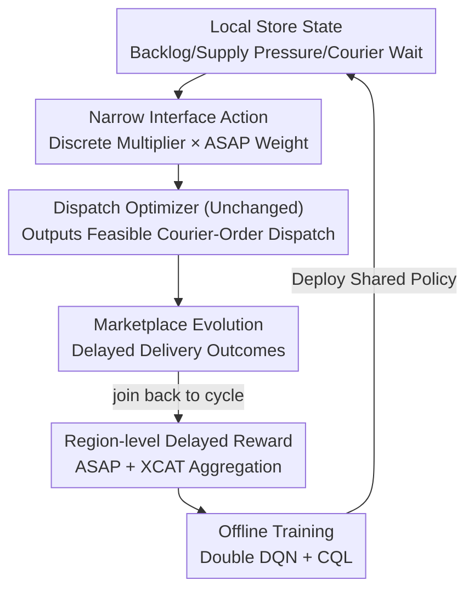

# Multi-Agent Reinforcement Learning from Delayed Marketplace Feedback for Objective-Weight Adaptation in Three-Sided Dispatch

**Conference**: ICML2026  
**arXiv**: [2606.13604](https://arxiv.org/abs/2606.13604)  
**Code**: TBD  
**Area**: Reinforcement Learning / Offline RL / Multi-Agent  
**Keywords**: Offline Reinforcement Learning, Multi-Agent, Marketplace Dispatch, Delayed Rewards, Switchback Experiments

## TL;DR
DoorDash models the "objective weight" regulation of food delivery dispatching as an offline multi-agent reinforcement learning problem. Instead of replacing the existing combinatorial dispatch optimizer, each store-level agent selects a discrete multiplier based on local market states to fine-tune the optimizer's trade-off between "delivery speed vs. bundling efficiency." Using Double DQN with Conservative Q-regularization (CQL), the policy is trained offline from noisy, delayed, and coupled market logs. In a production switchback experiment involving approximately 4,000 geographic regions, the system achieved "increased bundling rates and reduced courier active time without harming customer delivery quality."

## Background & Motivation

**Background**: Food delivery dispatching is a sequential decision-making problem embedded in a tri-sided "Customer-Merchant-Courier" marketplace. Each dispatch decision simultaneously affects customer delivery quality, merchant congestion, courier availability, bundling opportunities, and costs. Performance is evaluated not by human labels but by **delayed operational outcomes** from the marketplace (e.g., delivery time, courier utilization).

**Limitations of Prior Work**: Bundling improves courier efficiency, but faster execution reduces lateness and improves customer experience; these two goals are naturally in conflict. In production, this trade-off is typically controlled by **static heuristic weights**—updated manually and globally. These are brittle under local and time-varying conditions: over-bundling during congestion pushes up lateness, while under-bundling during idle periods wastes efficiency dividends.

**Key Challenge**: The trade-off must adapt to local real-time states, but the existing combinatorial dispatch optimizer (which ensures feasibility and safety constraints) cannot be replaced—any "replace the optimizer" solution would fail the production safety threshold.

**Goal**: (1) Design an RL architecture that learns from market feedback but adjusts weights through a low-dimensional control interface without replacing the optimizer; (2) Formalize objective-weight adaptation as an offline multi-agent decision problem with store-level decentralized execution and region-level delayed rewards; (3) Provide production switchback evidence.

**Key Insight**: Instead of learning "direct operational decisions" (direct dispatch, routing, or scheduling—as seen in most prior works, often limited to simulation), it is more effective to learn **regulation actions on a narrow interface**. Selecting a multiplier to nudge the existing optimizer's objective function preserves production feasibility while enabling local adaptation.

**Core Idea**: By using a narrow interface—"store-level agent selects discrete multiplier → scales ASAP speed weight → optimizer outputs feasible dispatch as usual"—learnable policies are decoupled from the immutable optimizer. This allows for safe offline policy learning on noisy, delayed, and coupled market logs.

## Method

### Overall Architecture

The system employs two-layer nested decision-making. The **inner layer** is the combinatorial dispatch optimizer: it maps orders, couriers, constraints, and objective weights to courier-order assignments; this layer remains unchanged to ensure feasibility. The **outer layer** is the Objective-Weight Adaptation agent (OWA-RL): every dispatch cycle (20 seconds), each store-level agent observes the local market state $s_t^i$ and selects a discrete multiplier $a_t^i$ to scale the baseline ASAP speed weight $\lambda_0$. The resulting adaptive weight $\lambda_t^i=a_t^i\lambda_0$ is fed into the optimizer. The actions change downstream optimization objectives, and the dispatch results eventually evolve into delayed marketplace outcomes (delivery duration, extra courier time). These delayed signals are joined back to the original decision cycle to form training data. Training is **centralized offline** (pooling experience across stores and using regional rewards to capture network effects), while execution is **store-level decentralized** (each store runs the shared policy independently using local states).

### Key Designs

**1. Narrow Interface Action Space: Tuning weights without replacing the optimizer**

The action space is $\mathcal{A}=\{0.8,0.9,1.0,1.1,1.2\}$, representing discrete multipliers applied to the baseline ASAP weight. When store $i$ selects $a_t^i$, it yields $\lambda_t^i=a_t^i\lambda_0$: **low multipliers** make bundling/efficient routing more attractive during optimization, while **high multipliers** emphasize faster completion (potentially splitting orders). The **neutral action $a_t^i=1.0$** exactly recovers the static production baseline. This design ensures that the RL never produces infeasible dispatches, as the optimizer still enforces all constraints—a prerequisite for direct production deployment.

**2. 3D Store State + Supply Pressure Rescaling: Revealing local variances**

The state $s_t^i=[d_t^i,\ \text{sup}_t^i,\ \text{cwt}_t^i]$ refreshes every cycle: $d_t^i$ is the count of outstanding deliveries, $\text{cwt}_t^i$ is the median courier wait time, and $\text{sup}_t^i$ is a **localized supply pressure feature**. Since supply signals are often regional, they can mask differences between stores. The authors rescale regional features using effective courier supply:

$$\text{sup}_t^i=\text{sup}_t^{g(i)}\cdot\frac{\widetilde{S}_t^{g(i)}}{\widetilde{S}_t^i}$$

where $g(i)$ is the region of store $i$, $\widetilde{S}_t^i$ is the median number of feasible couriers for that store, and $\widetilde{S}_t^{g(i)}$ is the regional median. This distinguishes between stores with high and low supply within the same region, enabling true local adaptation.

**3. ASAP/XCAT Delayed Rewards + Regional Aggregation: Handling delayed market feedback**

Rewards are derived from delayed delivery results and aggregated by region to capture cross-store network effects. For delivery $j$, using timestamps for creation, acceptance, and drop-off ($t_j^{\text{create}}, t_j^{\text{acc}}, t_j^{\text{drop}}$), two temporal metrics are defined: $\text{ASAP}_j=t_j^{\text{drop}}-t_j^{\text{create}}$ (customer side) and $\text{CAT}_j=t_j^{\text{drop}}-t_j^{\text{acc}}$ (courier active time). By subtracting the direct travel time $T_j^{\text{direct}}$, we obtain $\text{XCAT}_j=\text{CAT}_j-T_j^{\text{direct}}$ (**extra courier time**, acting as a proxy for bundling costs). The reward for region $g(i)$ at cycle $t$ is:

$$r_t^{g(i)}=-\frac{1}{|\mathcal{D}_t^{g(i)}|}\sum_{j\in\mathcal{D}_t^{g(i)}}\left(\alpha\,\text{ASAP}_j+\beta\,\text{XCAT}_j\right)$$

This captures customer delay (ASAP) and courier efficiency (XCAT), where the negative sign ensures that "minimizing time" corresponds to "maximizing reward."

**4. Double DQN + Conservative Q-Regularization: Suppressing OOD overestimation**

The policy $\pi_\theta(a|s)$ is shared across stores. The value function $Q_\theta(s,a)$ is trained using an offline Double DQN target to reduce maximization bias:

$$y_t^{\text{DDQN}}=r_t^{g(i)}+\gamma Q_{\bar\theta}\!\left(s_{t+1}^i,\ \arg\max_{a'\in\mathcal{A}}Q_\theta(s_{t+1}^i,a')\right)$$

To address out-of-distribution (OOD) value overestimation typical in offline RL, a discrete Conservative Q-Learning (CQL) regularizer is added to penalize values for actions poorly supported in the logs:

$$\mathcal{L}_{\text{CQL}}(\theta)=\mathbb{E}_{(s,a)\sim\mathcal{D}}\!\left[\log\sum_{a'\in\mathcal{A}}\exp Q_\theta(s,a')-Q_\theta(s,a)\right]$$

The final objective is $\mathcal{L}(\theta)=\mathcal{L}_{\text{DDQN}}(\theta)+\eta\mathcal{L}_{\text{CQL}}(\theta)$.

### Loss & Training

The training objective is the combined loss stated above. Before deployment, an **offline reward re-weighting diagnostic** was used to ensure the policy responds directionally to different feedback definitions. This led to selecting $\alpha=0.9$, which provided a balanced action distribution and prevented the policy from collapsing to extremes (either aggressive bundling or pure speed).

## Key Experimental Results

### Main Results (Production Switchback)

Approximately 4,000 geographic regions served as randomization units. A switchback interval of 2 hours was used to rotate between Control (static weights) and Treatment (OWA-RL, $\alpha=0.9$) for two weeks. CUPED was used for variance reduction. The table shows the Average Treatment Effect (ATE):

| Scope | Metric | Baseline | OWA-RL | ATE (p) | Direction |
|------|------|------|--------|---------|------|
| Overall | CAT (sec)↓ | 1163.0 | 1159.8 | **−1.261 (0.019)** | Courier Time ↓ |
| Overall | CWT (sec)↓ | 277.1 | 275.7 | **−0.856 (0.004)** | Courier Wait ↓ |
| Overall | % Batched↑ | 47.52% | 48.14% | **+0.495 (<0.001)** | Bundling Rate ↑ |
| Overall | ASAP (sec)↓ | 1956.0 | 1960.0 | +0.972 (0.264) | Neutral Quality |
| Overall | % 20-min Late↓ | 2.09% | 2.09% | −0.012 (0.237) | Neutral Quality |
| Dinner | % 20-min Late↓ | 2.36% | 2.34% | **−0.037 (0.040)** | Lateness ↓ |

**Core Conclusion**: Efficiency metrics (CAT, CWT, Bundling rate) significantly improved, while customer-side quality (ASAP, Lateness) remained stable, indicating the extraction of efficiency dividends without sacrificing experience.

### Key Findings
- **Efficiency/Quality Decoupling**: Significant improvement in efficiency with no significant degradation in quality proves the safety of adjusting weights via a narrow interface.
- **Higher Gains During Peak Hours**: During dinner peaks, OWA-RL simultaneously increased bundling and significantly reduced lateness, showing higher utility under high-pressure scenarios.
- **State-Dependent Policy**: Action probabilities shift dynamically with backlog, supply, and wait times, rather than collapsing to a fixed global multiplier.
- **Offline Diagnostics**: Selecting $\alpha=0.9$ avoided extreme policy behaviors, emphasizing the importance of offline pre-deployment evaluation.

## Highlights & Insights
- **Pragmatic Interface Design**: Tuning objective weights instead of replacing the decision logic is a highly robust engineering approach. It allows RL to pass production safety hurdles by letting the optimizer handle hard constraints.
- **Smart Feature Engineering**: Scaling regional supply pressure to the store level solves the common issue of local signals being "washed out" by regional aggregation.
- **Causal Production Evidence**: The use of switchback experiments with CUPED provides credible causal conclusions rather than mere correlations, which is rare for offline RL applications.

## Limitations & Future Work
- **Action Space Constraints**: The policy only controls 5 discrete multipliers for a single weight dimension; multi-objective, high-dimensional weight adaptation remains unexplored.
- **Heuristic Reward Composition**: The linear combination of ASAP and XCAT is still a manually set trade-off; the weight $\alpha$ relies on offline diagnostics.
- **Small Absolute Gains**: While significant at scale, the absolute reductions (e.g., 1.3s in CAT) are small, potentially making the system less effective in low-density markets.
- **Multi-Agent Coordination**: While stores are implicitly coupled via regional rewards, there is no explicit coordination or game-theoretic analysis of agent inter-dependencies.

## Related Work & Insights
- **Contrast with Direct Dispatch RL**: Unlike works that let RL directly perform routing or dispatching (often in simulation), this work uses RL to "manipulate the objective," ensuring production feasibility.
- **Contrast with Online DQN**: This work utilizes offline RL (CQL) to handle production constraints where online trial-and-error is not permissible.
- **Learning from Market Feedback**: This serves as a concrete example of "Learning from World Feedback" (delayed operational outcomes) rather than direct human preference labels (RLHF).

## Rating
- Novelty: ⭐⭐⭐⭐
- Experimental Thoroughness: ⭐⭐⭐⭐
- Writing Quality: ⭐⭐⭐⭐
- Value: ⭐⭐⭐⭐⭐

<!-- RELATED:START -->

## Related Papers

- [\[ICML 2026\] Parameter-free Dynamic Regret: Time-varying Movement Costs, Delayed Feedback, and Memory](parameter-free_dynamic_regret_time-varying_movement_costs_delayed_feedback_and_m.md)
- [\[ICML 2026\] Vulnerable Agent Identification in Large-Scale Multi-Agent Reinforcement Learning](vulnerable_agent_identification_in_large-scale_multi-agent_reinforcement_learnin.md)
- [\[ICML 2025\] Test-Time Adaptation with Binary Feedback](../../ICML2025/reinforcement_learning/test-time_adaptation_with_binary_feedback.md)
- [\[NeurIPS 2025\] Bandit and Delayed Feedback in Online Structured Prediction](../../NeurIPS2025/reinforcement_learning/bandit_and_delayed_feedback_in_online_structured_prediction.md)
- [\[ICLR 2026\] A Reward-Free Viewpoint on Multi-Objective Reinforcement Learning](../../ICLR2026/reinforcement_learning/a_reward-free_viewpoint_on_multi-objective_reinforcement_learning.md)

<!-- RELATED:END -->
