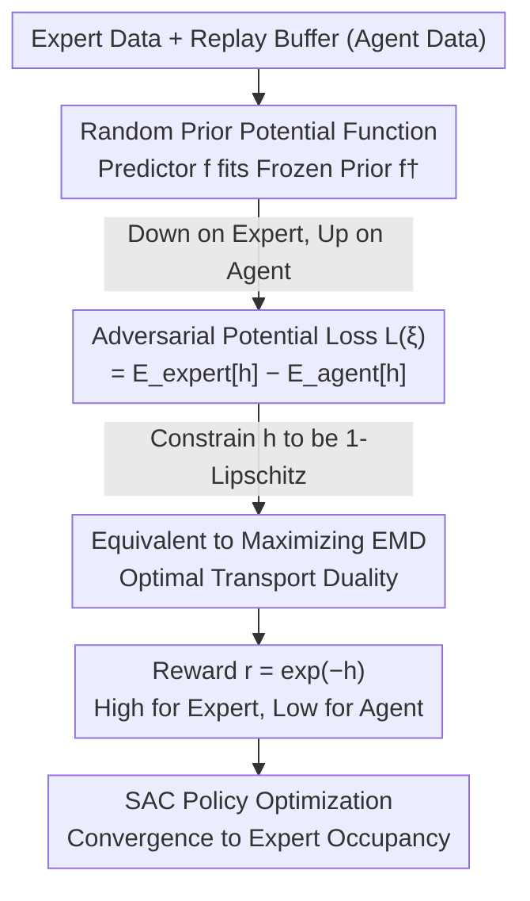

# Noise-Guided Transport: Imitation Learning from Random Priors

**Conference**: ICML 2026  
**arXiv**: [2509.26294](https://arxiv.org/abs/2509.26294)  
**Code**: TBD  
**Area**: Reinforcement Learning / Imitation Learning  
**Keywords**: Imitation Learning, Optimal Transport, Random Priors, Adversarial Training, Sample Efficient

## TL;DR
This paper reformulates imitation learning as an adversarial training process where a predictor network fits a frozen random prior network on expert data while moving away from it on agent data. The authors prove that this objective is equivalent to minimizing the Earth Mover's Distance (EMD) between expert and agent distributions. The resulting lightweight method eliminates the need for gradient penalties and successfully learns humanoid robot gaits with an ultra-low data regime of only 20 transitions.

## Background & Motivation

**Background**: In large-scale data regimes, Behavior Cloning (BC) paired with large models is sufficient for imitation learning. However, in **low-data** scenarios—with only a few expert demonstrations—BC fails due to compounding errors. Online Adversarial Imitation Learning (AIL) mitigates compounding errors through an "inner-loop inverse reinforcement learning + outer-loop reinforcement learning" framework. Representative works such as GAIL and its off-policy evolutions DAC and SAM essentially train a binary discriminator to distinguish between expert and agent state-action distributions, which is equivalent to minimizing the JS divergence between the two.

**Limitations of Prior Work**: GAN-based AIL faces two primary issues. First, JS divergence leads to **mode collapse and vanishing gradients** when the supports of the two distributions do not overlap, causing training instability. Almost all state-of-the-art (SOTA) off-policy AIL methods must rely on **Gradient Penalty (GP)** regularization for stability, which doubles the backpropagation cost, making it slow and expensive. Second, another line of work like RED uses "prediction from random priors" to learn an expert detector, but it is **entirely offline** and relies only on a single positive signal from the expert (similar to one-class or Positive-Unlabeled learning), failing to capture the true expert distribution.

**Key Challenge**: To achieve both sample efficiency and stability, one must avoid the non-overlapping support problem of JS divergence (which necessitates GP) while providing negative signals for the "random prior prediction" and allowing it to be updated online. Both existing directions are missing half of the solution.

**Goal**: To design a lightweight, off-policy reward learning objective that requires no pre-training or special architecture, provides inherent uncertainty estimation, does not rely on gradient penalties, and can scale to high-dimensional humanoid control under ultra-low data conditions.

**Key Insight**: The authors observe that the matching loss of "predicting a random prior" naturally serves as a **pseudo-density signal**—the prediction error is low in regions frequently visited by the expert and high in rare regions. By extending this from "decreasing only on expert data" to "decreasing on expert and increasing on agent data," the one-class problem becomes binary classification. Furthermore, it can be proven that this adversarial objective optimizes an Optimal Transport distance, fundamentally bypassing the issues of JS divergence.

**Core Idea**: A matching loss between a "predictor vs. frozen random prior" is used as a potential function $h_\xi$, which is minimized on expert data and maximized on agent data. By constraining $h_\xi$ to be 1-Lipschitz, the objective exactly equals the EMD (Wasserstein-1) between expert and agent distributions. The reward is directly derived from the potential function as $r_\xi=\exp(-h_\xi)$.

## Method

### Overall Architecture

NGT consists of two networks: a **frozen random prior network** $f^\dagger_\xi$ (never updated after initialization, outputs $m$-dimensional random targets) and a **trainable predictor** $f_\xi$ (fitting the prior output). The non-negative matching loss $h_\xi(x)=\ell\big(f_\xi(x),f^\dagger_\xi(x)\big)$ is termed the **potential function**. By performing gradient descent on expert data and gradient ascent on agent data, the potential function learns to be "low in expert regions and high in agent regions." Taking the negative exponential $r_\xi=\exp(-h_\xi)$ yields a reward where "experts are high and agents are low," which is fed into a SAC actor-critic to optimize the policy. The entire training process adds only one reward learning head to a standard off-policy RL loop.

### Key Designs

**1. Random Prior Potential: Turning "Predicting Random Noise" into an Adversarial Reward with Negative Signals**

This design addresses the "positive-signal only, purely offline" limitation of RED. The frozen prior network $f^\dagger_\xi$ maps inputs to $m$-dimensional random targets, and the predictor $f_\xi$ fits them. The matching loss $h_\xi(x)=\ell(f_\xi(x),f^\dagger_\xi(x))$ is low in frequently seen regions and high in rare regions. Thus, $h_\xi$ itself is a pseudo-density/indicator signal, and its magnitude and fluctuations encode epistemic uncertainty regarding the fit to random targets. While RED only decreases this loss on expert data, the key modification in NGT is to **simultaneously increase it on agent data**, resulting in the loss:

$$L(\xi):=\mathbb{E}_{x\sim P_{\text{expert}}}\big[h_\xi(x)\big]-\mathbb{E}_{x\sim P_{\text{agent}}}\big[h_\xi(x)\big]$$

Minimizing $L(\xi)$ forces $h_\xi$ to give low values to experts and high values to agents. The monotonically decreasing transformation $r_\xi(x)=\exp(-h_\xi(x))$ flips this into a reward: it is naturally non-negative, bounded in $(0,1]$ by $\ell\ge0$, and amplifies the contrast between experts and agents. This upgrades "one-class classification" to "binary classification" by completing the negative signals; the agent side uses the off-policy replay buffer distribution $\beta$ (a mixture of historical policies), fitting sample efficiency requirements.

**2. Equivalence to Optimal Transport (EMD) under 1-Lipschitz Constraint: Bypassing JS Divergence Pitfalls**

This step fundamentally explains "why not use GAN-based JS divergence." By restricting the potential function to the 1-Lipschitz function space $H^1_\xi$ and taking the infimum, the paper proves:

$$\inf_{h_\xi\in H^1_\xi}L(\xi)=-\sup_{h_\xi\in H^1_\xi}\Big(\mathbb{E}_{x\sim P_{\text{agent}}}[h_\xi]-\mathbb{E}_{x\sim P_{\text{expert}}}[h_\xi]\Big)=-\mathrm{EMD}(P_{\text{agent}},P_{\text{expert}})$$

Minimizing $L(\xi)$ is equivalent to **maximizing** the Earth Mover's Distance (Wasserstein-1 distance) between agent and expert distributions. This is the Kantorovich-Rubinstein duality: while there should be two dual potentials, NGT learns only one $h_\xi$, using $h_\xi$ for the first expectation and $-h_\xi$ for the second, collapsing the dual constraints into a single 1-Lipschitz continuity constraint. Unlike JS divergence, which collapses or suffers from vanishing gradients when supports don't overlap, EMD provides meaningful, smooth gradients even for non-overlapping distributions. This is the theoretical basis for NGT's stability. The paper also provides a concentration inequality for the empirical estimate $\hat L(\xi)$, showing it converges exponentially to the true $L(\xi)$.

**3. "Free" 1-Lipschitz via Spectral Normalization + Orthogonal Initialization, Eliminating Gradient Penalty**

To satisfy the equivalence above, $h_\xi$ must be approximately 1-Lipschitz. By function composition, $\Lambda(h_\xi)=\Lambda(\ell)\big(\Lambda(f_\xi)+\Lambda(f^\dagger_\xi)\big)$. The paper controls each term: **Spectral Normalization (SN)** is applied to every linear layer of the predictor and prior to constrain the spectral norm to 1. **Orthogonal Initialization (OI)** makes weights norm-preserving mappings—since the prior network is frozen and orthogonally initialized, its singular values are 1, meaning SN is unnecessary for it. The random prior also maximizes the use of the $m$-dimensional output space via full-rank mapping. Combined with near-linear activations (ReLU/LeakyReLU), $\Lambda(f^\dagger_\xi)$ approaches 1, and SN prevents $\Lambda(f_\xi)$ from diverging during updates. For the loss term, $\Lambda(\ell)$ is fixed: Huber loss ($\delta=1$, 1-Lipschitz) is the default. **Key Benefit**: In practice, one does not need a "perfect 1"; keeping $\Lambda(h_\xi)$ stable around 1 is sufficient. Thus, NGT **requires no gradient penalty**—whereas all SOTA off-policy adversarial IL baselines depend on GP. SN adds minimal overhead compared to the doubled backpropagation cost of GP, making NGT faster and more efficient.

**4. Histogram Distribution Loss ℓ_HLG: Turning Regression into Classification for High-Dimensional Humanoids**

On the most challenging Humanoid tasks, regression-based losses like Huber/softmax fail. The paper adopts the "Gaussian-style histogram loss" $\ell_{\text{HLG}}$ from RL value learning for reward learning. It uses four hyperparameters $(a,b,N,\sigma)$ to divide the interval $[a,b]$ into $N$ bins and spreads probability mass to neighboring bins using a normal distribution with width $\sigma$. The rationale is that turning regression into classification provides label smoothing (preventing overfitting), leverages the ordinal structure of regression targets for better generalization, and offers more robust representations that scale better. Since NGT predicts an $m$-dimensional random prior vector, predictions fall into $N\times m$ bins, introducing an architectural asymmetry (prior outputs $m$ scalars, predictor outputs $N\times m$ distributions). The paper derives a Lipschitz upper bound for $\ell_{\text{HLG}}$ relative to logits: $\Lambda\le\sqrt{1+(C/\sigma)^2}$. This indicates that a $\sigma$ that is too small will cause the Lipschitz constant to explode, so a sufficiently large $\sigma$ is necessary for stability. $\ell_{\text{HLG}}$ is what enables NGT to scale to Humanoid tasks.

### Loss & Training
The reward side minimizes $L(\xi)=\mathbb{E}_{\text{expert}}[h_\xi]-\mathbb{E}_{\text{agent}}[h_\xi]$. The potential function is constrained to be approximately 1-Lipschitz using SN+OI. Huber loss is used by default, while $\ell_{\text{HLG}}$ is used for Humanoid. The reward $r_\xi=\exp(-h_\xi)$ is fed into a shared SAC actor-critic backbone for off-policy policy optimization. All baselines are reproduced using the same SAC backbone, differing only in how the reward is calculated or learned.

## Key Experimental Results

On the Gymnasium continuous control suite, experts are SAC policies trained with different seeds. The number of demonstrations is set to 1, 4, or 11, sub-sampled at a rate of 20 (1 demonstration = 50 transitions). Each experiment uses 4 random seeds. FIGURE 2 / FIGURE 3 summarize 720 / 72 experiments, respectively.

### Main Results

| Settings | NGT | Comparison | Conclusion |
|------|-----|------|------|
| Continuous Control (All demos) | Reaches expert level, outperforms baselines | DAC/SAM, W-DAC/SAM, MMD, PWIL, RED*, DiffAIL | NGT is overall best |
| Humanoid-v4 (High-dim) | Achieves expert gait with min. 20 transitions | Only DiffAIL shows progress but is sub-optimal | NGT scales elegantly to high-dim |
| State-State / State-only (No Expert Actions) | Stable convergence | Most baselines fail in state-only mode | NGT works without expert actions |
| Need for Gradient Penalty | Not required (SN only) | DAC/SAM etc. require GP | NGT is faster and cheaper |

### Ablation Study

| Comparison | Observation | Description |
|------|------|------|
| NGT vs WGAN (W-DAC/SAM) | NGT is significantly better | Max EMD isn't enough; the key is stable estimation. Random prior tasks scale better with capacity than binary classification. |
| Binary Discriminator vs m-dim Prior | Binary training becomes trivial early; needs strong regularization | The $m$-dim prediction task provides smoother learning dynamics. |
| $\ell_{\text{HLG}}$ Dual-side $\sigma$ | Larger $\sigma$ on expert side | Simulates JS-GAN trick of smoothing only expert labels. |
| 10-seed Stability (FIGURE 4) | Tight variance across runs | Learning dynamics are stable. |

### Key Findings
- **Eliminating GP is the core dividend**: NGT stabilizes the 1-Lipschitz constraint using only Spectral Normalization, saving the doubled cost of GP. It is faster than all off-policy AIL baselines, likely due to better numerical stability and smoother dynamics of the potential function.
- **EMD is not just a catchphrase**: The gap between NGT and WGAN (which also targets EMD) shows that "targeting EMD" is less important than "estimating EMD stably." Random prior prediction provides this stable estimation.
- **Distribution loss unlocks high dimensions**: NGT only succeeded on Humanoid when using $\ell_{\text{HLG}}$. The "label smoothing + scalability" of turning regression into classification is critical.

## Highlights & Insights
- **"Random Noise Prediction Error" as a Reward**: Using RND-style random prior prediction error as a pseudo-density and adding an adversarial agent-side gradient provides both uncertainty estimation and discriminative signals in a simple architecture.
- **Theory Bridging Engineering Stability**: The equivalence of 1-Lipschitz potential and EMD duality explains why NGT doesn't need GP and why it remains stable even with non-overlapping distributions.
- **Simplifying to a Single Dual Potential**: Using $h_\xi$ and $-h_\xi$ as the two Kantorovich potentials collapses the requirement into a single 1-Lipschitz constraint, a simplification applicable to any Wasserstein-based objective.

## Limitations & Future Work
- Experiments are focused on Gymnasium continuous control (including Humanoid); neglected visual/real-robot or discrete control validation.
- Success on Humanoid depends on $\ell_{\text{HLG}}$, suggesting default regression losses are limited. $\ell_{\text{HLG}}$ hyperparameters $(a,b,N,\sigma)$ are sensitive.
- Future work intends to generalize this objective to generative modeling. There is no direct comparison to BC in high-data regimes (though the paper notes BC is preferable when data is abundant).

## Related Work & Insights
- **vs RED**: RED also uses random prior prediction for reward but is purely offline and positive-only. NGT adds agent-side negative signals and online adversarial updates, capturing the true expert distribution.
- **vs DAC / SAM (JS-GAN AIL)**: They use binary discriminators with JS divergence, leading to collapse/vanishing gradients without GP. NGT uses EMD with SN, making it faster and more stable.
- **vs WGAN-based IL**: Also uses Wasserstein distance, but NGT's random prior task acts as a more stable potential function than a standard WGAN critic.
- **vs DiffAIL**: DiffAIL uses diffusion error instead of a discriminator. It performs well on Humanoid due to strong representations but struggles in other environments and carries high computational costs. NGT is lightweight and more universally robust.

## Rating
- Novelty: ⭐⭐⭐⭐⭐ Elegant integration of random priors, adversarial signals, and OT duality.
- Experimental Thoroughness: ⭐⭐⭐⭐ Extensive coverage of low-data/high-dim scenarios, though limited to simulation.
- Writing Quality: ⭐⭐⭐⭐ Clear connection between theoretical derivations and engineering motivations.
- Value: ⭐⭐⭐⭐⭐ Highly useful for data-scarce domains like soft robotics or medical applications due to its efficiency and simplicity.

<!-- RELATED:START -->

## Related Papers

- [\[ACL 2026\] Beyond Fully Random Masking: Attention-Guided Denoising and Optimization for Diffusion Language Models](../../ACL2026/reinforcement_learning/beyond_fully_random_masking_attention-guided_denoising_and_optimization_for_diff.md)
- [\[ICML 2026\] Video-Based Optimal Transport for Feedback-Efficient Offline Preference-Based Reinforcement Learning](video-based_optimal_transport_for_feedback-efficient_offline_preference-based_re.md)
- [\[ICML 2026\] Counterfactual Transport Flows for Offline Conservative Trajectory Refinement](counterfactual_transport_flows_for_offline_conservative_trajectory_refinement.md)
- [\[ICLR 2026\] Boolean Satisfiability via Imitation Learning](../../ICLR2026/reinforcement_learning/boolean_satisfiability_via_imitation_learning.md)
- [\[ICLR 2026\] On Discovering Algorithms for Adversarial Imitation Learning](../../ICLR2026/reinforcement_learning/on_discovering_algorithms_for_adversarial_imitation_learning.md)

<!-- RELATED:END -->
