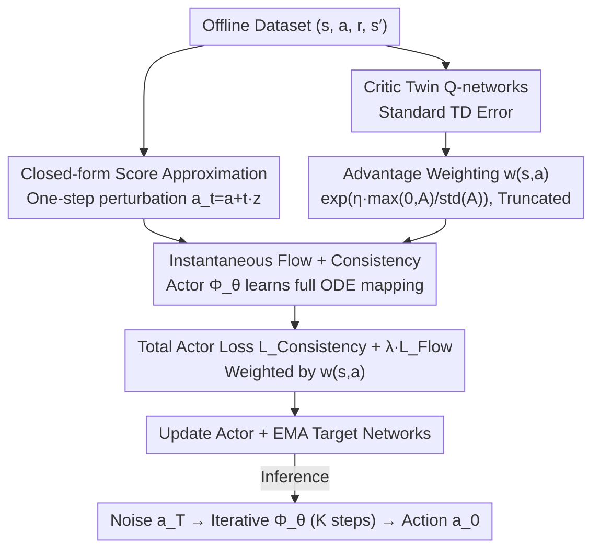

# Offline Reinforcement Learning with Generative Trajectory Policies

**Conference**: ICML2026  
**arXiv**: [2510.11499](https://arxiv.org/abs/2510.11499)  
**Code**: https://github.com/wmd3i/gtp  
**Area**: Reinforcement Learning / Offline RL / Generative Policies  
**Keywords**: Offline Reinforcement Learning, ODE Flow, Consistency Trajectories, Flow Matching, Advantage Weighting

## TL;DR
This work unifies diffusion policies, flow matching, and consistency policies into a single family of "Generative Trajectory Policies (GTP)" using "continuous-time ODE solution mappings." By combining a closed-form score approximation aligned with offline samples and an advantage-weighted training objective, the policy achieves minimal inference steps while attaining near-perfect scores on challenging D4RL tasks like AntMaze.

## Background & Motivation

**Background**: Offline RL prohibits interaction with the environment, requiring a generalizable policy to be extracted from a fixed dataset. Since behavior in such data is often highly multimodal, generative models have become the mainstream choice for policies—leading to a proliferation of Diffusion Policies, Consistency Policies, and Flow Matching policies.

**Limitations of Prior Work**: This family of methods suffers from a sharp trade-off. Diffusion policies possess high expressivity but require dozens of iterations, making single-step inference costs prohibitive. Conversely, consistency policies compress inference to one or two steps but suffer significant performance drops and rapid saturation.

**Key Challenge**: While diffusion and consistency appear to be separate paradigms, they fundamentally learn the same "noise-to-data" trajectory described by an ODE. The former learns the instantaneous velocity field, while the latter learns large-scale jumps. Both methods address only the extremes of the ODE solution mapping $\Phi(\boldsymbol{x}_t, t, s)$; no existing work learns the entire mapping.

**Goal**: (i) To unify Diffusion, Flow Matching, Consistency, CTM, Shortcut, and MeanFlow within a single ODE solution mapping framework; (ii) To design an offline RL policy class that balances expressivity and efficiency; (iii) To overcome implementation obstacles such as "unstable bootstrapping supervision" and the "misalignment between BC objectives and policy improvement."

**Key Insight**: Rather than choosing between diffusion and consistency, one should directly learn the complete ODE solution mapping $\Phi(\boldsymbol{x}_t, t, s)$. This mapping naturally allows jumps over arbitrary step sizes, preserving the expressivity of diffusion while achieving the efficiency of consistency.

**Core Idea**: Learn the solution mapping via two complementary objectives: "instantaneous anchors" and "global self-consistency." Furthermore, replace bootstrapping supervision with a closed-form score approximation based on offline samples and use advantage exponential weights to push the generative loss toward high-value actions.

## Method

### Overall Architecture

GTP implements the policy $\pi_\theta(s)$ as a parameterized ODE solution mapping $\Phi_\theta(s, a_t, t, \tau)$. Given the state $s$, a noisy action $a_t$, the current time $t$, and the target time $\tau$, it outputs a cleaner action $a_\tau$. During inference, starting from $a_T \sim \mathcal{N}(0, T^2 I)$, the policy iteratively calls $\Phi_\theta$ along an arbitrary time grid $T = t_0 > t_1 > \dots > t_K = 0$ to obtain the final action, allowing a flexible trade-off between 1 step and dozens of steps. During training, an Actor-Critic framework is used: the Critic consists of twin Q-networks learned via standard TD error, while the Actor optimizes both "instantaneous flow loss" and "trajectory consistency loss," driven by an advantage-weighted coefficient $w(s,a)$.

### Key Designs

**1. Unified Instantaneous Flow + Consistency Objectives for ODE Mapping**

Diffusion and consistency policies essentially learn the same "noise-to-data" ODE trajectory. GTP learns the entire solution mapping by introducing a proxy function $\phi(\boldsymbol{x}_t, t, s) = \boldsymbol{x}_t + \frac{t}{t-s}\int_t^s f(\boldsymbol{x}_\tau, \tau) d\tau$, recovering the mapping via $\Phi = (1 - s/t)\phi + (s/t)\boldsymbol{x}_t$. Two complementary constraints are applied: the **instantaneous flow loss** takes the limit $s \to t$ as $\lim_{s\to t}\phi = \boldsymbol{x}_t - t f(\boldsymbol{x}_t, t)$, causing the network to learn the denoising/velocity field as a local anchor. The **trajectory consistency loss** enforces $\Phi(\boldsymbol{x}_t, t, s) \approx \Phi(\Phi(\boldsymbol{x}_t, t, u), u, s)$ for any $t > u > s$ as global regulation. Optimizing both allows the model to bridge the gap between few-step quality and multi-step upper bounds.

**2. Closed-form Score Approximation: Replacing Bootstrapping with Data Anchors**

A primary cause of failure for generative policies in offline RL is bootstrapping—using an initially poor network as the ODE term $f_\theta$ to integrate training targets. GTP replaces the true score $f^\star(\boldsymbol{x}_t, t) = (\boldsymbol{x}_t - \mathbb{E}[\boldsymbol{x}|\boldsymbol{x}_t])/t$ with a closed-form proxy $\tilde{f}(\boldsymbol{x}_t, t) = (\boldsymbol{x}_t - \boldsymbol{x})/t$ anchored to the offline sample $\boldsymbol{x}$. Theorem 4.1 guarantees that if the ODE solver is $p$-order zero-stable with a max step size $h$, the error between the ideal and actual targets is only $O(h^p)$. This eliminates the need for an ODE solver during training and prevents the "bad scores leading to bad targets" cycle.

**3. Advantage-Weighted Value-Driven Objective: Pushing Generative BC to Policy Improvement**

Pure generative objectives only replicate data distributions. GTP derives the optimal policy under a KL-regularized RL objective as $\pi^*(a|s) \propto \pi_{\text{BC}}(a|s)\exp(\eta A(s,a))$, leading to an advantage-weighted loss $\max_\theta \mathbb{E}_{(s,a)\sim\mathcal{D}}[\exp(\eta A(s,a)) \cdot \ell_{\text{gen}}(\pi_\theta; a|s)]$. The weights are normalized and truncated: $w(s,a) = \exp\left(\eta \cdot \frac{\max(0, A(s,a))}{\text{std}(A) + \epsilon}\right)$. Hard truncation of negative advantages prevents low-quality actions from corrupting the gradient, while standard deviation normalization makes $\eta$ robust across different tasks.

### Loss & Training

The total Actor loss is $\mathcal{L}_{\text{actor}} = \mathcal{L}_{\text{Consistency}} + \lambda_{\text{Flow}} \cdot \mathcal{L}_{\text{Flow}}$, with both terms multiplied by $w(s, a)$. The Critic follows the standard twin Q TD target $r + \gamma \min_{j=1,2} Q_{\bm{\varphi}_j^-}(s', \pi_{\theta'}(s'))$. Both Actor and Critic target networks are updated via EMA. The inference steps $K$ can be chosen between 1 and 8, allowing a single model to provide a spectrum from "fast but coarse" to "refined multi-step" actions.

## Key Experimental Results

### Main Results

Evaluated on D4RL against state-of-the-art generative policies (Diffusion/Consistency/Flow) and classic offline RL, GTP achieves SOTA performance on Locomotion and AntMaze. It specifically achieves near-perfect scores on AntMaze Large tasks, which are known for highly multimodal trajectories.

| Dataset | Metric | GTP (Ours) | Prev. SOTA (Generative) | Gain |
|--------|------|------------|---------------------|------|
| AntMaze-Large-Diverse | Normalized Score | ≈ 100 | Significantly < 100 | Substantial |
| AntMaze-Large-Play | Normalized Score | ≈ 100 | Significantly < 100 | Substantial |
| D4RL Locomotion (mean) | Normalized Score | Highest | Slightly lower | Outperforms |

### Ablation Study

| Configuration | Key Metrics | Observation |
|------|---------|------|
| Full GTP | Highest | Closed-form score + consistency + advantage weighting. |
| w/o Closed-form score | Significant drop | Reverts to bootstrapping; unstable training, poor AntMaze performance. |
| w/o Consistency loss | Moderate drop | Instantaneous loss only; few-step quality collapses. |
| w/o Advantage weighting | Moderate drop | Reverts to generative BC; fails at policy improvement. |

### Key Findings

- The closed-form score approximation is the watershed for "solving" AntMaze; it stabilizes training while reducing computation, aligning with the $O(h^p)$ error bound in Theorem 4.1.
- Trajectory consistency is critical for "few-step inference"; performance degradation is most severe without it when $K$ reduces from 8 to 1.
- Advantage weighting yields higher gains in Locomotion (low data diversity) compared to AntMaze, where the bottleneck is primarily expressivity.

## Highlights & Insights

- **The "Intermediate Path" of Learning Solution Mappings**: By moving beyond the "one-step vs. multi-step" dichotomy and learning $\Phi(\boldsymbol{x}_t, t, s)$ directly, the authors unify CTM, Shortcut, and MeanFlow into a single family, providing insights for both generative modeling and policy learning.
- **Closed-form Scores for Stability**: Replacing the network's self-predicted score with $(\boldsymbol{x}_t - \boldsymbol{x})/t$ anchors supervision back to the data. This is more aggressive than Flow Matching as it entirely removes the ODE solver during training.
- **Transferable Trick**: The standardized $\max(0, A)/\text{std}(A)$ advantage-weighted generative loss is a "plug-and-play" paradigm that can be applied to any generative BC framework to decouple value guidance from distribution expressivity.

## Limitations & Future Work

- **Lipschitz Assumptions**: The $O(h^p)$ error bound assumes $f^\star$ and $\Phi_\theta$ are Lipschitz with respect to $\boldsymbol{x}$, which real-world networks (with ReLU/Attention) only approximate. The singularity of $\tilde{f}$ as $t \to 0$ requires further discussion.
- **Limited to D4RL**: Evaluation did not cover high-dimensional pixel-based robotic control (RoboMimic) or multi-task policies.
- **Future Directions**: Combining GTP with "classifier guidance" from Diffusion Q-learning or upgrading advantage weighting from the loss level to the sampling trajectory level could further reduce dependence on $\eta$.

## Related Work & Insights

- **vs. Diffusion Policy (Wang et al. 2023, Janner et al. 2022)**: GTP extends the denoising network into a solution mapping that can jump across arbitrary steps, reaching multi-step performance in only 1–4 steps.
- **vs. Consistency Policy (Ding & Jin 2024)**: Consistency policies rely on distillation and saturate quickly. GTP avoids distillation by learning both local velocity fields and global consistency simultaneously.
- **vs. IQL / AWR**: Classic methods use Gaussian/MLP policies which fail on multimodal data. GTP marries advantage-weighting with generative trajectory policies.

## Rating
- Novelty: ⭐⭐⭐⭐⭐ Bringing CTM/Flow/Consistency into a unified ODE mapping framework for RL is a significant conceptual contribution.
- Experimental Thoroughness: ⭐⭐⭐⭐ Comprehensive SOTA results on D4RL and AntMaze. Ablations clearly explain designs; lacking pixel-based tasks.
- Writing Quality: ⭐⭐⭐⭐⭐ Clear narrative: unified framework → obstacles → solutions. Theorem 4.1 effectively supports the intuition.
- Value: ⭐⭐⭐⭐⭐ Resolves the long-standing "expressivity vs. efficiency" trade-off for generative policies in offline RL.

<!-- RELATED:START -->

## Related Papers

- [\[ICML 2026\] Beyond the Proxy: Trajectory-Distilled Guidance for Offline GFlowNet Training](beyond_the_proxy_trajectory-distilled_guidance_for_offline_gflownet_training.md)
- [\[ICML 2026\] Trajectory-Level Data Augmentation for Offline Reinforcement Learning](trajectory-level_data_augmentation_for_offline_reinforcement_learning.md)
- [\[AAAI 2026\] One-Step Generative Policies with Q-Learning: A Reformulation of MeanFlow](../../AAAI2026/reinforcement_learning/one-step_generative_policies_with_q-learning_a_reformulation_of_meanflow.md)
- [\[ICML 2026\] PAC-Bayesian Reinforcement Learning Trains Generalizable Policies](pac-bayesian_reinforcement_learning_trains_generalizable_policies.md)
- [\[ICML 2026\] Offline Reinforcement Learning with Universal Horizon Models](offline_reinforcement_learning_with_universal_horizon_models.md)

<!-- RELATED:END -->
