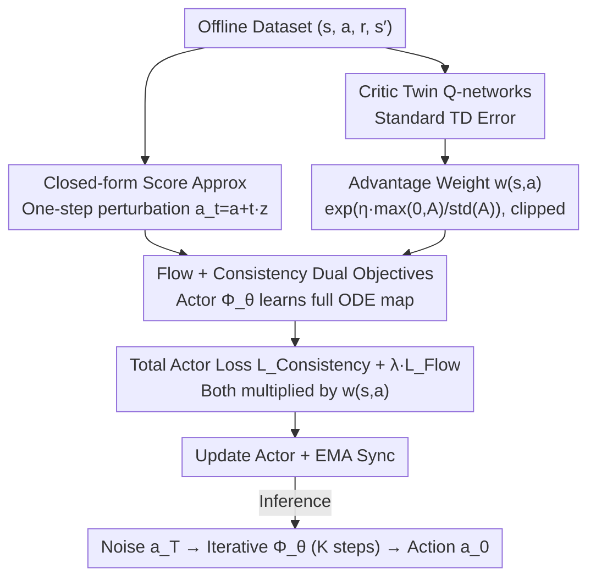

# Offline Reinforcement Learning with Generative Trajectory Policies

**Conference**: ICML2026  
**arXiv**: [2510.11499](https://arxiv.org/abs/2510.11499)  
**Code**: https://github.com/wmd3i/gtp  
**Area**: Reinforcement Learning / Offline RL / Generative Policies  
**Keywords**: Offline Reinforcement Learning, ODE Flow Maps, Consistency Trajectories, Flow Matching, Advantage Weighting  

## TL;DR
This paper unifies Diffusion Policies, Flow Matching, and Consistency Policies into a single family called "Generative Trajectory Policies (GTP)" using "continuous-time ODE solution maps." Combined with a closed-form score approximation to align with offline samples and an advantage-weighted training objective, the policy achieves near-perfect scores on hard tasks like AntMaze while maintaining low-latency sampling.

## Background & Motivation

**Background**: Offline RL prohibits environment interaction, requiring policy extraction from fixed datasets. Since behavioral data is often highly multi-modal, using generative models—such as Diffusion Policies, Consistency Policies, and Flow Matching—as policies has become a mainstream approach.

**Limitations of Prior Work**: This family of methods faces a sharp trade-off: Diffusion Policies have high expressivity but require dozens of iterations, making single-step inference too costly. Consistency Policies reduce inference to 1-2 steps, but policy quality drops significantly and performance saturates quickly.

**Key Challenge**: Diffusion and Consistency strategies appear to be two different paths, but both essentially learn the same "noise-to-data" trajectory described by an ODE. The former learns the instantaneous velocity field, while the latter learns large jumps. Both only touch one extreme of the ODE solution map $\Phi(\boldsymbol{x}_t, t, s)$; no unified approach learns the entire solution map.

**Goal**: (i) Unify Diffusion, Flow Matching, Consistency, CTM, Shortcut, and MeanFlow into a single ODE solution map framework; (ii) Design an offline RL policy class within this framework that balances expressivity and efficiency; (iii) Overcome implementation barriers like "unstable bootstrap supervision" and "mismatch between BC objectives and policy improvement."

**Key Insight**: Instead of choosing between "Diffusion vs. Consistency," one should directly learn the complete ODE solution map $\Phi(\boldsymbol{x}_t, t, s)$. This naturally allows jumping at any step length, retaining Diffusion's expressivity while gaining Consistency's efficiency.

**Core Idea**: Learn the solution map using two complementary objectives: "instantaneous anchors" and "global self-consistency." Use a closed-form score approximation based on offline samples to replace bootstrap supervision, and push the generative loss toward high-value actions using exponential advantage weights.

## Method

### Overall Architecture

GTP implements the policy $\pi_\theta(s)$ as a parameterized ODE solution map $\Phi_\theta(s, a_t, t, \tau)$. It takes state $s$, noisy action $a_t$, current time $t$, and target time $\tau$, and outputs a refined action $a_\tau$. During inference, starting from $a_T \sim \mathcal{N}(0, T^2 I)$, $\Phi_\theta$ is iteratively called along an arbitrary time grid $T = t_0 > t_1 > \dots > t_K = 0$ to get the final action, allowing a flexible trade-off between 1 and dozens of steps. Training uses an Actor-Critic framework: the Critic is a twin Q-network trained with standard TD error, while the Actor optimizes both "instantaneous flow loss" and "trajectory consistency loss," directed by an advantage-weighted coefficient $w(s,a)$ to align generative BC with policy improvement.

### Key Designs

**1. Unified ODE Map with Dual Flow & Consistency Objectives: One network for both denoising and multi-step composition.**

While Diffusion and Consistency seem different, they both learn the same ODE trajectory. Diffusion requires many steps of integration, while Consistency saturates early. GTP learns the entire map. It introduces a proxy function $\phi(\boldsymbol{x}_t, t, s) = \boldsymbol{x}_t + \frac{t}{t-s}\int_t^s f(\boldsymbol{x}_\tau, \tau) d\tau$ and recovers the map via $\Phi = (1 - s/t)\phi + (s/t)\boldsymbol{x}_t$. Two complementary constraints are applied: the **instantaneous flow loss** takes the limit $s \to t$ ($\lim_{s\to t}\phi = \boldsymbol{x}_t - t f(\boldsymbol{x}_t, t)$), making the network learn the velocity field as a local anchor; the **trajectory consistency loss** enforces $\Phi(\boldsymbol{x}_t, t, s) \approx \Phi(\Phi(\boldsymbol{x}_t, t, u), u, s)$ for any $t > u > s$ as global regulation. Optimizing both allows for high-quality few-step inference and a high multi-step performance ceiling.

**2. Closed-form Score Approximation: Replacing bootstrap supervision with single perturbations.**

A fundamental reason Diffusion/Consistency policies struggle in deep offline RL is bootstrap supervision—using a poor early-stage network itself as the ODE term $f_\theta$ to integrate training targets. GTP replaces the true score $f^\star(\boldsymbol{x}_t, t) = (\boldsymbol{x}_t - \mathbb{E}[\boldsymbol{x}|\boldsymbol{x}_t])/t$ at the ODE's right-hand side with a closed-form proxy anchored to the current offline sample $\boldsymbol{x}$: $\tilde{f}(\boldsymbol{x}_t, t) = (\boldsymbol{x}_t - \boldsymbol{x})/t$. Theorem 4.1 guarantees that for a $p$-order zero-stable ODE solver with step size $h$, the gap between ideal and actual targets is only $O(h^p)$. In practice, intermediate samples in the consistency loss $\boldsymbol{x}_u = \boldsymbol{x} + u \cdot \boldsymbol{z},\ \boldsymbol{z} \sim \mathcal{N}(0, I)$ are generated in one step, bypassing the ODE solver entirely.

**3. Advantage-Weighted Value-Driven Objective: Pushing generative BC toward true policy improvement.**

Pure generative objectives only replicate the data distribution. Under a KL-regularized RL objective, GTP derives the optimal policy as $\pi^*(a|s) \propto \pi_{\text{BC}}(a|s)\exp(\eta A(s,a))$, leading to an advantage-weighted loss: $\max_\theta \mathbb{E}_{(s,a)\sim\mathcal{D}}[\exp(\eta A(s,a)) \cdot \ell_{\text{gen}}(\pi_\theta; a|s)]$. The weights are normalized and clipped: $w(s,a) = \exp\left(\eta \cdot \frac{\max(0, A(s,a))}{\text{std}(A) + \epsilon}\right)$. Clipping negative advantages prevents low-quality actions from creating negative weights, while standard deviation normalization ensures $\eta$ remains robust across tasks. This design favors high-reward actions within the data distribution while maintaining multi-modal expressivity.

### Loss & Training

The total Actor loss is $\mathcal{L}_{\text{actor}} = \mathcal{L}_{\text{Consistency}} + \lambda_{\text{Flow}} \cdot \mathcal{L}_{\text{Flow}}$, with both terms multiplied by $w(s, a)$. The Critic follows the standard twin Q TD target $r + \gamma \min_{j=1,2} Q_{\bm{\varphi}_j^-}(s', \pi_{\theta'}(s'))$. Both Actor and Critic target networks are updated via EMA. The inference step $K$ can be chosen between 1–8, allowing a single model to span a spectrum from "extremely fast" to "multi-step refinement."

## Key Experimental Results

### Main Results

Compared against the strongest generative policies (Diffusion/Consistency/Flow) and classic offline RL on D4RL, GTP achieves SOTA on both Locomotion and AntMaze, reaching near-perfect scores on large AntMaze maps known for multi-modal trajectories.

| Dataset | Metric | GTP (Ours) | Prev. SOTA (Generative) | Gain |
|--------|------|------------|---------------------|------|
| AntMaze-Large-Diverse | Normalized Score | ≈ 100 | Significantly lower | Large margin, nearly "solved" |
| AntMaze-Large-Play | Normalized Score | ≈ 100 | Significantly lower | Large margin |
| D4RL Locomotion (mean) | Normalized Score | Highest | Slightly lower | Consistent outperform/match |

### Ablation Study

| Configuration | Key Metric | Description |
|------|---------|------|
| Full GTP | Highest | Closed-form score + Consistency loss + Advantage weight |
| w/o Closed-form score | Significant drop | Degenerates to bootstrap; unstable training; AntMaze fails |
| w/o Consistency loss | Moderate drop | Only flow loss remains; few-step quality collapses; requires more steps |
| w/o Advantage weight | Moderate drop | Degenerates to generative BC; no policy improvement |

### Key Findings

- **Closed-form score approximation** is the watershed for "solving" AntMaze—it stabilizes training and saves computation. This aligns with the $O(h^p)$ error bound in Theorem 4.1.
- **Trajectory consistency loss** is critical for few-step inference; performance drops most sharply without it when steps $K$ are reduced from 8 to 1.
- **Advantage weighting** provides more significant gains in "low diversity" tasks like Locomotion, and relatively smaller gains in expressivity-bottlenecked tasks like AntMaze.

## Highlights & Insights

- **The "Full Solution Map" is a neglected middle path**: The authors move beyond the "one-step vs. multi-step" dichotomy by learning the mapping $\Phi(\boldsymbol{x}_t, t, s)$ itself. this perspective unifies CTM, Shortcut, and MeanFlow into one family.
- **Closed-form scores stabilize training**: Replacing the network's own predicted score with $(\boldsymbol{x}_t - \boldsymbol{x})/t$ anchors supervision back to the data. This is akin to Flow Matching but more aggressively removes the ODE solver; the $O(h^p)$ bound provides clear guidance on step sizes.
- **Transferable Trick**: The standardized advantage weight $\max(0, A)/\text{std}(A)$ is a "plug-and-play" paradigm that can be applied to any "Generative BC + Value Correction" framework to simplify hyperparameter tuning.

## Limitations & Future Work

- ** Lipschitz & Stability Assumptions**: The $O(h^p)$ error bound assumes $f^\star$ and $\Phi_\theta$ are Lipschitz with respect to $\boldsymbol{x}$. Real networks (with ReLU/Attention) only approximate this, and singularities as $t \to 0$ are not fully discussed.
- **Evaluation Scope**: High-dimensional pixel-based tasks (RoboMimic or real robot arms) were not tested; it's unclear if the AntMaze success translates to pixel observations.
- **Potential Improvements**: Combining GTP with "classifier guidance" from Diffusion Q-learning or moving advantage weighting from "loss-weighting" to "trajectory sampling" could further reduce sensitivity to $\eta$.

## Related Work & Insights

- **vs. Diffusion Policy (Wang et al. 2023, Janner et al. 2022)**: They learn instantaneous denoising and require many steps. GTP expands this to a solution map, enabling jumps and reaching multi-step performance in 1–4 steps.
- **vs. Consistency Policy (Ding & Jin 2024)**: They rely on distillation to compress inference to 1 step, leading to early saturation. GTP avoids distillation by learning local fields and global consistency simultaneously.
- **vs. IQL / AWR**: Classic methods use Gaussian/MLP policies, which struggle with multi-modality. GTP grafts advantage weighting onto generative trajectory policies, decoupling value-guidance from distribution expressivity for the first time.

## Rating
- **Novelty**: ⭐⭐⭐⭐⭐ Unifying CTM/Flow/Consistency into an ODE solution map for RL is a significant conceptual contribution.
- **Experimental Thoroughness**: ⭐⭐⭐⭐ Full SOTA on D4RL with AntMaze solved. Strong ablations. Lacks pixel-based tasks.
- **Writing Quality**: ⭐⭐⭐⭐⭐ Clear structure (Unified framework → Obstacles → Solutions). Tight integration of Theorem 4.1 and Remarks.
- **Value**: ⭐⭐⭐⭐⭐ Resolves the "Efficiency vs. Expressivity" trade-off for generative policies in offline RL, providing a blueprint for future continuous-time policies.

<!-- RELATED:START -->

## Related Papers

- [\[ICML 2026\] Beyond the Proxy: Trajectory-Distilled Guidance for Offline GFlowNet Training](beyond_the_proxy_trajectory-distilled_guidance_for_offline_gflownet_training.md)
- [\[AAAI 2026\] One-Step Generative Policies with Q-Learning: A Reformulation of MeanFlow](../../AAAI2026/reinforcement_learning/one-step_generative_policies_with_q-learning_a_reformulation_of_meanflow.md)
- [\[ICML 2026\] Trajectory-Level Data Augmentation for Offline Reinforcement Learning](trajectory-level_data_augmentation_for_offline_reinforcement_learning.md)
- [\[ICML 2026\] PAC-Bayesian Reinforcement Learning Trains Generalizable Policies](pac-bayesian_reinforcement_learning_trains_generalizable_policies.md)
- [\[ICML 2026\] Offline Reinforcement Learning with Universal Horizon Models](offline_reinforcement_learning_with_universal_horizon_models.md)

<!-- RELATED:END -->
