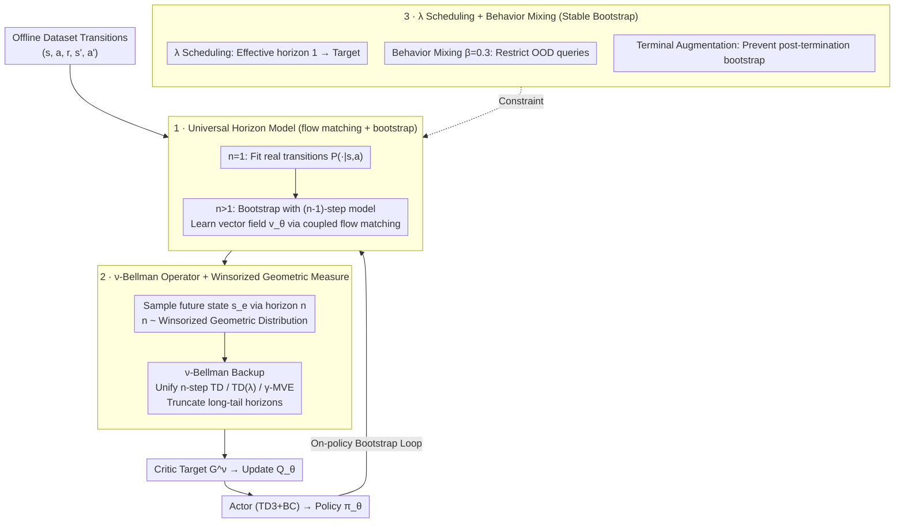

# Offline Reinforcement Learning with Universal Horizon Models

**Conference**: ICML 2026  
**arXiv**: [2605.15603](https://arxiv.org/abs/2605.15603)  
**Code**: https://rllab-snu.github.io/projects/UHM/  
**Area**: Offline Reinforcement Learning / Model-based RL / Value Learning / World Models  
**Keywords**: universal horizon model, geometric horizon model, n-step TD, winsorized geometric, flow matching

## TL;DR
The authors lift the restriction that the "Geometric Horizon Model (GHM) can only sample from a fixed discounted distribution" by proposing a Universal Horizon Model (UHM) capable of directly sampling future states over an arbitrary horizon $n$. By truncating excessively long horizons using a Winsorized geometric distribution, the proposed method achieves an average success rate improvement of approximately 14% over the strongest baselines across 100 OGBench tasks.

## Background & Motivation

**Background**: Offline reinforcement learning involves learning policies from static datasets, predominantly through TD learning. Recent findings suggest that $n$-step TD significantly reduces bias in long-horizon tasks. Consequently, works such as Park et al.'s $n$-step series, action chunking, and hierarchical policies have focused on "compressing the effective horizon." Simultaneously, model-based offline RL utilizes dynamics models to generate synthetic on-policy trajectories for value expansion, which theoretically addresses out-of-distribution issues.

**Limitations of Prior Work**: (1) Single-step dynamics models suffer from exploding compounding errors due to iterative inference on self-generated states in offline settings. (2) Although the Geometric Horizon Model (GHM) avoids iterative inference by "jumping to a discounted future," it collapses all future states into a single geometric distribution $\text{Geom}(1-\tilde\gamma)$, making the long-tail portion extremely difficult to model accurately. (3) GHM cannot specify the exact step $n$ for the sampled state, making it incompatible with $n$-step TD or TD($\lambda$).

**Key Challenge**: To eliminate compounding errors, "direct jumping" is required; however, jumping to a future fixed by a geometric distribution loses horizon granularity. Conversely, $n$-step TD requires knowledge of $n$. These two objectives are mutually exclusive within the GHM framework.

**Goal**: Construct a generative model that can "directly sample the future" to avoid iterative inference while explicitly specifying an arbitrary horizon $n$ during sampling. Based on this, develop a truly scalable offline value learning algorithm that is resilient to long-tail horizons.

**Key Insight**: The authors start from a mathematical observation: GHM is a "mixture of future distributions where $n\sim\text{Geom}(1-\tilde\gamma)$," while a single-step model is the case where $n\sim\delta(1)$. Both are special cases of the same family $m^\pi(x|s,a,n)$ evaluated at different $n$.

**Core Idea**: The $n$-step transition measure $m^\pi(x|s,a,n)=\Pr(s_n=x\mid s_0=s,a_0=a,\pi)$ itself is directly learned as a generative model. Subsequently, a "Winsorized geometric distribution" is used for horizon sampling—retaining the shape of TD($\lambda$) while imposing a hard upper bound on the long tail.

## Method

### Overall Architecture

UHM is a generative model implemented via flow matching, conditioned on $(s,a,n)$, which outputs the distribution of states after $n$ steps $m^\pi(\cdot|s,a,n)$. During training, it learns recursively through bootstrapping: the 1-step case corresponds to real transitions $\mathcal{P}(\cdot|s,a)$ in the dataset, while for $n>1$, the model bootstraps from the $(n-1)$-step model. The accompanying critic learns using a $\nu$-Bellman operator framework, unifying $n$-step TD, TD($\lambda$), and $\gamma$-MVE as different choices of $\nu$, using a Winsorized geometric measure as $\nu$ to stabilize training. The complete algorithm (Algorithm 1) uses TD3+BC as a backbone, supplemented by a reward network, actor, critic, UHM vector field $v_\theta$, target network EMA, and a behavior mixing coefficient $\beta=0.3$.

### Key Designs

**1. Universal Horizon Model: Treating Horizon $n$ as an Explicit Condition**

The fundamental issue with GHM is coupling the uncertainty of "how large is $n$" with "where the future state is for that $n$." Modeling the long tail requires simultaneous modeling of $n$ and its destination, which compounds difficulty and prevents $n$-step TD. UHM resolves this by learning the $n$-step transition measure $m^\pi(x|s,a,n)=\Pr(s_n=x|s_0=s,a_0=a,\pi)$ as the generative target: for $n=1$, it fits the dataset transitions $\mathcal{P}(x|s,a)$; for $n+1$, it bootstraps via $\mathbb{E}_{s'\sim\mathcal{P},a'\sim\pi}[m^\pi(x|s',a',n)]$. The implementation uses coupled flow matching: a target network $v_{\bar\theta}$ runs $N_\text{flow}$ ODE steps to transform noise $s_e^0\sim\mathcal{N}(0,I)$ into an $(n-1)$-step sample $s_e^1$, followed by regression on $\|v_\theta(s_e^\tau|s,a,n,\tau)-(s_e^1-s_e^0)\|_2^2$ along an optimal transport path $s_e^\tau=(1-\tau)s_e^0+\tau s_e^1$ for $\tau\sim\text{Unif}[0,1]$. By conditioning on $n$, the model focuses solely on "where the future is given $n$," and training signals are distributed evenly across all $n$. This allows UHM to outperform GHM in long horizons. Setting $n=1$ reduces it to single-step dynamics, while $n\sim\text{Geom}$ reduces it to GHM; thus, UHM is a strict generalization of both.

**2. $\nu$-Bellman Operator + Winsorized Geometric Measure: Capping the Long Tail of TD($\lambda$)**

With a model that handles arbitrary $n$, a unified backup is needed. The authors define the $\nu$-Bellman operator:

$$\mathcal{T}^\nu Q(s,a)=\mathbb{E}\Big[R(s,a)+\gamma\sum_{k\ge 1}\big[\xi^\nu(k)R(s_k,a_k)+\nu(k)Q(s_k,a_k)\big]\Big],\quad \xi^\nu(k)=\gamma^{k-1}-\sum_{\kappa=0}^{k-1}\gamma^\kappa\nu(k-\kappa),$$

where any sub-probability measure $\nu$ on $\mathbb{N}$ ensures convergence to $Q^\pi$. Choosing $\nu(k)=\gamma^{n-1}\mathbf{1}[k=n]$ yields $n$-step TD, while $\nu(k)=(1-\lambda)(\lambda\gamma)^{k-1}$ yields TD($\lambda$). The problem is that the original TD($\lambda$) has a non-zero geometric tail, meaning extremely long horizons can be sampled. Even if rare, UHM is least accurate at these horizons, which can pollute critic targets. The solution is Winsorization: for $k<k_\text{max}$, use $\nu(k)=(1-\lambda)(\lambda\gamma)^{k-1}$; at $k_\text{max}$, set $\nu(k_\text{max})=(\lambda\gamma)^{k_\text{max}-1}$ to accumulate the tail at the upper bound, and zero thereafter. This corresponds to sampling $n=\min(\text{Geom}(1-\lambda\gamma),k_\text{max})$ (where $k_\text{max}$ is the $q$-quantile; $q=0.2$ in this paper). This preserves the bias-variance trade-off of TD($\lambda$) while cutting off "tail explosions" and maintaining the sub-probability condition required for the convergence proof in Proposition 4.1.

**3. $\lambda$ Scheduling + Behavior Mixing: Breaking the Maladaptive Bootstrap Loop**

Bootstrapping—using model predictions to train the model—risks a vicious cycle: "early inaccurate large $n \to$ incorrect critic targets $\to$ policy drift $\to$ more OOD UHM queries." The authors apply constraints across time and state-action dimensions. For time, $\lambda$ scheduling uses $\lambda=\frac{r\lambda_f}{1-(1-r)\lambda_f}$ (where $r$ is training progress and $\lambda_f=0.8$, or $0.9$ for long-horizon tasks), allowing the effective horizon $1/(1-\lambda\gamma)$ to grow linearly. This ensures $n=1$ is learned first before progressing to $n=2,3,\dots$, creating a natural curriculum. For state-action constraints, behavior mixing uses a mixed policy $\pi^\text{mix}=(1-\beta)\pi_\theta+\beta\delta(a')$ to sample the next action (where $a'$ is from the dataset and $\beta=0.3$). This restricts UHM queries to state-actions with a bounded TV distance from the behavior policy, inspired by Kakade & Langford. Additionally, appending a terminal indicator to the augmented state allows the UHM to explicitly model termination, preventing the critic from bootstrapping past the end of an episode—a detail that, when removed, causes significant degradation.

### Loss & Training

The total loss is $L=L^v+L^Q+L^R+L^\pi$. Specifically, the UHM loss is $L^v=\|v_\theta(s_e^\tau|s,a,n,\tau)-(s_e^1-s_e^0)\|^2$; the critic loss is $L^Q=(Q_\theta(s,a)-G^\nu)^2$, where $G^\nu=r+\gamma(w_\xi R_{\text{sg}(\theta)}(s_e^1,a_e)+w_\nu Q_{\bar\theta}(s_e^1,a_e))$; and the reward loss is $L^R=(R_\theta(s,a)-r)^2$. The actor uses TD3+BC: $L^\pi=\alpha\|\mu_\theta(s)-a\|_2^2-Q_{\text{sg}(\theta)}(s,\mu_\theta(s))$. Hyperparameters include exploration noise $\sigma$, BC coefficient $\alpha$, and EMA decay $\eta$. All baselines share the same architecture, trained for 1M gradient steps, with results averaged over the last three epochs across 5 random seeds.

## Key Experimental Results

### Main Results (Average success rates for representative OGBench tasks)

| Environment (5 tasks/group) | ReBRAC | FQL | MAC | DTD($\lambda$) | GHM | **UHM** |
|------------------|--------|-----|-----|----------------|-----|---------|
| antmaze-large-navigate | 81 | 79 | 18 | 93 | 90 | 89 |
| antmaze-giant-navigate | 26 | 9 | 0 | 52 | 33 | 36 |
| humanoidmaze-medium-navigate | 22 | 58 | 2 | 81 | 90 | **95** |
| humanoidmaze-large-navigate | 2 | 4 | 0 | 27 | 16 | **33** |
| antsoccer-arena-navigate | 0 | 60 | 29 | 0 | 20 | 26 |
| cube-double-play | 12 | 29 | 53 | 4 | 29 | 30 |
| puzzle-3x3-play | 21 | 30 | 20 | 99 | 51 | **99** |
| puzzle-4x4-play | 14 | 17 | 78 | 1 | 13 | 11 |
| **Total Average (50 Tasks)** | 31 | 44 | 40 | 48 | 55 | **52** |

For long-horizon reasoning tasks (25 total), UHM averaged 22 vs. GHM 16 vs. DTD($\lambda$) 13. For noisy tasks (25 total), UHM averaged 39 vs. GHM 38 vs. DTD($\lambda$) 23. Overall, the authors claim a 14% improvement over the "strongest baseline" across 100 tasks.

### Ablation Study

| Configuration | Key Metric | Description |
|------|---------|------|
| Full UHM | Highest across 100 tasks | $\lambda$ scheduling + mixing $\beta=0.3$ + winsorize $q=0.2$ + terminal handling |
| w/o $\lambda$ scheduling | Fails on antmaze-giant | Bootstrap collapse due to early large $n$ |
| w/o terminal augmentation | Significant degradation | Critic explosion due to bootstrapping past terminal states |
| $\beta=0.0$ vs $0.3$ vs $1.0$ | Avg 0.63 / 0.66 / 0.59 | Task-dependent; $0.3$ is a robust compromise |
| winsorize $q=10^{-8}$ vs $0.1$ vs $0.2$ | $q=0.1,0.2$ > no truncation | Truncation is necessary; optimal $q$ is task-dependent |
| MBTD($\lambda$) (Single-step + TD($\lambda$)) | Far below UHM | Confirms "direct jump to $n$" is more stable than "iterative $n$" |
| GHM (Same framework, fixed geom) | Weaker than UHM | Flexibility in horizon provides real gains |

### Key Findings
- **Horizon reduction is the key lever in offline RL**: All methods using $n$-step / TD($\lambda$) (DTD, GHM, UHM) far outperform single-step TD (ReBRAC/FQL) on long-horizon tasks, translating Park et al.'s findings from model-free to model-based settings.
- **DTD($\lambda$) is a surprisingly strong baseline, but only on standard data**: On noisy data, DTD($\lambda$) scores <10% on manipulation tasks because it directly uses suboptimal trajectories. UHM outperforms DTD($\lambda$) by 16pp on noisy tasks, validating the necessity of synthetic on-policy futures in noisy scenarios.
- **The gap between UHM and GHM is concentrated in long-horizon reasoning**: 22 vs. 16 (a 38% relative gain). On standard tasks, they are comparable, suggesting UHM's core advantage stems from precise control over $n$.
- **Training time is comparable to GHM**: While a single UHM update is slightly slower, it is much faster than MBTD($\lambda$) (which requires $n$ model inferences) and remains within 1.1x the training time of DTD($\lambda$) for long tasks, with the efficiency advantage of direct sampling growing as task length increases.
- **Terminal handling is severely underrated**: Removing terminal augmentation leads to drastic degradation, suggesting the offline MBRL community has previously undervalued how termination states are integrated into generative models.

## Highlights & Insights
- **Unifying GHM and single-step models into a single generative family** is an elegant abstraction: $n\sim\text{Geom}\Rightarrow$ GHM, $n\sim\delta(1)\Rightarrow$ single-step, $n\sim$ any $p_H\Rightarrow$ UHM. This facilitates free choice of horizon distributions without retraining.
- **The $\nu$-Bellman operator is a powerful, overlooked tool**: It clarifies which horizon-weighted backups converge to $Q^\pi$, providing a theoretical entry point for future anti-geometric or heavy-tail backups.
- **The engineering philosophy of Winsorizing**: Applying a classical statistical technique to generative RL highlights the real risk of "low-probability event misestimation."
- **Transferable curriculum $\lambda$ scheduling**: The specific linear growth of the effective horizon can be applied to any bootstrap-trained world model.

## Limitations & Future Work
- **Acknowledged Limitations**: UHM is restricted by data sparsity and may extrapolate outside the data support. A single MLP/transformer may struggle to model all $n$ simultaneously. The current work is limited to state space and has not been extended to visual observations or action chunking.
- **Independent Observations**: (1) The Winsorize threshold $q$ is task-dependent ($q=0.2$ for cube-quadruple vs. $q=0.1$ for puzzle-4x6); automatic selection remains an open problem. (2) The coupling of reward network learning with stop-gradients in critic targets wasn't fully ablated. (3) Performance on humanoidmaze-giant shows DTD($\lambda$) leads, suggesting UHM needs better precision in high-dimensional, large-scale maps. (4) The nested ODE steps in flow matching might introduce gradient biases not explored.
- **Future Directions**: (1) Hierarchical UHM—using different networks for coarse vs. fine $n$. (2) Learning $q$ adaptively based on critic loss. (3) Integrating action chunking and visual world models (e.g., Dreamer) as a layer for latent dynamics.

## Related Work & Insights
- **vs. GHM (Janner et al., 2020) / Thakoor 2022**: Both jump to the future, but GHM hides $n$ implicitly, making it hard to learn and incompatible with TD($\lambda$). UHM is a strict generalization.
- **vs. $\gamma$-MVE**: This work proves $\gamma$-MVE is equivalent to TD($\lambda$) with $\lambda=\tilde\gamma/\gamma$. This aligns GHM and TD($\lambda$) mathematically, with UHM making $\lambda$ adjustable.
- **vs. MBTD($\lambda$) / LEQ (Park & Lee 2025)**: Both use model-based TD($\lambda$), but iterative models suffer from compounding error. UHM's direct sampling is significantly faster for long horizons.
- **vs. action-chunk dynamics (Zhang 2023; Lin 2025; Park 2026a)**: Those learn $\Pr(s_{t+n}|s_t,a_t,\dots,a_{t+n-1})$ conditioned on fixed sequences; UHM learns $\Pr(s_{t+n}|s_t,a_t,\pi)$, which is policy-induced and thus truly on-policy.
- **vs. MOPO / MOBILE**: These rely on uncertainty penalties. UHM addresses the root cause via direct future jumps and Winsorized tails, performing notably better on sparse-reward long-horizon tasks.

## Rating
- Novelty: ⭐⭐⭐⭐ Elegant generalization of GHM with a $\nu$-Bellman framework.
- Experimental Thoroughness: ⭐⭐⭐⭐⭐ 100 OGBench tasks with full ablations on scheduling, $\beta$, $q$, and terminals.
- Writing Quality: ⭐⭐⭐⭐ Rigorous math, though some Algorithm 1 details (ODE nesting, stop-gradients) require careful reading.
- Value: ⭐⭐⭐⭐ Plug-and-play improvement for offline MBRL that unifies multiple paradigms.

## Rating
- Novelty: TBD
- Experimental Thoroughness: TBD
- Writing Quality: TBD
- Value: TBD

<!-- RELATED:START -->

## Related Papers

- [\[ICML 2026\] Long-Horizon Model-Based Offline Reinforcement Learning Without Explicit Conservatism](long-horizon_model-based_offline_reinforcement_learning_without_explicit_conserv.md)
- [\[ICML 2026\] InftyThink+: Effective and Efficient Infinite-Horizon Reasoning via Reinforcement Learning](inftythink_effective_and_efficient_infinite-horizon_reasoning_via_reinforcement_.md)
- [\[ICLR 2026\] ADM-v2: Pursuing Full-Horizon Roll-out in Dynamics Models for Offline Policy Learning and Evaluation](../../ICLR2026/reinforcement_learning/adm-v2_pursuing_full-horizon_roll-out_in_dynamics_models_for_offline_policy_lear.md)
- [\[ICLR 2026\] Universal Value-Function Uncertainties](../../ICLR2026/reinforcement_learning/universal_value-function_uncertainties.md)
- [\[ICML 2026\] Learning to Bet for Horizon-Aware Anytime-Valid Testing](learning_to_bet_for_horizon-aware_anytime-valid_testing.md)

<!-- RELATED:END -->
