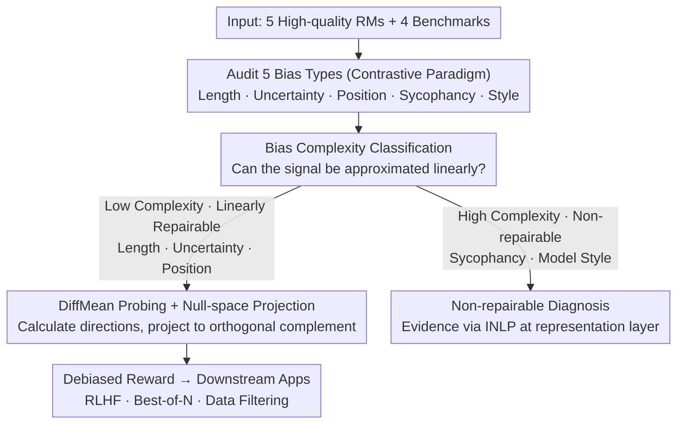

# One Bias After Another: Mechanistic Reward Shaping and Persistent Biases in Language Reward Models

**Conference**: ICML 2026  
**arXiv**: [2603.03291](https://arxiv.org/abs/2603.03291)  
**Code**: https://github.com/drfein/OneBiasAfterAnother (Available)  
**Area**: Alignment RLHF / AI Safety  
**Keywords**: Reward Models, Reward Hacking, Linear Probes, Null-space Projection, RM Bias

## TL;DR
This paper systematically measures five types of biases—length, uncertainty, position, sycophancy, and model style—across five high-quality RMs (including SOTA Skywork-Reward-V2). It categorizes them into "low complexity (linearly repairable)" and "high complexity (linearly non-repairable)" and proposes mechanistic reward shaping. By using DiffMean linear probes to perform null-space projection on the final-layer hidden states, the method significantly mitigates the first three types of biases and generalizes OOD to best-of-N without compromising RewardBench2 accuracy.

## Background & Motivation

**Background**: RLHF is the dominant method for aligning LMs, but RMs acting as proxy rewards are highly susceptible to reward hacking by policies. Biases such as length, position, overconfidence, and sycophancy have been frequently documented. Existing remedies either modify training data, add length penalties, or train robust RMs, most of which treat biases as linear spurious correlations.

**Limitations of Prior Work**: (1) Even the latest SOTA RMs (Skywork-Reward-V2 series, AllenAI-Llama-8B) persistently exhibit old biases; RMs trained to fix length bias often suffer from over-correction—ranking concise incorrect answers higher than correct long ones. (2) Existing post-hoc fixes (like length penalty) depend on explicit functional forms and fail in prompt-conditioned scenarios (best-of-N). (3) There is a lack of systematic differentiation between biases that are linear spurious correlations and those that are entangled and require deeper intervention, leading to "one-size-fits-all" methods failing on high-complexity biases.

**Key Challenge**: Biases may be co-linear with useful signals in the RM activation space. Single-direction interventions either fail to fix the bias or inadvertently remove beneficial signals.

**Goal**: (i) Re-audit known biases and discover new ones in latest RMs; (ii) provide an empirical classification of "linearly repairable vs. non-repairable" biases; (iii) design a data-efficient, in-model, OOD-generalizable intervention for low-complexity biases.

**Key Insight**: Based on the Linear Representation Hypothesis (Park et al., 2024a), high-level concepts are approximately linear directions in representation space. If a bias is primarily carried by a single linear direction, nulling that direction can locally debias. If the bias and signal are entangled in the same subspace, linear nulling will naturally fail, serving as a useful diagnostic signal.

**Core Idea**: Use pairs of "biased vs. unbiased" contrastive samples to create difference-of-mean probes. Perform null-space projection (mechanistic reward shaping) on the RM's final-layer hidden states to both fix biases and identify which biases are inherently unfixable via linear methods.

## Method

### Overall Architecture
The mechanism follows a "Measure → Categorize → Repair" pipeline. **Measure**: Systems audit five types of biases (length, uncertainty, position, sycophancy, model style) across five RMs (Skywork-Llama-8B, Skywork-Qwen-8B/0.6B, AllenAI-Llama-8B, DeBERTa-large-v2) using a unified contrastive paradigm. **Categorize**: Biases are divided into low complexity (linearly repairable: length, uncertainty, position) and high complexity (linearly non-repairable: sycophancy, model style) based on whether the dominant signal can be approximated by a single linear direction. **Repair**: For low-complexity biases, DiffMean linear probes $\mathbf{p}$ are calculated from hidden states of contrastive pairs. At inference, null-space projection $\mathbf{h}_{\text{null}} = \mathbf{h} - \sum_k \alpha (\mathbf{p}_k^{\top}\mathbf{h})\mathbf{p}_k$ is applied to the hidden states before the reward head.

Function: Input a prompt-completion pair; Output a debiased scalar reward. The intervention occurs entirely within the RM, requiring no retraining or optimizer changes, making it compatible with best-of-N, red-teaming, and data filtering.

### Key Designs

**1. Five-type Bias Audit + Contrastive Data Paradigm**
The audit makes bias discovery a reproducible pipeline. For length bias in GSM8K, (concise-correct, incorrect, verbose-correct) triplets are constructed to see if RMs prefer incorrect but verbose answers. For uncertainty, prefixing "I'm not sure..." requires the RM to maintain the ranking $r(C) \geq r(C+U) \geq r(I+U) \geq r(I)$. Model style bias calculates per-byte cross-entropy for 10 LMs and assesses the Spearman correlation between RM rewards and panel-relative $\Delta s_m$. Non-zero correlation indicates a systematic preference for a specific model family's "familiar style."

**2. Bias Complexity Categorization**
This design establishes an empirical criterion: high complexity vs. low complexity. "Mechanistic" is used in the narrow sense (Saphra & Wiegreffe, 2024)—asking if identifying and removing a direction in activation space causes measurable causal changes in downstream reward behavior. If nulling a direction reduces the target bias without harming baseline accuracy, it is low complexity. If the bias remains unchanged, it is entangled in the same subspace as quality signals and requires deeper intervention (e.g., SAEs or behavioral shifts).

**3. DiffMean Probe + Null-space Projection**
For repairable biases, contrastive sets $\{\mathbf{h}_i^+\}$ and $\{\mathbf{h}_j^-\}$ are used. The hidden state of the last non-padding token before the reward head is extracted. The probe direction is calculated as:
$$\mathbf{p} = \mathrm{normalize}\Big(\tfrac{1}{n_+}\sum_i \mathbf{h}_i^+ - \tfrac{1}{n_-}\sum_j \mathbf{h}_j^-\Big).$$
During inference, the state is projected: $\mathbf{h}_{\text{null}} = \mathbf{h} - \sum_k \alpha (\mathbf{p}_k^{\top}\mathbf{h})\mathbf{p}_k$. Multiple probes are handled via Gram-Schmidt orthogonalization. This approach does not assume a functional form for the bias and is data-efficient; a length probe from GSM8K transfers OOD to RewardBench2 and AlpacaEval.

### Loss & Training
Ours is **entirely training-free**. All interventions are inference-time linear projections. Parameters include the contrastive sample size and projection strength $\alpha \in \{0.5, 1.0, 1.5\}$. For SOTA RMs with fewer initial biases, $\alpha=0.5$ is often superior to $\alpha=1.0$ to avoid removing true signals.

## Key Experimental Results

### Main Results

| Bias Type | Baseline Performance | After Intervention | Significant Mitigation? |
|-----------|----------------------|--------------------|-------------------------|
| Length (DeBERTa) | Spearman(reward, length) = 0.611 | 0.067 (No 95% CI overlap) | Yes |
| Length (SOTA over-correction) | Prefers concise-wrong > verbose-right | Bias reduced; accuracy maintained | Yes |
| Uncertainty | "I'm not sure" → Accuracy drops 22.6% | Prefers uncertainty for wrong, direct for right | Yes |
| Calibration (Skywork-Qwen-8B) | Spearman(conf, corr) = 0.182 | 0.386 at $\alpha=1.0$ (Doubled) | Yes |
| Position (MCQA A–D) | Variance across positions 2-28% | Variance significantly reduced | Partial |
| RewardBench2 Accuracy | 70.1% | 69.3% - 70.1% (by intervention type) | Passed 5pp non-inferiority check |

### Ablation Study

| Setting | Key Findings |
|---------|--------------|
| Best-of-N on AlpacaEval | Within-prompt $\|r,L\|$ correlation 0.10 → 0.04; 4/5 RMs improved length-controlled win rate. |
| Best-of-N on GSM8K | Within-prompt correlation 0.076 → 0.007; Mean BoN accuracy 62.1% → 62.8%. |
| Sycophancy (Regressive) | All 5 RMs show sycophancy; Linear intervention cannot lower regressive sycophancy without harming progressive sycophancy. |
| Model Style Sensitivity | All 5 RMs show statistically significant reward-style correlation; accounts for 4-16% of ranking variance. |
| Calibration $\alpha$ Scan | Skywork-Qwen series peaks at $\alpha=1.0$; Llama8B series performs better at $\alpha=0.5$. |

### Key Findings
- **Discovery**: SOTA RMs actually "over-correct" for length, often favoring concise but incorrect answers in math tasks.
- **OOD Generalization**: Length probes constructed solely from GSM8K successfully transfer to RewardBench2 and AlpacaEval, reducing correlation to near zero without losing ranking accuracy.
- **Complexity Actionability**: Sycophancy and model-style biases cannot be eradicated even with iterative null-space projection (INLP), suggesting they are entangled with the core quality signal.

## Highlights & Insights
- **Valuable Negative Results**: Categorizing certain biases as "linearly non-repairable" provides an empirical roadmap for future research (e.g., using SAEs).
- **Engineering Friendliness**: Inference-time intervention that is plug-and-play for RLHF, best-of-N, and data filtering without retraining.
- **Model Style Bias**: Revealing that RMs systematically reward "familiar" writing styles (e.g., Llama-style) over actual quality provides a critical warning for the open-source RM ecosystem.

## Limitations & Future Work
- **Limitations**: (1) High-complexity biases (sycophancy/style) remain unsolved via linear methods; (2) Length probes in some SOTA RMs require manual tuning of $\alpha$ to avoid introducing positive correlation; (3) Evaluation is limited to four reasoning/knowledge benchmarks and lacks long-tail chat/safety coverage.
- **Mechanism**: The probe construction is sensitive to contrastive pair selection; if "verbose" samples correlate with "Chain of Thought," the intervention might accidentally nullify reasoning signals.
- **Future Work**: Scaling to SAE-based features for finer subspace decomposition; extending intervention to deeper layers for sycophancy.

## Related Work & Insights
- **vs. Explicit Penalties**: Unlike Park et al. (2024b) or Huang et al. (2025), ours does not assume a functional form for length-reward relationships and outperforms global calibration in BoN tasks.
- **vs. INLP**: While INLP is used as a diagnosis tool for high-complexity biases, our single-step DiffMean is a lighter, more practical inference-time fix.
- **vs. Sycophancy Evaluation**: Unlike previous work, ours filters out cases where the RM was already wrong, providing a cleaner measurement of sycophancy.

## Rating
- Novelty: ⭐⭐⭐⭐
- Experimental Thoroughness: ⭐⭐⭐⭐⭐
- Writing Quality: ⭐⭐⭐⭐
- Value: ⭐⭐⭐⭐⭐

<!-- RELATED:START -->

## Related Papers

- [\[ICML 2026\] CAMEL: Confidence-Gated Reflection for Reward Modeling](camel_confidence-gated_reflection_for_reward_modeling.md)
- [\[NeurIPS 2025\] Checklists Are Better Than Reward Models For Aligning Language Models](../../NeurIPS2025/reinforcement_learning/checklists_are_better_than_reward_models_for_aligning_langua.md)
- [\[ICLR 2026\] VerifyBench: Benchmarking Reference-based Reward Systems for Large Language Models](../../ICLR2026/reinforcement_learning/verifybench_benchmarking_reference-based_reward_systems_for_large_language_model.md)
- [\[ICML 2025\] Automatic Reward Shaping from Confounded Offline Data](../../ICML2025/reinforcement_learning/automatic_reward_shaping_from_confounded_offline_data.md)
- [\[ICML 2025\] Action-Dependent Optimality-Preserving Reward Shaping (ADOPS)](../../ICML2025/reinforcement_learning/action-dependent_optimality-preserving_reward_shaping.md)

<!-- RELATED:END -->
