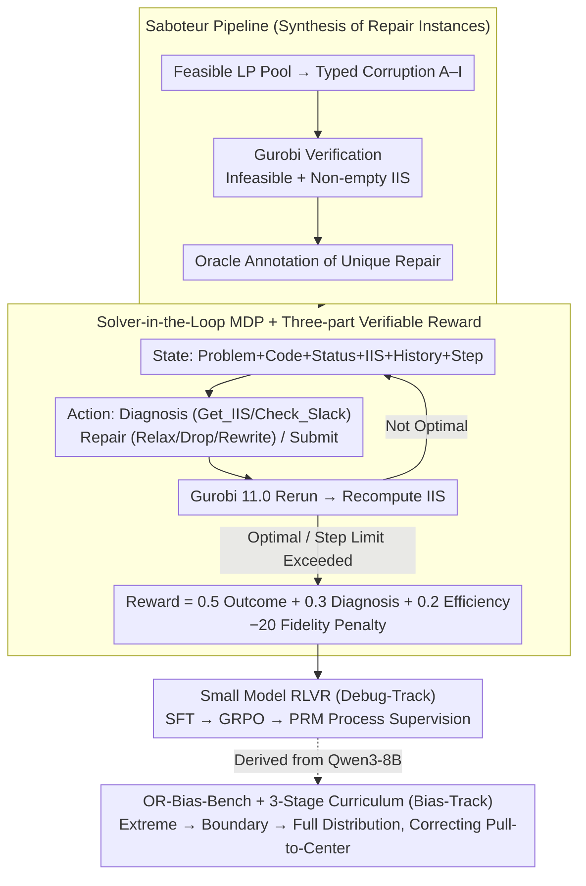

# ORLoopBench: Solver-in-the-Loop Benchmarks for Self-Correction and Behavioral Rationality in Operations Research

**Conference**: ICML 2026  
**arXiv**: [2601.21008](https://arxiv.org/abs/2601.21008)  
**Code**: https://github.com/Archer222arc/ORLoopBench  
**Area**: LLM Evaluation / Self-Correction / Operations Research / Solver-in-the-Loop / RLVR  
**Keywords**: solver-in-the-loop, IIS feedback, self-correction, GRPO, newsvendor bias

## TL;DR
The authors formalize "repairing an infeasible operations research model" as a solver-in-the-loop MDP where each modification step requires re-running Gurobi to obtain Irreducible Infeasible Subsystem (IIS) feedback. They release the ORLoopBench benchmark (5362 LP/MILP repair instances + inventory decision bias evaluation) and utilize RLVR to train an 8B model that outperforms closed-source APIs (92.4%) with a 95.3% RR@5 on LP repair tasks.

## Background & Motivation

**Background**: Existing LLM-for-OR benchmarks (NL4Opt, OptiBench, MAMO, ORLM, etc.) primarily examine one-shot translation from "problem description → solver code." The process terminates once the model writes the code, lacking multi-turn interaction with the solver.

**Limitations of Prior Work**: In practical operations research, the first response of an engineer after writing LP/MILP code is often seeing a `Status: Infeasible`. They then rely on the IIS provided by Gurobi to iteratively locate conflicting constraints and modify formulas. One-shot translation benchmarks bypass this debugging loop, thereby obscuring the true engineering capabilities of LLMs.

**Key Challenge**: In self-correction tasks, feedback signals are typically vague (e.g., compiler errors, unit test failures), leading works like CorrectBench to use "soft" metrics. Operations research scenarios possess a rare "triple certainty"—solver outputs are deterministic oracles, IIS provides a minimal certificate of conflict, and optimal solutions are mathematically verifiable—making it an ideal sandbox for studying self-correction that has remained un-systematized.

**Goal**: (1) Formalize infeasible-model repair as a trainable MDP; (2) Provide a benchmark that distinguishes "accidental repair" from "true diagnosis"; (3) Evaluate the behavioral rationality of LLMs in downstream operational decisions (inventory).

**Key Insight**: The authors leverage the IIS as a "minimal conflict certificate." It is not a standard error message but a mathematically compressible subset of conflicts, requiring the model to perform targeted modifications rather than trial-and-error.

**Core Idea**: Pack "problem description + current code + Gurobi status + IIS" into a state; define "diagnostic query / repair edit / submission" as actions; and compose a reward based on "optimality achieved, conflict identification, and step count." Reinforcement Learning with Verifiable Rewards (RLVR) via GRPO is then applied with solver validation, naturally fitting the OR context.

## Method

### Overall Architecture

ORLoopBench consists of two complementary components. **OR-Debug-Bench** is the core: a solver-in-the-loop MDP containing 5362 LP/MILP repair instances, covering 9 LP error types (A–I) and 8 MILP error types. **OR-Bias-Bench** is supplementary: 2000 newsvendor and 300 EOQ inventory decision problems, evaluating "pull-to-center" bias against closed-form optima $Q^{*}=F^{-1}(\text{CR})$ and $Q^{*}=\sqrt{2DK/h}$. Both components utilize a training pipeline based on Qwen3-8B with SFT + RL.

The evaluation loop proceeds as follows: the solver detects `Infeasible` and extracts the IIS from code → the agent observes the state (NL problem + current code + Status + IIS + history + step number) → outputs an action (Diagnosis `Get_IIS` / `Check_Slack`, Repair `Relax` / `Drop` / `Rewrite`, or Termination `Submit`) → Gurobi 11.0 re-runs to yield the next state → continues until `Optimal` or the step limit is reached (max 50). Two tracks originate from Qwen3-8B: Debug-Track follows "Saboteur data synthesis → MDP loop → RLVR training," and Bias-Track follows "Inventory bias testing → Three-stage curriculum correction."

### Key Designs

**1. Solver-in-the-loop MDP + Three-part Verifiable Reward: Turning multi-turn repair into a Gurobi-determined RL task**

Self-correction feedback is typically ambiguous, necessitating "soft" metrics; however, the OR solver is a deterministic oracle, and the IIS is a minimal certificate, allowing rewards to be grounded in objective signals. ORLoopBench defines the reward as $\mathcal{R}=0.5\,R_\text{outcome}+0.3\,R_\text{diagnosis}+0.2\,R_\text{efficiency}$: $R_\text{outcome}=+100$ if Optimal, else $-50$; $R_\text{diagnosis}=\text{DA}\cdot 100$, where Diagnosis Accuracy $\text{DA}=|\text{diagnosed}\cap \text{IIS}_\text{GT}|/|\text{IIS}_\text{GT}|$; $R_\text{efficiency}=-1$ per step; plus a $-20$ "fidelity penalty" to suppress "detour repairs" that modify non-IIS constraints to reach optimality. This design decouples "conflict understanding" from "feasibility restoration"—preventing the model from "cheating" through side effects and ensuring the reward measures actual IIS comprehension.

**2. Saboteur Pipeline: Automatically synthesizing "difficult and unique" infeasible repair triplets**

Synthesized data is useless if too simple or if repairs are non-unique, allowing models to bypass the intended diagnosis. The 4-stage pipeline (pool sampling → typed corruption → Gurobi verification → oracle annotation) ensures every corrupted LP is Infeasible, has a non-empty IIS, and the IIS contains the injected constraint. Nine error types are categorized: B/C involve minor sign or coefficient changes (Easy, baseline RR@5 ≥ 85%); H/I involve incomplete IIS or optimal selection (Medium, 70–85%); A/D/E/F/G cover direction flips, contradictory constraints, and cascading conflicts (Hard, <70%). Type-specific strategies are used, such as relaxation-based selection for Type A (increasing success rate from 30% to 95%). Anti-pattern measures like UUID-based naming and cascaded conflicts force models to perform genuine diagnosis rather than string matching.

**3. Small Model RLVR: GRPO + Process Reward Model pushing 8B to outperform frontier APIs**

Outcome-only rewards arrive too late for short-trajectory LP repair tasks, making it difficult for an 8B model to learn. ORLoopBench first performs SFT on 696 successful trajectories from GPT-5.2-chat / o4-mini / DeepSeek-R1 (acceptance criteria: ≤5 steps + ≥50% GT conflict hit), followed by GRPO ($\beta=0$ for KL, asymmetric clipping $[0.2, 0.28]$, LoRA $r=16, \alpha=32$, converging to RR@5 ≈ 95.0% in 4 epochs). To mitigate reward sparsity, a Process Reward Model (PRM) is trained for step-level scoring (highest reward for hitting conflicts or reducing IIS size), achieving an AUC-ROC of 0.94 and increasing DA by 4.7pp (68.0%→72.7%). The training requires only ~8 GPU-hours (2×A100) and transfers zero-shot to MILP.

**4. OR-Bias-Bench + Three-Stage Curriculum Learning: Correcting systemic downstream inventory decision biases**

Correct formulas do not guarantee correct application. The Bias-Track utilizes 2000 newsvendor (optimal $Q^{*}=\mu+\sigma\Phi^{-1}(\text{CR})$) and 300 EOQ ($Q^{*}=\sqrt{2DK/h}$) problems with unambiguous closed-form solutions. Following the discovery of "pull-to-center" bias (under-ordering for $\text{CR}>0.5$, over-ordering for $\text{CR}<0.5$), this work demonstrates that such bias can be corrected via curriculum learning: Stage 1 teaches direction at extreme CRs (0.1/0.9); Stage 2 calibrates magnitude at boundaries (0.15–0.25, 0.75–0.85); Stage 3 consolidates over the full distribution [0.2, 0.8]. This "direction-then-magnitude" approach reduced OOD bias from 20.0% to 10.4%.

### Loss & Training

The two tracks are derived from Qwen3-8B and trained independently: Debug-Track uses SFT + GRPO (with optional PRM), while Bias-Track uses SFT + Three-Stage Curriculum Learning. Inference is unified via SGLang (TP=2, concurrency=16) on 2×A100.

## Key Experimental Results

### Main Results

Evaluation of 26 models (LP test set 450 cases, 50 per Type A–I):

| Model | RR | RR@5 | DA | Avg. Steps |
|------|----|------|----|---------|
| Qwen3-8B-GRPO (Ours) | 100% | **95.3%** | **62.4%** | **2.25** |
| Qwen3-8B-Curriculum | 100% | 94.0% | 61.7% | 2.22 |
| Qwen3-8B-SFT | 99.8% | 93.1% | 60.8% | 2.34 |
| Claude Sonnet 4.6 (Best API) | — | 92.4% | — | — |
| o4-mini | 97.8% | 86.2% | 47.8% | 3.15 |
| claude-sonnet-4 | 100% | 86.2% | 50.1% | 3.71 |
| gpt-5.2-chat | 99.8% | 81.8% | 40.9% | 3.72 |
| DeepSeek-R1 | 99.1% | 56.7% | 34.5% | 5.08 |

MILP Transfer: The LP-trained model achieved 78.8% RR@5 zero-shot; MILP-specific training increased this to 87.1%, exceeding Claude Sonnet 4.6 (71.0%) by 16.1pp.

### Ablation Study

| Configuration | Key Metrics | Description |
|------|---------|------|
| SFT only | RR@5 93.1% / DA 60.8% | Imitation of teacher trajectories only |
| + GRPO (Outcome Reward) | RR@5 95.3% / DA 62.4% | Mainstrearm configuration |
| + PRM Process Supervision | DA 72.7% (+4.7pp) | Step-level rewards significantly boost diagnosis quality |
| + Curriculum Learning | OOD bias 10.4% (-9.6%) | Only scheme where OOD bias dropped significantly |

### Key Findings
- **8B Outperforming Frontier Models**: Qwen3-8B-GRPO surpassed Claude Sonnet 4.6 by 2.9pp in RR@5 while improving DA from 47.8% to 62.4% and reducing steps from 3.15 to 2.25.
- **Semantic Drift in Code Rewriting**: OptiMUS-style full regeneration reached optimality in 90% of MILP cases for GPT-5.4, but only 28.2% preserved the original objective function. Constraint-level repair naturally avoids this drift.
- **Diagnostic Style Inversion**: Post-training models transitioned to a "diagnose once, repair precisely" mode, averaging 1.3 diagnostic actions (vs. 2.1 for APIs) with significantly higher hit rates.
- **Directional Behavioral Bias**: All LLMs exhibited "pull-to-center" in newsvendor tasks; curriculum learning was the only method that reduced OOD bias (-9.6% drift).

## Highlights & Insights
- **Solver-in-the-Reward**: Unlike prior works using solvers for scoring, this work triggers the solver at every step, with rewards derived directly from state changes. RLVR in OR requires no human oracle and can scale indefinitely.
- **DA vs. RR@5 Decoupling**: Models with high RR@5 but low DA are easily identified as "repairing without understanding," providing diagnostic value for engineering applications.
- **PRM Success**: An AUC-ROC of 0.94 suggests that step-level labels for structured tasks are cleaner than in general competitive math or coding, making process supervision more effective.
- **OR-Bias-Bench**: Applying the behavioral economics "pull-to-center" theory to LLMs provides a rigorous "systemic bias probe" with unambiguous ground truths.

## Limitations & Future Work
- **Limitations**: Deployment costs (TP=2 on 2×A100) remain high for some labs; MILP performance (87.1%) still has room for improvement compared to real-world production requirements.
- **Observational Limitations**: The benchmark is coupled with Gurobi 11.0; different solvers (CPLEX/HiGHS) might yield different IIS results. The "Saboteur" pipeline's error distribution has not been statistically validated against real-world OR bug distributions.
- **Future Directions**: (1) Support solver-agnostic infeasibility certificates; (2) Embed objective function drift as a primary metric; (3) Incorporate real-world retail data for OOD distribution testing.

## Related Work & Insights
- **vs. CorrectBench**: CorrectBench uses soft testing for general programming; ORLoopBench uses deterministic IIS certificates for precise quantification of diagnostic accuracy.
- **vs. SWE-bench**: SWE-bench uses unit tests as black-box oracles; ORLoopBench provides readable IIS feedback at each step, facilitating step-level RL.
- **vs. ORLM / OptiBench**: Previous works focused on "NL to formula" one-shot translation; this work upgrades the task to "repairing existing incorrect code," reflecting real engineering workflows.
- **vs. AIM-Bench**: AIM-Bench first reported "pull-to-center" bias; this work proves it can be corrected through structured curriculum training.

## Rating
- Novelty: ⭐⭐⭐⭐ Systematic use of IIS as an RLVR signal is impactful, though solver-in-the-loop concepts exist in software engineering contexts.
- Experimental Thoroughness: ⭐⭐⭐⭐⭐ Comprehensive testing across 26 models, MILP transfer, bias OOD, PRM, and curriculum ablations.
- Writing Quality: ⭐⭐⭐⭐ Clean presentation of tables and reward formulas; some experimental details are relegated to appendices.
- Value: ⭐⭐⭐⭐⭐ The benchmark and training recipe are reusable for small-model RLVR in any structured mathematical task.

## Rating
- Novelty: Under Review
- Experimental Thoroughness: Under Review
- Writing Quality: Under Review
- Value: Under Review

<!-- RELATED:START -->

## Related Papers

- [\[ICML 2026\] Dr. Tulu: Reinforcement Learning with Evolving Rubrics for Deep Research](dr_tulu_reinforcement_learning_with_evolving_rubrics_for_deep_research.md)
- [\[NeurIPS 2025\] ReSearch: Learning to Reason with Search for LLMs via Reinforcement Learning](../../NeurIPS2025/reinforcement_learning/research_learning_to_reason_with_search_for_llms_via_reinforcement_learning.md)
- [\[CVPR 2026\] PlannerRFT: Reinforcing Diffusion Planners through Closed-Loop and Sample-Efficient Fine-Tuning](../../CVPR2026/reinforcement_learning/plannerrft_reinforcing_diffusion_planners.md)
- [\[ICML 2026\] D$^2$Evo: Dual Difficulty-Aware Self-Evolution for Data-Efficient Reinforcement Learning](d2evo_dual_difficulty-aware_self-evolution_for_data-efficient_reinforcement_lear.md)
- [\[ICML 2026\] Making Expert Reasoning Learnable with Self-Distillation](making_expert_reasoning_learnable_with_self-distillation.md)

<!-- RELATED:END -->
