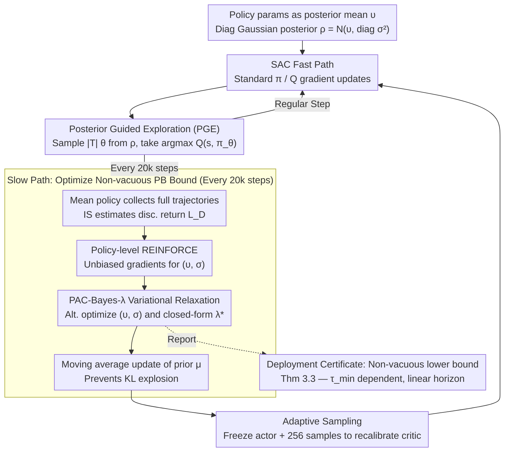

# PAC-Bayesian Reinforcement Learning Trains Generalizable Policies

**Conference**: ICML2026  
**arXiv**: [2510.10544](https://arxiv.org/abs/2510.10544)  
**Code**: None  
**Area**: Reinforcement Learning / Generalization Theory / PAC-Bayes  
**Keywords**: PAC-Bayes bounds, mixing time, Soft Actor-Critic, deployment certificates, posterior-guided exploration  

## TL;DR
This paper provides the first PAC-Bayesian RL generalization bound that **explicitly depends on the mixing time of the Markov chain** and scales only linearly with the long horizon $1/(1-\gamma)$. By embedding this bound as an "alive" training objective within SAC, the authors derive the PB-SAC algorithm—delivering non-vacuous deployment certificates and competitive performance on MuJoCo continuous control tasks simultaneously.

## Background & Motivation

**Background**: Applying Reinforcement Learning (RL) to safety-critical scenarios requires "formal generalization guarantees"—ensuring that trained policies perform well on unseen trajectories. While the PAC-Bayes framework provides non-vacuous, high-confidence certificates in supervised learning (Pérez-Ortiz 2021) and can serve as a training objective, applying it directly to RL faces a fatal issue: trajectory data is **temporally correlated**. Since $S_{t+1}$ is determined by $(S_t, A_t)$, the i.i.d. assumption central to classical PAC bounds is violated.

**Limitations of Prior Work**: (1) Seldin et al. (2011, 2012) elegantly handled sequential dependence using martingale methods, but RL data does not naturally form a martingale and requires external construction (e.g., Bellman residuals). (2) Fard et al. (2011) applied PAC-Bayes to RL via Bellman error, but the resulting sample complexity scales at $\mathcal{O}((1-\gamma)^{-4})$, which is numerically vacuous in modern deep RL settings where $\gamma=0.99$. (3) Recent works like Tasdighi et al. (2025) either inherit this poor horizon dependence or treat PAC-Bayes only as a regularization term (e.g., for deep exploration in PBAC or lifelong learning in Zhang 2025), abandoning the original goal of providing computable certificates.

**Key Challenge**: To make PAC-Bayes certificates useful in modern deep RL, three issues must be resolved simultaneously: (a) choosing a concentration inequality for sequential dependence; (b) addressing the exponential vacuity regarding the horizon $1/(1-\gamma)$; and (c) preventing the non-convex PAC-Bayes objective and periodic posterior updates from destroying critic stability. No previous literature has addressed all three.

**Goal**: (1) Derive a PAC-Bayes RL bound with explicit $\tau_{\min}$ (mixing time) dependence and horizon scaling of only $\mathcal{O}((1-\gamma)^{-1})$; (2) Ensure the bound is numerically non-vacuous on MuJoCo; (3) Design the PB-SAC algorithm to stably optimize this bound as an "alive" objective during training.

**Key Insight**: Instead of a two-step derivation via Bellman residuals, the authors perform a bounded-differences analysis directly on the **discounted return**. They leverage results from Paulin (2018) that extend McDiarmid’s inequality to Markov chains—providing concentration with explicit constants for "Markov functions satisfying bounded differences."

**Core Idea**: The transition-level sensitivity of the discounted return is derived as $c_{(h,j)} = \gamma^{h-1}R_{\max}/T$, yielding $\|c\|_2^2 = R_{\max}^2(1-\gamma^{2H})/(T(1-\gamma^2))$. Combining Markovian McDiarmid concentration with standard PAC-Bayes change-of-measure results in a clean certificate involving only $\tau_{\min} \cdot \|c\|_2^2$.

## Method

### Overall Architecture
The work consists of two layers:

1.  **Theoretical Layer (Section 3)**: Establishes the main PAC-Bayes RL theorem (Theorem 3.3) in the form: $\mathbb{E}_{\theta\sim\rho}[L(\theta)] \le \mathbb{E}_{\theta\sim\rho}[\hat{L}_D(\theta)] + \sqrt{\frac{R_{\max}^2(1-\gamma^{2H})}{T(1-\gamma^2)}\tau_{\min}(\mathrm{KL}(\rho\|\mu) + \ln\sqrt{2}/\delta)}$, where $L(\theta) = -\mathbb{E}_{\xi\sim M}[\frac{\pi_\theta(\xi)}{\pi_b(\xi)}G(\xi)]$ is the true off-policy loss written via importance sampling. The horizon dependence is only $1/(1-\gamma^2)$ (equivalent to linear scaling), and $\tau_{\min}$ is the mixing time of the induced Markov chain.
2.  **Algorithmic Layer (Section 4)**: Constructs PB-SAC (PAC-Bayes Soft Actor-Critic), maintaining a diagonal Gaussian posterior $\rho(\theta) = \mathcal{N}(\upsilon, \mathrm{diag}(\sigma^2))$. Standard SAC gradient updates handle the "fast path" for step-by-step training; the PAC-Bayes objective triggers a "slow path" every 20k steps to update the posterior. The slow path utilizes four mechanisms (Posterior Guided Exploration PGE / Policy-level REINFORCE / PAC-Bayes-$\lambda$ variational relaxation / Adaptive Sampling) to transform the theoretical bound into an optimizable objective.

The diagram below illustrates the overall flow of PB-SAC:

### Key Designs

**1. Transition-level bounded differences + Paulin concentration: Reducing horizon dependence from quartic to linear**

The first challenge is that sequential dependence invalidates classical PAC bounds. Rather than following Fard et al. (2011) in converting value error to Bellman error (which inflates the horizon dependence to $(1-\gamma)^{-4}$), the authors analyze the discounted return directly. For a fixed $\theta$ and two trajectory sets $D, \bar{D}$ differing by one transition, they prove:
$$|\hat{L}_D(\theta) - \hat{L}_{\bar{D}}(\theta)| \le \sum_{h',j'} c_{(h',j')}\,\mathbb{1}[\xi_{h'}^{(j')} \neq \bar{\xi}_{h'}^{(j')}],\qquad c_{(h,j)} = \gamma^{h-1} R_{\max}/T.$$
The coefficients $c_{(h,j)}$ capture how earlier transitions have a larger impact while later ones decay exponentially. Applying Paulin’s (2018) Markovian McDiarmid inequality shows that deviations are controlled by $\tau_{\min}\cdot\|c\|_2^2$. The critical benefit comes from the summation $\sum_h \gamma^{2h} \approx (1-\gamma^2)^{-1}$, which removes two factors of $1/(1-\gamma)$. This is the key step that reduces the bound from $\approx 10^8$ to $\approx 10^2$ for $\gamma=0.99$, moving from "numerically infinite" to "non-vacuous."

**2. Posterior Guided Exploration (PGE): Using uncertainty instead of undirected noise**

SAC typically relies on entropy regularization or $\epsilon$-greedy for exploration, which can be inefficient in sparse reward settings. Since PB-SAC maintains a posterior $\rho$ over policy parameters, exploration "listens" to the posterior: at each exploration step, $|\mathcal{T}|$ candidates $\theta_i$ are sampled from $\rho$, and the action is selected via $\arg\max_{\theta_i\in\mathcal{T}} Q(s,\pi_{\theta_i}(s))$. This requires only $|\mathcal{T}|$ critic evaluations without searching parameter space. The posterior standard deviation $\sigma$ automatically balances exploration and exploitation: larger $\sigma$ leads to diverse candidates, while smaller $\sigma$ clusters candidates around the mean. This uncertainty-driven exploration allows PB-SAC to outperform PBAC in sparse reward tasks.

**3. Policy-level REINFORCE: Making PAC-Bayes gradients samplable**

Optimizing the bound requires $\nabla_{(\upsilon,\sigma)}\mathbb{E}_{\theta\sim\rho}[\hat{L}_D(\theta)]$, but sampling occurs inside the gradient operator. The authors use a two-step detour: first, use the **current mean policy** to collect fresh, complete trajectories (necessary to maintain the intra-trajectory structure required by Theorem 3.3); then, apply the log-likelihood trick (REINFORCE) at the **policy parameter $\theta$ level** rather than the action $a$ level:
$$\nabla_{(\upsilon,\sigma)}\mathbb{E}_{\theta\sim\rho}[\hat{L}_D(\theta)] = \mathbb{E}_{\theta\sim\rho}\big[\nabla_{(\upsilon,\sigma)}\log P_{\upsilon,\sigma}(\theta)\cdot\hat{L}_D(\theta)\big].$$
This unbiased estimate keeps the PAC-Bayes training cost comparable to standard actor-critic.

**4. PAC-Bayes-$\lambda$ variational relaxation + Alternating optimization**

The certificate takes the form $\hat{L}_D + \sqrt{\text{KL}}$, which is non-convex due to the square root. Using the identity $\sqrt{x} = \inf_{\lambda>0}(\frac{x}{2\lambda}+\frac{\lambda}{2})$, the objective is rewritten as:
$$\mathcal{J}(\rho,\lambda) = \mathbb{E}_{\theta\sim\rho}[\hat{L}_D(\theta)] + \frac{\|c\|_2\,\tau_{\min}}{2\lambda}\big(\mathrm{KL}(\rho\|\mu)+\ln\tfrac{\sqrt{2}}{\delta}\big) + \frac{\lambda}{2}.$$
This is convex in $\rho$ and has a closed-form optimal $\lambda^*$. Alternating between optimizing $(\upsilon,\sigma)$ via REINFORCE and solving for $\lambda^*$ prevents training divergence and the failure mode where $\rho$ simply collapses to $\mu$.

**5. Adaptive Sampling: Eliminating actor-critic mismatch**

Each PAC-Bayes posterior update shifts the policy distribution significantly, causing the critic to become inaccurate and leading to performance drops (the "sawtooth" pattern in Figure 8a). To fix this, the authors freeze the actor immediately after a PAC-Bayes update and temporarily increase the sample count to 256. This allows the critic to recalibrate across the new posterior distribution before returning to 1-sample training.

### Loss & Training
The SAC fast path updates $\pi$ and $Q$ normally. PB-SAC triggers the PAC-Bayes-$\lambda$ update every 20k steps: (a) Collect **full** trajectories using the mean policy; (b) Estimate $\hat{L}_D(\theta)$ via importance sampling for sampled $\theta \sim \rho$; (c) Update the posterior using policy-level REINFORCE gradients and alternating optimization. The prior $\mu$ is updated toward the current $\rho$ via moving average to prevent KL explosion. The mixing time $\tau_{\min}$ is estimated via autocorrelation decay of rewards and state features.

## Key Experimental Results

### Main Results: MuJoCo Continuous Control (1M steps)

| Task | PB-SAC (Ours) | SAC Baseline | PBAC (Tasdighi 2025) | PAC-Bayes Certificate |
|------|----------------|--------------|----------------------|----------------|
| HalfCheetah-v5 | ≈10–11k Return | ≈10–11k Return | Significantly behind | Non-vacuous within 100k steps |
| Ant-v5 | ≈5–6k Return | ≈4–5k Return | Significantly behind | Meaningful lower bound at 1M steps |
| Hopper-v5 | Comparable to SAC| Baseline | Behind | Similar tight curve (Fig 5) |
| Walker2d-v5 | Comparable to SAC| Baseline | Behind | Similar tight curve |
| Ant-v5 (Sparse) | **Outperforms SAC+PBAC**| Baseline | Targeted design, but weaker | PGE excels in sparse rewards |

Key finding: PB-SAC performs similarly to SAC in dense-reward tasks (no "performance tax" for certificates) and outperforms PBAC in sparse-reward tasks. Certificates tighten monotonically during training.

### Ablation Study

| Configuration | Phenomenon | Explanation |
|------|------|------|
| Full PB-SAC | Smooth learning + Tightening bound | Complete model |
| w/o Adaptive Sampling | Significant "sawtooth" performance drops | Critic mismatch after updates (Fig 8a) |
| w/o PGE | Performance drops in sparse tasks | Loss of uncertainty-guided exploration |
| w/o Moving-average Prior | KL explosion | Posterior shifts too fast for initial prior |
| Fixed $\tau_{\min}=1$ (i.i.d.) | Tightest but theoretically invalid | Equivalent to standard McDiarmid |
| Fixed $\tau_{\min}=1000$ (Cons.) | Looser bound but still converges | "Safe overestimation" philosophy |

## Highlights & Insights
- **Alive bound paradigm**: The primary contribution is elevating the PAC-Bayes bound from a post-hoc metric to an "alive" training objective, supported by a suite of techniques (variational relaxation, PGE, adaptive sampling) to ensure stability.
- **Physicalization of dependencies**: Using $\tau_{\min}$ allows the bound to reflect the physical properties of the MDP—if the agent moves through state space quickly (small $\tau_{\min}$), each sample provides more independent information.
- **Policy-level REINFORCE trick**: Applying REINFORCE to the parameter $\theta$ level is a rare but highly effective way to make deep PAC-Bayes optimization computationally feasible for RL.

## Limitations & Future Work
- **Limitations**: Underestimating $\tau_{\min}$ leads to overconfident bounds (currently mitigated by taking the maximum autocorrelation decay). The Gaussian posterior may not capture the complex geometry of neural network parameter spaces. Importance weight clipping introduces a pessimistic bias.
- **Future Work**: Exploring more flexible posteriors (e.g., Normalizing Flows), using the pseudo-spectral gap instead of $\tau_{\min}$ for tighter bounds, and extending the "alive bound" framework to model-based RL.

## Related Work & Insights
- **vs Fard et al. (2011)**: Reduced horizon dependence from $(1-\gamma)^{-4}$ to $(1-\gamma)^{-1}$, moving from vacuous to usable certificates.
- **vs Seldin et al. (2011, 2012)**: Used Markov McDiarmid instead of martingales, which is more natural for RL data and provides explicit constants.
- **vs PBAC (Tasdighi 2025)**: PBAC uses PAC-Bayes for exploration via complex ensembles; Ours uses it for certificates via a simpler structure while achieving better performance in dense-reward tasks.

## Rating
- Novelty: ⭐⭐⭐⭐⭐ 
- Experimental Thoroughness: ⭐⭐⭐⭐ 
- Writing Quality: ⭐⭐⭐⭐⭐ 
- Value: ⭐⭐⭐⭐⭐ 

<!-- RELATED:START -->

<!-- Related papers would go here -->

<!-- RELATED:END -->

## Related Papers

- [\[ICML 2026\] Offline Reinforcement Learning with Generative Trajectory Policies](offline_reinforcement_learning_with_generative_trajectory_policies.md)
- [\[ICML 2026\] Learning Unmasking Policies for Diffusion Language Models](learning_unmasking_policies_for_diffusion_language_models.md)
- [\[AAAI 2026\] Explaining Decentralized Multi-Agent Reinforcement Learning Policies](../../AAAI2026/reinforcement_learning/explaining_decentralized_multi-agent_reinforcement_learning_policies.md)
- [\[ICLR 2026\] Learning to Play Multi-Follower Bayesian Stackelberg Games](../../ICLR2026/reinforcement_learning/learning_to_play_multi-follower_bayesian_stackelberg_games.md)
- [\[ICML 2026\] Chebyshev Policies and the Mountain Car Problem: Reinforcement Learning for Low-Dimensional Control Tasks](chebyshev_policies_and_the_mountain_car_problem_reinforcement_learning_for_low-d.md)

<!-- RELATED:END -->
