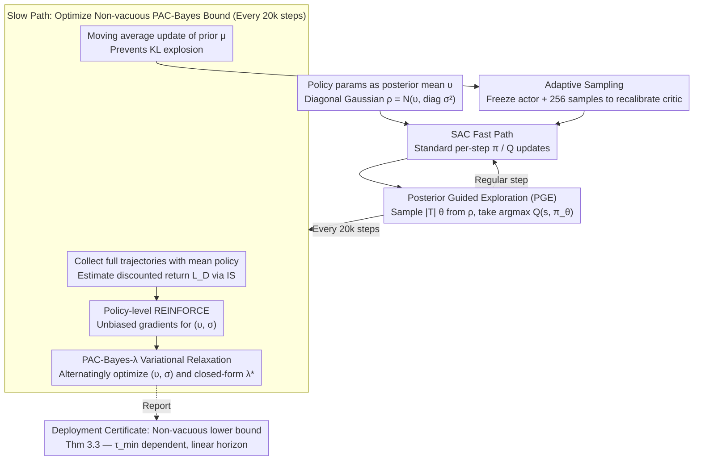

# PAC-Bayesian Reinforcement Learning Trains Generalizable Policies

**Conference**: ICML2026  
**arXiv**: [2510.10544](https://arxiv.org/abs/2510.10544)  
**Code**: None  
**Area**: Reinforcement Learning / Generalization Theory / PAC-Bayes  
**Keywords**: PAC-Bayes bounds, Mixing time, Soft Actor-Critic, Deployment certificates, Posterior-guided exploration  

## TL;DR
This paper presents the first PAC-Bayesian RL generalization bound that **explicitly depends on the Markov chain mixing time** and has a linear dependence on the long horizon $1/(1-\gamma)$. By embedding this bound as an "alive" training objective into SAC, the resulting PB-SAC algorithm provides non-vacuous deployment certificates and competitive performance on MuJoCo continuous control tasks.

## Background & Motivation

**Background**: Deploying reinforcement learning in safety-critical scenarios requires "formal generalization guarantees"—ensuring the trained policy performs well on unseen trajectories. The PAC-Bayes framework has successfully provided non-vacuous high-confidence certificates in supervised learning (Pérez-Ortiz 2021), where the certificate itself can serve as a training objective. However, applying PAC-Bayes directly to RL faces a fatal issue: trajectory data is **temporally correlated** ($S_{t+1}$ depends on $(S_t, A_t)$), violating the i.i.d. assumption required by classical PAC bounds.

**Limitations of Prior Work**: (1) Seldin et al. (2011, 2012) elegantly handled sequential dependence using martingale methods, but RL data does not naturally form a martingale and requires artificial construction (e.g., Bellman residuals). (2) Early work by Fard et al. (2011) applied PAC-Bayes to RL via Bellman error, resulting in a sample complexity scaling of $\mathcal{O}((1-\gamma)^{-4})$, which is numerically vacuous in modern deep RL settings (e.g., $\gamma=0.99$). (3) Recent work like Tasdighi et al. (2025) either inherits this poor horizon dependence or uses PAC-Bayes only as a regularization term (e.g., deep exploration in PBAC, lifelong learning in Zhang 2025), abandoning the goal of "computable certificates."

**Key Challenge**: To make PAC-Bayes certificates useful in modern deep RL, three issues must be resolved simultaneously: (a) selecting concentration inequalities for sequential dependence; (b) addressing the exponential vacuity regarding the horizon $1/(1-\gamma)$; and (c) stabilizing the critic against non-convex PAC-Bayes objectives and periodic posterior updates. No prior literature has addressed all three.

**Goal**: (1) Derive a PAC-Bayes RL bound with explicit $\tau_{\min}$ (mixing time) dependence and linear $\mathcal{O}((1-\gamma)^{-1})$ horizon dependence; (2) Achieve non-vacuous numerical results on MuJoCo; (3) Design the PB-SAC algorithm to stably optimize this bound as an alive objective.

**Key Insight**: The authors bypass the two-step derivation involving Bellman residuals and perform a **bounded-differences analysis directly on the discounted return**. They leverage the results of Paulin (2018), which extends McDiarmid’s inequality to Markov chains, providing concentration with explicit constants for "Markov functions satisfying bounded differences."

**Core Idea**: The authors derive transition-level sensitivity for the bounded-differences condition of discounted returns as $c_{(h,j)} = \gamma^{h-1}R_{\max}/T$, yielding $\|c\|_2^2 = R_{\max}^2(1-\gamma^{2H})/(T(1-\gamma^2))$. Combining Markovian McDiarmid concentration with standard PAC-Bayes change-of-measure results in a clean certificate containing only $\tau_{\min} \cdot \|c\|_2^2$.

## Method

### Overall Architecture
The work consists of two layers:

1.  **Theoretical Layer (Section 3)**: Establishes the main PAC-Bayes RL theorem (Theorem 3.3), providing a bound of the form $\mathbb{E}_{\theta\sim\rho}[L(\theta)] \le \mathbb{E}_{\theta\sim\rho}[\hat{L}_D(\theta)] + \sqrt{\frac{R_{\max}^2(1-\gamma^{2H})}{T(1-\gamma^2)}\tau_{\min}(\mathrm{KL}(\rho\|\mu) + \ln\sqrt{2}/\delta)}$, where $L(\theta) = -\mathbb{E}_{\xi\sim M}[\frac{\pi_\theta(\xi)}{\pi_b(\xi)}G(\xi)]$ is the off-policy true loss via importance sampling. The horizon dependence is $\mathcal{O}((1-\gamma)^{-1})$, and $\tau_{\min}$ is the mixing time of the policy-induced Markov chain.
2.  **Algorithm Layer (Section 4)**: Constructs PB-SAC (PAC-Bayes Soft Actor-Critic), maintaining a diagonal Gaussian posterior $\rho(\theta) = \mathcal{N}(\upsilon, \mathrm{diag}(\sigma^2))$. Standard SAC gradient updates handle the "fast path" per-step training, while the PAC-Bayes objective triggers a "slow path" posterior update every 20k steps. The slow path utilizes four mechanisms (Posterior Guided Exploration / Policy-level REINFORCE / PAC-Bayes-$\lambda$ relaxation / Adaptive sampling) to transform the theoretical bound into an optimizable, stable objective.

The diagram below illustrates the PB-SAC flow:

### Key Designs

**1. Transition-level Bounded Differences + Paulin Concentration: Reducing Horizon Dependence**

The authors avoid the traditional route of converting value error to Bellman error, which inflates horizon dependence to $(1-\gamma)^{-4}$. Instead, they analyze the sensitivity of the discounted return directly. For a fixed $\theta$ and two trajectory sets $D, \bar{D}$ differing by one transition:

$$|\hat{L}_D(\theta) - \hat{L}_{\bar{D}}(\theta)| \le \sum_{h',j'} c_{(h',j')}\,\mathbb{1}[\xi_{h'}^{(j')} \neq \bar{\xi}_{h'}^{(j')}],\quad c_{(h,j)} = \gamma^{h-1} R_{\max}/T.$$

This formulation captures that earlier transitions have higher impact while later ones decay exponentially. Applying Paulin's (2018) Markovian McDiarmid, the deviation is controlled by $\tau_{\min}\cdot\|c\|_2^2$. This summation $\sum_h \gamma^{2h}$ converges to $(1-\gamma^2)^{-1}$, effectively reducing the horizon dependence and bringing the bound from $10^8$ down to $10^2$, making it numerically non-vacuous.

**2. Posterior Guided Exploration (PGE): Uncertainty-driven Exploration**

Instead of undirected stochastic exploration (e.g., entropy regularization), PB-SAC utilizes the posterior $\rho$. During exploration steps, $|\mathcal{T}|$ candidates $\theta_i$ are sampled from $\rho$, and the action is selected via $\arg\max_{\theta_i\in\mathcal{T}} Q(s,\pi_{\theta_i}(s))$. The posterior standard deviation $\sigma$ automatically balances exploration and exploitation: larger $\sigma$ encourages diverse exploration, while smaller $\sigma$ focuses on the mean policy.

**3. Policy-level REINFORCE: Sampling the PAC-Bayes Gradient**

Optimizing $\nabla_{(\upsilon,\sigma)}\mathbb{E}_{\theta\sim\rho}[\hat{L}_D(\theta)]$ is challenging because the expectation is over the parameters. The authors collect fresh full trajectories using the mean policy (to maintain the dependency structure required by Theorem 3.3) and apply the log-likelihood trick at the **policy parameter level** $\theta$ rather than the action level:

$$\nabla_{(\upsilon,\sigma)}\mathbb{E}_{\theta\sim\rho}[\hat{L}_D(\theta)] = \mathbb{E}_{\theta\sim\rho}\big[\nabla_{(\upsilon,\sigma)}\log P_{\upsilon,\sigma}(\theta)\cdot\hat{L}_D(\theta)\big].$$

This provides an unbiased estimate that keeps the training cost comparable to standard actor-critic methods.

**4. PAC-Bayes-$\lambda$ Variational Relaxation + Alternating Optimization**

To handle the non-convex square root in the bound $\hat{L}_D + \sqrt{\text{KL term}}$, the authors use the identity $\sqrt{x} = \inf_{\lambda>0}(\frac{x}{2\lambda}+\frac{\lambda}{2})$ to introduce an auxiliary parameter $\lambda$:

$$\mathcal{J}(\rho,\lambda) = \mathbb{E}_{\theta\sim\rho}[\hat{L}_D(\theta)] + \frac{\|c\|_2\,\tau_{\min}}{2\lambda}\big(\mathrm{KL}(\rho\|\mu)+\ln\tfrac{\sqrt{2}}{\delta}\big) + \frac{\lambda}{2}.$$

This objective is convex w.r.t. $\rho$ and has a closed-form solution for $\lambda^*$. Alternating between updating $(\upsilon,\sigma)$ via REINFORCE and solving for $\lambda^*$ prevents training divergence and the "$\rho \to \mu$" collapse.

**5. Adaptive Sampling: Stabilizing the Actor-Critic Interaction**

Abrupt posterior updates can cause the critic to become misaligned with the new policy distribution, leading to performance drops. PB-SAC normally uses 1 sample (mean policy) for efficiency but increases this to 256 samples immediately following a PAC-Bayes update. This allows the critic to recalibrate across the new posterior distribution before returning to standard training.

## Key Experimental Results

### Main Results: MuJoCo Continuous Control (1M Steps)

| Task | PB-SAC (Ours) | SAC baseline | PBAC (Tasdighi 2025) | PAC-Bayes Certificate |
|------|----------------|--------------|----------------------|-----------------------|
| HalfCheetah-v5 | ≈10–11k return | ≈10–11k return | Significantly lower | Non-vacuous within 100k steps |
| Ant-v5 | ≈5–6k return | ≈4–5k return | Significantly lower | Meaningful lower bound at 1M steps |
| Hopper-v5 | On par with SAC | Baseline | Lower | Consistent tightening curve |
| Walker2d-v5 | On par with SAC | Baseline | Lower | Consistent tightening curve |
| Ant-v5 (Delayed/Sparse) | **Outperforms SAC+PBAC**| Baseline | Designed for this, but weaker | PGE excels in sparse rewards |

### Ablation Study

| Configuration | Observation | Explanation |
|------|------|------|
| Full PB-SAC | Smooth learning + tightening bound | Complete model |
| w/o Adaptive Sampling | Significant "sawtooth" drops | Critic misalignment after updates |
| w/o PGE | Performance drops to SAC levels in sparse tasks | Loss of uncertainty-guided exploration |
| w/o Moving-average Prior | KL explosion | Posterior shifts too fast for a static prior |
| Fixed $\tau_{\min}=1$ | Tightest bound but theoretically invalid | Equivalent to i.i.d. McDiarmid |
| Fixed $\tau_{\min}=1000$ | Loose bound but stable training | Confirms "conservative estimate is safer" |

### Key Findings
- Reducing horizon dependence to $\mathcal{O}((1-\gamma)^{-1})$ is the critical step that makes certificates readable rather than infinite at $\gamma=0.99$.
- The adaptive sampling strategy—taking one large step followed by high-sample recalibration—is counter-intuitively more stable than small-step updates in the critic-in-the-loop setting.
- Overestimating the mixing time $\tau_{\min}$ is safer than underestimating it. While performance is relatively insensitive to $\tau_{\min}$ scaling, underestimation invalidates the bound.

## Highlights & Insights
- **Alive Bound Paradigm**: The primary methodological contribution is elevating PAC-Bayes from an "after-the-fact report" to an "optimizable training objective" through a suite of stabilization techniques.
- **Physical Interpretation of Dependency**: Using $\tau_{\min}$ maps the "penalty" of the bound to physical properties of the MDP—faster mixing (low $\tau_{\min}$) implies more independent information per trajectory.
- **Policy-level REINFORCE**: Using the log-likelihood trick on parameters $\theta$ allows PAC-Bayes training costs to remain at the same order of magnitude as standard actor-critic methods.

## Limitations & Future Work
- **Limitations**: (1) Underestimating $\tau_{\min}$ leads to overconfident bounds (currently mitigated by auto-correlation maximums); (2) Gaussian posteriors may not respect the complex geometry of deep network parameter spaces; (3) Importance weight clipping introduces pessimistic bias, keeping the bound valid but conservative.
- **Future Directions**: (1) Implementing flexible posteriors like Normalizing Flows; (2) Using pseudo-spectral gaps for tighter mixing estimates; (3) Extending the paradigm to model-based RL to certify both dynamics and policy.

## Related Work & Insights
- **vs. Fard et al. (2011) / Tasdighi et al. (2025)**: Their $(1-\gamma)^{-4}$ dependence is vacuous; this work's $(1-\gamma)^{-1}$ dependence is a fundamental shift toward usability.
- **vs. Seldin et al. (2011, 2012)**: Martingale approaches are elegant but difficult to apply to raw RL data; Markovian McDiarmid is more natural for RL trajectories.
- **vs. PBAC (Tasdighi 2025)**: PBAC requires ensembles and complex designs for exploration; PB-SAC provides certificates with a simpler, single-critic structure and better dense-reward performance.

## Rating
- Novelty: ⭐⭐⭐⭐⭐ Simultaneously achieves mixing-time dependence, linear horizon limits, non-vacuity, and an "alive" objective.
- Experimental Thoroughness: ⭐⭐⭐⭐ Solid MuJoCo results and ablations; could benefit from pixel-based or large-scale tasks.
- Writing Quality: ⭐⭐⭐⭐⭐ Clearly articulates theoretical improvements and the necessity of each engineering component.
- Value: ⭐⭐⭐⭐⭐ The "alive PAC-Bayes" paradigm is a directly applicable tool for safety-critical and certifiable RL.

<!-- RELATED:START -->

## Related Papers

- [\[ICML 2026\] Offline Reinforcement Learning with Generative Trajectory Policies](offline_reinforcement_learning_with_generative_trajectory_policies.md)
- [\[ICML 2026\] Learning Unmasking Policies for Diffusion Language Models](learning_unmasking_policies_for_diffusion_language_models.md)
- [\[AAAI 2026\] Explaining Decentralized Multi-Agent Reinforcement Learning Policies](../../AAAI2026/reinforcement_learning/explaining_decentralized_multi-agent_reinforcement_learning_policies.md)
- [\[ICML 2026\] Chebyshev Policies and the Mountain Car Problem: Reinforcement Learning for Low-Dimensional Control Tasks](chebyshev_policies_and_the_mountain_car_problem_reinforcement_learning_for_low-d.md)
- [\[ICLR 2026\] Learning to Play Multi-Follower Bayesian Stackelberg Games](../../ICLR2026/reinforcement_learning/learning_to_play_multi-follower_bayesian_stackelberg_games.md)

<!-- RELATED:END -->
