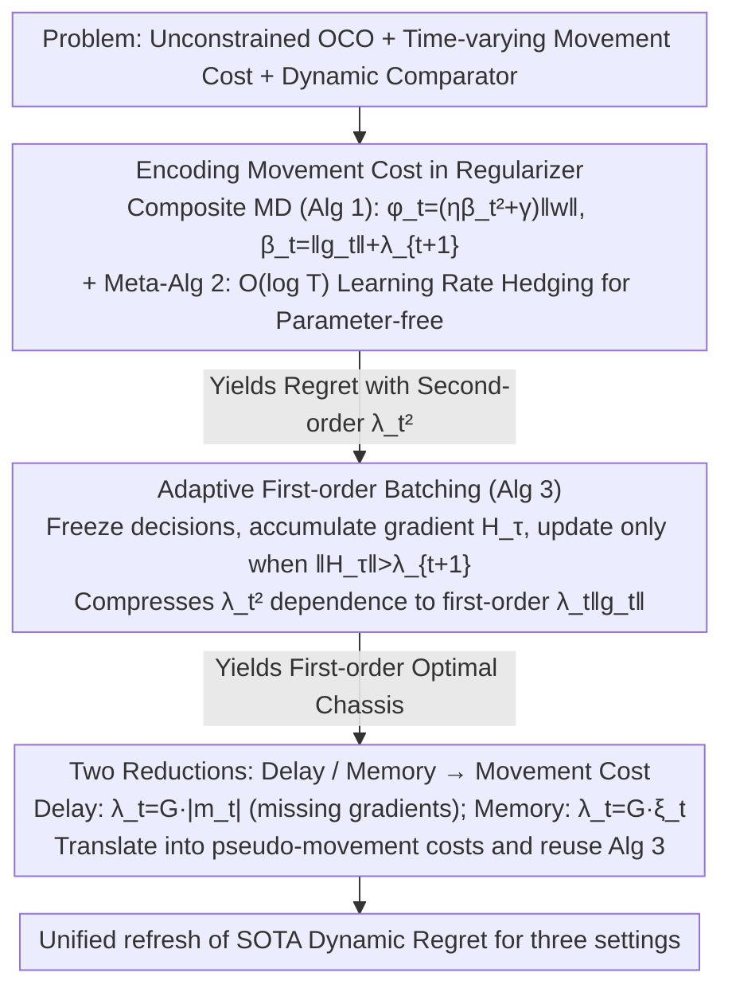

# Parameter-free Dynamic Regret: Time-varying Movement Costs, Delayed Feedback, and Memory

**Conference**: ICML2026  
**arXiv**: [2602.06902](https://arxiv.org/abs/2602.06902)  
**Code**: None (Theoretical paper)  
**Area**: Online Convex Optimization / Dynamic Regret / Parameter-free Algorithms  
**Keywords**: Dynamic Regret, Movement Costs, Delayed Feedback, Online Learning with Memory, Unconstrained OCO  

## TL;DR
This paper presents the first parameter-free algorithm for the triple setting of **unconstrained** online convex optimization (OCO), **time-varying movement costs**, and **dynamic comparator sequences**. By reducing delayed feedback and time-varying memory to OCO with time-varying movement costs, the authors provide a unified refresh of dynamic regret upper bounds for these three scenarios.

## Background & Motivation

**Background**: The standard OCO setting assumes a bounded decision domain and a single optimal fixed comparator, measured by static regret $R_T = \sum_t f_t(w_t) - \min_u \sum_t f_t(u)$. However, real-world applications—such as portfolio management, video streaming, load balancing, and optimal control—simultaneously violate these assumptions: decisions are unbounded (leveraging/short-selling), targets drift (structural market changes), and adjusting decisions incurs a movement cost proportional to $\|w_t - w_{t-1}\|$ (transaction fees, switching costs), where the cost coefficient $\lambda_t$ fluctuates significantly over time (liquidity, volatility).

**Limitations of Prior Work**: These three directions have been studied in isolation: Zhang et al. (2022) handled the unconstrained + movement cost setting but only for static regret; Zhang et al. (2021) provided dynamic regret for bounded domains with fixed movement costs; Wan et al. (2024) addressed dynamic regret for delayed feedback but only within bounded domains, and required the strong "in-order arrival" assumption to tighten the $d_{\max}T$ dependence to $d_{\mathrm{tot}}$. The intersection—**unconstrained + dynamic + time-varying movement costs**—remains an open problem.

**Key Challenge**: A tension exists between being parameter-free (not knowing the comparator norm $M$ and path length $P_T$ in advance) and operating in an unconstrained domain. In unbounded domains, $M$ has no prior upper bound, yet the algorithm must adapt its regret to $M$ and $P_T$. Movement costs sharpen this contradiction: they encourage the algorithm to move less, whereas parameter-free methods typically require non-strongly convex stabilizers that "aggressively probe the unknown radius," leading to a natural conflict.

**Goal**: (1) Design the first parameter-free algorithm for unconstrained OCO with time-varying movement costs; (2) Prove that the resulting regret adapts simultaneously to four problem-dependent quantities: $M$, $P_T$, $\{\lambda_t\}$, and $\{\|g_t\|\}$; (3) Reduce delayed feedback and time-varying memory to this unified framework.

**Key Insight**: The authors observe that in the composite mirror descent framework of Jacobsen & Cutkosky (2022), there is a correction term $\varphi_t(w)$ used to stabilize unconstrained mirror descent. By extending the coefficient of this correction term from $\eta\|g_t\|^2$ to $\eta(\|g_t\|+\lambda_{t+1})^2$, the movement cost can be encoded as a "dynamic friction coefficient"—the algorithm automatically reduces its step size when the next step incurs a high cost.

**Core Idea**: Refactor the regularizer using $\beta_t = \|g_t\| + \lambda_{t+1}$ to lift the unconstrained parameter-free toolbox to the time-varying movement cost setting. Then, use adaptive batching to compress the second-order $\lambda_t^2$ dependence into a first-order $\lambda_t\|g_t\|$ dependence, ensuring that movement costs do not "penalize for nothing" in mild environments with small gradients.

## Method

### Overall Architecture
The paper revolves around a three-tiered stacked algorithm system:

1.  **Base Layer (Algorithm 1)**: Composite Mirror Descent operating for a single learning rate $\eta$, using a log-linear regularizer $\psi(w) = \tfrac{2}{\eta}\int_0^{|w|}\log(x/\alpha+1)\,dx$ plus a time-varying correction term $\varphi_t(w) = (\eta\beta_t^2 + \gamma)\|w\|$.
2.  **Meta-algorithm Layer (Algorithm 2)**: Maintains a logarithmic number ($\mathcal{O}(\log T)$) of parallel Algorithm 1 instances with learning rates on a geometric grid $\eta_i = 2^i / (L\sqrt{T})$. The outputs of all instances are **summed directly** as the final decision. This step utilizes a standard hedging trick from parameter-free literature: the regret of any instance can be bounded by "the instance closest to the optimal learning rate" plus the regret of other instances relative to a zero comparator, the latter contributing only an $\mathcal{O}(\log T)$ additive term.
3.  **Batching Layer (Algorithm 3)**: Wraps an adaptive epoch partition over Algorithm 2. A mirror descent update is triggered only when the cumulative gradient $\|H_\tau\| = \|\sum_{t\in I_\tau} g_t\|$ exceeds the current movement cost $\lambda_{t+1}$; otherwise, the decision is frozen and gradients continue to aggregate. This layer is crucial for compressing the $\lambda_t^2$ dependence into a first-order $\lambda_t\|g_t\|$ dependence.

Finally, Section 5 uses two independent reductions (Algorithm 4 and Algorithm 5) to translate delayed feedback and time-varying memory into inputs for Algorithm 3.

The diagram below connects the three core designs following the "build the chassis, refine it, then reduce" logic of the paper (the meta-algorithm Layer Algorithm 2 is incorporated as the hedging scaffold):

### Key Designs

**1. Encoding time-varying movement costs into the regularizer: Making mirror descent automatically cautious of future high costs**

In unconstrained domains, the log-linear regularizer $\psi$ is not strongly convex. Jacobsen & Cutkosky (2022) noted that a linear-norm correction term $\varphi_t$ is required to stabilize the iterates. The key observation of this paper is that the coefficient of this correction term can be arbitrarily increased. Thus, it is rewritten as $\varphi_t(w) = (\eta\beta_t^2 + \gamma)\|w\|$, where $\beta_t \triangleq \|g_t\| + \lambda_{t+1}$, with the update rule:

$$w_{t+1} = \arg\min_w\ \langle g_t, w\rangle + D_\psi(w \mid w_t) + \varphi_t(w).$$

$\varphi_t$ acts like a "rubber band" tethered to the origin, with stiffness increasing alongside the current gradient and the next movement cost: when $\lambda_{t+1}$ is large, the algorithm is forced to be conservative; as $\lambda_{t+1} \to 0$, it smoothly reverts to standard parameter-free OCO. This step succeeds with minimal overhead because it only modifies the coefficient with $\lambda_{t+1}^2$, inheriting the Jacobsen–Cutkosky analytical framework and preserving all parameter-free properties (adaptation to $M$, $P_T$, and $\|g_t\|$).

**2. Adaptive First-order Batching (Algorithm 3): Compressing second-order $\lambda_t^2$ to first-order $\lambda_t\|g_t\|$**

Directly using the above regularizer results in a leading term containing $\lambda_t^2$, which yields a sub-optimal penalty in mild environments with small gradients. The batching layer maintains a cumulative gradient buffer $H_\tau$ and epoch index $\tau$. In each round, the decision is reused ($w_t = \tilde w_\tau$), and $g_t$ is accumulated into $H_\tau$. **Only when** $\|H_\tau\| > \lambda_{t+1}$ is the pair $(\tilde g_\tau = H_\tau, \tilde\lambda_{\tau+1} = \lambda_{t+1})$ fed into the underlying Algorithm 2, triggering a real update and starting a new epoch. The intuition is straightforward—movement is only worthwhile when the current evidence outweighs the cost of the next step. This improves the leading term from $\sqrt{\sum_t(\|g_t\|^2+\lambda_t^2)\|u_t\|}$ to $\sqrt{\sum_t(\|g_t\|^2+\lambda_t\|g_t\|)\|u_t\|}$. Remark 4.3 proves this first-order bound is never worse than the second-order bound and strictly tightens when $\|g_t\| \ll \lambda_t$. Compared to Zhang et al. (2022b) for fixed costs, the challenge here is allowing the trigger threshold to fluctuate with $\lambda_{t+1}$, requiring careful handling of epoch boundaries in the path-length analysis.

**3. Two Reductions: Translating delayed feedback and time-varying memory into movement costs**

This is the most elegant contribution—demonstrating that "unconstrained + time-varying movement cost" is not an isolated setting but a **primitive**. Any problem reduced to it inherits the entire toolset. For delayed feedback, Lemma 5.1 provides:

$$R_T^{\mathrm{del}}(u_{1:T}) \le \sum_t \Big\langle \textstyle\sum_{\tau\in o_{t+1}\setminus o_t} g_\tau,\ w_t - u_t\Big\rangle + G\sum_t |m_t|\,\|w_t - w_{t-1}\| + GP_T\,\sigma_{\max},$$

where $m_t$ is the set of gradients not yet arrived at round $t$. By treating arriving cumulative gradients as pseudo-gradients $h_t$ and $\lambda_t = G|m_t|$ as the pseudo-movement cost for Algorithm 3, one directly obtains $\widetilde{\mathcal{O}}(\sqrt{(M^2+MP_T)(T+d_{\mathrm{tot}})})$. The essence of this reduction is revealing that the physical meaning of movement cost is a "penalty for missing information"—the more gradients are missing, the less one should move. Consequently, it bypasses the "in-order arrival" assumption required by Wan et al. (2024), achieving $d_{\mathrm{tot}}$ dependence in unbounded domains under arbitrary arrival orders for the first time. The same logic applies to time-varying memory in Lemma 5.6, using a unary loss $\hat f_t(w) = f_t(w, \dots, w)$ and Lipschitz assumptions to derive $R_T^{\mathrm{mem}} \le \sum_t\langle h_t, w_t-u_t\rangle + G\sum_t\xi_t\|w_t-w_{t-1}\| + GP_T B^2$, where $\xi_t$ is a computable quantity related to future memory length.

### Loss & Training
This paper does not involve neural network training; all results are worst-case regret upper bounds. The implementation complexity of the algorithm is $\mathcal{O}(d\log T)$ per round (where $d$ is the decision dimension), matching standard parameter-free OCO. It requires prior knowledge of $L \ge G + 2\lambda_{\max}$ (or $L \ge G(1 + 3\sigma_{\max})$ for delays), where $G$ is the Lipschitz constant. Remark 4.2 provides a standard doubling trick to remove prior dependence on $\lambda_{\max}$ and $\sigma_{\max}$.

## Key Experimental Results

### Main Results: Dynamic Regret Upper Bounds for Three Settings

| Setting | Regret Upper Bound (Ours) | Applicable Domain | Key Adaptive Quantities |
| :--- | :--- | :--- | :--- |
| Unconstrained OCO + Time-varying Cost (Th 4.1) | $\widetilde{\mathcal{O}}\bigl(\sqrt{(M+P_T)\sum_t(\|g_t\|^2 + \lambda_t\|g_t\|)\|u_t\|}\bigr)$ | $\mathbb{R}^n$ | All: $M, P_T, \|g_t\|, \lambda_t, \|u_t\|$ |
| Unconstrained OCO + Delayed Feedback (Th 5.2) | $\widetilde{\mathcal{O}}\bigl(\sqrt{(M^2 + MP_T)(T + d_{\mathrm{tot}})}\bigr)$ | $\mathbb{R}^n$ | $M, P_T, d_{\mathrm{tot}}$ |
| Unconstrained OCO + Time-varying Memory $b_t$ (Th 5.7) | $\widetilde{\mathcal{O}}\bigl(\sqrt{(M^2 + MP_T)(H^2 T + GH\sum_t b_t^2)}\bigr)$ | $\mathbb{R}^n$ | $M, P_T, \{b_t\}, G, H$ |

All three results recover the known optimal dynamic regret for unconstrained OCO, $\widetilde{\mathcal{O}}(\sqrt{(M+P_T)\sum_t\|g_t\|^2\|u_t\|})$, in the degenerate cases where $\lambda_t = 0$ (no movement cost), $d_t = 0$ (no delay), or $b_t = 0$ (no memory).

### Ablation Study: Comparison with Existing SOTA

| Setting | Prev. SOTA | Ours | Gain |
| :--- | :--- | :--- | :--- |
| Static unconstrained + Cost (Zhang 2022b) | $\sqrt{G^2 T + \lambda GT}$ | $\sqrt{\sum_t\|g_t\|^2 + \lambda \sum_t \|g_t\|}$ | Removed worst-case $G^2T$, made problem-adaptive |
| Bounded + Fixed Memory (Zhao 2023) | $\sqrt{(1+P_T)(\sqrt{G}H^2 B + GHB^2)T}$ | $\sqrt{(M^2+MP_T)(H^2 T + GH\sum_t b_t^2)}$ | Removed boundedness, allowed time-varying memory |
| Bounded + Delayed (Wan 2024) | $\sqrt{(P_T+1)(T + d_{\max}T)}$ or $\dots(T + d_{\mathrm{tot}})$ (in-order) | $\sqrt{(M^2+MP_T)(T + d_{\mathrm{tot}})}$ | Removed in-order assumption + unconstrained |
| Static unconstrained + Delay (van der Hoeven 2022) | Second-order "lag" dependence, static | Dynamic version (with $P_T$) | Supports comparator drift |

### Key Findings
- The first-order movement cost dependence $\lambda_t\|g_t\|$ (Th 4.1) is never worse than the second-order $\lambda_t^2$ (Th 3.1) and tightens strictly as $\|g_t\| \to 0$. This is key to the subsequent reductions achieving optimal rates.
- The essence of the delayed feedback reduction is that movement cost physically represents a "penalty for missing information": $\lambda_t = G|m_t|$ translates the number of missing gradients into a cost. This explicitly connects delay and movement costs for the first time in literature.
- In the worst case of time-varying memory, the $H^2 T + GH\sum_t b_t^2$ dependence recovers the known $B\sqrt{T}$ minimax lower bound (Kumar et al. 2023) when $b_t \equiv B$, and extends it to the $\Omega(B\sqrt{(1+P_T)T})$ lower bound for dynamic regret.

## Highlights & Insights
- **"Movement cost as a hidden primitive for OCO"**: A profound insight is that time-varying movement cost is not just an independent problem but a primitive that can host other complex structures (delay, memory). This "build a general chassis, then reduce" approach is a valuable template for proof-heavy research.
- **Extensibility of the correction term $\varphi_t(w)$**: Incorporating $\beta_t = \|g_t\| + \lambda_{t+1}$ directly into the coefficient preserves the Jacobsen-Cutkosky framework while inheriting parameter-free properties. This suggests other physical quantities (e.g., noise variance, bandit feedback scale) could similarly be encoded into $\beta_t$.
- **Coexistence of Batching and Parameter-free**: It is often assumed that adaptive batching (no updates) and parameter-free methods (probing unknown radii) conflict. This work proves they can coexist and benefit each other if the trigger condition is chosen correctly.

## Limitations & Future Work
- **Limitations**: While the dependence on $\lambda_t$ is first-order, a pure movement cost penalty remains unavoidable. In completely static environments ($g_t = 0$), the algorithm correctly defaults to staying put via batching.
- **Implicit Assumptions**: $\lambda_{t+1}$ must be known at time $t$. This is reasonable in finance (predisclosed fees) but requires work for adaptive adversaries or partially observed costs.
- **Future Work**: (1) Characterizing the combination of delay and memory; (2) Designing implicit mirror descent versions for smoother $\beta_t$ transitions; (3) Extending this to high-probability/high-moment regret instead of just expectation.

## Related Work & Insights
- **vs. Jacobsen & Cutkosky (2022)**: They established the foundation for unconstrained dynamic parameter-free regret without movement costs; this work is a direct extension via $\beta_t$ refactoring.
- **vs. Zhang et al. (2022b)**: They handled static regret for unconstrained + fixed cost; this work generalizes it to time-varying costs and dynamic comparators, strictly outperforming them when $\lambda_t \equiv \lambda$.
- **vs. Wan et al. (2024)**: They used direct analysis for bounded + delay, requiring in-order assumptions for $d_{\mathrm{tot}}$; this work bypasses this via a reduction and extends to unconstrained domains.
- **vs. Zhao et al. (2023)**: Their OCO with memory assumes bounded domains and fixed memory; this work removes both constraints, providing tighter dependence on memory length and Lipschitz constants.

## Rating
- Novelty: ⭐⭐⭐⭐⭐ First parameter-free algorithm for unconstrained + dynamic + time-varying cost; establishes movement cost as a primitive for delay/memory.
- Experimental Thoroughness: ⭐⭐⭐ Purely theoretical; results are presented via optimality, recovery of degenerate cases, and algebraic comparison of bounds.
- Writing Quality: ⭐⭐⭐⭐ Clear structure with three layers of algorithms and two reductions. Remarks are insightful.
- Value: ⭐⭐⭐⭐⭐ Refreshes SOTA in three sub-areas; an essential read for OCO theory.

<!-- RELATED:START -->

## Related Papers

- [\[NeurIPS 2025\] Bandit and Delayed Feedback in Online Structured Prediction](../../NeurIPS2025/reinforcement_learning/bandit_and_delayed_feedback_in_online_structured_prediction.md)
- [\[AAAI 2026\] Bi-Level Contextual Bandits for Individualized Resource Allocation under Delayed Feedback](../../AAAI2026/reinforcement_learning/bi-level_contextual_bandits_for_individualized_resource_allocation_under_delayed.md)
- [\[ICML 2026\] Flow-Equivariant World Models: Memory for Partially Observed Dynamic Environments](flow_equivariant_world_models_memory_for_partially_observed_dynamic_environments.md)
- [\[ICML 2026\] FAB: A First-Order AB-based Gradient Algorithm for Distributed Bilevel Optimization over Time-Varying Directed Graphs](fab_a_first-order_ab-based_gradient_algorithm_for_distributed_bilevel_optimizati.md)
- [\[NeurIPS 2025\] Dynamic Regret Reduces to Kernelized Static Regret](../../NeurIPS2025/reinforcement_learning/dynamic_regret_reduces_to_kernelized_static_regret.md)

<!-- RELATED:END -->
