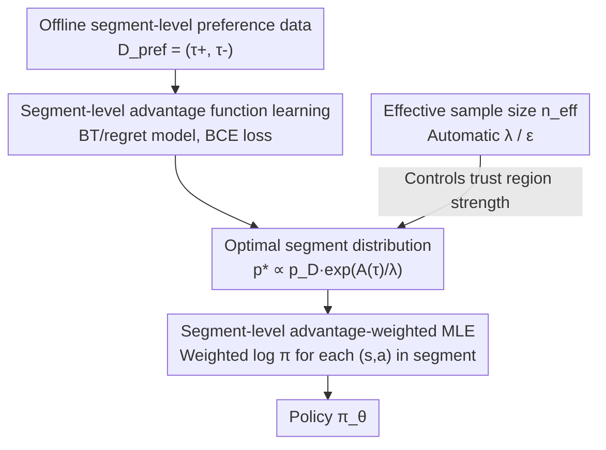

# PAWS: Preference Learning with Advantage-Weighted Segments

**Conference**: ICML 2026  
**arXiv**: [2606.11982](https://arxiv.org/abs/2606.11982)  
**Code**: https://ataranovic.github.io/PAWS-webpage/ (Project page containing code)  
**Area**: Reinforcement Learning / Preference-based RL (PbRL)  
**Keywords**: Preference RL, Temporal Credit Assignment, Advantage Function, Trust Region, Effective Sample Size

## TL;DR
PAWS identifies that the common practice in Preference-based RL (PbRL) of "training utility functions at the segment level but using them at the step level" causes distribution shifts. It proposes training advantage functions and updating policies **consistently at the segment level**. By using segment-level advantage weighting with trust-region constrained weighted maximum likelihood, PAWS significantly improves preference signal utilization and success rates on Meta-World robotic manipulation tasks.

## Background & Motivation

**Background**: Preference-based Reinforcement Learning (PbRL) enables policy learning through binary "which is better" comparisons between two behavior segments. This eliminates the need for explicit reward engineering and expert demonstrations, making it particularly suitable for tasks where rewards are difficult to specify or demonstration quality is inconsistent (e.g., teleoperation with varying skill levels). The mainstream approach involves training a utility function (reward or advantage model) using segment/trajectory-level preference pairs based on the Bradley–Terry model, which is then used for policy optimization.

**Limitations of Prior Work**: Utility functions are trained on **entire segments**—the loss only constrains the relative magnitude of the "sum of advantages across the segment." However, during policy optimization (e.g., in step-wise updates like PPO or IQL), this utility is queried for **individual state-action pairs**. There is a fundamental misalignment between the input distributions during training (segments) and inference (steps).

**Key Challenge**: The authors rediagnose this issue as a **training-inference distribution shift**, rather than the traditionally assumed "lack of fine-grained labels." Since segment-level losses only constrain the sum $A_\phi(\tau)=\sum_t A_\phi(s_t,a_t)$, **many different step-wise advantage assignments can explain the same segment-level preference label** (as shown in Figure 2 of the paper). Consequently, step-wise credit assignment is inherently underdetermined and arbitrary, leading policy updates astray. This is the true source of the "temporal credit assignment" problem. Empirical results show that prediction quality improves significantly when the learned utility function is queried using **segment-level** inputs consistent with the training distribution.

**Goal**: To eliminate the distribution misalignment between training and usage, ensuring that segment-level preference information propagates reliably to policy updates while minimizing dependence on manually tuned optimization hyperparameters.

**Core Idea**: **Stop querying utility at the step level**. Instead, perform policy optimization directly at the segment level. By using an advantage function that is both trained and queried on segments, combined with trust-region constrained weighted maximum likelihood updates, the concept of "high segment advantage" is translated into "increasing the likelihood of all actions within that segment."

## Method

### Overall Architecture

PAWS takes a batch of offline segment preference data $D_{\mathrm{prev}}=\{(\tau_i^+,\tau_i^-)\}$ and outputs a policy $\pi_\theta$. The entire pipeline maintains a "segment" granularity through three steps: first, training an advantage function $A_\phi$ on segment preferences; second, re-weighting the data distribution $p_D$ to an optimal segment distribution $p^*$ based on $A_\phi$ (maximizing advantage while staying near the original distribution); and finally, projecting the policy $\pi_\theta$ onto $p^*$ via a **segment-level advantage-weighted maximum likelihood** objective. The trust region strength (Lagrange multiplier $\lambda$ / KL bound $\epsilon$) is automatically determined using the "effective sample size $n_{\mathrm{eff}}$."

### Key Designs

**1. Segment-level Advantage Learning: Aligning Training and Usage Distributions**

To address the "segment-train, step-query" shift, PAWS ensures $A_\phi$ is **both trained and queried on segments**. Following the regret/advantage perspective of Knox et al. (modeling preferences using advantage rather than partial returns to better align with human evaluation), the preference probability is defined as:

$$P_{A_\phi}[\tau^+\succ\tau^-]=\frac{\exp(A_\phi(\tau^+))}{\exp(A_\phi(\tau^+))+\exp(A_\phi(\tau^-))},\quad A_\phi(\tau)=\sum_t A_\phi(s_t,a_t),$$

The training simplifies to binary cross-entropy on the difference of cumulative advantages: $\mathcal{L}_{\mathrm{pref}}(\phi)=-\frac1n\sum_i\log\sigma\big(A_\phi(\tau_i^+)-A_\phi(\tau_i^-)\big)$. The key insight is not the loss itself, but the commitment to **never query $A_\phi$ at a step-wise level later**. It is the step-wise querying in other PbRL methods that introduces the distribution shift. $A_\phi$ can be implemented via an encoder-only Transformer or a simple MLP, with early stopping based on validation accuracy to prevent overfitting.

**2. Segment-level Advantage-Weighted Trust Region Policy Update**

With $A_\phi$, PAWS abandons step-wise policy gradients in favor of a **trust-region constrained problem in segment space**:

$$\max_p \int p(\tau)A_\phi(\tau)\,d\tau\quad \text{s.t.}\ \ \mathrm{KL}(p(\tau)\,\|\,p_D(\tau))\le\epsilon,\ \int p(\tau)d\tau=1.$$

This formulation offers two critical benefits for offline settings: the trust region keeps the new distribution tied to the data distribution $p_D$ (preventing OOD sampling), and solving for $p^*$ is a purely offline process that requires no environment rollouts. Using the Lagrangian solution for Relative Entropy Policy Search (REPS), the optimal segment distribution is:

$$p^*(\tau)\propto p_D(\tau)\exp\Big(\tfrac1\lambda A_\phi(\tau)\Big),$$

which intensifies the data distribution probability where advantage is high. Projecting the policy $\pi_\theta$ via $\mathrm{KL}(p^*\,\|\,p_\theta)$ yields a **segment-level advantage-weighted MLE**:

$$\mathcal{L}(\theta)=\sum_{\tau\in D}\sum_{(s_t,a_t)\in\tau}\exp\Big(\frac{A_\phi(\tau)}{\lambda}\Big)\log\pi_\theta(a_t|s_t).$$

Note that the weight $\exp(A_\phi(\tau)/\lambda)$ uses the **total segment advantage**, shared by all $(s_t, a_t)$ within the segment. This is the fundamental difference from methods like AWAC/AWR that weight by "step-wise advantage," thereby avoiding credit assignment based on underdetermined step-wise values.

**3. Automatic Trust Region via Effective Sample Size ($n_{\mathrm{eff}}$)**

Tuning $\lambda$ is difficult: if $\lambda$ is too large, weights become uniform; if too small, only a few high-advantage samples are utilized. Since $\lambda$ is determined by the KL bound $\epsilon$, and the optimal $\epsilon$ depends on action dimensions and data scale, it is not robust across tasks. PAWS first solves for the optimal $\lambda^*$ using a dual function:

$$g(\lambda)=\lambda\epsilon+\lambda\log\int p_D(\tau)\exp\Big(\tfrac1\lambda A_\phi(\tau)\Big)d\tau$$

Instead of tuning $\epsilon$ directly, the authors tune the **effective sample size**:

$$n_{\mathrm{eff}}=\frac{(\sum_i w_i)^2}{\sum_i w_i^2},\quad w_i=\exp\Big(\tfrac1\lambda\sum_t A_\phi(s_t^i,a_t^i)\Big),$$

The corresponding $\epsilon$ is back-calculated from a target $n^*_{\mathrm{eff}}$ via an iterative process (Algorithm 1). The intuition for $n_{\mathrm{eff}}$ is straightforward—e.g., with 500 preferences and $n^*_{\mathrm{eff}}=10\%$, approximately 50 preferred segments are effectively driving the policy update.

### Loss & Training
The process consists of two stages: Stage one minimizes the preference BCE loss $\mathcal{L}_{\mathrm{pref}}(\phi)$ to learn the advantage function (Transformer or MLP with early stopping). Stage two maximizes the segment-level weighted MLE objective to update the policy, where $\lambda$ is derived from the dual function and $\epsilon$ is automatically determined by the target $n^*_{\mathrm{eff}}$. The entire pipeline is offline.

## Key Experimental Results

### Main Results

Evaluated on Meta-World robotic manipulation tasks, reporting task success rate (%, $\pm$2SE) under budgets of $n=50$ and $n=500$ preferences. The table shows average success rates across all tasks:

| Method | Success Rate (n=50) | Success Rate (n=500) | Gain vs BC (n=500) |
|------|------|------|------|
| BC (Baseline) | 46.2 | 57.3 | 0.0% |
| P-IQL | 48.9 | 70.7 | +23.4% |
| CPL | 42.9 | 67.6 | +18.0% |
| CPL+KL | 42.1 | 67.3 | — |
| Pref Transformer | 50.1 | 73.5 | — |
| IPL | 45.7 | 59.8 | — |
| **PAWS (Transformer)** | **51.6** | 78.2 | Top Tier |
| **PAWS (MLP)** | 50.8 | **78.3** | Top Tier |

PAWS (both architectures) achieves the highest or tied-highest success rates for both small and large budgets. Notably, the ~78% success rate at $n=500$ significantly outperforms the strongest baseline, Pref Transformer (73.5%).

### Key Findings
- **Distribution consistency is the primary driver**: Compared to advantage/reward-based methods like P-IQL/CPL, the only fundamental difference in PAWS is segment-level usage. The significant lead in difficult tasks (Peg Insert Side, Push Back) supports the claim that distribution shift, not label granularity, is the bottleneck.
- **Architectural robustness**: Transformer and MLP implementations performed almost identically (78.2 vs 78.3), suggesting gains stem from the segment-level optimization framework rather than the network capacity.
- **Robustness in small data regimes**: Even with only 50 preferences, PAWS maintains high performance, as the $n_{\mathrm{eff}}$ adaptation prevents policy collapse caused by over-reliance on a few high-advantage samples.

## Highlights & Insights
- **Redefining the Problem**: The authors reframe the temporal credit assignment problem from "coarse labels" to "training-inference distribution shift." The empirical evidence (recovery of prediction quality when querying at the segment level) is highly insightful.
- **Segment-Shared Weights**: Sharing the weight $\exp(A_\phi(\tau)/\lambda)$ across all actions in a segment is an elegant way to bypass underdetermined credit assignment, applicable to any "segment preference + weighted MLE" offline RL setup.
- **$n_{\mathrm{eff}}$ replacing $\epsilon$**: Using an interpretable quantity (how many preferences are effectively active) to set trust regions is far more user-friendly than manually tuning KL bounds.

## Limitations & Future Work
- The paper focuses on the **offline** setting and assumes informative oracles; robustness to noise/conflicting labels from humans is not fully explored.
- Evaluation is limited to Meta-World simulations; validation on real robots or tasks with long-horizon, non-Markovian rewards is missing.
- Segment length $N$ is a critical hyperparameter affecting the trade-off between distribution consistency and credit resolution; its sensitivity was not analyzed in depth.
- Shared weighting might dilute the distinction between "good" and "bad" actions within a very long segment.

## Related Work & Insights
- **vs P-IQL / Reward Models**: These query at the **step-wise** level after learning rewards, introducing the diagnosed distribution shift. PAWS operates at the segment level throughout.
- **vs CPL / DPO / IPL**: These optimize policy likelihood directly from preferences without reward models. They capture fewer state-action dependencies and struggle with sparse data; PAWS retains the advantage model while avoiding step-wise attribution.
- **vs AWAC / AWR**: While both use weighted MLE, AWAC uses **step-wise** advantage for individual weights, whereas PAWS uses **segment-level** advantage shared across the segment.

## Rating
- Novelty: ⭐⭐⭐⭐ (Rediagnosing temporal credit assignment as distribution shift is a high-value insight).
- Experimental Thoroughness: ⭐⭐⭐⭐ (Solid Meta-World benchmarks, but lacks real-world robot validation).
- Writing Quality: ⭐⭐⭐⭐ (Clear motivation and intuitive diagrams).
- Value: ⭐⭐⭐⭐ (The $n_{\mathrm{eff}}$ adaptation and segment-weighted approach are highly practical).

<!-- RELATED:START -->

## Related Papers

- [\[ICLR 2026\] Heterogeneous Agent Q-weighted Policy Optimization](../../ICLR2026/reinforcement_learning/heterogeneous_agent_q-weighted_policy_optimization.md)
- [\[ICML 2026\] Safe Reinforcement Learning with Preference-Based Constraint Inference](safe_reinforcement_learning_with_preference-based_constraint_inference.md)
- [\[ICML 2026\] From Reward-Free Representations to Preferences: Rethinking Offline Preference-Based Reinforcement Learning](from_reward-free_representations_to_preferences_rethinking_offline_preference-ba.md)
- [\[ICML 2026\] Video-Based Optimal Transport for Feedback-Efficient Offline Preference-Based Reinforcement Learning](video-based_optimal_transport_for_feedback-efficient_offline_preference-based_re.md)
- [\[ICML 2026\] Randomized Advantage Transformation (RAT): Computing Natural Policy Gradients via Direct Backpropagation](randomized_advantage_transformation_rat_computing_natural_policy_gradients_via_d.md)

<!-- RELATED:END -->
