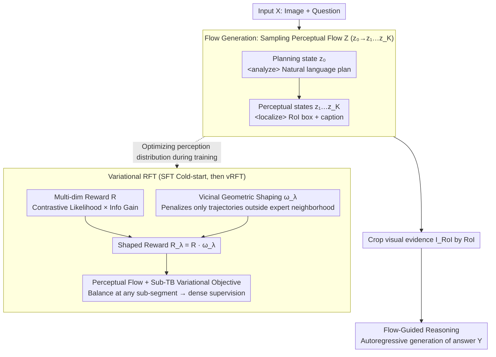

# Perceptual Flow Network for Visually Grounded Reasoning

**Conference**: ICML 2026  
**arXiv**: [2605.02730](https://arxiv.org/abs/2605.02730)  
**Code**: None  
**Area**: Multimodal VLM / Reinforcement Learning / Visual Reasoning  
**Keywords**: Visually Grounded Reasoning, GFlowNet, Sub-TB, Variational RL, LVLM Hallucinations

## TL;DR
Abandoning the traditional RLVR approach of "hard supervision using precise boxes from vision experts," PFlowNet models the act of perception as a structured latent variable called Perceptual Flow. It approximates the ideal reasoning-oriented posterior using a variational distribution $p_\theta(Z|X)$ and trains it via Sub-TB variational RL, multi-dimensional rewards, and Vicinal Geometric Shaping. This allows the 8B Qwen3-VL to achieve new SOTA scores of 90.6% on V* Bench and 67.0% on MME-RealWorld-lite.

## Background & Motivation

**Background**: To mitigate language bias and hallucinations in Large Vision-Language Models (LVLMs), recent methods (Look-twice, VGR, grounded thinking, etc.) use RLVR to distill geometric priors from vision experts (e.g., GroundingDINO) into LVLMs, encouraging the model to "box key regions before answering" during inference.

**Limitations of Prior Work**: The authors conducted a crucial probe experiment using Qwen2.5-VL on V*: by performing isotropic expansion around expert-annotated boxes to generate geometric priors with varying IoU, they fed only the corresponding crops to the LVLM. Results were counter-intuitive: the most precise expert boxes were not the best evidence for reasoning, suggesting a "sweet spot." This is because vision experts, designed for object detection, prioritize geometric precision while neglecting the "reasoning context." Excessively tight boxes create "tunnel vision," stripping away peripheral cues necessary for task completion.

**Key Challenge**: Current VGR methods equate "expert geometric precision" with "reasoning evidence quality," forcing LVLMs to strictly align with expert boxes. However, the "golden evidence" most useful for reasoning is instance-specific, and heuristic expansion cannot accurately capture it. This represents a fundamental misalignment of optimizing for the wrong target.

**Goal**: (1) Formalize VGR as a distribution modeling problem over latent visual trajectories $Z$; (2) construct a learnable perceptual trajectory representation that decouples "geometric precision" from "reasoning utility"; (3) use variational RL to encourage exploration toward "reasoning-friendly" perceptual behavior while maintaining geometric reliability.

**Key Insight**: Rather than using expert boxes as hard constraints, the reasoning trajectory $Z$ is treated as a latent variable. A self-parameterized variational distribution $p_\theta(Z|X)$ approximates the "ideal VGR posterior" $P_V(Z|X,Y)$, which only requires $Z$ to fall within a $\sigma$-neighborhood $\mathcal{S}_V$ centered on the golden evidence $G$. Expert boxes $E$ serve only as "vicinal references" rather than hard targets.

**Core Idea**: Treat perception as a Perceptual Flow (planning state + a sequence of grounded perceptual states). Use a Sub-Trajectory Balance (Sub-TB) variational objective (GFlowNet style) for dense supervision, and design "multi-dimensional rewards + Vicinal Geometric Shaping $\omega_\lambda$" (effective only outside the expert neighborhood) to achieve "sufficient exploration without boundary violation."

## Method

### Overall Architecture
PFlowNet decouples the LVLM workflow into two stages: (i) **Flow Generation**: The model samples a Perceptual Flow $Z = (z_0 \to z_1 \to \dots \to z_K)$ from $p_\theta(Z|X)$, where $z_0$ is a planning state wrapped in `<analyze>...</analyze>` and $z_{\ge 1} = \langle r_k, c_k\rangle$ are wrapped in `<localize>`, each containing an RoI box (coordinates 0–1000) and a descriptive caption; (ii) **Flow-Guided Reasoning**: Based on $Z$ and its cropped visual evidence $I_{RoI}$, the model generates the final answer $Y$ autoregressively. The joint distribution factorizes as $p_\theta(Y, Z|X) = p_\theta(Z|X) p_\theta(Y|Z, \langle X, I_{RoI}\rangle)$. Training involves two steps: cold-start SFT on synthetic perceptual flow data $(X, Z_s)$, followed by variational RFT on $(X, Y, E)$ to optimize $p_\theta(Z|X)$ toward $P_V$.

### Key Designs

**1. Perceptual Flow + Sub-TB Variational Objective: Structuring "where to look and what is seen" into segment-wise scorable trajectories**

PPO-style objectives provide sparse rewards only at the end of an episode, leading to high gradient variance for multi-step perceptual behaviors. PFlowNet discretizes perception: a Perceptual Flow $Z = (z_0, z_1, \dots, z_K)$ is defined where the planning state $z_0$ is natural language and perceptual states $z_k=\langle r_k, c_k\rangle$ are RoI boxes + captions. With this structure, the GFlowNet Sub-Trajectory Balance is introduced—requiring any sub-segment $z_{i:j}$ to satisfy $\mathcal{F}(z_i)\,\mathcal{T}_F(z_{i:j}) = \mathcal{F}(z_j)\,\mathcal{T}_B(z_{j:i})$. This leads to the vRFT objective $\mathcal{L}_{vRFT}(\theta)$ (Eq. 2), minimized via the sum of squared log-ratios. This offers three benefits: explicit structure allows rewards on sub-trajectories; Sub-TB provides denser constraints than PPO; and decoupling perception from reasoning allows optimizing $p_\theta(Z|X)$ without corrupting the LLM's reasoning parameters.

**2. Multi-dimensional Rewards (Contrastive Visual + Information Gain): Targeting both accuracy and utility**

If rewards focused solely on geometric IoU, the model might engage in reward hacking—producing accurate boxes with generic captions, or beautiful captions for irrelevant boxes. PFlowNet splits the reward into independent constraints:

$$R(z_{0:k}\top) = \left(\prod_{i=1}^k \frac{p_\phi^+(z_i)}{p_\phi^-(z_i)}\right) p_\phi(Y \mid z_{0:k}\top, X).$$

In the contrastive term, $p_\phi^+(z_i)=p_\phi(c_i\mid I_{r_i})$ is the visual likelihood of the caption within the crop, and $p_\phi^-(z_i)=p_\phi(c_i\mid I\setminus I_{r_i})$ is the likelihood in the complement region. A key insight: under trajectory expectation, this contrastive term is equivalent to reverse-KL distillation, encouraging captions to represent privileged information from the crop while ignoring background noise. The information gain term $p_\phi(Y|z_{0:k}\top, X)$ ensures the chosen trajectory actually contributes to the final answer.

**3. Vicinal Geometric Shaping: Downgrading expert boxes from "targets" to "guardrails"**

Since precise expert boxes are often not the best evidence (due to tunnel vision), the model should not be forced to imitate experts 100%, but exploration cannot be entirely unchecked. PFlowNet penalizes only trajectories outside the expert neighborhood. Using a symmetric Chamfer-IoU distance $d_{IoU}(A,B)=1-0.5(IoU_{A\to B}+IoU_{B\to A})$, an $\varepsilon$-neighborhood $\mathcal{B}_\varepsilon(E)=\{z_{0:k}\mid d_{IoU}(r_{1:k},E)\le\varepsilon\}$ is defined around the expert RoI set $E$. The shaping weight $\omega_\lambda(z_{0:k},E)=\exp(-\lambda\,\mathbb{I}(z_{0:k}\notin\mathcal{B}_\varepsilon(E)))$ applies a penalty $\lambda$ only to trajectories outside this neighborhood. The shaped reward $R_\lambda=R\cdot\omega_\lambda$ is then used in the Sub-TB objective. Theorem 3.4 proves there exists a $\lambda^\star$ making the TV distance bound strictly smaller than both MLE and expert-guided RLVR.

### Loss & Training
**Data Pipeline**: Gemini-3-flash / GPT-4o act as teachers. Synthetic flows $Z_s$ are generated by randomly expanding expert RoIs. A verifier samples answers with and without $Z_s$, splitting data by pass@k: simple samples ($k=1$) are discarded; samples where $2\le k_{w/Z_s}\le 16$ go to the RFT set; and hard samples where $k_{w/o Z_s} > 16$ but $k_{w/Z_s} = 1$ go to the cold-start set.  
**Cold-start**: Standard SFT minimizing the cross-entropy between $p_\theta(Z|X)$ and $Z_s$.  
**vRFT**: Combining the three designs, utilizing parallelized Sub-TB computation for sampled trajectories.

## Key Experimental Results

### Main Results
Base model: Qwen3-VL 8B. Evaluated on V* Bench (complex visual search), TreeBench (perception + reasoning), and MME-RealWorld-Lite.

| Dataset | Metric | Ours (PFlowNet) | Prev. SOTA / Baseline | Gain |
|---|---|---|---|---|
| V* Bench | Overall Acc | **90.6%** | Qwen3-VL 8B: 77.5% | +13.1% vs Base, New SOTA |
| TreeBench | Overall Acc | +10.4% (vs Base) | Qwen3-VL 8B | +10.4 |
| MME-RealWorld-Lite | Overall Acc | **67.0%** | Baselines: 43–52% | +21% vs Qwen3-VL 8B |

Note: Larger models like InternVL3-78B or Qwen2.5-VL-72B score only around 42–46% on these benchmarks. PFlowNet 8B significantly outperforms 70B-class baselines.

### Ablation Study

| Configuration | Key Impact | Description |
|---|---|---|
| Full PFlowNet | SOTA Performance | Contains all three components |
| $\lambda \to 0$ | $D_{TV} \to 1 - s_V$ | Degenerates to MLE; loss of geometric prior |
| $\lambda \to \infty$ | $D_{TV} \to 1 - q$ | Degenerates to expert-guided RLVR; locked by expert bias |
| $\varepsilon \to 0$ | Neighborhood shrinks | Reward signal fails, bounds loosen |
| $\varepsilon > \sigma$ | Neighborhood overflows | Geometric guidance diluted; performance drops |

### Key Findings
- **Discovery**: Probe experiments debunk the "experts are best" assumption; precise boxes yield lower accuracy than moderately expanded boxes (the "tunnel vision" effect).
- **Theory**: Theorems 3.1–3.4 provide provable improvements over MLE and expert-guided RLVR under the condition $\mathcal{B}_\varepsilon \subseteq \mathcal{S}_V$.
- **Efficiency**: The 8B model surpasses 78B models, indicating that structured decomposition and variational RL significantly enhance sample efficiency.
- **Scaling**: Test-time scaling properties show continuous improvement with larger sampling budgets, suggesting $p_\theta(Z|X)$ learns a truly explorable distribution.

## Highlights & Insights
- Re-formalizing VGR as "latent variable posterior approximation" is the major conceptual upgrade. By replacing "geometric alignment" with "distribution approximation," the "expert bias" problem becomes a tunable $\lambda$/$\varepsilon$ hyperparameter issue.
- Sub-TB provides dense supervision while maintaining the exploratory nature of GFlowNets, which is particularly suited for multi-step perception.
- The insight that the contrastive term $p_\phi^+/p_\phi^-$ is equivalent to reverse-KL distillation is elegant, providing clear physical and optimization semantics.
- The philosophy of Vicinal Geometric Shaping ("Expert as reference, not target") is transferable to any RLHF scenario requiring a balance between expert priors and exploration (e.g., tool calling or robotics).

## Limitations & Future Work
- Strong theoretical assumptions (Assumption 1/2, $d_{eff}$-regularity) may not fully hold for complex LVLM distributions.
- Perceptual Flow currently only supports "box + caption" states; it needs extension for finer granularities like masks, point clouds, or video frames.
- The data pipeline relies on strong teacher models (Gemini/GPT-4o), creating a barrier for open-source reproduction.
- Multi-dimensional rewards require maintaining a frozen Reward Model, doubling the VRAM cost during training.

## Related Work & Insights
- **vs Look-Twice / VGR**: These use expert geometry as hard rewards and are limited by expert bias; PFlowNet treats experts as references and learns the optimal perception via a variational objective.
- **vs DeepSeek-R1**: While R1 uses RLVR for verifiable rewards (math/code), PFlowNet extends RLVR to scenarios where perception cannot be directly verified, using contrastive likelihood and information gain.
- **vs GFlowNets**: While originally for discrete combinatorial objects, this is among the first to bring Sub-TB into multimodal LVLM reasoning.

## Rating
- Novelty: ⭐⭐⭐⭐⭐ 
- Experimental Thoroughness: ⭐⭐⭐⭐ 
- Writing Quality: ⭐⭐⭐⭐ 
- Value: ⭐⭐⭐⭐⭐ 

<!-- RELATED:START -->

<!-- RELATED:END -->

## Related Papers

- [\[CVPR 2026\] See It, Say It, Sorted: An Iterative Training-Free Framework for Visually-Grounded Multimodal Reasoning in LVLMs](../../CVPR2026/reinforcement_learning/see_it_say_it_sorted_an_iterative_training-free_framework_for_visually-grounded_.md)
- [\[ACL 2026\] Visually-Guided Policy Optimization for Multimodal Reasoning](../../ACL2026/reinforcement_learning/visually-guided_policy_optimization_for_multimodal_reasoning.md)
- [\[ICML 2026\] How Does Reasoning Flow? Tracing Attention-Induced Information Flow for Targeted RL in LLMs](how_does_reasoning_flow_tracing_attention-induced_information_flow_for_targeted_.md)
- [\[ICML 2026\] Flow-Equivariant World Models: Memory for Partially Observed Dynamic Environments](flow_equivariant_world_models_memory_for_partially_observed_dynamic_environments.md)
- [\[ICML 2026\] Plug-and-Play Benchmarking of Reinforcement Learning Algorithms for Large-Scale Flow Control](plug-and-play_benchmarking_of_reinforcement_learning_algorithms_for_large-scale_.md)

<!-- RELATED:END -->
