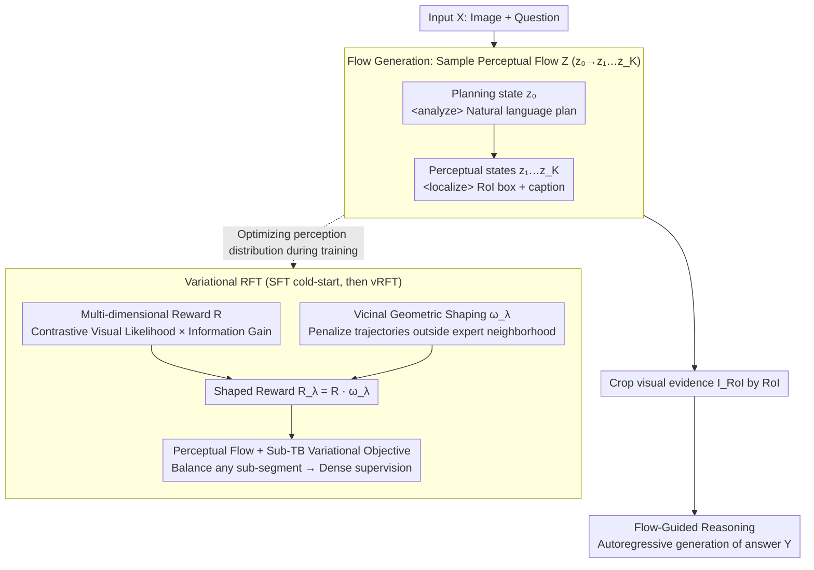

# Perceptual Flow Network for Visually Grounded Reasoning

**Conference**: ICML 2026  
**arXiv**: [2605.02730](https://arxiv.org/abs/2605.02730)  
**Code**: None  
**Area**: Multimodal VLM / Reinforcement Learning / Visual Reasoning  
**Keywords**: Visually Grounded Reasoning, GFlowNet, Sub-TB, Variational RL, LVLM Hallucination

## TL;DR
Moving away from the traditional RLVR route of "hard supervision using precise boxes from vision experts," PFlowNet models the perceptual act itself as a structured sequence of Perceptual Flow latent variables. It approximates the ideal reasoning-oriented posterior using a variational distribution $p_\theta(Z|X)$ trained via Sub-TB variational RL, multi-dimensional rewards, and Vicinal Geometric Shaping. This allows the 8B Qwen3-VL to achieve new SOTAs of 90.6% on V* Bench and 67.0% on MME-RealWorld-lite.

## Background & Motivation

**Background**: To mitigate linguistic bias and hallucinations in LVLMs, a recent class of methods (e.g., look-twice, VGR, grounded thinking) utilizes RLVR to distill geometric priors from vision experts (e.g., GroundingDINO) into LVLMs, encouraging the model to "box key regions first, then answer."

**Limitations of Prior Work**: The authors conducted a crucial probe experiment using Qwen2.5-VL on V* Bench—isotropically expanding expert-annotated boxes to create geometric priors with varying IoUs and feeding only the corresponding crops to the LVLM. The results were counterintuitive: the most precise expert boxes were not the best evidence for reasoning; a "sweet spot" exists. The reason is that vision experts are designed for object detection, prioritizing geometric precision while ignoring "reasoning context." Excessively tight boxes create "tunnel vision," removing peripheral cues essential for task completion.

**Key Challenge**: Existing VGR methods equate "expert geometric precision" with "reasoning evidence quality," forcing LVLMs to strictly align with expert boxes. However, the "gold evidence" most useful for reasoning is instance-specific, and heuristic expansion cannot accurately capture it. This represents a fundamental misalignment of optimizing for the wrong objective.

**Goal**: (1) Formalize VGR as a distribution modeling problem over latent visual trajectories $Z$; (2) Construct a family of learnable perceptual trajectory representations to decouple "geometric precision" from "reasoning utility"; (3) Use variational RL to encourage exploration toward "reasoning-friendly" perceptual behavior while maintaining geometric reliability.

**Key Insight**: Rather than using expert boxes as hard constraints, the reasoning trajectory $Z$ is treated as a latent variable. A self-parameterized variational distribution $p_\theta(Z|X)$ approximates the "ideal VGR posterior" $P_V(Z|X,Y)$, which only requires $Z$ to fall within a $\sigma$-neighborhood $\mathcal{S}_V$ centered at the gold evidence $G$. The expert box $E$ serves only as a "vicinal reference" rather than a hard target.

**Core Idea**: Perception is structured as a Perceptual Flow (planning state + a sequence of grounded perceptual states). Dense supervision is provided via a Sub-Trajectory Balance (GFlowNet-style) variational objective, combined with "multi-dimensional rewards + Vicinal Geometric Shaping $\omega_\lambda$" (active only outside the expert neighborhood) to achieve "sufficient exploration without overstepping."

## Method

### Overall Architecture
PFlowNet decouples the LVLM workflow into two stages: (i) **Flow Generation**: The model samples a Perceptual Flow $Z = (z_0 \to z_1 \to \dots \to z_K)$ from $p_\theta(Z|X)$, where $z_0$ is a planning state wrapped in `<analyze>...</analyze>` and $z_{\ge 1} = \langle r_k, c_k\rangle$ are states wrapped in `<localize>...</localize>`, each containing a RoI box (relative coordinates 0–1000) and a descriptive caption; (ii) **Flow-Guided Reasoning**: The model generates the final answer $Y$ autoregressively based on $Z$ and the cropped visual evidence $I_{RoI}$. The joint distribution factorizes as $p_\theta(Y, Z|X) = p_\theta(Z|X) p_\theta(Y|Z, \langle X, I_{RoI}\rangle)$. Training involves two steps: cold-start SFT on synthetic perceptual flow data $(X, Z_s)$, followed by variational RFT on $(X, Y, E)$ to optimize $p_\theta(Z|X)$ toward $P_V$.

### Key Designs

**1. Perceptual Flow + Sub-TB Variational Objective: Structuring "where to look and what is seen" into segment-wise scorable trajectories**

PPO-like objectives provide sparse rewards only at the end of an episode, leading to high gradient variance in multi-step perceptual behaviors. PFlowNet discretizes perception by defining a Perceptual Flow $Z = (z_0, z_1, \dots, z_K)$, where $z_0$ is natural language and $z_k=\langle r_k, c_k\rangle$ is an RoI box + caption, explicitly separated by special tokens. This structure allows the introduction of Sub-Trajectory Balance from GFlowNet theory—requiring any sub-segment $z_{i:j}$ to satisfy $\mathcal{F}(z_i)\,\mathcal{T}_F(z_{i:j}) = \mathcal{F}(z_j)\,\mathcal{T}_B(z_{j:i})$. This leads to the vRFT objective $\mathcal{L}_{vRFT}(\theta)$ (Eq. 2), using the sum of squared log-ratios as loss. This offers three benefits: rewards can be defined on each sub-trajectory; Sub-TB provides denser constraints than PPO for more stable training; and perception parameters $p_\theta(Z|X)$ can be optimized independently of LLM reasoning parameters.

**2. Multi-dimensional Reward (Contrastive Visual + Information Gain): Targeting "accuracy" and "utility" simultaneously**

If rewards only target geometric IoU, models may perform reward hacking—accurate boxes with generic captions, or beautiful captions with irrelevant boxes. PFlowNet splits the reward into independent constraints:

$$R(z_{0:k}\top) = \left(\prod_{i=1}^k \frac{p_\phi^+(z_i)}{p_\phi^-(z_i)}\right) p_\phi(Y \mid z_{0:k}\top, X).$$

In the contrastive term, $p_\phi^+(z_i)=p_\phi(c_i\mid I_{r_i})$ is the visual likelihood of the caption within the cropped region, and $p_\phi^-(z_i)=p_\phi(c_i\mid I\setminus I_{r_i})$ is the likelihood in the complement region. $p_\phi$ is a frozen reward model shared with the policy's initialization. A key insight is that this contrastive term, under trajectory expectation, is equivalent to reverse-KL distillation: $\mathbb{E}[\sum\log(p_\phi^+/p_\phi^-)]=\sum[D_{KL}(q_\theta^i\|p_\phi(\cdot|I\setminus I_{r_i})) - D_{KL}(q_\theta^i\|p_\phi(\cdot|I_{r_i}))]$. This encourages the caption to stick to privileged information in the crop and ignore complement noise. The information gain term $p_\phi(Y|z_{0:k}\top, X)$ ensures the selected trajectory contributes to the final answer. Combined, "grounding" and "utility" become simultaneous requirements.

**3. Vicinal Geometric Shaping: Downgrading expert boxes from "hard targets" to "safety rails"**

The probe experiment showed that the most precise expert boxes are not always the best evidence for reasoning. Therefore, the model should not be forced to 100% imitate the expert, nor should it explore entirely without limits. PFlowNet penalizes only when the model is outside the expert neighborhood. Using the symmetric Chamfer-IoU distance $d_{IoU}(A,B)=1-0.5(IoU_{A\to B}+IoU_{B\to A})$, it defines an $\varepsilon$-neighborhood $\mathcal{B}_\varepsilon(E)=\{z_{0:k}\mid d_{IoU}(r_{1:k},E)\le\varepsilon\}$ around the expert RoI set $E$. The shaping weight $\omega_\lambda(z_{0:k},E)=\exp(-\lambda\,\mathbb{I}(z_{0:k}\notin\mathcal{B}_\varepsilon(E)))$ applies a penalty $\lambda$ only to trajectories outside this neighborhood. Inside the neighborhood, the reward $R$ determines the priority. The final shaped reward $R_\lambda=R\cdot\omega_\lambda$ enters the Sub-TB $\mathcal{F}$. Theoretically, Theorem 3.1 gives a TV distance upper bound: $\lambda\to 0$ reduces to standard MLE (losing geometric constraints), while $\lambda\to\infty$ reduces to expert-guided RLVR (locked by expert bias). Theorem 3.4 proves a $\lambda^\star$ exists such that the bound is strictly smaller than the lower bound of both, $\min\{1-s_V, 1-q\}$, meaning it strictly outperforms these baselines under ideal assumptions.

### Loss & Training
**Data Pipeline**: Gemini-1.5-pro / GPT-4o act as teachers. First, synthetic flows $Z_s$ are generated by randomly expanding expert RoIs. Then, a verifier samples answers under "no $Z_s$" and "with $Z_s$" conditions. Data is split by pass@k: $k=1$ is discarded as too easy; $k>1$ but $2\le k_{w/Z_s}\le 16$ goes to the RFT set; $k_{w/o Z_s} > 16$ and $k_{w/Z_s} = 1$ goes to the cold-start set. **Cold-start**: Standard SFT, minimizing cross-entropy between $p_\theta(Z|X)$ and $Z_s$. **vRFT**: Trained using the three key designs, with parallelized Sub-TB calculation over $L$ sampled trajectories.

## Key Experimental Results

### Main Results
Base model: Qwen3-VL 8B. Evaluation covers V* Bench (complex visual search), TreeBench (perception + reasoning), and MME-RealWorld-Lite (OCR/remote sensing/charts/monitoring/autonomous driving).

| Dataset | Metric | PFlowNet | Prev. SOTA / Baseline | Gain |
|---|---|---|---|---|
| V* Bench | Overall Acc | **90.6%** | Qwen3-VL 8B 77.5% | +13.1% vs base, New SOTA |
| TreeBench | Overall Acc | **Qwen3-VL+10.4%** | Qwen3-VL 8B | +10.4 vs base |
| MME-RealWorld-Lite | Overall Acc | **67.0%** | Various baselines in 43–52% range | +21% vs Qwen3-VL 8B |

Note: Larger models like InternVL2-76B / Qwen2-VL-72B achieved only 46.4% / 42.2% on TreeBench/MME-RealWorld-Lite. PFlowNet 8B significantly outperforms 70B-scale models, suggesting performance stems from the training paradigm rather than parameter count.

### Ablation Study

| Configuration | Key Metric | Description |
|---|---|---|
| Full PFlowNet ($\lambda^\star, \varepsilon^\star$) | Tightest TV bound / SOTA | All three components included |
| $\lambda \to 0$ | $D_{TV} \to 1 - s_V$ | Reduced to MLE; geometric prior lost |
| $\lambda \to \infty$ | $D_{TV} \to 1 - q$ | Reduced to expert-guided RLVR; locked by expert bias |
| $\varepsilon \to 0$ | Neighborhood shrinks to a point | Reward signal fails, bound loosens |
| Increasing $\varepsilon$ (within $\mathcal{B}_\varepsilon \subseteq \mathcal{S}_V$) | $q \uparrow$, bound tightens | Wider is better within the effective domain |
| $\varepsilon > \sigma$ | Neighborhood exceeds $\mathcal{S}_V$ | Geometric guidance diluted; performance drops |

### Key Findings
- The probe experiment directly refutes the intuition that "experts are most precise": higher answer accuracy is achieved with medium-IoU expanded boxes rather than exact expert boxes, validating "tunnel vision."
- Theorems 3.1–3.4 provide provable improvements over MLE and expert-guided RLVR, provided $\mathcal{B}_\varepsilon \subseteq \mathcal{S}_V$.
- Excellent performance-efficiency trade-off: The 8B model outperforms 78B-scale baselines, indicating that structural decomposition of perceptual flow combined with variational RL significantly boosts sample efficiency.
- Test-time scaling properties: Performance continues to improve with larger sampling budgets, suggesting $p_\theta(Z|X)$ learns a truly explorable distribution rather than a single point.

## Highlights & Insights
- Re-formalizing VGR as "latent variable posterior approximation" is the major conceptual leap. By replacing the "geometric alignment" framework of RLVR with "distribution approximation," the "expert bias" problem becomes a tunable $\lambda$/$\varepsilon$ hyperparameter issue.
- Sub-TB provides dense supervision while maintaining the exploratory nature of GFlowNets, which is particularly suitable for multi-step perceptual behavior. Mapping GFlowNet concepts from molecule generation to LVLM reasoning is a novel and natural bridge.
- The insight that the contrastive term $p_\phi^+/p_\phi^-$ in the reward equals reverse-KL distillation is elegant, giving the physical meaning of "inner vs outer" crop likelihood difference a clear optimization semantic.
- The design philosophy of Vicinal Geometric Shaping ("experts are references, not targets") can be transferred to any RLHF scenario needing a balance between expert priors and exploration, such as tool calling or robot policy distillation.

## Limitations & Future Work
- Strong theoretical assumptions (Assumption 1/2, $d_{eff}$-regularity) might not hold for complex, real-world LVLM distributions; the bounds are idealized.
- Currently, Perceptual Flow only supports "box + caption" states; it needs extension for finer-grained behaviors (e.g., masks, point clouds, video frames).
- The data pipeline relies on strong teacher models (Gemini-1.5-pro / GPT-4o) for flow synthesis, posing a hurdle for open-weights reproduction.
- $\lambda$ and $\varepsilon$ are fixed hyperparameters with no adaptive scheduling; the theorem proves the existence of $\lambda^\star$ but not a closed-form derivation.
- Multi-dimensional rewards require maintaining a reward model $p_\phi$, doubling memory costs during training.

## Related Work & Insights
- **vs Look-Twice / VGR / TraceVL**: These use expert geometry (e.g., GroundingDINO) as a hard reward and are limited by expert bias. PFlowNet treats experts as vicinal references and learns the optimal perception via a variational objective.
- **vs DeepSeek-R1 (RLVR Paradigm)**: R1 uses RLVR with verifiable rewards in math/code. PFlowNet extends RLVR to scenarios where perceptual behavior is not directly verifiable, using contrastive likelihood + information gain as a proxy for ground-truth rewards.
- **vs GFlowNets (Sub-TB)**: While original GFNs are for discrete combinatorial objects, this is among the first works to bring Sub-TB into LVLM multimodal reasoning.

## Rating
- Novelty: ⭐⭐⭐⭐⭐ Re-formalizes VGR, introduces GFlowNet Sub-TB, and designs Vicinal Geometric Shaping.
- Experimental Thoroughness: ⭐⭐⭐⭐ Comprehensive evaluation on V* / TreeBench / MME, though some ablation details are in the appendix.
- Writing Quality: ⭐⭐⭐⭐ Clear structure from probe experiments to formalization and methods.
- Value: ⭐⭐⭐⭐⭐ Paradigm-level impact on grounded-reasoning LVLMs; vicinal shaping and contrastive rewards are highly transferable.

<!-- RELATED:START -->

<!-- RELATED:END -->

## Related Papers

- [\[CVPR 2026\] See It, Say It, Sorted: An Iterative Training-Free Framework for Visually-Grounded Multimodal Reasoning in LVLMs](../../CVPR2026/reinforcement_learning/see_it_say_it_sorted_an_iterative_training-free_framework_for_visually-grounded_.md)
- [\[ACL 2026\] Visually-Guided Policy Optimization for Multimodal Reasoning](../../ACL2026/reinforcement_learning/visually-guided_policy_optimization_for_multimodal_reasoning.md)
- [\[ICML 2026\] Flow-Equivariant World Models: Memory for Partially Observed Dynamic Environments](flow_equivariant_world_models_memory_for_partially_observed_dynamic_environments.md)
- [\[ICML 2026\] Plug-and-Play Benchmarking of Reinforcement Learning Algorithms for Large-Scale Flow Control](plug-and-play_benchmarking_of_reinforcement_learning_algorithms_for_large-scale_.md)
- [\[ICML 2026\] The Shape of Reasoning: Topological Analysis of Reasoning Traces in Large Language Models](the_shape_of_reasoning_topological_analysis_of_reasoning_traces_in_large_languag.md)

<!-- RELATED:END -->
