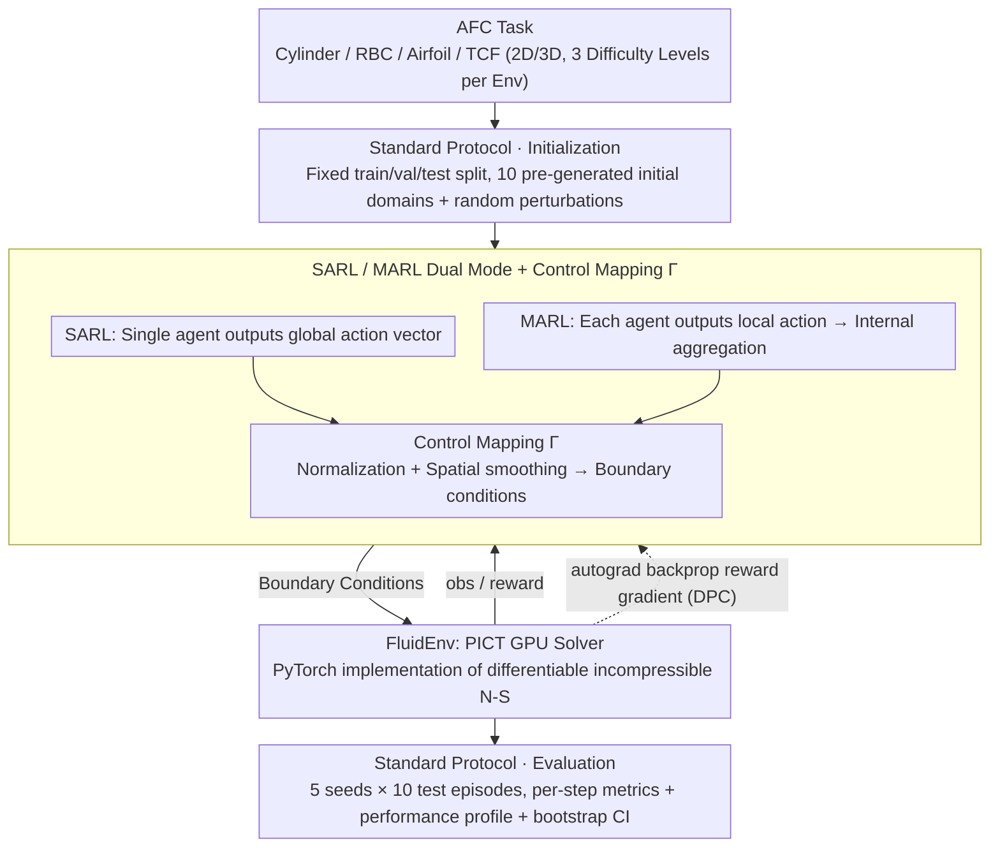

# Plug-and-Play Benchmarking of Reinforcement Learning Algorithms for Large-Scale Flow Control

**Conference**: ICML 2026  
**arXiv**: [2601.15015](https://arxiv.org/abs/2601.15015)  
**Code**: https://github.com/safe-autonomous-systems/fluidgym  
**Area**: Reinforcement Learning / Benchmarking / Active Flow Control / Differentiable Simulation  
**Keywords**: Active Flow Control, RL Benchmark, Differentiable Simulation, Multi-Agent RL, GPU CFD

## TL;DR
This paper introduces FluidGym—the first reinforcement learning (RL) active flow control (AFC) benchmark implemented entirely in PyTorch without external CFD solver dependencies. It is end-to-end differentiable, natively supports multi-agent and 3D flow fields, and provides standardized results for PPO/SAC/TD-MPC/DPC across 13 environments involving 25k+ GPU hours.

## Background & Motivation
**Background**: RL has demonstrated potential in various AFC tasks, such as aerodynamic drag reduction, heat transfer enhancement, and Tokamak plasma stabilization. However, the community suffers from significant variations in environment setups, sensor placements, reward definitions, and hyperparameters, making horizontal comparison difficult. Furthermore, over 75% of AFC literature defaults to PPO, while newer continuous control methods (SAC, TD-MPC, DPC) have not been systematically evaluated.

**Limitations of Prior Work**: Existing AFC benchmarks (DRLinFluids, drlFoam, DRLFluent, Gym-preCICE, Beacon, HydroGym) are hindered by several issues: (i) reliance on external CFD solvers like OpenFOAM/Fluent/FEniCS, which have fragile installation chains and require CFD expertise; (ii) lack of differentiability, preventing the use of gradient-based methods like DPC; (iii) absence of multi-agent APIs; (iv) primary focus on 2D cases. Beacon is a rare pure-Python solution but is restricted to 2D single-agent tasks and is non-differentiable; HydroGym covers 3D but ties each environment to different solver backends, leading to significant inconsistencies.

**Key Challenge**: AFC physical tasks naturally involve large action spaces and spatially distributed actuators (hundreds to thousands of jets or heaters). The most natural modeling approach is MARL + 3D + gradient propagation. However, existing engineering stacks decouple these three attributes. Researchers are often forced to sacrifice differentiability, 3D support, or MARL capabilities.

**Goal**: To build a unified benchmark that is (1) pure PyTorch and "pip installable", (2) fully differentiable, (3) natively supports both SARL and MARL modes, and (4) covers 2D/3D scenarios with three levels of difficulty per environment, accompanied by a standard train/val/test protocol and multi-algorithm baselines.

**Key Insight**: By utilizing a self-developed GPU-accelerated PICT solver (which implements incompressible Navier-Stokes GPU operators within PyTorch), the CFD solver and RL interface can be integrated into a single Python package, allowing autograd to pass directly through CFD time-stepping.

**Core Idea**: Replace the traditional "external CFD + Python wrapper" glue stack with a PyTorch-native GPU CFD solver to fundamentally eliminate engineering debt regarding differentiability and MARL integration.

## Method

### Overall Architecture
FluidGym encapsulates the PICT GPU solver into a `FluidEnv` abstraction layer. It exposes RL interfaces such as Gymnasium (SARL), PettingZoo (MARL), Stable-Baselines3, and TorchRL at the top level while reusing PyTorch autograd at the bottom level. The same physical task can support three interaction modes simultaneously: single-agent (global observation + global action), multi-agent (local observation + local action, aggregated and smoothed to boundary conditions via a mapping function $\Gamma$), and gradient methods (autograd passing through the entire rollout to update policy parameters directly). The environment supports multi-GPU parallel rollouts, with the cumulative experiments spanning 25k+ GPU hours.

The environment family consists of 4 physical categories and 13 specific configurations: Flow past a cylinder (CylinderRot2D / CylinderJet2D / CylinderJet3D), Rayleigh-Bénard Convection (RBC2D / RBC2D-wide / RBC3D / RBC3D-wide), Flow over an airfoil (Airfoil2D / Airfoil3D), and Turbulent Channel Flow (TCFSmall3D / TCFLarge3D × both/bottom). Each environment offers 3 difficulty levels (adjusted by Reynolds or Rayleigh numbers). The maximum action dimension reaches 4096 (TCFLarge3D), and the maximum observation dimension is nearly 900,000 (RBC3D-wide).

### Key Designs

**1. PyTorch-native Differentiable CFD Stack: One Python package for stepping, automatic differentiation, and RL training**

The engineering debt of existing AFC benchmarks stems from the "external CFD solver + Python wrapper" stack, which is hard to install and blocks differentiability. FluidGym's underlying solver, PICT, is a GPU-accelerated incompressible Navier-Stokes solver where all operators are implemented as PyTorch CUDA kernels. Consequently, every flow field update can be tracked by autograd. `FluidEnv.step(a)` not only returns standard `(obs, reward, done)` but also allows gradients to propagate from the reward to the action $a$ and eventually to policy parameters $\theta$. This is crucial for Differentiable Predictive Control (DPC). On CylinderJet2D-easy, DPC achieves training speeds approximately 1 order of magnitude faster than PPO and 2 orders faster than SAC. In contrast, Beacon is non-differentiable, and HydroGym's JAX-based components are inconsistent across backends. Writing the solver directly in PyTorch is the only path to satisfy "pure Python + fully differentiable + unified scenarios," albeit at the cost of maintaining custom GPU CFD kernels.

**2. SARL/MARL Dual Mode + Control Mapping $\Gamma$: Single/multi-agent interchangeability for the same task**

Real AFC scenarios involve spatially distributed actuators. When action dimensions explode (e.g., 4096 in TCFLarge3D), SARL becomes infeasible, whereas MARL’s translation equivariance fits spatially uniform boundaries. FluidGym treats both as first-class citizens. In SARL mode, the agent outputs a global action vector $\vec{a}_t$. In MARL mode, each agent $i$ outputs a local action $\vec{a}_t^i$ based on local observation $\vec{o}_{t+1}^i$. Internally, the environment uses a control mapping function $\Gamma$ (typically normalization + spatial smoothing) to aggregate local actions into global boundary conditions. For instance, in RBC2D with 12 heaters, SARL uses one policy for a 12-dimensional vector, while MARL deploys the same shared policy across 12 agents. Both interact with the same `FluidEnv`. Rewards are weighted combinations of local and global metrics, such as $r_t=\mathrm{Nu}_{\mathrm{ref}}-\mathrm{Nu}_{\mathrm{instant}}$ for RBC, where $\mathrm{Nu}_{\mathrm{instant}}=\sqrt{\mathrm{Ra}\cdot\mathrm{Pr}}\langle u_y T\rangle_V$. This allows direct comparison between the two methodologies.

**3. Standardized Training/Evaluation Protocol: Eliminating incomparability in AFC literature**

The lack of comparability in AFC results stems from variations in initial conditions, seed counts, and episode lengths. Many papers use a single seed or evaluate on training initial conditions, which exaggerates variance. FluidGym provides 3 fixed splits (train/val/test) for each environment, with 10 pre-generated random initial domains that are cached upon first use. `env.reset()` overlays random perturbations and random rollout steps on a selected domain, ensuring reproducibility via seeds. Each algorithm is tested across 5 seeds × 10 test episodes. Performance is reported using performance profiles, with confidence intervals estimated via 2,000 stratified bootstrap samples. All metrics are reported per-step rather than cumulatively to prevent contamination by episode length.

### Loss & Training
PPO and SAC use default hyperparameters from Stable-Baselines3, while MARL variants (MA-PPO/MA-SAC) use shared policies. DPC is demonstrated only on CylinderJet2D and RBC2D due to the computational weight of backpropagating through rollouts in 3D. All experiments were conducted on a single NVIDIA A100, with per-step execution times ranging from 1.17 seconds (RBC3D) to 52.89 seconds (Airfoil3D).

## Key Experimental Results

### Main Results: Environment Overview

| Env Prefix | Control Goal | #Sensors | #Actuators | SARL | MARL | Step Time (s) |
|------------|--------------|----------|------------|------|------|---------------|
| CylinderJet2D | Drag Reduction | 302 | 1 | ✓ | × | 2.01 |
| CylinderJet3D | Drag Reduction | 4832 | 8 | ✓ | ✓ | 9.52 |
| RBC2D | Heat Transfer | 768 | 12 | ✓ | ✓ | 1.92 |
| RBC3D | Heat Transfer | 221184 | 64 | × | ✓ | 1.17 |
| RBC3D-wide | Heat Transfer | 884736 | 256 | × | ✓ | 1.71 |
| Airfoil3D | Lift-to-Drag | 2508 | 12 | ✓ | ✓ | 52.89 |
| TCFLarge3D-both | Drag Reduction | 4096 | 4096 | × | ✓ | 0.56 |

The benchmark covers action dimensions from 1 to 4096 and observation dimensions spanning three orders of magnitude.

### Algorithm Comparison and Transfer

| Configuration | Key Findings |
|---------------|--------------|
| PPO vs SAC (SARL) | SAC achieved the highest normalized test scores across all difficulties; PPO converged slowly. This contradicts the community's default preference for PPO. |
| MA-PPO vs MA-SAC | Performance profiles were similar, with MA-SAC slightly higher but with overlapping CIs; MA-PPO outperformed in TCF series. |
| DPC vs PPO/SAC (CylinderJet2D-easy) | DPC training was ~10× faster than PPO and ~100× faster than SAC; final drag reduction ≈7.2% (SAC ~8%). |
| 2D→3D transfer (CylinderJet) | On easy difficulty, transferred policies outperformed native 3D training; also reached peak reduction on hard. |
| Small→Large TCF transfer | MARL policy trained on small domains approached opposition control baselines on large domains, significantly outperforming native large-domain training. |
| Training wall-clock | DPC is 1.5–2× slower per step than RL (extra backward pass), while TD-MPC is the fastest algorithm. |

### Key Findings
- **Challenging the PPO Default**: PPO, the long-standing default in the AFC community, was consistently outperformed by SAC in FluidGym, highlighting algorithm selection biases caused by the previous lack of unified benchmarks.
- **Differentiability vs. Engineering**: DPC provides a 1-2 order of magnitude increase in sample efficiency via direct reward gradients, though at the cost of one extra backward CFD pass per step, leading to 1.5-2× higher wall-clock time per step than RL.
- **Emergent MARL Coordination**: In RBC3D-easy, MA-PPO learned heating patterns that formed two stable convection rolls, consistent with physical findings (Vasanth 2024), showing that RL can learn spatially invariant collaborative strategies without explicit coordination mechanisms.
- **Robust Transferability**: Both 2D→3D and small-to-large domain transfers yielded results comparable to or better than native training, suggesting significant potential for transfer learning due to physical similarities in AFC tasks.

## Highlights & Insights
- **The Engineering Bet on PyTorch-native CFD**: Developing the PICT GPU solver was a high-investment decision, but it was the only way to achieve the "differentiable + single Python stack + GPU acceleration" trifecta, setting a new paradigm for benchmark-integrated solvers.
- **Performance Profiles over Mean Scores**: Using performance profiles + IQM + bootstrap CI directly addresses common pitfalls in AFC research, such as single-seed reporting or relying on simple averages.
- **Transferable Trick**: Combining MARL with shared policies and spatial translation equivariance allows training on small domains and deployment on large ones, saving multiples of CFD computation.
- **Plug-and-Play Philosophy**: A simple `pip install` and Gym-compatible API lower the barrier to entry for machine learning researchers in the high-threshold CFD field.

## Limitations & Future Work
- The authors acknowledge: (i) limited statistical robustness with only 5 seeds due to CFD costs; (ii) lack of CPU-only support (requires CUDA); (iii) DPC is only demonstrated in 2D; (iv) baselines use default SB3 hyperparameters, which may not represent the performance ceiling.
- Hidden constraints: All 13 environments are based on incompressible Navier-Stokes. Complex physics like compressible flow, combustion, or phase changes are not yet covered.
- Future directions: Adding MHD physics, increasing seed counts, and integrating differentiable RL to compare horizontally with DPC.
- Evaluation blind spot: Transfer experiments focused on 2D↔3D and scale, but did not investigate transfers across Reynolds numbers or out-of-distribution physical parameters.

## Related Work & Insights
- **vs. HydroGym (Lagemann 2025)**: While HydroGym supports 3D and MARL, it ties environments to different solvers (FEniCS/m-AIA); FluidGym unifies all environments under a single PICT/PyTorch stack.
- **vs. Beacon (Viquerat 2024)**: Beacon is Python-only but limited to 2D, single-agent, and non-differentiable.
- **vs. DRLinFluids / drlFoam / Gym-preCICE**: These rely on external solvers like OpenFOAM, leading to high maintenance costs. FluidGym bypasses this via an embedded solver.
- **vs. PDE Control Benchmarks (Bhan 2024, Zhang 2024)**: Those focus on low-dimensional PDEs, whereas FluidGym target high-dimensional turbulent fields.

## Rating
- Novelty: ⭐⭐⭐⭐ Developing a PyTorch CFD solver is a significant engineering contribution.
- Experimental Thoroughness: ⭐⭐⭐⭐ Extensive scale (25k+ GPU hours), though seed count and DPC coverage could be higher.
- Writing Quality: ⭐⭐⭐⭐ Clear argumentation and high information density.
- Value: ⭐⭐⭐⭐⭐ A critical step for the RL-for-AFC community, with high practical utility due to the "pip install" ease of use.

<!-- RELATED:START -->

## Related Papers

- [\[ICML 2026\] Vulnerable Agent Identification in Large-Scale Multi-Agent Reinforcement Learning](vulnerable_agent_identification_in_large-scale_multi-agent_reinforcement_learnin.md)
- [\[ICLR 2026\] VerifyBench: Benchmarking Reference-based Reward Systems for Large Language Models](../../ICLR2026/reinforcement_learning/verifybench_benchmarking_reference-based_reward_systems_for_large_language_model.md)
- [\[ICML 2025\] Benchmarking Quantum Reinforcement Learning](../../ICML2025/reinforcement_learning/benchmarking_quantum_reinforcement_learning.md)
- [\[ICML 2026\] Perceptual Flow Network for Visually Grounded Reasoning](perceptual_flow_network_for_visually_grounded_reasoning.md)
- [\[ICML 2026\] Adaptive Bandit Algorithms for Contextual Matching Markets](adaptive_bandit_algorithms_for_contextual_matching_markets.md)

<!-- RELATED:END -->
