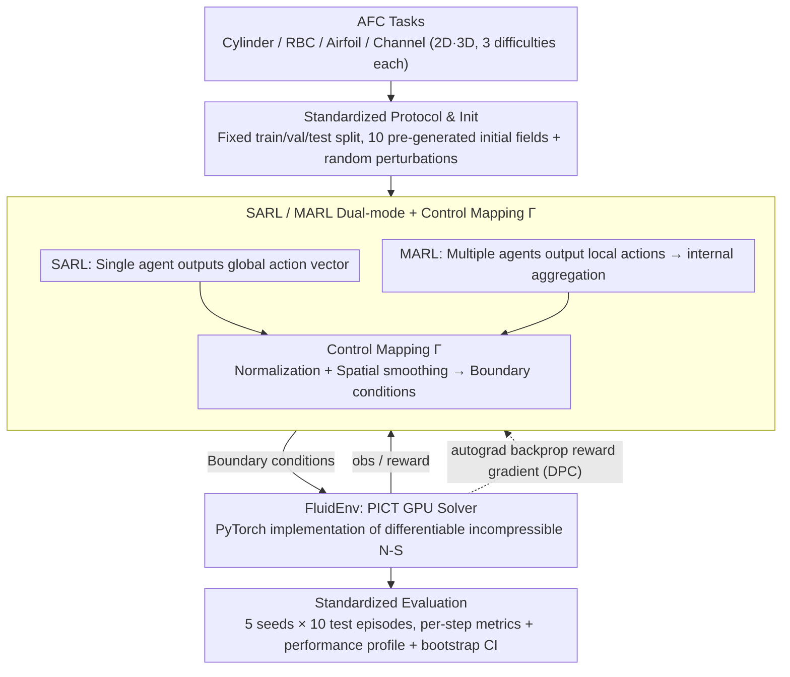

# Plug-and-Play Benchmarking of Reinforcement Learning Algorithms for Large-Scale Flow Control

**Conference**: ICML 2026  
**arXiv**: [2601.15015](https://arxiv.org/abs/2601.15015)  
**Code**: https://github.com/safe-autonomous-systems/fluidgym  
**Area**: Reinforcement Learning / Benchmarking / Active Flow Control / Differentiable Simulation  
**Keywords**: Active Flow Control (AFC), RL Benchmark, Differentiable Simulation, Multi-Agent RL, GPU CFD

## TL;DR
This paper introduces FluidGym—the first RL benchmark for active flow control implemented entirely in PyTorch without external CFD solver dependencies. It is end-to-end differentiable, natively supports multi-agent and 3D flow fields, and provides standardized results from 25k+ GPU hours across 13 2D/3D environments using PPO/SAC/TD-MPC/DPC.

## Background & Motivation
**Background**: RL has shown potential in various Active Flow Control (AFC) tasks, such as aerodynamic drag reduction, heat transfer enhancement, and Tokamak plasma stabilization. However, the environments, sensor arrangements, reward definitions, and hyperparameters used in the community vary significantly, making horizontal comparisons difficult. Furthermore, over 75% of AFC literature defaults to PPO, while newer continuous control methods (SAC, TD-MPC, DPC) have not been systematically evaluated.

**Limitations of Prior Work**: Existing AFC benchmarks (DRLinFluids, drlFoam, DRLFluent, Gym-preCICE, Beacon, HydroGym) are hindered by one or more of the following: (i) dependence on external CFD solvers like OpenFOAM/Fluent/FEniCS, which results in fragile installation chains and requires CFD expertise; (ii) lack of differentiability, preventing the use of gradient-based methods like DPC; (iii) lack of multi-agent APIs; (iv) majority covering only 2D cases. Beacon is a rare Python-only solution but is restricted to 2D single-agent tasks and is non-differentiable; HydroGym covers 3D but ties each environment to different solver backends, leading to significant inconsistencies.

**Key Challenge**: Physiological AFC tasks inherently involve large action spaces and spatially distributed actuators (hundreds to thousands of jets or heaters). The most natural modeling is MARL + 3D + Gradient Propagation. However, the engineering stacks of existing benchmarks disconnect these three attributes. Researchers must often sacrifice differentiability, 3D support, or MARL capabilities.

**Goal**: To build a unified benchmark that is (1) pure PyTorch and "pip installable", (2) fully differentiable, (3) natively supports both SARL and MARL modes, and (4) covers 2D/3D scenarios with three difficulty levels per environment, accompanied by standard train/val/test protocols and multi-algorithm baselines.

**Key Insight**: By utilizing a self-developed GPU-accelerated PICT solver (implementing incompressible Navier-Stokes GPU operators within PyTorch), the CFD solver and RL interface are encapsulated in a single Python package, allowing autograd to propagate directly through CFD time-stepping.

**Core Idea**: Replace the traditional "external CFD + Python wrapper" glue stack with a PyTorch-native GPU CFD solver to fundamentally eliminate engineering debt in differentiability and MARL integration.

## Method

### Overall Architecture
FluidGym encapsulates the PICT GPU solver into a `FluidEnv` abstraction layer. It exposes RL interfaces such as Gymnasium (SARL), PettingZoo (MARL), Stable-Baselines3, and TorchRL at the top level while reusing PyTorch autograd at the bottom. The same physical task can be executed in three interaction modes: Single-Agent (global observation + global action), Multi-Agent (local observation + local action, aggregated and smoothed via a mapping function $\Gamma$ to boundary conditions), and Gradient-based (autograd through the entire rollout to calculate reward gradients directly for policy parameters). The environment supports multi-GPU parallel rollouts, with the entire experiment suite totaling 25k+ GPU hours.

The environment family includes 4 types of fundamental physics across 13 specific configurations: Cylinder Flow (CylinderRot2D / CylinderJet2D / CylinderJet3D), Rayleigh-Bénard Convection (RBC2D / RBC2D-wide / RBC3D / RBC3D-wide), Airfoil Flow (Airfoil2D / Airfoil3D), and Turbulent Channel Flow (TCFSmall3D / TCFLarge3D × both/bottom). Each provides 3 difficulty levels (adjusted by Reynolds or Rayleigh numbers), with action dimensions up to 4096 (TCFLarge3D) and observation dimensions near 900,000 (RBC3D-wide).

### Key Designs

**1. PyTorch-native Differentiable CFD Stack: Managing stepping, autodiff, and RL training in one package**

The engineering debt of existing AFC benchmarks stems mainly from the "external CFD + Python wrapper" glue stack, which is hard to install and blocks differentiability. FluidGym’s underlying solver, PICT, is a GPU-accelerated incompressible Navier-Stokes solver where all operators are implemented as PyTorch CUDA kernels, allowing every flow field update to be tracked by autograd. `FluidEnv.step(a)` not only returns standard `(obs, reward, done)` but also allows gradients to flow from the reward back to the action $a$ and policy parameters $\theta$. This is critical for supporting Differentiable Predictive Control (DPC). On CylinderJet2D-easy, DPC training is approximately 10x faster than PPO and 100x faster than SAC. In contrast, Beacon is Python-only but non-differentiable, and HydroGym is only partially JAX-differentiable with split backends.

**2. SARL/MARL Dual-mode + Control Mapping $\Gamma$: Seamless switching for the same physical task**

Real-world AFC scenarios involve spatially distributed actuators (hundreds of jets/heaters). SARL becomes infeasible as action dimensions explode (e.g., 4096 in TCFLarge3D), whereas MARL’s translation equivariance is a natural fit for uniform spatial boundaries. FluidGym treats both as first-class citizens: in SARL mode, the agent outputs a global action vector $\vec{a}_t$; in MARL mode, each agent $i$ outputs a local action $\vec{a}_t^i$ based on local observations $\vec{o}_{t+1}^i$. The environment uses a mapping function $\Gamma$ (normalization + spatial smoothing) to aggregate these into global boundary conditions. For the 12 heaters in RBC2D, SARL uses one policy for a 12D vector, while MARL deploys shared policies across 12 agents. The reward is a weighted combination of local and global metrics, such as $r_t=\mathrm{Nu}_{\mathrm{ref}}-\mathrm{Nu}_{\mathrm{instant}}$ for RBC, where $\mathrm{Nu}_{\mathrm{instant}}=\sqrt{\mathrm{Ra}\cdot\mathrm{Pr}}\langle u_y T\rangle_V$.

**3. Standardized Training/Evaluation Protocol: Eliminating incomparability in AFC literature**

Current AFC results are difficult to compare because initial conditions, seed counts, and episode lengths vary. Many papers use a single seed or test on training initial conditions, which exaggerates variance. FluidGym provides 3 fixed splits (train/val/test) for each environment, with each split containing 10 pre-generated random initial fields. `env.reset()` overlays random perturbations on these fields. Each algorithm is run with 5 seeds × 10 test episodes. Performance is reported via performance profiles (Agarwal 2021) with 95% confidence intervals estimated by 2k stratified bootstrap samples. Metrics are reported per-step rather than cumulatively to avoid pollution from episode length differences.

### Loss & Training
PPO and SAC use default hyperparameters from Stable-Baselines3, while MARL variants (MA-PPO/MA-SAC) employ shared policies. DPC is demonstrated on CylinderJet2D and RBC2D, as rollout backprop for 3D environments is computationally intensive. All experiments were conducted on individual NVIDIA A100s, with per-step times ranging from 1.17s (RBC3D) to 52.89s (Airfoil3D).

## Key Experimental Results

### Main Results: Environment Overview

| Env Prefix | Control Goal | #Sensors | #Actuators | SARL | MARL | Step Time (s) |
|------------|--------------|----------|------------|------|------|---------------|
| CylinderJet2D | Drag Reduction | 302 | 1 | ✓ | × | 2.01 |
| CylinderJet3D | Drag Reduction | 4832 | 8 | ✓ | ✓ | 9.52 |
| RBC2D | Heat Transfer | 768 | 12 | ✓ | ✓ | 1.92 |
| RBC3D | Heat Transfer | 221184 | 64 | × | ✓ | 1.17 |
| RBC3D-wide | Heat Transfer | 884736 | 256 | × | ✓ | 1.71 |
| Airfoil3D | Lift-to-Drag | 2508 | 12 | ✓ | ✓ | 52.89 |
| TCFLarge3D-both | Drag Reduction | 4096 | 4096 | × | ✓ | 0.56 |

Action dimensions range from 1 to 4096, and observation dimensions span three orders of magnitude.

### Ablation Study & Transfer

| Configuration | Key Findings |
|---------------|--------------|
| PPO vs SAC (SARL) | SAC achieved the highest normalized test scores across all difficulties; PPO converged slower. |
| MA-PPO vs MA-SAC | Performance profiles are similar; MA-SAC is slightly higher but CI overlaps significantly. |
| DPC vs RL (CylinderJet2D) | DPC training is ~10x faster than PPO and ~100x faster than SAC in terms of samples. |
| 2D→3D Transfer | On easy difficulty, transferred policies outperformed native 3D training. |
| Small→Large TCF Transfer | Small-domain MARL policies approached opposition control baselines in large domains. |
| Wall-clock Time | DPC is 1.5–2x slower than RL per step due to the backward pass through the environment. |

### Key Findings
- **Challenging PPO's Dominance**: SAC consistently outperformed PPO, which is the community default, highlighting how a lack of unified benchmarks can lead to suboptimal algorithm selection.
- **Gradient-Efficiency Trade-off**: DPC achieves 1–2 orders of magnitude faster training in terms of samples via reward gradients, though wall-clock time is 1.5–2x higher per step due to the CFD backward pass.
- **Spontaneous MARL Collaboration**: In RBC3D-easy, MA-PPO learned heating patterns forming stable convection rolls, indicating that MARL can discover spatial coordination without explicit mechanisms.
- **Robust Transferability**: Successful transfers from 2D to 3D and small to large domains suggest that the physical similarity in AFC tasks provides significant room for cross-domain application.

## Highlights & Insights
- **Engineering Gamble on PyTorch-native CFD**: Developing the PICT GPU solver was a high-investment decision, but it was the only path to achieving "differentiable + single Python stack + GPU acceleration" simultaneously.
- **Performance Profiles over Mean Scores**: Adopting performance profiles + IQM + bootstrap CI (Agarwal 2021) addresses the common flaw in AFC literature of reporting results based on single seeds.
- **Transfer Strategy**: The combination of MARL + shared policy + spatial equivariance allows training on small domains and deployment on large ones, significantly saving CFD computation time.
- **Plug-and-Play Philosophy**: Lowering the entry barrier for machine learning researchers to a `pip install` and Gym-compatible API is a major contribution to the "non-CFD expert" accessibility of the field.

## Limitations & Future Work
- **Computational Cost**: Due to CFD overhead, only 5 seeds were used per algorithm, limiting statistical robustness.
- **Hardware Constraint**: Requires CUDA-enabled GPUs; no CPU-only path is currently supported.
- **Scope of Physics**: All 13 environments are based on incompressible Navier-Stokes; the benchmark does not yet cover compressible flow, combustion, or phase changes.
- **Future Directions**: Plans include adding Magnetohydrodynamics (MHD), increasing seed counts, and integrating differentiable RL for horizontal comparison with DPC.

## Related Work & Insights
- **vs HydroGym (Lagemann 2025)**: HydroGym supports 3D and MARL but utilizes disparate backends (FEniCS, m-AIA, JAX). FluidGym unifies all environments under a single PICT/PyTorch stack.
- **vs Beacon (Viquerat 2024)**: Beacon is limited to 2D single-agent non-differentiable tasks; FluidGym expands all these dimensions.
- **vs DRLinFluids / Gym-preCICE**: These rely on external CFD like OpenFOAM. FluidGym eliminates coupling and maintenance costs by embedding the solver.

## Rating
- Novelty: ⭐⭐⭐⭐ Developing a native PyTorch CFD solver is a significant engineering feat.
- Experimental Thoroughness: ⭐⭐⭐⭐ Massive GPU hours across diverse environments, though seed counts are limited.
- Writing Quality: ⭐⭐⭐⭐ Clear arguments with high information density in tables.
- Value: ⭐⭐⭐⭐⭐ A critical step for the RL-for-AFC community, significantly lowering the barrier to entry.

<!-- RELATED:START -->

## Related Papers

- [\[ICML 2026\] Vulnerable Agent Identification in Large-Scale Multi-Agent Reinforcement Learning](vulnerable_agent_identification_in_large-scale_multi-agent_reinforcement_learnin.md)
- [\[ICLR 2026\] VerifyBench: Benchmarking Reference-based Reward Systems for Large Language Models](../../ICLR2026/reinforcement_learning/verifybench_benchmarking_reference-based_reward_systems_for_large_language_model.md)
- [\[ICML 2025\] Benchmarking Quantum Reinforcement Learning](../../ICML2025/reinforcement_learning/benchmarking_quantum_reinforcement_learning.md)
- [\[ICML 2026\] Adaptive Bandit Algorithms for Contextual Matching Markets](adaptive_bandit_algorithms_for_contextual_matching_markets.md)
- [\[ICML 2026\] Perceptual Flow Network for Visually Grounded Reasoning](perceptual_flow_network_for_visually_grounded_reasoning.md)

<!-- RELATED:END -->
