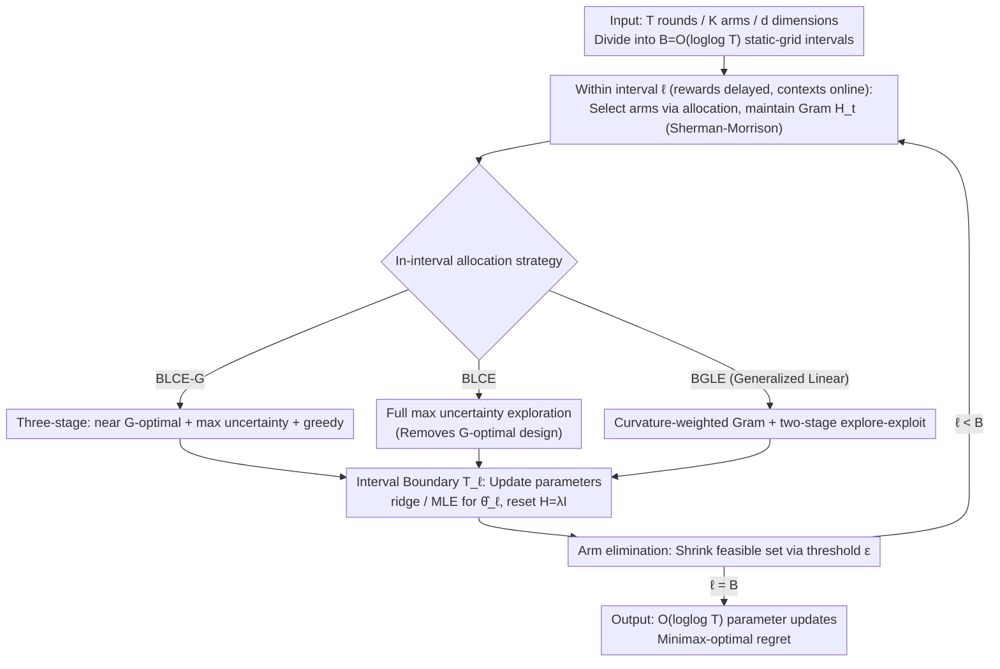

# Practical and Optimal Algorithm for Linear Contextual Bandits with Rare Parameter Updates

**Conference**: ICML2026  
**arXiv**: [2606.00984](https://arxiv.org/abs/2606.00984)  
**Code**: To be confirmed  
**Area**: Reinforcement Learning / Bandit Theory  
**Keywords**: Linear contextual bandit, batched bandit, rare parameter updates, minimax regret, G-optimal design

## TL;DR
In linear contextual bandits, the authors explicitly decouple "when rewards are received" and "whether context within an interval can be utilized," two axes previously confused by the term "batched." They define a more practical "rare parameter updates" setting (restricting only reward-driven updates while allowing reward-free context adaptivity). Based on this, they propose BLCE-G and BLCE, which require only $\mathcal{O}(\log\log T)$ parameter updates. BLCE-G is the first to achieve minimax-optimal regret $\widetilde{\mathcal{O}}(\sqrt{dT\log K}\wedge d\sqrt T)$ across both small-$K$ and large-$K$ regimes, while BLCE removes the G-optimal design bottleneck to achieve the lowest runtime among all optimal algorithms. This approach is further extended to generalized linear bandits with BGLE, which eliminates dependence on the worst-case curvature parameter $\kappa$.

## Background & Motivation

**Background**: Stochastic linear contextual bandits are a classic model for sequential decision-making: at each round $t$, the agent observes feature vectors for $K$ arms $\mathcal A_t=\{x_{t,1},\ldots,x_{t,K}\}\subseteq\mathbb R^d$, selects an arm, and receives $r_t=\langle x_{t,a_t},\theta^*\rangle+\eta_t$. The goal is to minimize cumulative expected regret $\mathcal R(T)=\mathbb E[\sum_t(\langle x_t^*,\theta^*\rangle-\langle x_{t,a_t},\theta^*\rangle)]$. The deployment bottleneck is often the "reward-driven parameter updates" (model retraining, confidence set recalculation, or posterior updates) rather than selection, due to expensive pipelines, privacy audits, or manual validation. This motivates research into "limited adaptivity / batched bandits."

**Limitations of Prior Work**: The authors identify that the term "batched" has been conflated across two independent axes: (i) reward visibility (feedback delay) and (ii) whether the policy depends on contexts arrived within an interval (context adaptivity). For instance, Karbasi 2021 formalized batch policies allowing within-interval context dependence, whereas static-grid algorithms (Ruan 2021, Hanna 2023, Zhang 2025) achieve $\mathcal{O}(\log\log T)$ updates but implicitly require committing to a rule independent of within-interval contexts. This "strict batching" forces them to use expensive primitives like G-optimal design, $(1/T)$-net discretization, or repeated optimization oracles, leading to extremely high runtimes.

**Key Challenge**: Strict batching is not an inherent requirement of batched feedback—contexts are observed before arm selection, and it is natural to use them even if parameter updates are delayed. By decoupling "reducing reward-based updates" from "maintaining context adaptivity," one can potentially eliminate the computational burden imposed by G-optimal design.

**Goal**: (1) Provide an algorithm that is minimax-optimal in both small-$K$ ($K\le\mathcal O(e^d)$) and large-$K$ ($K\ge\Omega(e^d)$) regimes under $\mathcal{O}(\log\log T)$ updates. (2) Achieve minimax optimality while removing the G-optimal design subprocess to reduce runtime. (3) Extend this to generalized linear bandits (GLB) and remove the dependence on the worst-case curvature $\kappa$.

**Key Insight**: Maintain a reward-free state variable—the Gram matrix $H_t$ and its inverse (via Sherman-Morrison updates at $\mathcal{O}(d^2)$ per step). Perform "uncertainty-driven" exploration by selecting arms via $\arg\max_x\|x\|_{H_{t-1}^{-1}}$. This naturally depends on arrived contexts but not on rewards, thus fitting the "rare parameter updates" setting.

**Core Idea**: Replace "static G-optimal design rollout" with "reward-free in-interval maximum variance exploration + arm elimination + boundary parameter updates." Theoretical analysis proves that the cumulative bound of $\|x\|_{H^{-1}}$ yields information gain comparable to G-optimal design but without the $\mathcal{O}(Kd^3)$ design calls.

## Method

### Overall Architecture
The horizon $[T]$ is divided into $B=\mathcal{O}(\log\log T)$ static-grid intervals: $\mathcal T_1=\lceil\sqrt T/\log_2\log_2 T\rceil+1$, $\mathcal T_\ell=(\mathcal T_{\ell-1}+\lceil T^{1-2^{-\ell}}/\log_2\log_2 T\rceil+2)\wedge T$. Within each interval, rewards are invisible while contexts arrive online; the agent selects arms via an allocation strategy and updates the reward-free Gram matrix $H_t$ in $\mathcal{O}(d^2)$. At interval boundaries $\mathcal T_\ell$, a ridge regression $\hat\theta_\ell=V_\ell^{-1}\sum_{t}r_tx_{t,a_t}$ (where $V_\ell=H_{\mathcal T_\ell}$) is performed, and $H$ is reset to $\lambda I$. Subsequent intervals use $\hat\theta_1,\ldots,\hat\theta_{\ell-1}$ for nested arm elimination to shrink the feasible set $\mathcal A_t^{(k)}$. The three algorithms differ only in their **in-interval exploration-exploitation allocation**: BLCE-G and BLCE are for linear bandits (with and without G-optimal design, respectively), while BGLE extends this to GLB.

### Key Designs

**1. BLCE-G: First to be optimal in both regimes via three-stage allocation**
Existing static-grid algorithms are typically optimal in only one regime. BLCE-G achieves optimality in both by splitting intervals: the first interval is split $c:(1-c)$ for near G-optimal design $\pi_{G'}(\mathcal A_t)$ and max uncertainty $\arg\max_x\|x\|_{H_{t-1}^{-1}}$. Subsequent intervals use a $c^2:c(1-c):(1-c)$ split (near G-optimal over $\mathcal A_t^{(\ell-1)}$, max uncertainty, and greedy exploitation via $\hat\theta_{\ell-1}$). The key is the elimination threshold:
$$\varepsilon_{t,k}=\max_{y\in\mathcal A_t^{(k-1)}}\|y\|_{V_k^{-1}}\Big(\sqrt{2\log(|\mathcal A_t^{(k-1)}|(B-1)T^2)}+\sqrt\lambda \;\wedge\; 2\sqrt{\log(2^{6d-5}\pi d(B-1)^2T^2/15^{d-1})}+2\sqrt\lambda\Big),$$
Taking the $\min$ allows $\sqrt{\log K}$ to dominate for small-$K$ and $\sqrt d$ for large-$K$, covering both regimes.

**2. BLCE: Removing G-optimal design with lowest runtime**
BLCE demonstrates that G-optimal design is a requirement of strict batching, not optimality itself. By allowing the reward-free Gram matrix to evolve with contexts, the rule $\arg\max_x\|x\|_{H_{t-1}^{-1}}$ achieves information gain equivalent to G-optimal design. BLCE uses full uncertainty exploration in the first interval and a two-stage (uncertainty + greedy) approach in subsequent intervals. Theorem 2 proves it maintains $\mathcal R(T)=\widetilde{\mathcal O}(\sqrt{dT\log K}\wedge d\sqrt T)$, adding only a $\sqrt{\log T}$ polylog factor while reducing runtime to $\mathcal O(Kd^2T\log\log T)$.

**3. BGLE: $\kappa$-free generalized linear bandits**
In GLB, $\mathbb E[r_t]=\mu(\langle x_{t,a_t},\theta^*\rangle)$. Traditional regret bounds contain $1/\kappa$ ($\kappa=\max\dot\mu^{-1}$), which can diverge. BGLE uses the BLCE skeleton but weights the Gram matrix by local curvature $\dot\mu(\langle x_{t,a_t},\hat\theta_{\ell-1}\rangle)$. It uses MLE at boundaries. By weighting the Gram matrix, the analysis depends on average curvature $\hat\kappa=1/\mathbb E_{\mathcal A\sim\mathcal D}[\dot\mu(\langle x^*,\theta^*\rangle)]$ rather than worst-case curvature, providing a qualitative improvement for saturating links.

### Loss & Training
Both algorithms use standard estimators at interval boundaries: BLCE-G and BLCE perform ridge regression with $\lambda$ set to $\log(dT)$ and $1$ respectively. BGLE uses MLE with $\lambda=R^2(d+\log T)$. Interval lengths are strictly determined by a static grid doubling-trick.

## Key Experimental Results

### Main Results
For $T=10{,}000$, BLCE achieved the lowest runtime among all optimal algorithms while maintaining better regret and lower variance than non-optimal baselines.

| Config (K,d) | RS-OFUL | SoftBatch | BatchLinUCB-DG | hanna2023contexts | BatchLearning | BLCE-G | BLCE |
|------------|---------|-----------|----------------|--------------------|----------------|--------|------|
| (1000,5)   | 0.85s   | 4.18s     | 290.87s        | Exponential        | 166.17s        | 23.40s | **5.91s** |
| (5000,10)  | 4.15s   | 15.17s    | 1300.01s       | Exponential        | 621.09s        | 40.27s | **12.83s** |
| (50,20)    | 0.42s   | 3.74s     | 1031.66s       | Exponential        | 45.85s         | 2.26s  | **1.06s** |
| (100,30)   | 0.61s   | 5.50s     | 2987.07s       | Exponential        | 77.01s         | 3.70s  | **1.62s** |

### Theoretical Comparison

| Algorithm | Regret | Updates | Context-adaptive | Runtime |
|------|--------|----------|-------------------|---------|
| RS-OFUL | $\mathcal O(d\sqrt T\log T)$ | $\mathcal O(d\log T)$ | Yes | $\mathcal O((Kd+d^2)T+Kd^3\log T)$ |
| Zhang 2025 | $\widetilde{\mathcal O}(\sqrt{dT\log K}\log\log T)$ | $\mathcal O(\log\log T)$ | No | $\mathcal O(Kd^2T\log\log T + Kd^{3.5}\sqrt{T})$ |
| **BLCE-G** | $\widetilde{\mathcal O}(\sqrt{dT\log K}\wedge d\sqrt T)$ | $\mathcal O(\log\log T)$ | Yes | $\mathcal O(Kd^2T(d+\log\log T))$ |
| **BLCE** | $\widetilde{\mathcal O}(\sqrt{dT\log K}\wedge d\sqrt T)$ | $\mathcal O(\log\log T)$ | Yes | $\mathcal O(Kd^2T\log\log T)$ |

### Key Findings
- Allowing context adaptivity reduced runtime from 290s to 5.9s (~50x) while achieving tighter regret.
- BLCE identifies that G-optimal design is not an intrinsic requirement for optimality in batched settings.
- BGLE's reliance on average curvature $\hat\kappa$ instead of worst-case $\kappa$ is a major improvement for logistic links.

## Highlights & Insights
- Decoupling "batched" into distinct operational levels (strict batching vs. rare updates) clarifies a previously confused area of research.
- Successfully challenging the necessity of G-optimal design resulted in algorithms that are both theoretically optimal and practically fast.
- The uncertainty-driven reward-free Gram mechanism provides a template for applying adaptive logic to constrained industrial feedback systems.

## Limitations & Future Work
- The static-grid schedule depends on a known horizon $T$.
- Large-scale arm sets ($K > 10^6$) were not tested and would require indexing structures like ANN/IVF.
- The transient term in BGLE still has an exponential dependence on $RS$, which should be addressed in future work.

## Related Work & Insights
- **vs Zhang 2025**: BLCE removes the dominant $\mathcal{O}(Kd^{3.5}\sqrt{T})$ term caused by first-batch G-optimal design.
- **vs Karbasi 2021**: BLCE maintains context adaptivity while reducing parameter updates from $\mathcal{O}(K\log T)$ to $\mathcal{O}(\log\log T)$ with minimax-optimal regret.
- **vs Sawarni 2024**: BGLE achieves $\kappa$-free regret in both leading and transient terms, whereas prior work retained $\kappa$ in the transient term.

<!-- RELATED:START -->

## Related Papers

- [\[ICML 2025\] Optimal and Practical Batched Linear Bandit Algorithm](../../ICML2025/reinforcement_learning/optimal_and_practical_batched_linear_bandit_algorithm.md)
- [\[ICLR 2026\] Single Index Bandits: Generalized Linear Contextual Bandits with Unknown Reward Functions](../../ICLR2026/reinforcement_learning/single_index_bandits_generalized_linear_contextual_bandits_with_unknown_reward_f.md)
- [\[ICML 2026\] Parameter-free Dynamic Regret: Time-varying Movement Costs, Delayed Feedback, and Memory](parameter-free_dynamic_regret_time-varying_movement_costs_delayed_feedback_and_m.md)
- [\[NeurIPS 2025\] Tractable Multinomial Logit Contextual Bandits with Non-Linear Utilities](../../NeurIPS2025/reinforcement_learning/tractable_multinomial_logit_contextual_bandits_with_non-linear_utilities.md)
- [\[NeurIPS 2025\] Generalized Linear Bandits: Almost Optimal Regret with One-Pass Update](../../NeurIPS2025/reinforcement_learning/generalized_linear_bandits_almost_optimal_regret_with_one-pass_update.md)

<!-- RELATED:END -->
