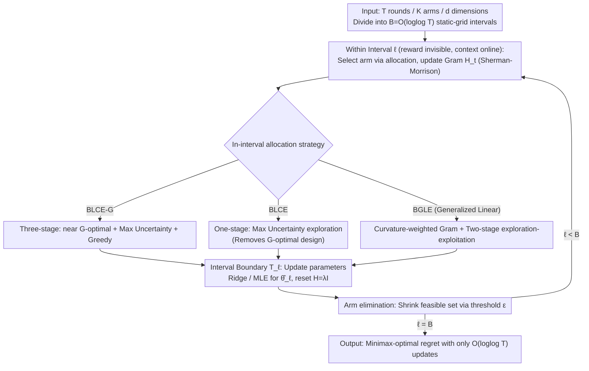

# Practical and Optimal Algorithm for Linear Contextual Bandits with Rare Parameter Updates

**Conference**: ICML2026  
**arXiv**: [2606.00984](https://arxiv.org/abs/2606.00984)  
**Code**: To be confirmed  
**Area**: Reinforcement Learning / Bandit Theory  
**Keywords**: linear contextual bandit, batched bandit, rare parameter updates, minimax regret, G-optimal design

## TL;DR
In linear contextual bandits, the authors explicitly decouple the two axes previously confused by the term "batched"—"when feedback is received" and "whether strategies can rely on incoming contexts within an interval." They define "rare parameter updates" as a setting that limits only reward-driven parameter updates while allowing reward-free context adaptivity, which is more aligned with practical deployment. Based on this, they propose two algorithms, BLCE-G and BLCE, requiring only $\mathcal O(\log\log T)$ updates. BLCE-G is the first to achieve minimax-optimal regret $\widetilde{\mathcal O}(\sqrt{dT\log K}\wedge d\sqrt T)$ across both small-$K$ and large-$K$ regimes simultaneously. BLCE further eliminates the G-optimal design bottleneck, achieving the lowest runtime among all optimal algorithms. The approach is extended to generalized linear bandits (BGLE), removing the dependence on the worst-case curvature parameter $\kappa$.

## Background & Motivation

**Background**: Stochastic linear contextual bandits are a classical model for sequential decision-making. At each round $t$, the agent observes feature vectors for $K$ arms $\mathcal A_t=\{x_{t,1},\ldots,x_{t,K}\}\subseteq\mathbb R^d$, selects an arm to pull, and receives $r_t=\langle x_{t,a_t},\theta^*\rangle+\eta_t$. The goal is to minimize the cumulative expected regret $\mathcal R(T)=\mathbb E[\sum_t(\langle x_t^*,\theta^*\rangle-\langle x_{t,a_t},\theta^*\rangle)]$ over $T$ rounds. In practice, the deployment bottleneck is often not "selecting an arm given a context" but "feeding new reward feedback into parameter estimation": model retraining, confidence set recalculation, and posterior updates may involve expensive pipelines, log synchronization, privacy audits, or human verification. This motivates the study of "limited adaptivity / batched bandits."

**Limitations of Prior Work**: The authors observe that the term "batched" is used inconsistently across two independent axes: (i) reward visibility (feedback delay) and (ii) whether the policy can depend on contexts arriving within the interval (context adaptivity). For instance, Karbasi (2021) formalizes batch policies as $\pi_t:H_{t_{\ell-1}}\times C_t\to\mathcal A$, allowing within-interval context dependency. Conversely, static-grid algorithms (Ruan 2021, Hanna 2023, Zhang 2025) achieve near minimax-optimal regret with $\mathcal O(\log\log T)$ updates but implicitly require committing to an action rule at the start of an interval that does not depend on within-interval contexts. This "strict batching" forces them to invoke expensive primitives like G-optimal design, $(1/T)$-net discretization, or repeated optimization oracles, leading to extremely high runtimes (e.g., Zhang 2025's BatchLinUCB-DG takes 290s for $(K=1000,d=5,T=10^4)$).

**Key Challenge**: Strict batching is not an inherent requirement of batched feedback. Since contexts are observed before selecting arms, it is unnatural to delay using "already observed contexts" until the next parameter update. By decoupling "minimizing reward-based parameter updates" from "maintaining context adaptivity within intervals," it is possible to eliminate the computational burden imposed by G-optimal design.

**Goal**: (1) Provide an algorithm that is minimax-optimal in both small-$K$ ($K\le\mathcal O(e^d)$) and large-$K$ ($K\ge\Omega(e^d)$) regimes with $\mathcal O(\log\log T)$ updates. (2) Achieve minimax-optimality while removing the G-optimal design sub-procedure to reduce runtime. (3) Extend the framework to generalized linear bandits and remove the regret bound's dependence on the worst-case curvature $\kappa$ (which diverges as the link function saturates, $\dot\mu\to 0$).

**Key Insight**: Within each interval $\ell$, the agent can maintain a reward-free state variable—the Gram matrix $H_t$ and its inverse (via Sherman-Morrison updates at $\mathcal O(d^2)$ per step). Arms are selected using "uncertainty-driven" exploration (e.g., $\arg\max_x\|x\|_{H_{t-1}^{-1}}$). This naturally depends on the contexts arrived within the interval but not on rewards, thus fitting the "rare parameter updates" setting.

**Core Idea**: Replace "static G-optimal design rollout" with "reward-free in-interval exploration along the maximum variance direction + arm elimination + parameter updates at interval boundaries." Theoretical analysis using cumulative bounds of $\|x\|_{H^{-1}}$ shows this achieves information gain comparable to G-optimal design while eliminating the $\mathcal O(Kd^3)$ design calls.

## Method

### Overall Architecture
The horizon $[T]$ is divided into $B=\mathcal O(\log\log T)$ static-grid intervals: $\mathcal T_1=\lceil\sqrt T/\log_2\log_2 T\rceil+1$, $\mathcal T_\ell=(\mathcal T_{\ell-1}+\lceil T^{1-2^{-\ell}}/\log_2\log_2 T\rceil+2)\wedge T$. Within each interval, rewards are invisible but contexts arrive online. The agent selects arms according to an allocation strategy and maintains a reward-free Gram matrix $H_t$ using Sherman-Morrison updates ($\mathcal O(d^2)$ per step). At interval boundaries $\mathcal T_\ell$, a ridge regression is performed: $\hat\theta_\ell=V_\ell^{-1}\sum_{t}r_tx_{t,a_t}$ (where $V_\ell=H_{\mathcal T_\ell}$), and $H$ is reset to $\lambda I$. For subsequent intervals, $\hat\theta_1,\ldots,\hat\theta_{\ell-1}$ are used for nested arm elimination to shrink the feasible set $\mathcal A_t^{(k)}$. The three proposed algorithms share this skeleton but differ in their **in-interval exploration-exploitation allocation**:

### Key Designs

**1. BLCE-G: Three-stage allocation (near G-optimal + uncertainty + greedy), first to be optimal in both regimes**

Existing static-grid algorithms are optimal only in either the small-$K$ or large-$K$ regime. BLCE-G achieves optimality in both with $\mathcal O(\log\log T)$ updates. It splits the first interval into two segments (ratio $c:1-c$): the first segment samples arms via near G-optimal design $\pi_{G'}(\mathcal A_t)$, and the second following the direction of maximum uncertainty $\arg\max_x\|x\|_{H_{t-1}^{-1}}$. For intervals $\ell\ge 2$, it uses a three-stage allocation ($c^2:c(1-c):1-c$): near G-optimal over $\mathcal A_t^{(\ell-1)}$, maximum uncertainty, and greedy exploitation using $\hat\theta_{\ell-1}$. The dual-regime optimality stems from the elimination threshold:
$$\varepsilon_{t,k}=\max_{y\in\mathcal A_t^{(k-1)}}\|y\|_{V_k^{-1}}\Big(\sqrt{2\log(|\mathcal A_t^{(k-1)}|(B-1)T^2)}+\sqrt\lambda \;\wedge\; 2\sqrt{\log(2^{6d-5}\pi d(B-1)^2T^2/15^{d-1})}+2\sqrt\lambda\Big).$$
Using the minimum of two confidence bounds ensures $\sqrt{\log K}$ dominates for small $K$ and $\sqrt d$ for large $K$.

**2. BLCE: Removing G-optimal design with lowest runtime**

BLCE argues that G-optimal design is a requirement of strict batching, not optimality itself. By allowing the Gram matrix to evolve with incoming contexts, the reward-free rule $\arg\max_x\|x\|_{H_{t-1}^{-1}}$ achieves information gain comparable to G-optimal design. BLCE uses pure uncertainty-driven exploration in the first interval and a two-stage (uncertainty exploration followed by greedy exploitation) allocation for subsequent intervals. Theorem 2 proves it maintains $\mathcal R(T)=\widetilde{\mathcal O}(\sqrt{dT\log K}\wedge d\sqrt T)$, adding only a $\sqrt{\log T}$ factor to the polylog terms while reducing runtime to $\mathcal O(Kd^2T\log\log T)$.

**3. BGLE: Extension to generalized linear bandits without $\kappa$ dependence**

In generalized linear bandits, $\mathbb E[r_t]=\mu(\langle x_{t,a_t},\theta^*\rangle)$. Standard regret bounds include a $1/\kappa$ factor ($\kappa=\max\dot\mu^{-1}$), which diverges for saturated link functions. BGLE weights the Gram matrix by local curvature: $\alpha_{t,\ell-1}(\lambda)\dot\mu(\langle x_{t,a_t},\hat\theta_{\ell-1}\rangle)$. It uses maximum likelihood estimation (MLE) at interval boundaries. By weighting the Gram matrix, the analysis depends on average curvature $\hat\kappa=1/\mathbb E_{\mathcal A\sim\mathcal D}[\dot\mu(\langle x^*,\theta^*\rangle)]$ rather than the worst-case $\kappa$, representing a qualitative improvement for saturated link functions.

### Loss & Training
The algorithms do not learn neural parameters but use Least Squares or MLE. BLCE-G and BLCE perform ridge regression $\hat\theta_\ell=V_\ell^{-1}\sum_t r_t x_{t,a_t}$ at interval boundaries. BGLE performs MLE. $\lambda$ is set to $\log(dT)$ for BLCE-G, $1$ for BLCE, and $R^2(d+\log T)$ for BGLE. The interval schedule follows a doubling-trick style static grid.

## Key Experimental Results

### Main Results
$T=10{,}000$, 10 independent runs, $d$-dimensional uniform arm sampling. Baselines: RS-OFUL (Abbasi 2011), BatchLinUCB-DG (Ruan 2021), SoftBatch (Hanna 2023 contexts), BatchLearning (Zhang 2025).

| Config (K,d) | RS-OFUL | SoftBatch | BatchLinUCB-DG | hanna2023contexts | BatchLearning | BLCE-G | BLCE |
|------------|---------|-----------|----------------|--------------------|----------------|--------|------|
| (1000,5)   | 0.85s   | 4.18s     | 290.87s        | Exponential        | 166.17s        | 23.40s | **5.91s** |
| (5000,10)  | 4.15s   | 15.17s    | 1300.01s       | Exponential        | 621.09s        | 40.27s | **12.83s** |
| (50,20)    | 0.42s   | 3.74s     | 1031.66s       | Exponential        | 45.85s         | 2.26s  | **1.06s** |
| (100,30)   | 0.61s   | 5.50s     | 2987.07s       | Exponential        | 77.01s         | 3.70s  | **1.62s** |

BLCE achieves the lowest runtime among all optimal algorithms and is comparable to suboptimal baselines. Regret results show BLCE-G and BLCE outperform all baselines across all $K$ regimes with lower variance.

### Theoretical Regret Comparison

| Algorithm | Regret | Parameter Updates | Context-adaptive | Runtime |
|------|--------|----------|-------------------|---------|
| RS-OFUL | $\mathcal O(d\sqrt T\log T)$ | $\mathcal O(d\log T)$ | Yes | $\mathcal O((Kd+d^2)T+Kd^3\log T)$ |
| Ruan 2021 | $\mathcal O(\sqrt{dT\log(dKT)\log d}\log\log T)$ | $\mathcal O(\log\log T)$ | No | $\mathcal O(Kd^4T(\log T+\log d))$ |
| Hanna 2023 contexts | $\mathcal O(d\sqrt{T\log T}\log\log T)$ | $\mathcal O(\log\log T)$ | No | $\Omega(T^d)$ |
| Zhang 2025 | $\mathcal O(\sqrt{dT\log(dKT)\log T}\log(dT)\log\log T)$ | $\mathcal O(\log\log T)$ | No | $\mathcal O(Kd^2T\log\log T)+\mathcal O(Kd^{7/2}\sqrt{T\log(dKT)\log T})$ |
| **BLCE-G** | $\widetilde{\mathcal O}(\sqrt{dT\log K}\wedge d\sqrt T)$ | $\mathcal O(\log\log T)$ | Yes | $\mathcal O(Kd^2T(d+\log\log T))$ |
| **BLCE** | $\widetilde{\mathcal O}(\sqrt{dT\log K}\wedge d\sqrt T)$ | $\mathcal O(\log\log T)$ | Yes | $\mathcal O(Kd^2T\log\log T)$ |

### Key Findings
- Allowing context adaptivity reduces runtime from 290s to 5.9s (~50x) for the same $\mathcal O(\log\log T)$ updates while yielding tighter regret.
- BLCE removes the $\mathcal O(Kd^{7/2}\sqrt T)$ bottleneck of G-optimal design used in Zhang 2025.
- BGLE's regret depends on average curvature $\hat\kappa$ instead of worst-case $\kappa$, a significant improvement for saturated link functions.

## Highlights & Insights
- **Conceptual Clarity**: The paper distinguishes three operationally different levels of "batching" (fully sequential, strictly batched, and rare parameter updates), providing a clear framework for future work.
- **Breaking Consensus**: It demonstrates that G-optimal design is a byproduct of strict batching rather than an inherent requirement for optimality in the batched setting.
- **Practical Utility**: The "uncertainty-driven Gram" mechanism adaptively utilizes within-interval contexts to gain information, making it suitable for recommendation/ranking systems with delayed feedback.

## Limitations & Future Work
- The schedule depends on a known horizon $T$; extension to unknown $T$ while maintaining dual-regime optimality is an open question.
- Evaluation is limited to synthetic datasets; performance on real-world industrial datasets needs verification.
- BGLE’s transient term still contains $e^{8RS}$, which might dominate when the dynamic range of the link function is large.

## Related Work & Insights
- **vs Abbasi 2011**: BLCE reduces parameter updates from $\mathcal O(d\log T)$ to $\mathcal O(\log\log T)$ and optimizes regret to minimax-optimal with lower runtime.
- **vs Zhang 2025**: BLCE replaces the costly first-batch G-optimal design with reward-free Gram evolution, drastically reducing computational overhead.
- **vs Sawarni 2024**: BGLE provides the first $\kappa$-free leading and transient terms for generalized linear bandits.

<!-- RELATED:START -->

## Related Papers

- [\[ICML 2025\] Optimal and Practical Batched Linear Bandit Algorithm](../../ICML2025/reinforcement_learning/optimal_and_practical_batched_linear_bandit_algorithm.md)
- [\[ICLR 2026\] Single Index Bandits: Generalized Linear Contextual Bandits with Unknown Reward Functions](../../ICLR2026/reinforcement_learning/single_index_bandits_generalized_linear_contextual_bandits_with_unknown_reward_f.md)
- [\[ICML 2026\] Parameter-free Dynamic Regret: Time-varying Movement Costs, Delayed Feedback, and Memory](parameter-free_dynamic_regret_time-varying_movement_costs_delayed_feedback_and_m.md)
- [\[NeurIPS 2025\] Tractable Multinomial Logit Contextual Bandits with Non-Linear Utilities](../../NeurIPS2025/reinforcement_learning/tractable_multinomial_logit_contextual_bandits_with_non-linear_utilities.md)
- [\[NeurIPS 2025\] Generalized Linear Bandits: Almost Optimal Regret with One-Pass Update](../../NeurIPS2025/reinforcement_learning/generalized_linear_bandits_almost_optimal_regret_with_one-pass_update.md)

<!-- RELATED:END -->
