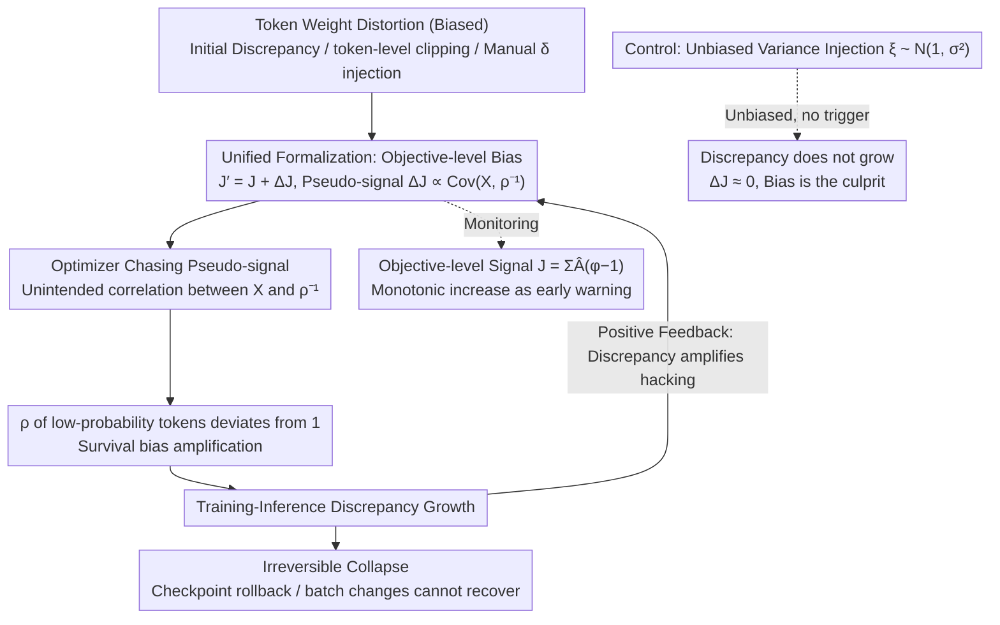

# Probing RLVR Training Instability through the Lens of Objective-Level Hacking

**Conference**: ICML 2026  
**arXiv**: [2602.01103](https://arxiv.org/abs/2602.01103)  
**Code**: None  
**Area**: LLM Alignment / RLHF / RL Training Stability / MoE  
**Keywords**: RLVR, GRPO, MoE, Training-Inference Discrepancy, Objective-Level Hacking

## TL;DR
The authors propose the "objective-level hacking" framework, attributing the phenomenon of growing training-inference discrepancy in MoE models during RLVR to biased pseudo-signals introduced into the optimization objective by token-level weight distortions. Experiments on a 30B MoE model verify that "bias (not variance) is the culprit."

## Background & Motivation

**Background**: RLVR (Reinforcement Learning with Verifiable Rewards, represented by algorithms like GRPO/DAPO/GSPO) has become the core post-training paradigm for reasoning models like OpenAI o1 and DeepSeek-R1, demonstrating stronger generalization and long-term gains in mathematics, code, and Agent tasks compared to SFT.

**Limitations of Prior Work**: Particularly under MoE architectures, RLVR training frequently suffers from instability—validation performance reverses, token entropy collapses, and gradient norms become abnormal. A puzzling companion phenomenon is the growing *training-inference discrepancy*: token probabilities for the same weights become increasingly inconsistent between vLLM inference and Megatron training, even when parameters are synchronized at every step.

**Key Challenge**: This was originally perceived as transient noise from numerical precision differences in infrastructure. Why does it grow monotonically and eventually trigger irreversible collapse? Existing patches (TIS, various clipping variants, GSPO sequence-level clipping) can mitigate the issue, but the underlying mechanism remains unexplained.

**Goal**: To answer two specific questions: (1) Why does the training-inference discrepancy accumulate rather than remain constant? (2) Which common techniques (initial discrepancy, token-level clipping, custom token weighting) unknowingly inject biased signals into the optimization objective?

**Key Insight**: The concept of "reward hacking" is elevated from the verifier to the *optimization objective level*. Any fine-tuning of token-level weights is equivalent to adding a $\Delta\mathcal J(\theta)$ term to the original GRPO objective. If this term correlates with a pseudo-signal (such as $\rho_{i,t}^{-1}$), the optimization will proceed in a direction that widens the discrepancy, forming a positive feedback loop.

**Core Idea**: A unified formula $\mathcal J_{\text{dist}}=\mathcal J + \Delta_{\text{dist}}\mathcal J$ is used to describe the implicit bias of various "token-level weight distortions" on the optimization objective. Through active injection experiments, it is proven that *bias is the key factor*, while variance-based noise does not trigger collapse.

## Method

### Overall Architecture
The paper follows a causal chain: any "token-level weight distortion" (numerical noise from initial discrepancy, token-level clipping, or manually injected weighting) superimposes an additional bias term $\Delta\mathcal J(\theta)$ onto the GRPO/GSPO objective. This bias acts as a pseudo-signal; as the optimizer pursues it, the training-inference discrepancy for low-probability tokens increases. This discrepancy, in turn, amplifies the pseudo-signal, creating a positive feedback loop until irreversible collapse occurs. The paper first provides a **theoretical** unified form $\mathcal J_{\text{dist}}=\mathcal J(\theta)+\Delta_{\text{dist}}\mathcal J(\theta)$ for various distortions. Then, in the **experimental** phase (Qwen3-30B-A3B MoE, verl + vLLM + Megatron, DAPO-Math-17k), it confirms the "bias (not variance) $\Rightarrow$ discrepancy growth $\Rightarrow$ collapse" chain through four sets of experiments: initial discrepancy/TIS, clipping intensity scanning, active injection, and unbiased variance control.

### Key Designs

**1. Unified formalization of objective-level hacking: Reducing heterogeneous "training accidents" to the same bias term.** Numerical errors, token-level clipping, and custom weighting in RLVR appear unrelated but can be explained together. Starting from the ideal GRPO objective $\mathcal J(\theta)=\mathbb E_{\text{train}}[\sum_{i,t} X_{i,t}(\theta)]$ (where $X_{i,t}=r_{i,t}\hat A_{i,t}/(G|o_i|)$), the authors note that rollouts are sampled from $\pi_{\text{infer}}$ rather than $\pi_{\text{train}}$, making the actual objective $\mathcal J'(\theta)=\mathcal J(\theta)+\Delta\mathcal J(\theta)$. First-order derivation yields the bias term $\Delta\mathcal J(\theta)\simeq \sum_{i,t}\text{Cov}_{\text{train}}(X_{i,t},\rho_{i,t}^{-1})$, where $\rho_{i,t}=\pi_{\text{train}}/\pi_{\text{infer}}$ measures the discrepancy. Similarly, token-level clipping is equivalent to multiplying by a hard weight $\phi_{i,t}\in\{0,1\}$, resulting in a bias term $\Delta_{\text{clip}}\mathcal J=\mathbb E_{\text{train}}[\sum X_{i,t}(\phi_{i,t}-1)]$. Both are merged into the unified form $\mathcal J_{\text{dist}}=\mathcal J+\Delta_{\text{dist}}\mathcal J$.

**2. Active injection experiments as causal probes: Turning pseudo-signals into "switchable" variables.** Correlation between clipping intensity and discrepancy growth does not prove causality. The authors use the sequence-level algorithm GSPO—which does not inherently cause discrepancy growth—as a clean baseline. They manually multiply low-probability tokens ($\pi_{\text{train}}<\pi_{\text{low}}=0.1$) by weights $\varphi_{i,t}=\delta$ (keeping others as 1) and scan $\delta\in\{1.2, 2, 3\}$, explicitly injecting a biased $\Delta_{\text{inj}}\mathcal J=\mathbb E_{\text{train}}[\sum Y_{i,t}(\varphi_{i,t}-1)]$. Two controls were added: first, reducing weights for low-probability tokens also caused discrepancy growth, proving the root cause is "distortion" itself rather than weighting direction; second, injecting unbiased variance $\xi_{i,t}\sim\mathcal N(1,\sigma^2)$ resulted in $\Delta\mathcal J_{\text{var}}\simeq 0$. The fact that $20\%$ weighting ($\delta=1.2$) triggers growth while unbiased variance does not confirms that "bias, not variance, is the culprit."

**3. Objective-level signal monitoring + positive feedback loop: Providing early warnings and explaining irreversibility.** Hacking is often abstract and hard to prevent; its irreversibility (checkpoint rollbacks or data batch changes fail to fix it) was previously unexplained. The paper defines a proxy $J=\sum_{i,t}\hat A_{i,t}(\varphi_{i,t}-1)$. A significant positive Pearson correlation between $J$ and training steps indicates the pseudo-signal is being optimized (confirmed in Fig. 6). Mechanistically, $\rho_{i,t}$ for low-probability tokens deviates downward from 1 due to survival bias, which amplifies the effective strength of $\Delta\mathcal J$. This "discrepancy ⇄ hacking" loop makes the process irreversible once started. $J$ thus serves as an early warning for RLVR: if it increases monotonically, training should be stopped.

### Loss & Training
No new loss functions are introduced; instead, existing GRPO/GSPO objectives are reformulated as "weighted objectives." Experiments were conducted on 4 nodes × 8 A100 GPUs, with 128 problems × 16 responses per step, 4 parameter updates, and a response length of 8K. GRPO default clip is 0.2; GSPO sequence-level clip is 3e-4/4e-4.

## Key Experimental Results

### Main Results

Discrepancy and validation behavior under different stabilization strategies:

| Configuration | Discrepancy Growth | Validation | Notes |
|---|---|---|---|
| GRPO + token clip (vanilla) | Significant rise | Reverse drop | Standard RLVR, poor stability |
| + TIS Correction | Significantly slowed | Improved | Only modifies objective |
| Token clip strong ($\epsilon=0.2$) | Fastest | Earliest collapse | Strong clip = Strong bias |
| Token clip weak ($\epsilon=0.28$) | Slower | Better | Weak clip is more stable |
| GSPO (sequence clip) | No growth | Stable | No token-level bias |
| GSPO + injected $\delta=1.2$ | Growth triggered | Degradation | $20\%$ weighting triggers collapse |
| GSPO + variance $\xi\sim\mathcal N(1,\sigma^2)$ | No growth | Stable | Bias is the culprit, not variance |

### Ablation Study

| Research Question | Design | Key Observation |
|---|---|---|
| Clip intensity vs. discrepancy | Right clip $\in\{0.2, 0.24, 0.28\}$ | Stronger clip leads to faster discrepancy growth |
| Bias vs. Variance | Biased vs. Unbiased weighting | Unbiased variance does not trigger growth |
| Reducing low-prob weights | Symmetric perturbation | Also triggers growth, proving "distortion" is the cause |

### Key Findings
- Token-level clipping, which is supposed to stabilize training, actually accelerates discrepancy growth in MoE models. It acts as a token weight distortion equivalent to injecting pseudo-signals.
- Discrepancy growth is a *positive feedback* process: hacking causes $\rho$ of low-probability tokens to deviate from 1, which further amplifies the hacking intensity. This explains why checkpoint rollbacks often fail to recover the model.
- Sequence-level algorithms (GSPO) are stable on MoE not because of "looser clipping," but because they structurally avoid token-level weight distortion. This suggests a rule for MoE-specific RL: *never inject biased weights that depend on token probabilities.*

## Highlights & Insights
- Success in mapping "reward hacking" to "objective-level hacking," explaining training-inference discrepancy as a product of a biased algorithmic objective rather than just an infrastructure bug.
- Elegant active injection experiment design: using GSPO as a stable base to toggle $\delta$ and $\sigma$ provides a clean causal proof.
- Provides a *monitorable* early signal $J=\sum \hat A_{i,t}(\varphi_{i,t}-1)$ for industrial RLVR, allowing for intervention before validation performance collapses.

## Limitations & Future Work
- Experiments were limited to Qwen3-30B-A3B; the strength of the conclusions for dense models or other MoE routing strategies is unknown.
- The framework explains *what* triggers collapse but does not yet provide a method for *automatic debiasing*. Future work may integrate importance sampling with token weight distortion correction.
- A100 numerical precision is lower than H100, which the authors admit likely amplified the initial discrepancy; threshold triggers for hacking may vary on higher-precision hardware.

## Related Work & Insights
- **vs DAPO / Dr.GRPO**: These variants modify clipping, advantages, or length normalization empirically. This paper provides a unified formula $\mathcal J=\mathcal J+\Delta\mathcal J$ to explain why those modifications work.
- **vs GSPO (Zheng 2025)**: While GSPO empirically found sequence-level clipping to be more stable, this paper provide a mechanistic explanation, turning an empirical finding into a theoretical necessity.
- **vs TIS (Yao 2025)**: TIS uses importance sampling to correct the objective. This paper identifies TIS as an "applied remedy" at the $\Delta\mathcal J$ level and demonstrates that TIS alone cannot fully eliminate discrepancy in MoE models.

## Rating
- Novelty: ⭐⭐⭐⭐ Proposes objective-level hacking and a unified formula to explain MoE RLVR collapse.
- Experimental Thoroughness: ⭐⭐⭐⭐ Sets of control, intensity scan, active injection, and bias/variance decoupling experiments on 30B MoE.
- Writing Quality: ⭐⭐⭐⭐ Clear derivations and intuitive descriptions of the feedback loop.
- Value: ⭐⭐⭐⭐ Provides specific guidelines for RLVR algorithm design and monitorable engineering signals.

<!-- RELATED:START -->

## Related Papers

- [\[ICML 2026\] Single-Rollout Hidden-State Dynamics for Training-Free RLVR Data Selection](single-rollout_hidden-state_dynamics_for_training-free_rlvr_data_selection.md)
- [\[ICLR 2026\] Exploration vs Exploitation: Rethinking RLVR through Clipping, Entropy, and Spurious Reward](../../ICLR2026/reinforcement_learning/exploration_vs_exploitation_rethinking_rlvr_through_clipping_entropy_and_spuriou.md)
- [\[ICML 2025\] A Theoretical Study of (Hyper) Self-Attention through the Lens of Interactions: Representation, Training, Generalization](../../ICML2025/reinforcement_learning/a_theoretical_study_of_hyper_self-attention_through_the_lens_of_interactions_rep.md)
- [\[ICML 2026\] Trajectory-Level Data Augmentation for Offline Reinforcement Learning](trajectory-level_data_augmentation_for_offline_reinforcement_learning.md)
- [\[ICML 2026\] How Reasoning Evolves from Post-Training Data: An Empirical Study Using Chess](how_reasoning_evolves_from_post-training_data_an_empirical_study_using_chess.md)

<!-- RELATED:END -->
