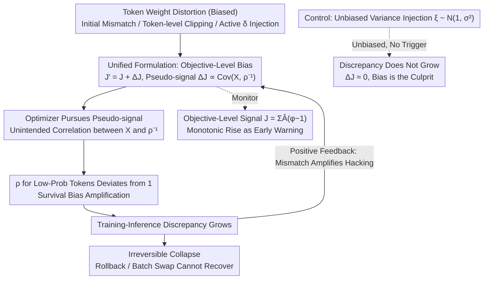

# Probing RLVR Training Instability through the Lens of Objective-Level Hacking

**Conference**: ICML 2026  
**arXiv**: [2602.01103](https://arxiv.org/abs/2602.01103)  
**Code**: None  
**Area**: LLM Alignment / RLHF / RL Training Stability / MoE  
**Keywords**: RLVR, GRPO, MoE, Training-Inference Mismatch, Objective-Level Hacking

## TL;DR
The authors propose an "objective-level hacking" framework, attributing the phenomenon where the training-inference discrepancy of MoE models increasingly grows during RLVR to biased pseudo-signals introduced by token-level weight distortions in the optimization objective. They verify through four sets of experiments on a 30B MoE that "bias (not variance) is the culprit."

## Background & Motivation

**Background**: RLVR (Reinforcement Learning from Verifiable Rewards, represented by algorithms like GRPO/DAPO/GSPO) has become the core post-training paradigm behind reasoning models such as OpenAI o1 and DeepSeek-R1, demonstrating stronger generalization and long-term gains in math, code, and Agent tasks compared to SFT.

**Limitations of Prior Work**: Particularly under MoE architectures, RLVR training frequently suffers from crashes—validation performance drops, token entropy collapses, and gradient norms become abnormal. A puzzling byproduct is the continuous growth of *training-inference discrepancy*: the output token probabilities for the same weights under vLLM inference and Megatron training become increasingly inconsistent, even if parameters are synchronized at every step.

**Key Challenge**: This should theoretically be a transient noise caused by "infrastructure numerical precision differences." Why does it grow monotonically and eventually trigger irreversible collapse? Existing patches (TIS, various clip variants, GSPO sequence-level clip) can mitigate it, but the mechanism remains unexplained.

**Goal**: To answer two specific questions—(1) Why does the training-inference discrepancy accumulate and grow instead of remaining constant? (2) Which common techniques (initial discrepancy, token-level clipping, custom token weighting) unknowingly introduce biased signals into the optimization objective?

**Key Insight**: Elevate the concept of "reward hacking" from the verifier to the *objective level*—any fine-tuning of token-level weights is equivalent to adding a $\Delta\mathcal J(\theta)$ term to the original GRPO objective. If this term correlates positively with a pseudo-signal (such as $\rho_{i,t}^{-1}$), the optimization will move toward increasing the discrepancy, forming a positive feedback loop.

**Core Idea**: Use a unified formula $\mathcal J_{\text{dist}}=\mathcal J + \Delta_{\text{dist}}\mathcal J$ to describe the implicit bias introduced by various "token-level weight distortions" on the optimization objective, and prove through active injection experiments that *bias is the key*, while variance-like noise does not trigger collapse.

## Method

### Overall Architecture
The entire paper unfolds around a causal chain: any "token-level weight distortion" (numerical noise from initial mismatch, token-level clipping, or manually injected weighting) superimposes an additional bias term $\Delta\mathcal J(\theta)$ onto the optimization objective of GRPO/GSPO. This bias acts as a pseudo-signal. As the optimizer chases it, the training-inference mismatch of low-probability tokens is widened, which in turn amplifies the pseudo-signal, creating positive feedback until an irreversible collapse occurs. The paper first provides a **theoretical** unified form $\mathcal J_{\text{dist}}=\mathcal J(\theta)+\Delta_{\text{dist}}\mathcal J(\theta)$ for various distortions, and then **experimentally** (Qwen3-30B-A3B MoE, verl + vLLM + Megatron, DAPO-Math-17k) confirms the "bias (not variance) $\Rightarrow$ mismatch growth $\Rightarrow$ collapse" chain through four experiments: initial mismatch/TIS, clip strength scanning, active injection, and unbiased variance controls. The following diagram illustrates this chain:

### Key Designs

**1. Unified Formulation of Objective-Level Hacking: Reducing diverse "training accidents" to a single bias term.** Numerical errors, token-level clipping, and various custom weightings in RLVR seem unrelated, lacking a unified explanation and thus a cure. Starting from the ideal GRPO objective $\mathcal J(\theta)=\mathbb E_{\text{train}}[\sum_{i,t} X_{i,t}(\theta)]$ (where $X_{i,t}=r_{i,t}\hat A_{i,t}/(G|o_i|)$), the paper notes that rollouts are actually sampled from $\pi_{\text{infer}}$ rather than $\pi_{\text{train}}$, making the real objective $\mathcal J'(\theta)=\mathcal J(\theta)+\Delta\mathcal J(\theta)$. A first-order derivation yields the bias term $\Delta\mathcal J(\theta)\simeq \sum_{i,t}\text{Cov}_{\text{train}}(X_{i,t},\rho_{i,t}^{-1})$, where $\rho_{i,t}=\pi_{\text{train}}/\pi_{\text{infer}}$ measures the training-inference discrepancy. Similarly, token-level clip is equivalent to multiplying by a hard weight $\phi_{i,t}\in\{0,1\}$, with the bias written as $\Delta_{\text{clip}}\mathcal J=\mathbb E_{\text{train}}[\sum X_{i,t}(\phi_{i,t}-1)]$. Both merge into the unified form $\mathcal J_{\text{dist}}=\mathcal J+\Delta_{\text{dist}}\mathcal J$. Recognizing that these accidents are effectively "secretly changing weights for certain tokens" allows for testing them using the same injection experiments.

**2. Active Injection Experiments as Causal Probes: Making pseudo-signals "switchable" variables.** Clip strength and mismatch growth are at most correlated, which does not prove causality. The authors chose the sequence-level algorithm GSPO as a base—it does not inherently trigger mismatch growth, making it a clean baseline—and manually multiplied low-probability tokens ($\pi_{\text{train}}<\pi_{\text{low}}=0.1$) by factor $\varphi_{i,t}=\delta$ while keeping others at 1. Scanning $\delta\in\{1.2, 2, 3\}$ is equivalent to explicitly inserting a biased $\Delta_{\text{inj}}\mathcal J=\mathbb E_{\text{train}}[\sum Y_{i,t}(\varphi_{i,t}-1)]$ into the objective. Two controls were also conducted: first, reversing the weighting for low-probability tokens also triggered mismatch growth, showing the root cause is "distortion" itself rather than the direction of weighting; second, injecting unbiased variance noise $\xi_{i,t}\sim\mathcal N(1, \sigma^2)$ led to $\Delta\mathcal J_{\text{var}}\simeq 0$ (as $\xi-1$ is independent of $Y_{i,t}$). This allows "switching" the pseudo-signal: just a 20% weighting ($\delta=1.2$) immediately ignited mismatch, while unbiased variance was completely ineffective. This clean bidirectional causal experiment confirms "bias is the culprit, not variance."

**3. Objective-Level Signal Monitoring + Positive Feedback Loop: Providing a monitorable early warning and explaining why collapse is irreversible.** Hacking is an abstract concept that is hard to see or prevent in engineering. Furthermore, the fact that rolling back checkpoints or changing data batches cannot recover from a collapse has remained unexplained. The paper defines a proxy $J=\sum_{i,t}\hat A_{i,t}(\varphi_{i,t}-1)$ to be plotted in real-time. When the Pearson correlation between $J$ and steps is significantly above 0, it indicates the pseudo-signal is being continuously optimized (monitored in Fig. 6). Mechanistically, $\rho_{i,t}$ for low-probability tokens continuously deviates downward from 1 (due to survival bias), which further amplifies the effective strength of $\Delta\mathcal J$. Thus, "mismatch ⇄ hacking" feeds back into each other, creating an unstoppable loop once started. $J$ therefore serves as an early warning for industrial RLVR: once it rises monotonically, training should stop immediately, rather than waiting for validation performance to crash.

### Loss & Training
No new loss is introduced; instead, existing GRPO/GSPO are reformulated as "weighted objectives." All experiments were run on 4 nodes × 8 A100s, with 128 problems × 16 responses per step, 4 parameter updates, and a response length of 8K. The default GRPO clip was 0.2, and GSPO sequence-level clip was 3e-4/4e-4.

## Key Experimental Results

### Main Results

Discrepancy and validation behavior under different stabilization strategies (summarized from Figures 2, 4, 5):

| Configuration | Discrepancy Growth | Validation | Remarks |
|---|---|---|---|
| GRPO + token clip (vanilla) | Significant rise | Reverse drop | Standard RLVR, poor stability |
| + TIS Correction | Noticeable slowdown | Improvement | Modifies objective only |
| Token clip strong (ε=0.2) | Fastest | Earliest collapse | Strong clip = Strong bias |
| Token clip weak (ε=0.28) | Slower | Better | Weak clip is slightly more stable |
| GSPO (sequence clip) | No growth | Stable | No token-level bias |
| GSPO + injected $\delta=1.2$ | Triggers growth | Degradation | Just 20% weighting triggers it |
| GSPO + variance $\xi\sim\mathcal N(1,\sigma^2)$ | No growth | Stable | Bias is the culprit, not variance |

### Ablation Study

| Question | Design | Key Observation |
|---|---|---|
| Clip intensity vs. discrepancy | Right clip ∈{0.2, 0.24, 0.28} | Stronger clip leads to faster discrepancy growth |
| Bias vs. Variance | Biased vs. Unbiased token weighting | Unbiased variance does not trigger growth (Eq. (22)) |
| Lowering low-prob weights | Symmetric perturbation | Also triggers growth, showing root is "distortion" not "direction" |

### Key Findings
- Token-level clipping, which "feels like it should stabilize training," actually accelerates discrepancy growth in MoE because it is inherently a token-weight distortion, equivalent to injecting a pseudo-signal.
- Discrepancy growth is a *positive feedback* process: hacking causes $\rho$ of low-probability tokens to deviate from 1, and the deviation further amplifies hacking intensity. This is why rollbacks or batch swaps cannot save a collapsed model.
- Sequence-level algorithms (GSPO) are stable on MoE not because the "clip is looser," but because they structurally avoid token-level weight distortion. This provides a specific guideline for future MoE-specific RL algorithm design: *never insert biased weights into the objective that depend on token probabilities*.

## Highlights & Insights
- Horizontally transfers the concept of "reward hacking" to "objective hacking," explaining training-inference mismatch (an "infrastructure bug") as the product of an "algorithm-level biased objective," providing a reproducible mechanistic explanation.
- The active injection experiment design is elegant: using GSPO as a stable base to explicitly toggle $\delta$ and $\sigma$ serves as a clean bidirectional causal experiment.
- Provides a *monitorable* early signal $J=\sum \hat A_{i,t}(\varphi_{i,t}-1)$ for industrial RLVR, rather than relying on post-hoc validation drops for rollback decisions.

## Limitations & Future Work
- Experiments were performed solely on Qwen3-30B-A3B MoE; the strength of conclusions for dense models or other MoE routing strategies is unknown.
- The framework explains "what causes collapse," but not yet "how to automatically debias." A potential direction is integrating importance sampling correction and token weight distortion into a unified objective repair.
- A100 numerical precision is lower than H100, which the authors admit amplifies the initial discrepancy; the triggering threshold for hacking might differ on higher-precision hardware.

## Related Work & Insights
- **vs. DAPO / Dr.GRPO etc.**: These variants modify clip/advantage/length normalization based on experience. This paper provides a unified formula $\mathcal J=\mathcal J+\Delta\mathcal J$ to explain "why these modifications work."
- **vs. GSPO (Zheng 2025)**: GSPO engineeringly discovered that "sequence clip is more stable." This paper provides a mechanistic explanation via objective-level hacking, moving its advantages from "empirical discovery" to "theoretical necessity."
- **vs. TIS (Yao 2025)**: TIS directly applies importance sampling correction to the objective. This paper positions it as a "targeted treatment at the $\Delta\mathcal J$ level" and demonstrates that TIS cannot completely eliminate discrepancy in MoE.

## Rating
- Novelty: ⭐⭐⭐⭐ Proposes objective-level hacking and a unified formula, explaining MoE RLVR collapse mechanisms for the first time.
- Experimental Thoroughness: ⭐⭐⭐⭐ Four sets of experiments on 30B MoE: controls, intensity scanning, active injection, and bias/variance decoupling.
- Writing Quality: ⭐⭐⭐⭐ Clear derivations, intuitive description of the positive feedback loop.
- Value: ⭐⭐⭐⭐ Provides specific guidelines for RLVR algorithm design and monitorable engineering signals.

<!-- RELATED:START -->

## Related Papers

- [\[ICML 2026\] Single-Rollout Hidden-State Dynamics for Training-Free RLVR Data Selection](single-rollout_hidden-state_dynamics_for_training-free_rlvr_data_selection.md)
- [\[ICLR 2026\] Exploration vs Exploitation: Rethinking RLVR through Clipping, Entropy, and Spurious Reward](../../ICLR2026/reinforcement_learning/exploration_vs_exploitation_rethinking_rlvr_through_clipping_entropy_and_spuriou.md)
- [\[ICML 2025\] A Theoretical Study of (Hyper) Self-Attention through the Lens of Interactions: Representation, Training, Generalization](../../ICML2025/reinforcement_learning/a_theoretical_study_of_hyper_self-attention_through_the_lens_of_interactions_rep.md)
- [\[ICML 2026\] How Reasoning Evolves from Post-Training Data: An Empirical Study Using Chess](how_reasoning_evolves_from_post-training_data_an_empirical_study_using_chess.md)
- [\[ICML 2026\] Trajectory-Level Data Augmentation for Offline Reinforcement Learning](trajectory-level_data_augmentation_for_offline_reinforcement_learning.md)

<!-- RELATED:END -->
