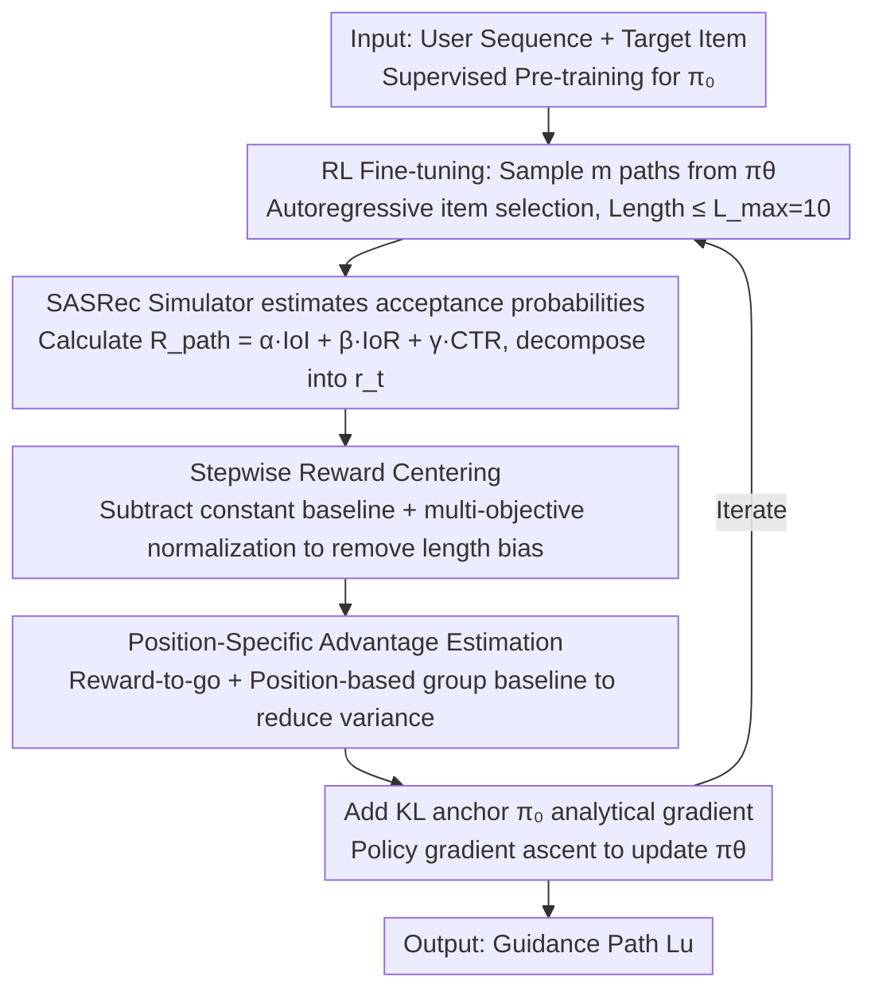

# ProRL: Effective Reinforcement Learning for Proactive Recommendation via Rectified Policy Gradient Estimation

**Conference**: ICML2026  
**arXiv**: [2605.28293](https://arxiv.org/abs/2605.28293)  
**Code**: https://github.com/hongruhou89/ProRL  
**Area**: Reinforcement Learning / Recommender Systems  
**Keywords**: Proactive Recommendation, Policy Gradient, Length Shortcut, Position-Adaptive Advantage, Multi-Objective Reward

## TL;DR
Aiming at the "length shortcut" problem where naive policy gradients collapse into "repetitive paths of equal length" in the proactive recommendation task, this paper theoretically attributes the failure to the positive mean stepwise rewards induced by path-level reward decomposition. The authors propose ProRL: it employs Stepwise Reward Centering to subtract a constant baseline from each step’s expected reward to eliminate length bias, and utilizes Position-Specific Advantage Estimation to reduce variance through GRPO-style group baselines per step position. On three real-world datasets, ProRL consistently outperforms heuristic, supervised, and LLM-based SOTA methods across four metrics: IoI, IoR, CTR, and Coherence.

## Background & Motivation

**Background**: Conventional recommender systems primarily reflect historical user preferences. However, platforms often aim to actively guide users toward specific target items (e.g., new products, exclusive content, or long-tail categories). This has led to the emergence of Proactive Recommender Systems (PRS): given a user interaction sequence $S_u$ and a platform-specified target item $i_T$, the goal is to generate a guidance path $L_u=(i_1,\ldots,i_L)$ composed of $L$ intermediate items. Each step must both be accepted by the user (Path Feasibility, measured by CTR) and substantially increase user interest in the target item (Guidance Effectiveness, measured by IoI and IoR). Existing solutions fall into three categories: heuristics (IPG, ITMPRec) rely on greedy rules and often fall into local optima; LLM-based planning (LLM-IPP, T-PRA) is expensive and difficult to deploy industrially; supervised methods (IRN) imitate historical paths but are restricted by the training distribution and cannot discover better paths.

**Limitations of Prior Work**: Fitting PRS into a reinforcement learning framework seems natural—one could treat the path reward $R_\text{path}=\alpha\cdot\mathrm{IoI}+\beta\cdot\mathrm{IoR}+\gamma\cdot\mathrm{CTR}$ as an observable signal and optimize it using a standard policy gradient estimator $\hat g_\text{std}=\frac{1}{nm}\sum_{i,j}\sum_{t=1}^{L^{(i,j)}}\nabla_\theta\log\pi_\theta^{(i,j,t)}\cdot R^{(i,j)}$. However, empirically, the policy collapses within a few hundred steps, generating nearly identical paths of maximum length $L_\max$ for all users, thereby losing diversity.

**Key Challenge**: The authors decompose this failure into two structural defects. First, the path-level reward naturally decomposes into stepwise increments $r_t:=R(i_1,\ldots,i_t)-R(i_1,\ldots,i_{t-1})$. Experimentally, the expectation $\mathbb E_\pi[r_t]$ for CTR, IoI, and IoR components is consistently positive, causing $\mathbb E[R_\text{path}]$ to grow linearly with path length—this implies that in early training, "extending the path" yields gains faster than "selecting better items," leading to a length shortcut. Theoretically, the authors prove that in a simplified model, the stop probability $p(s)$ monotonically drops to 0 at a rate of $O(1/s)$. Second, the standard estimator weights the log-probability of each step with the full path reward $R^{(i,j)}$. Since the action at step $t$ only affects $r_t,\ldots,r_L$, including $r_1,\ldots,r_{t-1}$ injects irrelevant noise, resulting in high gradient variance.

**Goal**: Within a lightweight transformer framework using supervised pre-training and RL fine-tuning, the goal is to redesign the policy gradient estimator such that (1) the expected gain from extending a path is zero, forcing the model to focus gradients on "selecting high-quality items," and (2) the advantage estimation for each step is unbiased and low-variance.

**Key Insight**: Since the failure stems from the structural property of "non-zero stepwise reward means," the most direct way to eliminate it is *reward centering*—performed stepwise and combined with multi-objective normalization. Since the variance in standard estimation stems from "weighting every step with the global reward," the idea of group baselines from GRPO can be further refined to be *position-specific*.

**Core Idea**: By specializing reward centering and GRPO-style group baselines for the unique structures of PRS—namely "positive stepwise means" and "reward-to-go varying with position"—this paper derives a critic-free, low-variance, and length-unbiased policy gradient estimator.

## Method

### Overall Architecture
ProRL formalizes PRS as an RL problem where an episode consists of multiple discrete selection steps: the policy $\pi_\theta(\cdot\mid S_u,i_T)$ autoregressively generates the next item ID from the vocabulary until an EOS token is output or the length reaches $L_\max=10$. The entire pipeline consists of "Supervised Pre-training $\pi_0 \rightarrow$ Policy Gradient Fine-tuning with ProRL estimator." In each batch, $m$ paths are sampled from $\pi_\theta$, and a SASRec user simulator estimates the acceptance probability of each step. These are combined into a path reward $R_\text{path}=\alpha\cdot\mathrm{IoI}+\beta\cdot\mathrm{IoR}+\gamma\cdot\mathrm{CTR}$ (the three components are normalized as their magnitudes vary significantly). The path reward is decomposed into stepwise rewards and then rectified by two mechanisms. The RL objective function is $J(\theta)=\mathbb E_{L_u\sim\pi_\theta}[R_\text{path}]-\lambda\cdot D_\mathrm{KL}(\pi_\theta\|\pi_0)$, where the KL term anchors $\pi_\theta$ to the pre-trained $\pi_0$ to preserve sequence priors and prevent out-of-distribution search (which also explains why Coherence is improved). The key lies entirely in the estimation of the reward term $\nabla_\theta\mathbb E_{\pi_\theta}[R]$. ProRL addresses the "length shortcut" and "gradient variance" problems using two complementary mechanisms: Stepwise Reward Centering and Position-Specific Advantage Estimation.

### Key Designs

**1. Stepwise Reward Centering (SRC): Making the expected gradient of "adding a step" zero to break the length shortcut**

The diagnosis revealed that the root of the length shortcut is the consistently positive mean of stepwise rewards. In early training, "extending length" earns rewards faster than "improving item quality." SRC addresses this by decomposing the path reward into $R=\sum_t r_t$ and subtracting a global constant baseline $\tilde r_t=r_t-\bar r$ from each step, where $\bar r=\mathbb E_\pi[r_*]$. By construction, $\mathbb E_\pi[\tilde r_t]=0$, so $\mathbb E[\sum_t\tilde r_t]$ no longer increases with $L$. For multi-objective scenarios, this is extended to per-component normalization:

$$\tilde r_t=\sum_{i=1}^K w_i\cdot\frac{r_t^{(i)}-\mu^{(i)}}{\sigma^{(i)}},$$

where $\mu^{(i)},\sigma^{(i)}$ are estimated using rollouts during a warm-up epoch and then **frozen**. A single global baseline is sufficient because the stepwise expectations of the three components are positive and relatively stable. Freezing the statistics prevents the baseline from drifting with the policy, while normalization ensures the multi-objective gradient magnitudes are comparable.

**2. Position-Specific Advantage Estimation (PSAE): Group baselines by step position to reduce variance without a critic**

The standard estimator weights every step with the full path reward $R^{(i,j)}$, but the action at step $t$ only affects future rewards $r_t,\ldots,r_L$. PSAE first uses reward-to-go $G_t^{(i,j)}=\sum_{\ell=t}^{L^{(i,j)}}r_\ell^{(i,j)}$ to exclude irrelevant past rewards. It then applies position-specific group baselines:

$$\bar G_{i,t}=\frac{\sum_{j:L^{(i,j)}\ge t}G_t^{(i,j)}}{\sum_j \mathbb I[L^{(i,j)}\ge t]},\qquad \hat A_t^{(i,j)}=G_t^{(i,j)}-\bar G_{i,t},$$

calculating the average for all rollouts that reach step $t$ for a given input $i$. This yields the rectified estimator $\hat g_\text{rect}=\frac{1}{nm}\sum_{i,j}\sum_{t}\nabla_\theta\log\pi_\theta^{(i,j,t)}\cdot\hat A_t^{(i,j)}$. This is more specialized for PRS than GRPO (which uses a shared baseline $\bar R_i$ for all steps), as reward-to-go naturally decreases as $t$ increases. A position-specific baseline provides a more accurate, zero-mean reference for each step, maintaining unbiasedness while significantly reducing variance.

### Loss & Training
Training occurs in two stages. Pre-training: Cross-entropy on (history, target, path) triplets from historical data to learn $\pi_0$. RL phase: Sample $m$ paths from $\pi_\theta$ per batch. The first epoch estimates $\mu^{(i)},\sigma^{(i)},\bar r$, which are then frozen. Subsequent epochs perform policy gradient ascent using $\hat g_\text{rect}-\lambda\nabla_\theta D_\mathrm{KL}(\pi_\theta\|\pi_0)$. $L_\max=10$. The user simulator is SASRec trained on historical interactions; acceptance probability $P(i\mid S)$ is derived from the SASRec softmax output.

## Key Experimental Results

### Main Results
Testing on three real-world datasets (MovieLens-1M, Steam, Amazon-Book) using SASRec as the evaluator against 9 baselines.

| Dataset | Metric | ProRL | Second-best baseline | Gain |
|--------|------|-------|---------------|------|
| MovieLens-1M | CTR | 0.8543 | IRN 0.8398 | +1.7% |
| MovieLens-1M | IoI | 2.8504 | T-PRA 2.4867 | +14.6% |
| MovieLens-1M | IoR | 728.18 | LLM-IPP 662.52 | +9.9% |
| Steam | CTR | 0.5625 | Bert4Rec 0.4617 | +21.8% |
| Steam | IoI | 1.1188 | T-PRA 0.3339 | +235% |
| Amazon-Book | IoI | 2.9812 | T-PRA 1.7261 | +72.7% |
| Amazon-Book | IoR | 1383.41 | T-PRA 476.93 | +190% |

ProRL also significantly outperforms others on **Coherence** (semantic continuity, hidden from reward), e.g., 0.8422 vs LLM-IPP 0.6288 on ML-1M, indicating it learns high-quality paths rather than reward hacking.

### Ablation Study
Ablation of SRC and PSAE modules on ML-1M:

| Configuration | CTR | IoI | IoR | Explanation |
|------|-----|-----|-----|------|
| Full ProRL | 0.8543 | 2.8504 | 728.18 | Full model |
| w/o SRC | 0.9731 | 1.2373 | 649.96 | CTR is highest but IoI drops by 56%, confirming length shortcut prioritizes clicks over guidance |
| w/o PSAE | 0.7456 | 2.5556 | 695.86 | All metrics drop; PSAE contributes significantly to CTR |

Multi-objective reward ablation: Removing any of CTR, IoI, or IoR leads to a significant decline in the corresponding primary metric, and in some cases, other metrics as well, proving the objectives are mutually reinforcing.

### Key Findings
- The true value of SRC lies in guidance rather than CTR: without SRC, CTR is inflated to 0.97 due to length bias but IoI is halved, showing the length shortcut essentially sacrifices long-term guidance for short-term clicks.
- PSAE has a structural advantage over GRPO’s $\bar R_i$ baseline in PRS: as reward-to-go decreases with steps, position-specific baselines yield lower variance than global baselines (Table 5 reports advantage variance significantly lower than reward-to-go and GRPO).
- Cross-evaluator analysis: ProRL trained on SASRec remains superior when evaluated by unseen models like GRU4Rec, LightSANs, and Bert4Rec (e.g., ML-1M IoI 2.4560 vs T-PRA 2.3167 under GRU4Rec), indicating it learns a generalized guidance strategy rather than over-fitting the reward model.

## Highlights & Insights
- Elevating "training failure" to "structural diagnosis" is a highlight: by decomposing $R=\sum r_t$ and showing $\mathbb E[r_t]>0$, the length shortcut is transformed from an empirical observation to a provable $O(1/s)$ outcome, giving the centering solution a clear target.
- Upgrading GRPO-style group baselines to position-specific ones is a generalizable trick for any task where "rewards are decomposable and per-step semantics vary," such as dialog generation or tool-use planning.
- Freezing warm-up statistics ($\mu,\sigma,\bar r$) is a crucial engineering detail: letting the baseline update alongside the policy can create a feedback loop that traps the improvement.
- The improvement in Coherence (despite not being in the reward) suggests the "reward + KL anchoring" combination naturally prefers semantically coherent paths—an existence proof that PRS can jump out of the training distribution while retaining semantic priors.

## Limitations & Future Work
- The global baseline $\bar r$ approximates all step expectations with a single scalar. The authors acknowledge residual bias for rewards where $\mathbb E[r_t]$ varies significantly with $t$ (like IoR), though position-specific $\bar r_t$ might reduce sample efficiency.
- The user simulator is an offline SASRec model. While cross-evaluator tests mitigate this, the RL is still essentially performed on a simulator; performance in live A/B testing remains unverified.
- SRC fixes length shortcuts for $L_\max=10$, but approximation errors for a global $\bar r$ might accumulate for much longer episodes (e.g., 100 steps).
- The KL anchoring weight $\lambda$ requires tuning; if the KL is too weak, the model loses the $\pi_0$ prior; if too strong, RL degrades to SFT.

## Related Work & Insights
- **vs IRN (Zhu et al., 2023)**: IRN performs direct supervised imitation of historical paths and is limited by the training distribution. ProRL uses the same transformer backbone but uses RL to explore out-of-distribution paths, achieving >65% higher IoI.
- **vs LLM-IPP / T-PRA**: While LLMs are strong planners, they are costly. ProRL uses a small model + RL to surpass them on most metrics, notably increasing IoI from 0.33 to 1.12 on Steam.
- **vs GRPO (Shao et al., 2024)**: GRPO uses a single global baseline $\bar R_i$ per input. PSAE refines this by position $t$ to exploit the structural signal of reward-to-go without needing a critic.
- **vs REINFORCE + baseline (Williams, 1992)**: Classic baselines require a separate critic for $V(s)$; PSAE uses position-wise means from multiple rollouts of the same input, requiring zero additional parameters.

<!-- RELATED:START -->

## Related Papers

- [\[NeurIPS 2025\] On the Global Optimality of Policy Gradient Methods in General Utility Reinforcement Learning](../../NeurIPS2025/reinforcement_learning/on_the_global_optimality_of_policy_gradient_methods_in_general_utility_reinforce.md)
- [\[ICML 2026\] InftyThink+: Effective and Efficient Infinite-Horizon Reasoning via Reinforcement Learning](inftythink_effective_and_efficient_infinite-horizon_reasoning_via_reinforcement_.md)
- [\[NeurIPS 2025\] Robust and Diverse Multi-Agent Learning via Rational Policy Gradient](../../NeurIPS2025/reinforcement_learning/robust_and_diverse_multi-agent_learning_via_rational_policy_gradient.md)
- [\[ACL 2026\] CE-GPPO: Coordinating Entropy via Gradient-Preserving Clipping Policy Optimization in Reinforcement Learning](../../ACL2026/reinforcement_learning/ce-gppo_coordinating_entropy_via_gradient-preserving_clipping_policy_optimizatio.md)
- [\[ICML 2026\] d2: Improving Reasoning in Diffusion Language Models via Trajectory Likelihood Estimation](d2_improving_reasoning_in_diffusion_language_models_via_trajectory_likelihood_es.md)

<!-- RELATED:END -->
