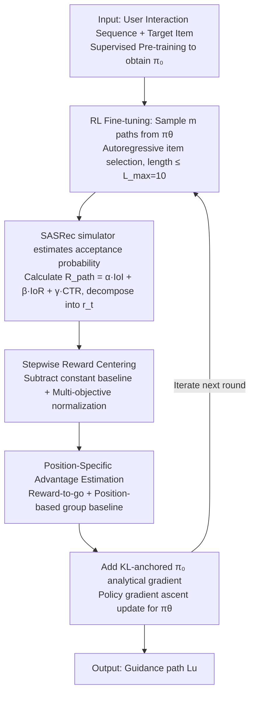

# ProRL: Effective Reinforcement Learning for Proactive Recommendation via Rectified Policy Gradient Estimation

**Conference**: ICML2026  
**arXiv**: [2605.28293](https://arxiv.org/abs/2605.28293)  
**Code**: https://github.com/hongruhou89/ProRL  
**Area**: Reinforcement Learning / Recommender Systems  
**Keywords**: Proactive Recommendation, Policy Gradient, Length Shortcut, Position-Specific Advantage, Multi-Objective Reward

## TL;DR
Addressing the issue where naive policy gradients collapse into "equal-length repetitive paths" in proactive recommendation tasks, the authors theoretically attribute the failure to the "length shortcut" and high variance induced by positive mean stepwise rewards after path-level reward decomposition. They propose ProRL: using Stepwise Reward Centering to subtract a constant baseline from the expected reward at each step to eliminate length bias, and Position-Specific Advantage Estimation to reduce variance via GRPO-style group baselines based on step positions. Experimental results on three real-world datasets show that ProRL outperforms heuristic, supervised, and LLM-based SOTA methods across four metrics: IoI, IoR, CTR, and Coherence.

## Background & Motivation

**Background**: Conventional recommender systems primarily reflect historical user preferences. However, platforms often aim to actively guide users toward a target item (e.g., new products, exclusive content, long-tail categories). This has given rise to Proactive Recommender Systems (PRS): given a user interaction sequence $S_u$ and a platform-specified target item $i_T$, the system generates a guidance path $L_u=(i_1,\ldots,i_L)$ consisting of $L$ intermediate items. Each step must be accepted by the user (Path Feasibility, measured by CTR) and substantially increase the user's interest in the target item (Guidance Effectiveness, measured by IoI and IoR). Existing solutions fall into three categories: heuristics (IPG, ITMPRec) rely on greedy rules and prone to local optima; LLM path planning (LLM-IPP, T-PRA) is expensive and difficult to deploy; supervised methods (IRN) imitate historical paths and are restricted by the training distribution.

**Limitations of Prior Work**: Applying Reinforcement Learning (RL) naturally to PRS seems reasonable—optimizing the path reward $R_\text{path}=\alpha\cdot\mathrm{IoI}+\beta\cdot\mathrm{IoR}+\gamma\cdot\mathrm{CTR}$ as an observable signal using standard policy gradient estimation $\hat g_\text{std}=\frac{1}{nm}\sum_{i,j}\sum_{t=1}^{L^{(i,j)}}\nabla_\theta\log \pi_\theta^{(i,j,t)}\cdot R^{(i,j)}$. Empirically, however, the policy collapses within a few hundred steps into generating nearly identical paths for all users, with lengths hitting the maximum $L_\max$, thus losing diversity.

**Key Challenge**: The authors identify two structural flaws. First, path-level rewards naturally decompose into stepwise increments $r_t:=R(i_1,\ldots,i_t)-R(i_1,\ldots,i_{t-1})$. Experiments show that $\mathbb E_\pi[r_t]$ for CTR, IoI, and IoR components are consistently positive, causing $\mathbb E[R_\text{path}]$ to grow linearly with path length—leading to a "length shortcut" where extending the path yields gains faster than selecting better items. Theoretically, the authors prove that in a simplified model, the stop probability $p(s)$ monotonically drops to 0 at a rate of $O(1/s)$. Second, the standard estimator weights each step's log-probability by the full path reward $R^{(i,j)}$. Since the action at step $t$ only affects $r_t,\ldots,r_L$, including $r_1,\ldots,r_{t-1}$ injects irrelevant noise, resulting in high gradient variance.

**Goal**: Within a lightweight transformer framework using supervised pre-training + RL fine-tuning for PRS, the objective is to redesign the policy gradient estimator such that (1) the expected gain of extending a path is zero, forcing the model to focus on item quality; and (2) the advantage estimation at each step is low-variance and unbiased.

**Key Insight**: Since the failure stems from the structural property of "non-zero stepwise reward mean," the most direct solution is *reward centering*—applied stepwise and combined with multi-objective normalization. Furthermore, since variance comes from global path weighting, the GRPO approach of group baselines can be extended to be *position-specific*.

**Core Idea**: By specializing reward centering and GRPO-style group baselines for the unique PRS structures of "positive stepwise mean" and "position-varying reward-to-go," a critic-free, low-variance, and length-unbiased policy gradient estimator is derived.

## Method

### Overall Architecture
ProRL formalizes PRS as an RL problem where an episode consists of several discrete selection steps: the policy $\pi_\theta(\cdot\mid S_u,i_T)$ autoregressively generates the next item ID from the vocabulary until the EOS token is output or the maximum length $L_\max=10$ is reached. The pipeline consists of "Supervised Pre-training $\pi_0$ → Policy Gradient Fine-tuning with the ProRL estimator." Each batch samples $m$ paths from $\pi_\theta$, calculates acceptance probabilities via a SASRec user simulator to compute $R_\text{path}=\alpha\cdot\mathrm{IoI}+\beta\cdot\mathrm{IoR}+\gamma\cdot\mathrm{CTR}$, decomposes these into stepwise rewards $r_t$, and applies two mechanisms to rectify gradients. The RL objective is $J(\theta)=\mathbb E_{L_u\sim\pi_\theta}[R_\text{path}]-\lambda\cdot D_\mathrm{KL}(\pi_\theta\|\pi_0)$, where the KL term anchors $\pi_\theta$ to $\pi_0$ to preserve sequence priors and prevent out-of-distribution searches. Two independent yet complementary mechanisms, Stepwise Reward Centering and Position-Specific Advantage Estimation, resolve the "length shortcut" and "gradient variance" issues respectively.

### Key Designs

**1. Stepwise Reward Centering (SRC): Breaking the length shortcut by zeroing the expected gain of path extension**

The length shortcut originates from the fact that stepwise reward means are consistently positive. SRC addresses this by decomposing the path reward into $R=\sum_t r_t$ and subtracting a global constant baseline $\tilde r_t=r_t-\bar r$ for each step, where $\bar r=\mathbb E_\pi[r_*]$. By construction, $\mathbb E_\pi[\tilde r_t]=0$, and thus $\mathbb E[\sum_t\tilde r_t]$ no longer grows with $L$. For multi-objective scenarios, this is extended via normalization:

$$\tilde r_t=\sum_{i=1}^K w_i\cdot\frac{r_t^{(i)}-\mu^{(i)}}{\sigma^{(i)}},$$

where $\mu^{(i)},\sigma^{(i)}$ are estimated using rollouts during a warm-up epoch and then **frozen**. A single global baseline suffices because the stepwise expectations are relatively stable. Freezing statistics prevents the baseline from drifting with the policy, while normalization ensures gradient magnitudes are comparable across objectives.

**2. Position-Specific Advantage Estimation (PSAE): Reducing variance via position-based group baselines without a critic**

Standard estimators use the total path reward $R^{(i,j)}$ to weight each step, even though step $t$ only influences $r_t,\ldots,r_L$. PSAE first uses reward-to-go $G_t^{(i,j)}=\sum_{\ell=t}^{L^{(i,j)}}r_\ell^{(i,j)}$ to remove irrelevant past rewards. It then applies a position-specific group baseline:

$$\bar G_{i,t}=\frac{\sum_{j:L^{(i,j)}\ge t}G_t^{(i,j)}}{\sum_j \mathbb I[L^{(i,j)}\ge t]},\qquad \hat A_t^{(i,j)}=G_t^{(i,j)}-\bar G_{i,t},$$

averaging all rollouts that reach step $t$ for a given input $i$. This yields the rectified estimator $\hat g_\text{rect}=\frac{1}{nm}\sum_{i,j}\sum_{t}\nabla_\theta\log\pi_\theta^{(i,j,t)}\cdot\hat A_t^{(i,j)}$. This is more structurally suited to PRS than GRPO’s global path average $\bar R_i$, as reward-to-go naturally decreases as $t$ increases. PSAE remains an unbiased estimator but with significantly lower variance.

### Loss & Training
Training proceeds in two stages. Pre-training: Cross-entropy on (history, target, path) triplets to learn $\pi_0$. RL phase: Sample $m$ paths from $\pi_\theta$ per batch. The first epoch estimates $\mu^{(i)},\sigma^{(i)},\bar r$ via rollouts and freezes them. Subsequent epochs perform policy gradient ascent according to $\hat g_\text{rect}-\lambda\nabla_\theta D_\mathrm{KL}(\pi_\theta\|\pi_0)$. $L_\max$ is set to 10. The user simulator, trained on historical data via SASRec, provides acceptance probabilities $P(i\mid S)$ through its softmax output.

## Key Experimental Results

### Main Results
Evaluation was conducted on three real-world datasets (MovieLens-1M, Steam, Amazon-Book) using SASRec as the evaluator against 9 baselines.

| Dataset | Metric | ProRL | Next Best Baseline | Gain |
|--------|------|-------|---------------|------|
| MovieLens-1M | CTR | 0.8543 | IRN 0.8398 | +1.7% |
| MovieLens-1M | IoI | 2.8504 | T-PRA 2.4867 | +14.6% |
| MovieLens-1M | IoR | 728.18 | LLM-IPP 662.52 | +9.9% |
| Steam | CTR | 0.5625 | Bert4Rec 0.4617 | +21.8% |
| Steam | IoI | 1.1188 | T-PRA 0.3339 | +235% |
| Amazon-Book | IoI | 2.9812 | T-PRA 1.7261 | +72.7% |
| Amazon-Book | IoR | 1383.41 | T-PRA 476.93 | +190% |

ProRL also significantly outperforms others in Coherence (not included in rewards), achieving 0.8422 on MovieLens-1M vs 0.6288 for LLM-IPP, indicating the learning of high-quality paths rather than reward hacking.

### Ablation Study
Ablation on ML-1M for SRC and PSAE modules:

| Configuration | CTR | IoI | IoR | Description |
|------|-----|-----|-----|------|
| Full ProRL | 0.8543 | 2.8504 | 728.18 | Full model |
| w/o SRC | 0.9731 | 1.2373 | 649.96 | Highest CTR but 56% drop in IoI; confirms length shortcut over-optimizes clicks |
| w/o PSAE | 0.7456 | 2.5556 | 695.86 | Decline in all metrics, PSAE contributes significantly to CTR |

Multi-objective reward ablation indicates that removing CTR, IoI, or IoR results in a significant drop in the corresponding metric, proving the objectives reinforce each other.

### Key Findings
- The value of SRC lies in guidance rather than CTR: without SRC, CTR reaches 0.97 due to length bias, but IoI is halved, showing the length shortcut sacrifices long-term guidance for short-term clicks.
- PSAE offers structural advantages over GRPO’s $\bar R_i$ baseline in PRS: position-based baselines yield lower variance than global ones as reward-to-go decays across steps.
- Cross-evaluator analysis: ProRL, trained on SASRec, maintains top performance on IoI/IoR when evaluated with unseen models like GRU4Rec, LightSANs, and Bert4Rec, demonstrating generalization of the guidance policy.

## Highlights & Insights
- The transition from "training failure" to "structural diagnosis" is a highlight: by decomposing $R=\sum r_t$ and empirically finding $\mathbb E[r_t]>0$, the length shortcut is transformed from an empirical observation to a provable $O(1/s)$ result, providing a clear objective for centering.
- Scaling GRPO-style group baselines to position-specific ones is a generalizable trick for tasks where rewards are decomposable and steps have different semantic weight (e.g., dialog, tool-use planning).
- Freezing warm-up statistics ($\mu,\sigma, \bar r$) is a crucial engineering detail: updating baselines alongside the policy risks a feedback loop that stalls improvement.
- The improvement in Coherence despite its absence from rewards suggests the "Reward + KL anchoring" combination naturally prefers semantically coherent paths.

## Limitations & Future Work
- The global baseline $\bar r$ approximates the expectation of all steps with a scalar; a residual bias may exist when $\mathbb E[r_t]$ varies significantly with $t$.
- The evaluation primarily relies on an offline simulator (SASRec); while cross-evaluator experiments help, real-world A/B testing is needed.
- In much longer episodes, the approximation error of the constant $\bar r$ might accumulate, potentially requiring position-specific $\bar r_t$ or critic-based baselines.
- The selection of the KL anchoring weight $\lambda$ is a sensitive hyperparameter; too small loses the prior, too large reduces RL to SFT.

## Related Work & Insights
- **vs IRN**: IRN uses supervised seq2seq imitation of historical paths, limiting exploration; ProRL significantly improves IoI by exploring out-of-distribution paths via RL.
- **vs LLM-IPP / T-PRA**: LLMs are powerful but costly; ProRL uses a small model with RL to outperform them on most metrics, especially Steam's IoI.
- **vs GRPO**: While GRPO uses a single global baseline $\bar R_i$, PSAE differentiates baselines by step $t$ to leverage the structure of reward-to-go.
- **vs Classic REINFORCE + baseline**: Traditional baselines require training a critic $V(s)$; PSAE uses position-based means from multiple rollouts of the same input, requiring zero additional parameters.

<!-- RELATED:START -->

## Related Papers

- [\[ICLR 2026\] Asynchronous Policy Gradient Aggregation for Efficient Distributed Reinforcement Learning](../../ICLR2026/reinforcement_learning/asynchronous_policy_gradient_aggregation_for_efficient_distributed_reinforcement.md)
- [\[ICLR 2026\] Reevaluating Policy Gradient Methods for Imperfect-Information Games](../../ICLR2026/reinforcement_learning/reevaluating_policy_gradient_methods_for_imperfect-information_games.md)
- [\[NeurIPS 2025\] On the Global Optimality of Policy Gradient Methods in General Utility Reinforcement Learning](../../NeurIPS2025/reinforcement_learning/on_the_global_optimality_of_policy_gradient_methods_in_general_utility_reinforce.md)
- [\[ICML 2026\] InftyThink+: Effective and Efficient Infinite-Horizon Reasoning via Reinforcement Learning](inftythink_effective_and_efficient_infinite-horizon_reasoning_via_reinforcement_.md)
- [\[ICLR 2026\] SPG: Sandwiched Policy Gradient for Masked Diffusion Language Models](../../ICLR2026/reinforcement_learning/spg_sandwiched_policy_gradient_for_masked_diffusion_language_models.md)

<!-- RELATED:END -->
