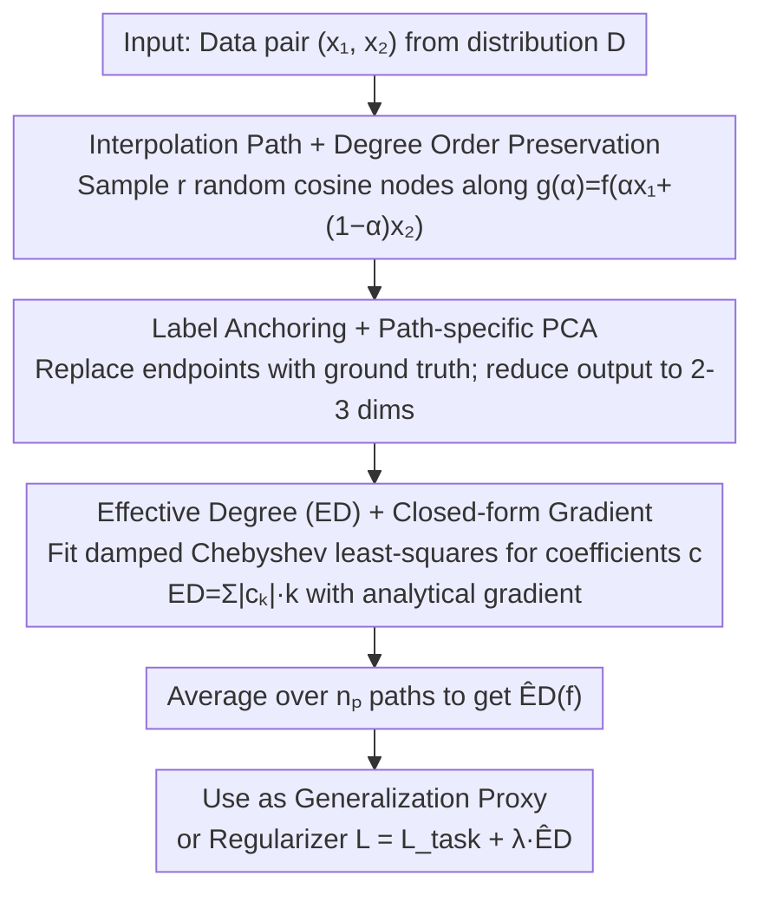

# Quantifying and Optimizing Simplicity via Polynomial Representations

**Conference**: ICML2026  
**arXiv**: [2605.29823](https://arxiv.org/abs/2605.29823)  
**Code**: https://github.com/xinzaixinzai/Effective-Degree  
**Area**: Interpretability  
**Keywords**: Simplicity measure, function space, Chebyshev polynomials, generalization proxy, differentiable regularization  

## TL;DR
The authors propose using "Chebyshev polynomials fitted along data interpolation paths" as a low-dimensional function-space proxy for neural networks. They define "Effective Degree" (ED)—the sum of absolute coefficients weighted by their polynomial orders—as a scalar measure of "how simple a function is." ED predicts the generalization gap on CIFAR-10, ImageNet, and CLIP more accurately than existing proxies like sharpness or parameter $L_2$ norms. Furthermore, the estimation pipeline is differentiable, allowing ED to serve as a "simplicity regularizer" during training, which consistently yields gains across image, text, CLIP fine-tuning, and reinforcement learning tasks.

## Background & Motivation

**Background**: Deep networks are over-parameterized yet generalize well, a phenomenon often explained by "simplicity bias"—the tendency of optimization dynamics to select simple solutions. Several "simplicity/generalization proxies" have been proposed, including max-margin, minimum-norm, informational description length, PAC-Bayes, the number of linear regions in ReLU networks, parameter $L_2$ norms, sharpness, and adaptive sharpness.

**Limitations of Prior Work**: An ideal simplicity measure should satisfy three criteria: (i) universality across tasks and architectures; (ii) scalability to large models; and (iii) differentiability for optimization. Existing measures typically fail at least one of these:

- Max-margin / Minimum-norm: Theoretically sound but mostly restricted to linear or homogeneous models; difficult to extrapolate to deep non-linear models.
- Description length / PAC-Bayes: Universal but difficult to estimate stably and even harder to use as a direct training objective.
- Linear region count: Aligns with expressivity but is highly architecture-dependent and uncomputable at scale.
- Parameter-space metrics (norms, Jacobian, sharpness): Sensitive to re-parameterization and lack stability across architectures; sharpness often anti-correlates with generalization under recipes like mixup.

**Key Challenge**: Simplicity should ideally be a property of the "learned function itself," yet most existing proxies reside in parameter space or rely on specific architectural assumptions. Moreover, most definitions are non-differentiable, preventing their use as direct regularization terms.

**Goal**: (1) Define a simplicity measure directly in the function space; (2) Enable its estimation for large-scale trained models; (3) Ensure end-to-end differentiability to allow its use as a regularization term during training.

**Key Insight**: Expanding polynomials directly in a $d$-dimensional input space leads to a combinatorial explosion of basis functions, $\binom{d+K}{K}$. The authors slice the network into 1D functions along interpolation paths between two data points: $g_{\bm{x}_1,\bm{x}_2}(\alpha)=f(\alpha\bm{x}_1+(1-\alpha)\bm{x}_2)$. They prove that random paths preserve the "degree order" of multivariate polynomials almost everywhere, making 1D proxies sufficient to reflect the non-linearity of the original network.

**Core Idea**: Restrict the network to 1D interpolation paths $\to$ Fit using Chebyshev polynomials $\to$ Use "coefficient $L_1$-weighted degree" as the scalar simplicity measure ED, then estimate the network's ED via path averaging. The entire pipeline is analytically differentiable, enabling it to serve as both a post-hoc measure and a training-time regularizer.

## Method

### Overall Architecture

Given a predictive network $f:\mathbb{R}^d\to\mathbb{R}^{m'}$ and a data distribution $\mathcal{D}$, the pipeline follows five steps:

1. **Interpolation Path Sampling**: Draw a pair $(\bm{x}_1,\bm{x}_2)$ from $\mathcal{D}$ and define $\bm{x}(\alpha)=\alpha\bm{x}_1+(1-\alpha)\bm{x}_2$ for $\alpha\in[0,1]$.
2. **Node Sampling**: Sample $r$ "random cosine nodes" $\alpha_i=\tfrac{1}{2}(1-\cos\theta_i)$ on $\alpha$, where $\theta_i\sim U[(i-1)\pi/r,i\pi/r]$, equivalent to stratified randomization over the Chebyshev measure.
3. **Output Dimensionality Reduction**: Perform path-specific Principal Component Analysis (PCA) on the outputs $\{f(\bm{x}(\alpha_i))\}$, retaining the top $m$ dimensions (typically $m=2,3$) to simplify multi-output fitting into low-dimensional scalar sequences.
4. **Chebyshev Least-Squares Fitting**: For each PCA dimension, fit $P(\alpha)=\sum_{k=0}^K c_k T_k(2\alpha-1)$ by solving the damped normal equation $(\bm{T}^\top\bm{T}+\epsilon\bm{I})\bm{c}_\epsilon=\bm{T}^\top\bm{y}$ to ensure numerical stability.
5. **ED Calculation & Averaging**: Calculate $\mathrm{ED}(P)=\sum_k|c_k|\cdot k$ and average across PCA dimensions. The final $\widehat{\mathrm{ED}}(f)=\mathbb{E}_{\bm{x}_1,\bm{x}_2\sim\mathcal{D}}[\mathrm{ED}(P_{\bm{x}_1,\bm{x}_2})]$, estimated during training via empirical means over $n_p$ paths per minibatch.

The vertical flow of this pipeline is illustrated below:

### Key Designs

**1. Interpolation Path + Degree Order Preservation: Reducing high-dimensional polynomial simplicity to 1D fitting to bypass the $\binom{d+K}{K}$ explosion.**

Expanding polynomial basis functions directly in the $d$-dimensional input space is unscalable due to the $\binom{d+K}{K}$ complexity. The authors slice the network along a 1D interpolation path $g_{\bm{x}_1,\bm{x}_2}(\alpha)=f(\bm{x}(\alpha))$ and define complexity on this 1D function. To ensure no information is lost by the "reduction in degree upon projection," they provide Theorem 3.1: For any two polynomials $P_1, P_2$ with degrees $D_1 > D_2$, the empirical mean of degrees $\widehat{d}_n(P_i)$ sampled from $n$ i.i.d. paths almost surely satisfies $\widehat{d}_n(P_1) > \widehat{d}_n(P_2)$ as $n$ grows. The proof leverages the lemma that the zero set of a non-zero polynomial has Lebesgue measure zero—random interpolation directions will almost never hit the zero set that causes a drop in degree. Interpolation paths provide 1D slices near the data manifold, preserving distribution relevance while compressing estimation into 1D least squares.

**2. Label-anchored ED + Path-specific PCA: Pre-processing path outputs to prevent simplicity regularization from conflicting with classification goals and to handle high-dimensional outputs.**

Before fitting the polynomial, two issues in classification tasks must be addressed. First, cross-entropy encourages predictions to stay away from the uniform distribution, while simplicity regularization penalizes "excessive non-linearity" along the path. These can conflict during early training. Label-anchored ED addresses this by replacing the model's predictions at endpoints ($\theta_1=0, \theta_r=\pi$) with ground-truth one-hot labels, forcing the polynomial to pass through the real endpoints. This allows high-curvature transitions at the ends while penalizing only redundant non-linearity within the path. Second, to handle high-dimensional outputs (e.g., 1000-class logits), path-specific PCA is used: each path is independently projected into $m=2,3$ dimensions before fitting, with gradients propagated back through the PCA decomposition. Endpoints are anchored because "correctly classifying endpoints" is a hard task constraint that should not be flattened by simplicity penalties.

**3. Effective Degree (ED) + Closed-form Gradient: Compressing polynomial coefficients into a scalar while ensuring end-to-end differentiability.**

After fitting Chebyshev coefficients, they must be compressed into a scalar for training. The arithmetic degree $\deg(P)$ is discrete and sensitive to noise, making it unsuitable for optimization. The authors use $\mathrm{ED}(P)=\sum_k|c_k|\cdot k$, which acts as a degree weighted by the absolute value of coefficients. This is equivalent to an $\ell_1$-style constraint on coefficients, aligning with Rademacher complexity where low-dimensional representations provide tighter capacity control. Differentiability is provided by Proposition 5.1 with the analytical gradient $\partial \mathrm{ED}/\partial\bm{y}=\bm{T}(\bm{T}^\top\bm{T})^{-1}(\mathrm{sign}(\bm{c})\odot\bm{d})$, where $\bm{d}=[0,\dots,K]^\top$ and $\bm{T}_{i,k}=T_k(2\alpha_i-1)$. In practice, the damped system $\bm{c}_\epsilon=\texttt{LinearSolve}(\bm{T}^\top\bm{T}+\epsilon\bm{I},\bm{T}^\top\bm{y})$ is solved using PyTorch's LU solver for stability. The $\ell_1$ weighting ensures Lipschitz continuity against coefficient perturbations, makes the gradient naturally scale-invariant, and allows stable backpropagation even in ill-conditioned high-order fitting.

### Loss & Training

The total objective is $\mathcal{L}(\theta;\mathcal{B})=\mathcal{L}_{\text{task}}(\theta;\mathcal{B})+\lambda\,\widehat{\mathrm{ED}}_{\mathcal{B}}$. Hyperparameters include path count $n_p$, node count $r$, polynomial degree $K$, damping $\epsilon$, and regularization strength $\lambda$. A set of "robust defaults" was identified on CIFAR-10. For text tasks, interpolation is performed in the embedding space. For multi-modal/CLIP fine-tuning, interpolation occurs on image inputs. In RL, only the actor network's ED is penalized.

## Key Experimental Results

### Main Results

| Task / Model | Baseline | SAM | ASAM | Jacobian | Mixup | **+ ED (Ours)** |
|------|-------|-----|------|----------|-------|---------|
| CIFAR-10, ViT-Tiny (Top-1 %, 3 seeds) | 87.80 ± 1.17 | 87.85 ± 1.27 | 87.85 ± 1.24 | 87.81 ± 0.17 | 88.83 ± 1.48 | **90.82 ± 0.11** |
| ImageNet, ViT-S/16 (Original recipe) | 71.37 ± 0.17 | — | — | — | — | **72.76 ± 0.16** |
| ImageNet, ViT-S/16 (Strong recipe) | 74.42 ± 0.13 | — | — | — | — | **75.01 ± 0.11** |
| CLIP ViT-B/32 ImageNet ID | 76.20 ± 0.02 | — | — | — | — | **77.14 ± 0.05** |
| CLIP ViT-B/32 OOD Average (5 shifts) | 44.04 ± 0.08 | — | — | — | — | **45.31 ± 0.08** |
| CLIP ViT-B/16 ImageNet ID | 81.35 ± 0.11 | — | — | — | — | **82.19 ± 0.03** |
| CLIP ViT-B/16 OOD Average (5 shifts) | 53.69 ± 0.04 | — | — | — | — | **55.29 ± 0.14** |

Consistently positive across modalities/tasks: ViT-Tiny on CIFAR-10 improves by +3.0 points over the baseline with ED, outperforming SAM/ASAM/Jacobian/Mixup. In CLIP fine-tuning, both ID and five OOD shifts (ImageNetV2/R/A/Sketch/ObjectNet) improve simultaneously. BERT-base on RTE/MRPC/CoLA also outperforms the mixup baseline. On the Procgen benchmark, PPO with ED improves generalization across Dodgeball, Fruitbot, Jumper, and StarPilot environments.

### Ablation Study

| Design Option | Effect / Conclusion |
|-------|------|
| Replacing interpolation paths with random noise | Correlation with generalization weakens; regularization effect drops, showing "near the data manifold" is key. |
| Chebyshev vs. Legendre bases | Similar performance; ED is insensitive to the specific choice of orthogonal basis. |
| Random cosine vs. fixed Chebyshev vs. uniform sampling | Uniform sampling is significantly unstable for high $K$; random cosine is most stable. |
| PCA to 2/3 dims vs. full output | Works without PCA; PCA is an efficiency optimization rather than a performance driver. |
| ED w/o Label Anchoring (LA) | Slightly lower than ED with LA (90.00 vs. 90.82 on ViT-Tiny) but still outperforms other regularizers. |
| Correlation with sharpness/$L_2$ | Pearson correlation between ED and generalization gap is strongest on ResNet18/CIFAR-10 and CLIP. Sharpness reverses direction under mixup. |

### Key Findings

- **ED is a robust generalization proxy**: Across ResNet18 and ViT-Tiny, and 27 sets of hyperparams, the Pearson correlation between ED and the generalization gap is significantly stronger than sharpness, ASAM, or $L_2$ norm. In grokking experiments, only ED exhibits a clear peak followed by a drop near the validation loss "sudden drop" point.
- **Regularization gains stem from measurement accuracy**: The fact that ED is both predictive and optimizable validates the "function-space simplicity $\to$ generalization" hypothesis.
- **Cross-modal universality**: Benefits across image (CIFAR-10/ImageNet), text (GLUE), vision-language (CLIP), and RL (Procgen) suggest that penalizing high-order non-linearity is a relatively model-agnostic inductive bias.
- **Failure Mode**: The appendix notes that ED may fail in shortcut learning scenarios where simple features are exploitable but do not aid robust generalization; in such cases, ED may actually reinforce the shortcut.

## Highlights & Insights

- **The combination of "function-space metric + closed-form differentiability" is key**: Previous function-space metrics were either uncomputable (PAC-Bayes, description length) or non-optimizable (linear regions). By using 1D interpolation paths and Chebyshev bases, this work converts estimation into a small-matrix linear problem and achieves end-to-end measurement-to-regularization.
- **"Path anchoring" provides distribution relevance**: Traditional sharpness involves random perturbations in parameter space, independent of data. ED binds the measure to the data distribution via interpolation paths, ensuring consistency across different training recipes (like mixup). This is particularly valuable for CLIP fine-tuning where recipes significantly shift index distributions.
- **Label-anchored ED as a clever engineering compromise**: By explicitly recognizing that classification tasks must separate endpoints, it restricts simplicity penalties to "redundant non-linearity within the path." This distinction between necessary and unnecessary non-linearity could be generalized to other tasks like contrastive learning.

## Limitations & Future Work

- **Stated Limitations**: Theoretical gaps remain regarding which specific classes of function-space simplicity are captured by path-based polynomial proxies beyond Theorem 3.1. Failure modes occur in shortcut learning scenarios.
- **Self-identified Limitations**: (i) Computational overhead is non-trivial, requiring $n_p$ paths $\times$ $r$ nodes of forward passes per minibatch; (ii) The requirement for continuous interpolation limits direct application to discrete inputs like graphs or molecular structures without embedding; (iii) Coupling between $K, r, m$ lacks a theoretical guideline and currently relies on "robust defaults."
- **Future Directions**: (1) Adaptive path lengths (extending beyond $[0,1]$); (2) Coupling ED with mixup data augmentation; (3) Orthogonal combinations with sharpness-aware training.

## Related Work & Insights

- **vs. SAM / ASAM (Foret 2021; Kwon 2021)**: SAM penalizes worst-case perturbations in parameter space and is sensitive to re-parameterization. ED measures function-space complexity and is more robust across recipes.
- **vs. Jacobian regularization (Hoffman 2019)**: Jacobian regularization only controls local first-order sensitivity (slope). ED captures the global high-order non-linearity along a path, including curvature information invisible to the Jacobian.
- **vs. Mixup (Zhang 2018)**: Mixup enforces "interpolated input $\to$ interpolated label," which can be too rigid for text. ED only estimates complexity along the path without imposing synthetic labels, performing better on BERT/GLUE.
- **vs. PAC-Bayes / Compression (Dziugaite-Roy 2017; Arora 2018)**: These methods focus on formal upper bounds that are often vacuous and cannot be used as direct training objectives. ED lacks theoretical bounds but offers strong empirical performance and differentiability.

## Rating
- Novelty: ⭐⭐⭐⭐ The "path-based polynomial proxy + closed-form gradient ED" framework is a clean, practical bridge between theory and engineering.
- Experimental Thoroughness: ⭐⭐⭐⭐⭐ Coverage across images, text, CLIP, and RL, including grokking, OOD shifts, and failure mode analysis, is exhaustive.
- Writing Quality: ⭐⭐⭐⭐ Clear derivation chain (preservation theorem $\to$ differentiability $\to$ damped implementation $\to$ anchoring).
- Value: ⭐⭐⭐⭐⭐ Offers a rare generalization proxy that outperforms sharpness and serves as a near maintenance-free universal regularizer.

<!-- RELATED:START -->

## Related Papers

- [\[NeurIPS 2025\] Quantifying Generalisation in Imitation Learning](../../NeurIPS2025/reinforcement_learning/quantifying_generalisation_in_imitation_learning.md)
- [\[ICML 2026\] Can Large Language Models Generalize Procedures Across Representations?](can_large_language_models_generalize_procedures_across_representations.md)
- [\[ICML 2026\] Laplacian Representations for Decision-Time Planning](laplacian_representations_for_decision-time_planning.md)
- [\[ICLR 2026\] Dual Goal Representations](../../ICLR2026/reinforcement_learning/dual_goal_representations.md)
- [\[ACL 2026\] The Stackelberg Speaker: Optimizing Persuasive Communication in Social Deduction Games](../../ACL2026/reinforcement_learning/the_stackelberg_speaker_optimizing_persuasive_communication_in_social_deduction_.md)

<!-- RELATED:END -->
