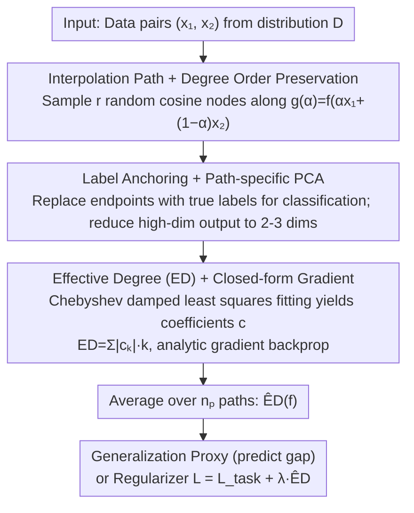

# Quantifying and Optimizing Simplicity via Polynomial Representations

**Conference**: ICML2026  
**arXiv**: [2605.29823](https://arxiv.org/abs/2605.29823)  
**Code**: https://github.com/xinzaixinzai/Effective-Degree  
**Area**: Interpretability  
**Keywords**: Simplicity Measure, Function Space, Chebyshev Polynomials, Generalization Proxy, Differentiable Regularization  

## TL;DR
The authors propose using "fitting Chebyshev polynomials along data interpolation paths" as a low-dimensional function space proxy for neural networks. They define **Effective Degree** (ED)—calculated as the sum of absolute values of coefficients weighted by the polynomial order—as a scalar measure of "how simple a function is." ED predicts the generalization gap on CIFAR-10/ImageNet/CLIP more accurately than known proxies like sharpness or parameter $L_2$ norm. Furthermore, the entire estimation pipeline is differentiable, allowing it to serve directly as a "simplicity regularizer" during training, which consistently yields gains across image, text, CLIP fine-tuning, and reinforcement learning tasks.

## Background & Motivation

**Background**: Deep networks are over-parameterized yet generalize well, a phenomenon often explained by "simplicity bias"—the tendency of optimization dynamics to select simple solutions. Various "simplicity/generalization proxies" have been proposed, including max-margin, minimum-norm, information-theoretic description length, PAC-Bayes, number of linear regions in ReLU networks, parameter $L_2$ norm, sharpness, and adaptive sharpness.

**Limitations of Prior Work**: A robust simplicity measure should satisfy three criteria: (i) generality across tasks/architectures; (ii) computability at scale; and (iii) differentiability for optimization. Existing measures typically only satisfy one or two:

- Max-margin / Min-norm: Theoretically sound but only valid for linear/homogeneous models; difficult to extrapolate to deep non-linear models.
- Description length / PAC-Bayes: General but difficult to estimate stably, and hard to use as a direct training objective.
- Number of linear regions: Aligns with expressivity but is highly architecture-dependent and uncomputable at scale.
- Parameter space measures (norms, Jacobian, sharpness): Sensitive to re-parameterization and show poor stability across architectures; sharpness often anti-correlates with generalization under recipes like Mixup.

**Key Challenge**: Simplicity should be an inherent property of the "learned function itself," yet most existing proxies reside in parameter space or rely on architectural assumptions. Moreover, most definitions are non-differentiable, preventing direct optimization as a regularizer.

**Goal**: (1) Provide a simplicity measure defined directly in function space; (2) ensure it is computable for large-scale trained models; and (3) make it end-to-end differentiable for use as a regularization term.

**Key Insight**: Expanding polynomials directly in a $d$-dimensional input space leads to a combinatorial explosion of basis functions $\binom{d+K}{K}$. The authors instead slice the network into 1D functions along interpolation paths between two data points, $g_{\bm{x}_1,\bm{x}_2}(\alpha)=f(\alpha\bm{x}_1+(1-\alpha)\bm{x}_2)$, and perform polynomial fitting. They prove that random paths almost everywhere preserve the "degree order" of multivariate polynomials, meaning 1D proxies are sufficient to reflect the non-linearity of the original network.

**Core Idea**: Restrict the network to 1D interpolation paths $\rightarrow$ fit with Chebyshev polynomials $\rightarrow$ use "coefficients weighted by order ($L_1$)" as the scalar simplicity measure ED, then estimate the global ED via path averaging. The entire process is closed-form differentiable, serving as both a post-hoc measure and a training regularizer.

## Method

### Overall Architecture

Given a predictive network $f:\mathbb{R}^d\to\mathbb{R}^{m'}$ and data distribution $\mathcal{D}$, the pipeline follows five steps:

1.  **Path Sampling**: Draw a pair $\bm{x}_1,\bm{x}_2$ from $\mathcal{D}$, defining $\bm{x}(\alpha)=\alpha\bm{x}_1+(1-\alpha)\bm{x}_2$ for $\alpha\in[0,1]$.
2.  **Node Sampling**: Sample $r$ "stochastic cosine nodes" $\alpha_i=\tfrac{1}{2}(1-\cos\theta_i)$ on $\alpha$, where $\theta_i\sim U[(i-1)\pi/r,i\pi/r]$, equivalent to stratified randomization over the Chebyshev measure.
3.  **Dimensionality Reduction**: Apply path-specific PCA to outputs $\{f(\bm{x}(\alpha_i))\}$ along the path, retaining the top $m$ dimensions (typically $m=2,3$), simplifying multi-output polynomial fitting into low-dimensional scalar sequences.
4.  **Chebyshev Least Squares Fitting**: For each PCA dimension, fit $P(\alpha)=\sum_{k=0}^K c_k T_k(2\alpha-1)$, solving the damped normal equations $(\bm{T}^\top\bm{T}+\epsilon\bm{I})\bm{c}_\epsilon=\bm{T}^\top\bm{y}$ for numerical stability.
5.  **ED Calculation & Averaging**: $\mathrm{ED}(P)=\sum_k|c_k|\cdot k$, averaged across output dimensions. The final $\widehat{\mathrm{ED}}(f)=\mathbb{E}_{\bm{x}_1,\bm{x}_2\sim\mathcal{D}}[\mathrm{ED}(P_{\bm{x}_1,\bm{x}_2})]$ is estimated during training using the empirical mean across $n_p$ path pairs in a minibatch.

The flow of this pipeline corresponds to the following key designs:

### Key Designs

**1. Interpolation Paths + Degree Preservation Theorem: Reducing high-dimensional polynomial simplicity to 1D fitting to bypass the $\binom{d+K}{K}$ combinatorial explosion**

Expanding polynomial basis functions directly in the $d$-dimensional input space is unscalable. The authors restrict the network to a 1D interpolation path between two data points $g_{\bm{x}_1,\bm{x}_2}(\alpha)=f(\bm{x}(\alpha))$ and define complexity on this 1D function. To ensure information is not lost during projection, Theorem 3.1 states: for any two non-zero polynomials $P_1, P_2$ with degrees $D_1 > D_2$, the empirical mean degree $\widehat{d}_n(P_1) > \widehat{d}_n(P_2)$ almost surely holds for large $n$ when paths are drawn i.i.d. The proof utilizes the lemma that the zero set of a non-zero polynomial has Lebesgue measure zero—random interpolation directions almost certainly avoid the zero set that would cause a degree drop. Interpolation paths provide "1D slices near the data manifold," preserving distributional relevance while reducing estimation to 1D least squares.

**2. Label-anchored ED + Path-specific PCA: Refining path outputs before fitting to prevent conflict with objectives and handle high dimensionality**

Before polynomial fitting, two issues in classification must be addressed. First, cross-entropy encourages predictions to shift quickly away from uniform distributions, while simplicity regularization penalizes "excessive non-linearity" along the path. These can conflict in early training. **Label-anchored ED** replaces endpoint predictions with true one-hot labels during fitting (fixing $\theta_1=0, \theta_r=\pi$, sampling $r-2$ middle nodes), forcing the polynomial to pass through true labels. This allows high curvature near endpoints while penalizing redundant non-linearity inside the path. Second, for high-dimensional outputs (e.g., 1000-class logits), fitting each dimension is costly. **Path-specific PCA** projects the $r$ outputs of each individual path into $m=2,3$ dimensions before fitting, with gradients back-propagated through the PCA decomposition. Endpoints are anchored because correct classification is a task constraint; path-specific PCA is used as it remains robust even with high statistical noise.

**3. Effective Degree (ED) + Closed-form Gradients: Compressing polynomial coefficients into a scalar and ensuring differentiability**

The final step is compressing the Chebyshev coefficients into a scalar training target. The arithmetic degree $\deg(P)$ is discrete and sensitive to small perturbations, making it unsuitable for optimization. The authors use $\mathrm{ED}(P)=\sum_k|c_k|\cdot k$—essentially a weight-degree product using the $L_1$ norm of coefficients. This is equivalent to an $\ell_1$-style constraint, aligning with the idea that low-dimensional coefficient representations yield tighter Rademacher complexity capacity control. Differentiability is provided by Proposition 5.1 via the analytic gradient $\partial \mathrm{ED}/\partial\bm{y}=\bm{T}(\bm{T}^\top\bm{T})^{-1}(\mathrm{sign}(\bm{c})\odot\bm{d})$, where $\bm{d}=[0,\dots,K]^\top$ and $\bm{T}_{i,k}=T_k(2\alpha_i-1)$. Numerical stability is ensured by solving the damped system $\bm{c}_\epsilon=\texttt{LinearSolve}(\bm{T}^\top\bm{T}+\epsilon\bm{I},\bm{T}^\top\bm{y})$ using autograd-compatible solvers.

### Loss & Training

The total objective is $\mathcal{L}(\theta;\mathcal{B})=\mathcal{L}_{\text{task}}(\theta;\mathcal{B})+\lambda\,\widehat{\mathrm{ED}}_{\mathcal{B}}$. Hyperparameters include path count $n_p$, nodes $r$, polynomial degree $K$, damping $\epsilon$, and regularization strength $\lambda$. Text tasks perform interpolation in embedding space; multi-modal/CLIP fine-tuning interpolates image inputs; RL penalizes the actor network.

## Key Experimental Results

### Main Results

| Task / Model | Baseline | SAM | ASAM | Jacobian | Mixup | **+ ED (Ours)** |
|------|-------|-----|------|----------|-------|---------|
| CIFAR-10, ViT-Tiny (Top-1 %, 3 seeds) | 87.80 ± 1.17 | 87.85 ± 1.27 | 87.85 ± 1.24 | 87.81 ± 0.17 | 88.83 ± 1.48 | **90.82 ± 0.11** |
| ImageNet, ViT-S/16 (Original recipe) | 71.37 ± 0.17 | — | — | — | — | **72.76 ± 0.16** |
| ImageNet, ViT-S/16 (Strong recipe) | 74.42 ± 0.13 | — | — | — | — | **75.01 ± 0.11** |
| CLIP ViT-B/32 ImageNet ID | 76.20 ± 0.02 | — | — | — | — | **77.14 ± 0.05** |
| CLIP ViT-B/32 OOD Avg (5 shifts) | 44.04 ± 0.08 | — | — | — | — | **45.31 ± 0.08** |
| CLIP ViT-B/16 ImageNet ID | 81.35 ± 0.11 | — | — | — | — | **82.19 ± 0.03** |
| CLIP ViT-B/16 OOD Avg (5 shifts) | 53.69 ± 0.04 | — | — | — | — | **55.29 ± 0.14** |

Consistent gains across modalities: ViT-Tiny on CIFAR-10 improves by +3.0 points over baseline with ED, outperforming SAM/ASAM/Jacobian/Mixup. In CLIP fine-tuning, both ID and five OOD shifts show simultaneous improvement. PPO with ED improves generalization in four Procgen environments (unseen level performance increases by +1 to several points).

### Ablation Study

| Design Option | Function / Conclusion |
|-------|------|
| Replacing interp. paths with random noise | Weakens correlation between ED and generalization, degrading regularization |
| Chebyshev vs. Legendre basis | Results are similar; ED is insensitive to the choice of orthogonal basis |
| Sample: Random Cosine vs. Fixed vs. Uniform | Uniform sampling is unstable when $K$ is large; random cosine is most stable |
| PCA to 2/3 dims vs. Full-dim output | Works without PCA; PCA decreases overhead rather than being the primary gain driver |
| ED w/o Label Anchoring (LA) | Slightly lower than ED with LA (90.00 vs 90.82) but still superior to other methods |
| Correlation with Sharpness/$L_2$ | ED has the strongest Pearson correlation with generalization gap; sharpness reverses under Mixup |

### Key Findings

- **ED is the most stable generalization proxy**: Across ResNet18 and ViT-Tiny, and 27 hyperparameter sets, ED's Pearson correlation with the generalization gap is significantly stronger than sharpness, adaptive sharpness, or $L_2$ norm.
- **Regularization gains stem from measure accuracy**: The fact that ED both predicts and optimizes well confirms the link between "function space simplicity" and "generalization."
- **Cross-modal universality**: Gains are observed in Vision (CIFAR/ImageNet), Text (GLUE), Vision-Language (CLIP), and RL (Procgen), suggesting "penalizing high-order non-linearity" is a model-agnostic inductive bias.
- **Failure Modes**: ED may fail in shortcut learning scenarios where simple features are exploitable but do not support robust generalization.

## Highlights & Insights

- **The combination of "function space measure + closed-form differentiability" is key**: Previous function space measures were either uncomputable (PAC-Bayes) or non-differentiable (linear regions). This work uses 1D paths and Chebyshev bases to turn estimation into a small-scale linear solve, enabling end-to-end optimization.
- **"Path anchoring" provides data dependence**: Unlike parameter-space sharpness (data-agnostic), ED is naturally bound to the data distribution via interpolation paths. This makes it consistent across training recipes like Mixup where sharpness-based metrics often fail.
- **Label-anchored ED is an elegant compromise**: By recognizing that classification requires divergence at endpoints, it directs the "simplicity penalty" toward redundant non-linearity within the path rather than the task-essential transitions at boundaries.

## Limitations & Future Work

- **Theoretical gaps**: The extent to which path-based polynomial proxies capture general function space simplicity remains partially unanswered beyond degree preservation (Theorem 3.1). 
- **Computational overhead**: Each minibatch requires $n_p$ paths $\times r$ nodes of forward passes plus matrix solves. While the authors claim this is acceptable, the exact training time increase for ImageNet is not fully detailed.
- **Discrete spaces**: Paths require continuous interpolation. While handled via embeddings for text, applications to structured inputs like graphs are non-trivial.

## Related Work & Insights

- **vs SAM / ASAM (Foret 2021; Kwon 2021)**: SAM penalizes worst-case perturbations in parameter space and is sensitive to re-parameterization; ED measures in function space and is robust across recipes.
- **vs Jacobian Regularization (Hoffman 2019)**: Jacobian reg controls local 1st-order sensitivity; ED captures global high-order non-linearity along paths.
- **vs Mixup (Zhang 2018)**: Mixup enforces linear label interpolation; ED estimates complexity on paths without imposing synthetic labels, often performing better on text where Mixup might be too rigid.

## Rating
- Novelty: ⭐⭐⭐⭐ "Path-based polynomial proxies + closed-form ED" is a clean and practical framework.
- Experimental Thoroughness: ⭐⭐⭐⭐⭐ Covers Vision, Text, CLIP, and RL, including OOD shifts and grokking analysis.
- Writing Quality: ⭐⭐⭐⭐ Clear derivation chain; specific "robust default" values are mostly in the appendix.
- Value: ⭐⭐⭐⭐⭐ A rare generalization proxy that consistently beats sharpness and serves as a near maintenance-free universal regularizer.

<!-- RELATED:START -->

## Related Papers

- [\[ICML 2026\] Can Large Language Models Generalize Procedures Across Representations?](can_large_language_models_generalize_procedures_across_representations.md)
- [\[ICML 2026\] Laplacian Representations for Decision-Time Planning](laplacian_representations_for_decision-time_planning.md)
- [\[NeurIPS 2025\] Quantifying Generalisation in Imitation Learning](../../NeurIPS2025/reinforcement_learning/quantifying_generalisation_in_imitation_learning.md)
- [\[ICLR 2026\] Dual Goal Representations](../../ICLR2026/reinforcement_learning/dual_goal_representations.md)
- [\[ICML 2026\] DR.Q: Debiased Model-based Representations for Sample-efficient Continuous Control](debiased_model-based_representations_for_sample-efficient_continuous_control.md)

<!-- RELATED:END -->
