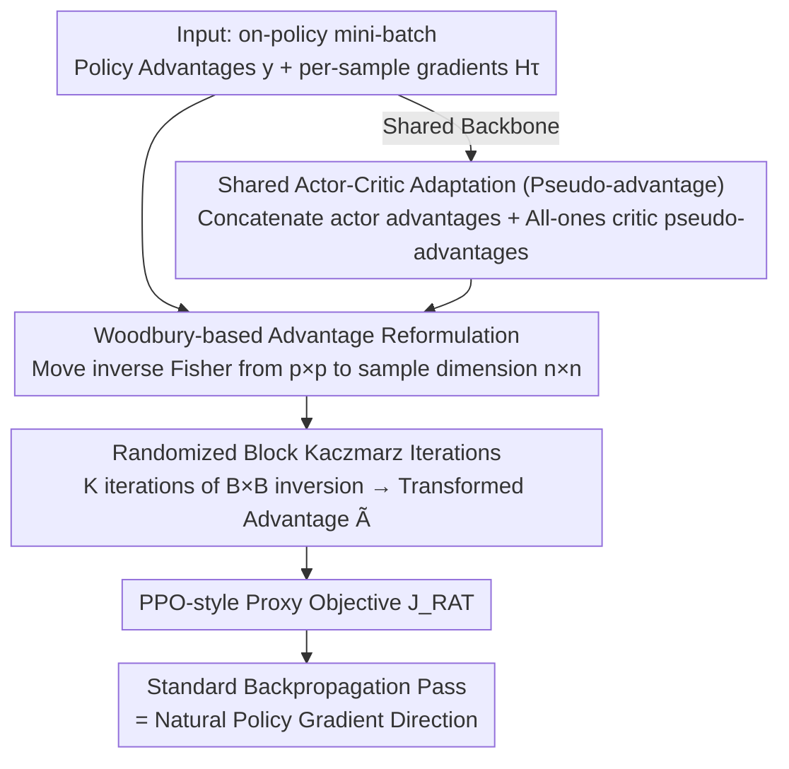

# Randomized Advantage Transformation (RAT): Computing Natural Policy Gradients via Direct Backpropagation

**Conference**: ICML2026  
**arXiv**: [2605.18591](https://arxiv.org/abs/2605.18591)  
**Code**: https://github.com/agent-lab/ICML2026-RAT  
**Area**: Reinforcement Learning  
**Keywords**: Natural Policy Gradient, Woodbury Formula, Kaczmarz Iteration, Advantage Transformation, on-policy RL  

## TL;DR
This work reformulates Tikhonov-regularized Natural Policy Gradient (NPG) as a "standard policy gradient with transformed advantages" via the Woodbury identity. By utilizing Randomized Block Kaczmarz iterations on mini-batches to solve this transformation, the method bypasses explicit Fisher matrix construction, Conjugate Gradient inner loops, and architecture-dependent curvature approximations like KFAC. It computes natural policy gradients using a single standard backpropagation pass, matching or exceeding the performance of TRPO/ACKTR/KFAC on MuJoCo and Procgen benchmarks.

## Background & Motivation

**Background**: Natural Policy Gradient (NPG) achieves parameter-invariant update directions by pre-multiplying the vanilla policy gradient $\nabla^{\text{PG}}_{\bm{\theta}} J$ with the inverse Fisher Information Matrix $\bm{F}^{-1}$. This "geometric correction" serves as the theoretical foundation for TRPO, ACKTR, Natural Actor-Critic, and PPO updates, with theoretical analysis showing it significantly improves convergence.

**Limitations of Prior Work**: The Fisher matrix $\bm{F}\in\mathbb{R}^{p\times p}$ scales with the number of parameters $p$, making explicit construction and inversion infeasible for deep networks. Two main common approaches exist:

- **Hessian-Free + CG** (e.g., TRPO): Converts inversion into Fisher-vector products solved via Conjugate Gradient (CG). This requires dozens of inner iterations per step, incurring high overhead, and is difficult to apply to shared actor-critic architectures.
- **Structural Approximation** (e.g., KFAC): Assumes Fisher is block-diagonal with Kronecker product structures. While faster, it sacrifices accuracy and heavily depends on gradient independence assumptions, requiring derivation-from-scratch for new architectures.

**Key Challenge**: While NPG benefits from Fisher-based gradient rescaling, current implementations either consume excessive time for exact $\bm{F}^{-1}\bm{g}$ computation or sacrifice precision for architecture-dependent approximations. Can the natural gradient be computed solely through "standard backpropagation" without explicit Fisher operations?

**Goal**: (1) Identify a reformulation that makes NPG functionally equivalent to vanilla policy gradient; (2) Develop a scalable finite-sample estimation algorithm for this reformulation; (3) Provide convergence guarantees and validate on large-scale benchmarks.

**Key Insight**: The authors observe that Tikhonov-regularized NPG is equivalent to a weighted least squares problem. By applying the Woodbury identity $(\bm{I}+\bm{U}\bm{V})^{-1}\bm{U}=\bm{U}(\bm{I}+\bm{V}\bm{U})^{-1}$, the matrix inverse can be shifted from the "parameter dimension $p \times p$" to the "sample dimension $n \times n$". In batch RL settings where $B \ll p$, this shift opens a new computational path.

**Core Idea**: Completely "absorb" $\bm{F}^{-1}$ into a transformation of the advantage function $A_\pi(s,a)$. NPG is rewritten as $\bm{H}^\top\bm{\Sigma}\tilde{\bm{y}}$, differing from vanilla PG only by the transformed advantage $\tilde{\bm{y}}=(\lambda\bm{I}_n+\bm{H}\bm{H}^\top\bm{\Sigma})^{-1}\bm{y}$. Randomized Block Kaczmarz is then used to iteratively approximate this transformation on on-policy mini-batches.

## Method

### Overall Architecture

Let $n=|\mathcal{S}||\mathcal{A}|$ be the "sample space dimension," $p=|\bm{\theta}|$ the "parameter dimension," $\bm{H}\in\mathbb{R}^{n\times p}$ have rows $\partial_{\bm{\theta}}\log\pi$, $\bm{y}\in\mathbb{R}^n$ be the advantage vector, and $\bm{\Sigma}$ be the diagonal weighting matrix for $d_\pi(s)\pi(a|s)$. The pipeline consists of three steps:

1.  **Rewrite**: The Tikhonov-regularized NPG $\nabla^{\text{T-NPG}}=(\lambda\bm{I}_p+\bm{H}^\top\bm{\Sigma}\bm{H})^{-1}\bm{H}^\top\bm{\Sigma}\bm{y}$ is transformed via Woodbury identities into $\bm{H}^\top\bm{\Sigma}\tilde{\bm{y}}$, where $\tilde{\bm{y}}=(\lambda\bm{I}_n+\bm{H}\bm{H}^\top\bm{\Sigma})^{-1}\bm{y}$—downsizing the inverse from $p\times p$ to $n\times n$.
2.  **Approximate**: Since $n$ remains large in continuous action spaces, $\bm{\Sigma}$ is approximated via Monte Carlo sampling. Solving for $\tilde{\bm{y}}$ is reformulated as a regularized least squares problem: $\min_{\bm{g}}\|\bm{y}-\bm{H}\bm{g}\|_{\bm{\Sigma}}^2+\lambda\|\bm{g}\|_2^2$.
3.  **Mechanism**: Randomized Block Kaczmarz iterations are applied. For each mini-batch $\tau_j$, a $B\times B$ inversion is performed. After $K$ iterations, the resulting $\tilde{A}_j(s,a)$ is inserted into a PPO-style proxy objective $J_{\text{RAT}}(\bm{\theta})=\mathbb{E}[\frac{\pi(a|s;\bm{\theta})}{\pi_{\text{old}}(a|s)}\tilde{A}_j(s,a)]$. A single standard backpropagation pass then yields the natural policy gradient direction. For shared networks, a critic-side "pseudo-advantage" is introduced to unify actor and critic in the same iteration.

### Key Designs

**1. Woodbury-based Advantage Reformulation: From "Fisher-inverse $\times$ Gradient" to "Gradient $\times$ Transformed Advantage"**

Standard NPG efficiency is limited by inverting the $p\times p$ Fisher matrix. RAT overcomes this by applying the Woodbury identity $(\bm{I}+\bm{U}\bm{V})^{-1}\bm{U}=\bm{U}(\bm{I}+\bm{V}\bm{U})^{-1}$ twice to the Tikhonov-regularized form, shifting the inverse to the sample dimension:

$$\nabla^{\text{T-NPG}}_{\bm{\theta}} J=\bm{H}^\top\bm{\Sigma}\,(\lambda\bm{I}_n+\bm{H}\bm{H}^\top\bm{\Sigma})^{-1}\bm{y}.$$

This denotes a standard policy gradient where the advantage $A_\pi$ is replaced by $\bar{A}_\pi=[(\lambda\bm{I}_n+\bm{H}\bm{H}^\top\bm{\Sigma})^{-1}\bm{y}]_{(s,a)}$. This is efficient because $n \times n$ inversion is controlled when batch sizes are smaller than parameter counts. Furthermore, all curvature information is compressed into a single scalar "advantage," making it compatible with any advantage-based algorithm (PPO, A2C, GAE).

**2. Randomized Block Kaczmarz Iteration: Breaking one $n\times n$ Inverse into $K$ Identical $B\times B$ Inverses**

To handle large $n$ in continuous settings, the method solves for $\tilde{\bm y}$ using regularized least squares $\min_{\bm g}\|\bm y-\bm H\bm g\|_{\bm\Sigma}^2+\lambda\|\bm g\|_2^2$ via Randomized Block Kaczmarz iterations on on-policy mini-batches. Each step takes a mini-batch $\tau_j$ for a regularized projection, with a closed-form proximal solution:

$$\bm{g}_j=\bm{g}_{j-1}+\bm{H}_{\tau_j}^\top\big[(\lambda\bm{I}+\bm{H}_{\tau_j}\bm{H}_{\tau_j}^\top)^{-1}(\bm{y}_{\tau_j}-\bm{H}_{\tau_j}\bm{g}_{j-1})\big].$$

The $B\times B$ inverse (implemented via `torch.linalg.solve` using per-sample gradients for $\bm H_\tau$) represents the randomized advantage transformation. The Tikhonov proximal form ensures stability in noisy, rank-deficient RL settings, gradually "bleeding" curvature information into $\bm g$. Unlike momentum-based Kaczmarz methods (e.g., SPRING), RAT refines updates within a single on-policy rollout to avoid stale gradients.

**3. Architecture-agnostic Shared Actor-Critic Adaptation (Pseudo-advantage)**

Existing methods like KFAC typically compute curvature for each head separately. Since RAT reformulates NPG into a vanilla form, shared backbones are handled naturally. By treating the critic as a Gaussian likelihood, an additional critic "pseudo-advantage" (e.g., an all-ones vector) is introduced. The actor advantage $\bm y^\pi$ and critic pseudo-advantage $\bm y^V$ are concatenated for the RAT iteration, producing a shared proxy loss. Autograd handles the gradients without needing manual parameter splitting, while $\ell_2$ gradient clipping $\alpha_j=\min(\eta,\nu/\|\bm g_j\|_2)$ ensures stability.

### Loss & Training

The objective is $J_{\text{RAT}}(\bm{\theta})=\mathbb{E}_{(s,a)\sim\mathcal{D}_k}\!\left[\frac{\pi(a|s;\bm{\theta})}{\pi_{\text{old}}(a|s)}\tilde{A}_j(s,a)\right]$, following the PPO importance sampling ratio. Within each on-policy rollout, $K$ inner Kaczmarz iterations update $\tilde{A}_j$, each corresponding to a standard backpropagation pass. The Tikhonov coefficient $\lambda$ ensures the invertibility of $(\lambda\bm{I}+\bm{H}_\tau\bm{H}_\tau^\top)$ and controls convergence speed.

Theoretically, under the "compatible advantage" assumption, $\mathbb{E}\|\bm{g}_j-\bm{g}^*\|_2^2\le(1-\mu)^j\|\bm{g}_0-\bm{g}^*\|_2^2$ (Theorem 1, linear convergence). With noise, an error floor of $\eta^2/\mu$ exists (Theorem 2), justifying the use of gradient norm clipping in practice.

## Key Experimental Results

### Main Results

Evaluated on MuJoCo (separate actor-critic) with final return mean ± stderr (5 seeds, 10M steps). Comparison targets include PPO, TRPO (FVP+CG), KFAC, and Sophia. Key data for shared actor-critic scenarios:

| Task | State×Action | RAT (Ours) | ACKTR | PPO | Sophia |
|------|-----------|-----------|-------|------|--------|
| Swimmer | 8×2 | **271.6 ± 36.3** | 59.1 ± 13.0 | 191.3 ± 32.7 | 57.9 ± 5.9 |
| HalfCheetah | 17×6 | **4629.2 ± 287.4** | 3630.9 ± 282.6 | 4146.0 ± 107.5 | 899.5 ± 113.2 |
| Ant | 105×8 | **2926.6 ± 353.1** | 23.4 ± 3.2 | 1373.9 ± 26.0 | -7.0 ± 1.4 |
| Humanoid | 376×17 | **5382.7 ± 117.3** | 2571.7 ± 838.7 | 5357.9 ± 150.9 | 669.4 ± 56.2 |
| HumanoidStandup| 376×17 | **146529.7 ± 2317.6** | 127928.5 ± 5433.7 | 130014.2 ± 6463.7 | 111212.6 ± 13449.9 |

On high-dimensional Procgen (ResNet policy), RAT met or exceeded baselines across "all tasks." In Gaussian parameter estimation visualizations, RAT's gradient direction nearly overlaps with the analytical natural gradient, whereas vanilla PG deviates significantly.

### Ablation Study (Wall-clock time per step in ms)

| Method (HalfCheetah / Ant / Humanoid) | Separate Mode | Shared Mode | Description |
|--------|---------------|--------------|------|
| RAT (Ours) | 9.83 / 10.04 / 18.17 | 11.53 / 11.66 / 19.85 | ~2x faster than FVP+CG; supports shared backbones |
| FVP+CG (TRPO) | 19.86 / 19.95 / 19.81 | N/A | High CG inner loop overhead |
| KFAC / ACKTR | 5.60 / 5.61 / 6.57 | 6.92 / 6.85 / 7.87 | Fast but precision depends on architecture assumptions |
| Sophia (diag Fisher) | 3.92 / 3.98 / 5.71 | 5.97 / 6.03 / 7.58 | Fastest but worst returns |
| PPO (vanilla) | 3.12 / 3.18 / 3.22 | 3.70 / 3.70 / 3.72 | Speed upper bound reference |

### Key Findings

-   **Balance of Precision and Overhead**: RAT's per-step time is approximately half of FVP+CG and twice that of KFAC, yet it outperforms both in returns. Diagonal approximations like Sophia failed in Ant/Humanoid, indicating that non-diagonal curvature is essential.
-   **Significant Gains in Large Action Spaces**: In high-dimensional tasks like Ant and Humanoid, where baselines like ACKTR struggle, RAT remains stable. This confirms the Theorem 1 analysis suggesting RAT's advantage is most pronounced in ill-conditioned matrices.
-   **Shared Actor-Critic is a Killer Feature**: Unlike KFAC, which requires manual Fisher splitting, RAT uses pseudo-advantages to enable shared architectures naturally, remaining competitive with separate configurations.

## Highlights & Insights

-   **"Inverse Relocation" is the Critical Insight**: While prior works focus on improving $\bm{F}^{-1}$ calculation, this work uses Woodbury to move the inverse to the sample dimension. This shifts the mindset: curvature information need not reside in a matrix; it can reside in "transformed scalar advantages," ensuring native compatibility with PPO, A2C, and GAE.
-   **Undervalued Implementation-Friendliness**: Most RL frameworks (Stable-Baselines, CleanRL) are structured around "calculating advantages → backprop." While KFAC and TRPO require deep algorithmic or optimizer changes, RAT only modifies the advantage calculation function, allowing near-zero-intrusion integration into existing PPO pipelines.
-   **Future Potential via NTK Perspective**: The authors note that $\bm{H}\bm{H}^\top$ is essentially the Neural Tangent Kernel (NTK). This means NTK approximations (Random Features, Nyström) could further reduce RAT's cost, providing a path toward applying NPG to LLM-scale training (e.g., RLHF).

## Limitations & Future Work

-   **Sample vs. Parameter Scaling**: The efficiency gain assumes $B \ll p$. If extremely small policies are trained with massive batches, the $B\times B$ inverse could become a bottleneck.
-   **Off-policy and Replay Buffer Adaptation**: The Kaczmarz analysis relies on the on-policy distribution $d_\pi(s,a)$. Extending this to off-policy algorithms like SAC or IMPALA remains an open question regarding reweighting $\bm{\Sigma}$.
-   **Theoretical Assumptions**: Theorem 1 assumes $\bm{H}$ is full rank ($p \ll n$), which is often violated in deep RL. While Theorem 2 addresses this with an "error floor," further analysis on the relationship between clipping thresholds $\nu$ and the error floor is needed.
-   **Potential Improvements**: (1) Replacing inner Kaczmarz with variance-reduction methods like SVRG; (2) Adapting $\lambda$ based on the Fisher spectrum; (3) Merging with momentum variants like SPRING.

## Related Work & Insights

-   **vs FVP+CG (TRPO)**: Both avoid explicit Fisher construction. However, FVP operates in "parameter space CG," while RAT operates in "sample space Kaczmarz," requiring only one $B\times B$ solve + backprop and natively supporting shared networks.
-   **vs KFAC / ACKTR**: KFAC assumes Kronecker-factorized independence and is architecture-sensitive. RAT makes no structural assumptions on $\bm{F}$, making it applicable to Transformers or CNNs simply by providing per-sample gradients.
-   **vs Guzmán-Cordero et al. 2025**: Also utilizes Woodbury identities but approximates the inverse directly and requires manual gradient merging. RAT uses randomized iterations and pseudo-advantages to let autograd handle curvature merging.
-   **vs SPRING (Goldshlager 2024)**: Both use Kaczmarz, but SPRING uses momentum and updates once per batch across rollouts. RAT iterates multiple times within a single rollout without momentum to avoid stale gradients, making it more on-policy friendly.

## Rating
- Novelty: ⭐⭐⭐⭐⭐ The combination of Woodbury, Randomized Kaczmarz, and Advantage Transformation is unique and elegantly reduces natural gradients to a vanilla form.
- Experimental Thoroughness: ⭐⭐⭐⭐ Strong coverage across MuJoCo, Procgen, and visualization; however, lacks LLM-scale RLHF validation.
- Writing Quality: ⭐⭐⭐⭐⭐ Clear derivations, solid theoretical theorems, and explicit comparisons with previous methods make it highly reproducible.
- Value: ⭐⭐⭐⭐⭐ Provides a "zero-intrusion" NPG solution for PPO codebases, opening pathways for re-introducing natural gradients in large-scale RL systems.

<!-- RELATED:START -->

## Related Papers

- [\[AAAI 2026\] DiffOP: Reinforcement Learning of Optimization-Based Control Policies via Implicit Policy Gradients](../../AAAI2026/reinforcement_learning/diffop_reinforcement_learning_of_optimization-based_control_policies_via_implici.md)
- [\[ICLR 2026\] Learning to Orchestrate Agents in Natural Language with the Conductor](../../ICLR2026/reinforcement_learning/learning_to_orchestrate_agents_in_natural_language_with_the_conductor.md)
- [\[ICML 2026\] PAWS: Preference Learning with Advantage-Weighted Segments](paws_preference_learning_with_advantage-weighted_segments.md)
- [\[ICML 2026\] RL4RLA: Teaching ML to Discover Randomized Linear Algebra Algorithms Through Curriculum Design and Graph-Based Search](rl4rla_teaching_ml_to_discover_randomized_linear_algebra_algorithms_through_curr.md)
- [\[CVPR 2026\] Talk2Move: Reinforcement Learning for Text-Instructed Object-Level Geometric Transformation in Scenes](../../CVPR2026/reinforcement_learning/talk2move_reinforcement_learning_for_text-instructed_object-level_geometric_tran.md)

<!-- RELATED:END -->
