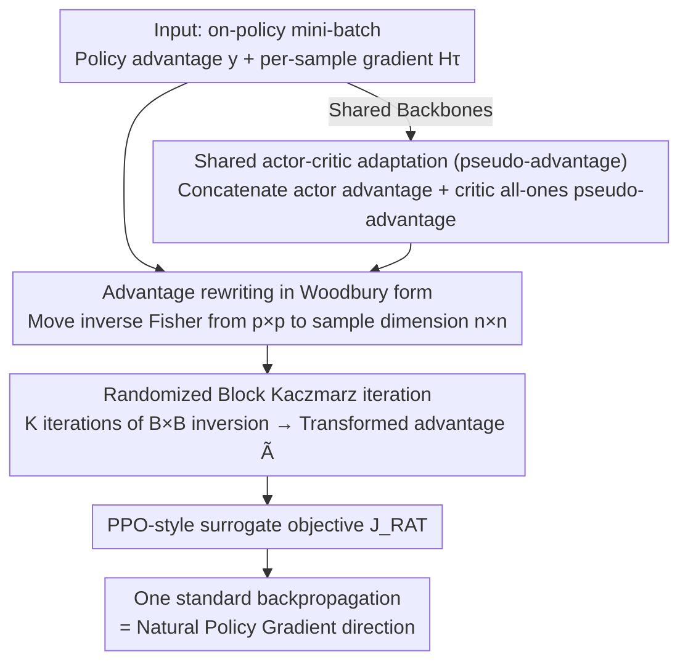

# Randomized Advantage Transformation (RAT): Computing Natural Policy Gradients via Direct Backpropagation

**Conference**: ICML2026  
**arXiv**: [2605.18591](https://arxiv.org/abs/2605.18591)  
**Code**: https://github.com/agent-lab/ICML2026-RAT  
**Area**: Reinforcement Learning  
**Keywords**: Natural Policy Gradient, Woodbury formula, Kaczmarz iteration, Advantage Transformation, on-policy RL  

## TL;DR
This work rewrites the Tikhonov-regularized Natural Policy Gradient (NPG) as a "vanilla policy gradient with transformed advantages" via the Woodbury identity. By solving this advantage transformation using Randomized Block Kaczmarz iterations on mini-batches, the method completely bypasses explicit Fisher matrix construction, Conjugate Gradient (CG) inner loops, and architecture-dependent curvature approximations like KFAC. It obtains the natural policy gradient direction using only a single standard backpropagation, matching or exceeding the performance of TRPO/ACKTR/KFAC on MuJoCo and Procgen.

## Background & Motivation

**Background**: Natural Policy Gradient (NPG) achieves parameter-invariant update directions by left-multiplying the vanilla policy gradient $\nabla^{\text{PG}}_{\bm{\theta}} J$ by the inverse Fisher information matrix $\bm{F}^{-1}$. It serves as the theoretical foundation for TRPO, ACKTR, Natural Actor-Critic, and PPO-style updates. Theoretical analyses also indicate that this "geometric correction" significantly improves convergence properties.

**Limitations of Prior Work**: However, the scale of the Fisher matrix $\bm{F}\in\mathbb{R}^{p\times p}$ is proportional to the number of parameters $p$ (millions in deep policies), making explicit construction and inversion impractical. Mainstream workarounds follow two paths:

- **Hessian-Free + CG** (e.g., TRPO): Converts inversion into Fisher-vector products solved via Conjugate Gradient iterations. Each step requires dozens of CG loops, causing high overhead and difficulty in applying to shared actor-critic networks.
- **Structural Approximation** (e.g., KFAC): Assumes the Fisher matrix can be decomposed into layer-wise Kronecker products. This is faster but sacrifices accuracy and relies heavily on gradient independence assumptions, requiring manual re-derivation for different architectures.

**Key Challenge**: The benefits of NPG stem from "re-normalizing gradient directions using the Fisher matrix," yet all existing implementations either spend significant time calculating $\bm{F}^{-1}\bm{g}$ accurately or sacrifice precision for architecture-dependent approximations. Is it possible to completely skip explicit operations on the Fisher matrix and compute the natural gradient using only "standard backpropagation"?

**Goal**: (1) Find a rewriting method such that NPG formally reduces to a vanilla policy gradient; (2) Provide a scalable finite-sample estimation algorithm for this rewriting; (3) Offer convergence guarantees and validation on large-scale benchmarks.

**Key Insight**: The authors noted a fact occasionally mentioned in literature—Tikhonov-regularized NPG is equivalent to a weighted least squares problem. By applying the Woodbury identity $(\bm{I}+\bm{U}\bm{V})^{-1}\bm{U}=\bm{U}(\bm{I}+\bm{V}\bm{U})^{-1}$, the matrix inverse can be moved from the "parameter dimension $p\times p$" to the "sample dimension $n\times n$." In the batch RL setting where $B\ll p$, shifting the inversion from parameter space to sample space opens a new pathway for computation.

**Core Idea**: Completely "absorb" $\bm{F}^{-1}$ into the transformation of the advantage function $A_\pi(s,a)$. NPG is rewritten as $\bm{H}^\top\bm{\Sigma}\tilde{\bm{y}}$, where the only difference from vanilla PG is the advantage $\tilde{\bm{y}}=(\lambda\bm{I}_n+\bm{H}\bm{H}^\top\bm{\Sigma})^{-1}\bm{y}$. A Randomized Block Kaczmarz iteration is then used to approximate this transformation on on-policy mini-batches.

## Method

### Overall Architecture

Let $n=|\mathcal{S}||\mathcal{A}|$ denote the "sample space dimension" and $p=|\bm{\theta}|$ the "parameter dimension." Rows of $\bm{H}\in\mathbb{R}^{n\times p}$ are $\partial_{\bm{\theta}}\log\pi$, $\bm{y}\in\mathbb{R}^n$ is the advantage vector, and $\bm{\Sigma}$ is a diagonal weighting matrix for $d_\pi(s)\pi(a|s)$. The pipeline consists of three steps:

1. **Rewriting**: Tikhonov-regularized NPG $\nabla^{\text{T-NPG}}=(\lambda\bm{I}_p+\bm{H}^\top\bm{\Sigma}\bm{H})^{-1}\bm{H}^\top\bm{\Sigma}\bm{y}$ is shown via Woodbury deformations to be equivalent to $\bm{H}^\top\bm{\Sigma}\tilde{\bm{y}}$, where $\tilde{\bm{y}}=(\lambda\bm{I}_n+\bm{H}\bm{H}^\top\bm{\Sigma})^{-1}\bm{y}$—shrinking the inverse from $p\times p$ to $n\times n$.
2. **Approximation**: Since $n$ remains large in continuous action spaces, $\bm{\Sigma}$ is approximated via Monte Carlo sampling, and the solution for $\tilde{\bm{y}}$ is rewritten as a regularized least squares problem $\min_{\bm{g}}\|\bm{y}-\bm{H}\bm{g}\|_{\bm{\Sigma}}^2+\lambda\|\bm{g}\|_2^2$.
3. **Mechanism**: Use Randomized Block Kaczmarz iterations—each step takes a mini-batch $\tau_j$, performs a $B\times B$ inversion, and after $K$ iterations, the resulting $\tilde{A}_j(s,a)$ is plugged into a PPO-style surrogate objective $J_{\text{RAT}}(\bm{\theta})=\mathbb{E}[\frac{\pi(a|s;\bm{\theta})}{\pi_{\text{old}}(a|s)}\tilde{A}_j(s,a)]$. A standard backpropagation then yields the natural policy gradient direction. For shared networks, a critic pseudo-advantage is introduced to unify actor and critic updates.

### Key Designs

**1. Woodbury-form Advantage Rewriting: From "Inverse Fisher × Gradient" to "Vanilla Gradient × Transformed Advantage"**

Efficiency improvements for NPG often stall at the same point—how to invert the $p\times p$ (million-dimensional) Fisher matrix. The breakthrough in RAT applies the Woodbury identity $(\bm{I}+\bm{U}\bm{V})^{-1}\bm{U}=\bm{U}(\bm{I}+\bm{V}\bm{U})^{-1}$ twice to $(\lambda\bm{I}_p+\bm{H}^\top\bm{\Sigma}\bm{H})^{-1}\bm{H}^\top\bm{\Sigma}$ to move the inversion to the sample dimension:

$$\nabla^{\text{T-NPG}}_{\bm{\theta}} J=\bm{H}^\top\bm{\Sigma}\,(\lambda\bm{I}_n+\bm{H}\bm{H}^\top\bm{\Sigma})^{-1}\bm{y}.$$

This equation implies NPG is simply vanilla policy gradient where the advantage is transformed from $A_\pi$ to $\bar{A}_\pi=[(\lambda\bm{I}_n+\bm{H}\bm{H}^\top\bm{\Sigma})^{-1}\bm{y}]_{(s,a)}$. This is effective because the inversion scale shrinks to $n \times n$, which is controllable if the batch size is smaller than the parameter count. Moreover, all curvature information is compressed into the scalar "advantage," making it naturally compatible with any advantage-based algorithm (PPO, A2C, GAE).

**2. Randomized Block Kaczmarz Iteration: Splitting $n\times n$ Inversion into $K$ $B\times B$ Inversions**

To handle large $n$ in continuous spaces, solving for $\tilde{\bm y}$ is treated as a regularized least squares problem $\min_{\bm g}\|\bm y-\bm H\bm g\|_{\bm\Sigma}^2+\lambda\|\bm g\|_2^2$, approximated via Randomized Block Kaczmarz iterations on mini-batches. Each step samples a mini-batch $\tau_j$ for a regularized projection, where the proximal sub-problem has a closed-form solution:

$$\bm{g}_j=\bm{g}_{j-1}+\bm{H}_{\tau_j}^\top\big[(\lambda\bm{I}+\bm{H}_{\tau_j}\bm{H}_{\tau_j}^\top)^{-1}(\bm{y}_{\tau_j}-\bm{H}_{\tau_j}\bm{g}_{j-1})\big].$$

The $B\times B$ inversion in parentheses represents the "randomized advantage transformation" $\tilde A_j$. In practice, `torch.linalg.solve` is used instead of explicit inversion for stability, $\bm H_\tau$ is obtained via PyTorch per-sample gradients, and $\bm H\bm H^\top$ relates to the Neural Tangent Kernel (NTK). The Tikhonov term ensures $(\lambda\bm I+\bm H_\tau\bm H_\tau^\top)$ is always invertible and keeps updates close to $\bm g_{j-1}$, gradually incorporating curvature. Unlike momentum-based Kaczmarz methods like SPRING, RAT refines $\bm g_j$ within a single on-policy rollout to avoid stale gradients.

**3. Architecture-agnostic Shared Actor-Critic Adaptation (Pseudo-advantage)**

Methods like KFAC typically calculate curvature for each head separately and merge them manually, which is difficult for shared backbones. Since RAT reduces NPG to a PG-like form, shared backbones and unified losses become natural. Following ACKTR, the critic is treated as a Gaussian likelihood, and a "pseudo-advantage" (e.g., an all-ones vector) is introduced for the critic. By concatenating actor advantages $\bm y^\pi$ and critic pseudo-advantages $\bm y^V$ into a single RAT iteration, a shared surrogate loss is obtained. Gradients are handled by autograd without manual layer-wise partitioning. Combined with $\ell_2$ gradient clipping $\alpha_j=\min(\eta,\nu/\|\bm g_j\|_2)$, this ensures training stability, allowing RAT to outperform KFAC in shared-network scenarios.

### Loss & Training

The objective is $J_{\text{RAT}}(\bm{\theta})=\mathbb{E}_{(s,a)\sim\mathcal{D}_k}\!\left[\frac{\pi(a|s;\bm{\theta})}{\pi_{\text{old}}(a|s)}\tilde{A}_j(s,a)\right]$, sharing the importance sampling ratio format with PPO. Within each on-policy rollout, $K$ inner Kaczmarz iterations refresh $\tilde{A}_j$, each corresponding to one standard backpropagation. The Tikhonov coefficient $\lambda$ ensures invertibility of $(\lambda\bm{I}+\bm{H}_\tau\bm{H}_\tau^\top)$ and controls convergence speed.

Theoretically, under the "compatible advantage" assumption, $\mathbb{E}\|\bm{g}_j-\bm{g}^*\|_2^2\le(1-\mu)^j\|\bm{g}_0-\bm{g}^*\|_2^2$ (Theorem 1, linear convergence). With noise, an error floor of $\eta^2/\mu$ appears (Theorem 2), justifying the use of gradient norm clipping in practice.

## Key Experimental Results

### Main Results

Evaluations on MuJoCo continuous control (separate actor-critic) using final return (mean ± stderr, 5 seeds, 10M steps) comparing PPO, TRPO/FVP+CG, KFAC, and Sophia. Key results for shared actor-critic scenarios:

| Task | State×Action | RAT (Ours) | ACKTR | PPO | Sophia |
|------|-----------|-----------|-------|------|--------|
| Swimmer | 8×2 | **271.6 ± 36.3** | 59.1 ± 13.0 | 191.3 ± 32.7 | 57.9 ± 5.9 |
| HalfCheetah | 17×6 | **4629.2 ± 287.4** | 3630.9 ± 282.6 | 4146.0 ± 107.5 | 899.5 ± 113.2 |
| Ant | 105×8 | **2926.6 ± 353.1** | 23.4 ± 3.2 | 1373.9 ± 26.0 | -7.0 ± 1.4 |
| Humanoid | 376×17 | **5382.7 ± 117.3** | 2571.7 ± 838.7 | 5357.9 ± 150.9 | 669.4 ± 56.2 |
| HumanoidStandup | 376×17 | **146529.7 ± 2317.6** | 127928.5 ± 5433.7 | 130014.2 ± 6463.7 | 111212.6 ± 13449.9 |

On high-dimensional Procgen (ResNet policies), RAT matches or exceeds baselines across all tasks. Visualization of Gaussian parameter estimation shows RAT's gradient direction almost perfectly aligns with the analytical natural gradient, while vanilla PG deviates significantly.

### Ablation Study (per-step wall-clock time in ms)

| Method (HalfCheetah / Ant / Humanoid) | Separate Mode | Shared Mode | Description |
|--------|---------------|--------------|------|
| RAT (Ours) | 9.83 / 10.04 / 18.17 | 11.53 / 11.66 / 19.85 | ~2× faster than FVP+CG; supports shared backbones |
| FVP+CG (TRPO) | 19.86 / 19.95 / 19.81 | N/A | High overhead from CG loops |
| KFAC / ACKTR | 5.60 / 5.61 / 6.57 | 6.92 / 6.85 / 7.87 | Fast but precision depends on architecture assumptions |
| Sophia (diag Fisher) | 3.92 / 3.98 / 5.71 | 5.97 / 6.03 / 7.58 | Fastest but worst returns |
| PPO (vanilla) | 3.12 / 3.18 / 3.22 | 3.70 / 3.70 / 3.72 | Reference for speed upper bound |

### Key Findings

- **Balance of Precision and Overhead**: RAT is approximately half as slow as FVP+CG and twice as slow as KFAC per step, but it outperforms both in returns. Diagonal approximations like Sophia are fastest but collapse on Ant/Humanoid, suggesting that non-diagonal curvature is indispensable.
- **Significant Gains in Large Action Spaces**: In high-dimensional tasks like Ant and Humanoid, baselines like ACKTR often struggle or regress. RAT provides stable improvements, validating the Theorem 1 analysis where $\mu$ dominates convergence—RAT's advantage is most pronounced in ill-conditioned problems.
- **Shared Actor-Critic is a Killer Feature**: While KFAC requires manual splitting of the Fisher matrix for shared networks, Ours uses pseudo-advantages to enable shared training "for free," performing at least as well as separate configurations.

## Highlights & Insights

- **"Matrix Inversion Relocation" is the Critical Insight**: While most NPG improvements focus on *how* to calculate $\bm{F}^{-1}$, Ours uses the Woodbury identity to move inversion from parameter space to sample space. This mathematical shift ensures curvature information is stored in "transformed scalar advantages," making RAT naturally compatible with modern RL frameworks (PPO, A2C, GAE) that use "advantage" as an interface.
- **Underestimated "Engineering Friendliness" of Curvature in Advantages**: Modern RL libraries are built around the "calculate advantage → backprop" workflow. KFAC requires optimizer modification, and TRPO requires CG loops. RAT only requires modifying the advantage calculation function, allowing it to be integrated into any PPO implementation with near-zero friction.
- **Synergy with NTK Perspectives**: The observation that $\bm{H}\bm{H}^\top$ is the NTK implies that NTK approximations (Random Features, Nyström) can directly reduce RAT's internal inversion costs. This provides a clear optimization path for scaling RAT to LLM-scale actor-critic training (e.g., RLHF).

## Limitations & Future Work

- **Sample vs. Parameter Dimensions**: The efficiency advantage assumes $B \ll p$. If extremely small policies are trained with massive batches in the future, $B \times B$ inversion could become a bottleneck.
- **Off-policy and Replay Buffer Adaptation**: The convergence analysis of Randomized Block Kaczmarz relies on the on-policy distribution $d_\pi(s,a)$. Extending this to off-policy algorithms like SAC or IMPALA remains an open question regarding $\bm{\Sigma}$ re-weighting.
- **Realism of Theoretical Assumptions**: Theorem 1 assumes $\bm{H}$ is full rank, which may fail with large policies and small batches. While Theorem 2 addresses this via an "error floor," more granular analysis of the relationship between the floor and the gradient clipping threshold $\nu$ is needed.
- **Potential Improvements**: (1) Replacing inner Kaczmarz with variance reduction methods like SVRG/SARAH; (2) Adapting $\lambda$ based on the Fisher spectrum within a batch; (3) Fusing with momentum variants of Kaczmarz (like SPRING) to accelerate convergence on ill-conditioned tasks.

## Related Work & Insights

- **vs FVP+CG (TRPO, Schulman 2015)**: Neither explicitly constructs the Fisher matrix, but FVP+CG performs CG in "parameter space" with dozens of loops. RAT performs Kaczmarz in "sample space" with one $B \times B$ inversion plus one backprop, naturally supporting shared architectures.
- **vs KFAC / ACKTR (Wu 2017)**: KFAC relies on layer-wise Kronecker decompositions and strong gradient independence assumptions. RAT makes no structural assumptions on $\bm{F}$ and can migrate to Transformer or CNN policies by simply changing the per-sample gradient implementation.
- **vs Guzmán-Cordero et al. 2025**: Also uses Woodbury for NPG but directly approximates the inverse Fisher and requires manual merging of actor/critic gradients. RAT leaves solving to a randomized iterator and uses pseudo-advantages to let autograd handle curvature merging, resulting in cleaner engineering.
- **vs SPRING (Goldshlager 2024)**: Both use Kaczmarz, but SPRING uses momentum and updates once per batch, accumulating $\bm{g}$ across rollouts. RAT iterates multiple times within a single rollout without momentum, avoiding stale gradients and proving friendlier for on-policy RL.

## Rating
- Novelty: ⭐⭐⭐⭐⭐ The combination of Woodbury, Randomized Kaczmarz, and Advantage Transformation is unique and elegantly reduces NPG to a vanilla gradient form.
- Experimental Thoroughness: ⭐⭐⭐⭐ Covers MuJoCo, Procgen, and Gaussian visualizations; however, lacks validation on LLM-level RLHF.
- Writing Quality: ⭐⭐⭐⭐⭐ Clear derivations, two solid theorems, and explicit comparisons with KFAC/FVP+CG/SPRING make it highly reproducible.
- Value: ⭐⭐⭐⭐⭐ Provides a natural gradient solution that can be plugged into existing PPO code with virtually no friction, opening doors for NPG in large-scale RL/RLHF.

<!-- RELATED:START -->

## Related Papers

- [\[AAAI 2026\] DiffOP: Reinforcement Learning of Optimization-Based Control Policies via Implicit Policy Gradients](../../AAAI2026/reinforcement_learning/diffop_reinforcement_learning_of_optimization-based_control_policies_via_implici.md)
- [\[ICLR 2026\] Learning to Orchestrate Agents in Natural Language with the Conductor](../../ICLR2026/reinforcement_learning/learning_to_orchestrate_agents_in_natural_language_with_the_conductor.md)
- [\[ICML 2026\] RL4RLA: Teaching ML to Discover Randomized Linear Algebra Algorithms Through Curriculum Design and Graph-Based Search](rl4rla_teaching_ml_to_discover_randomized_linear_algebra_algorithms_through_curr.md)
- [\[CVPR 2026\] Talk2Move: Reinforcement Learning for Text-Instructed Object-Level Geometric Transformation in Scenes](../../CVPR2026/reinforcement_learning/talk2move_reinforcement_learning_for_text-instructed_object-level_geometric_tran.md)
- [\[ACL 2026\] Free Energy-Driven Reinforcement Learning with Adaptive Advantage Shaping for Unsupervised Reasoning in LLMs](../../ACL2026/reinforcement_learning/free_energy-driven_reinforcement_learning_with_adaptive_advantage_shaping_for_un.md)

<!-- RELATED:END -->
